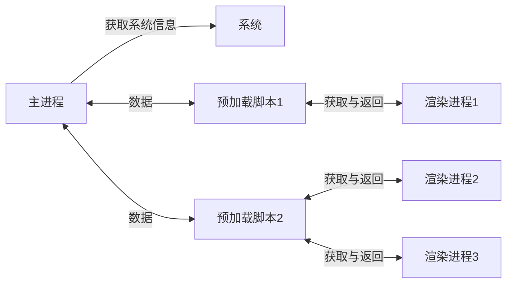

# 二、主进程和渲染进程


## 2.1 主进程与渲染进程

在 `Electron` 中主要控制两类进程: 主进程、渲染器进程。

1.  主进程  
    每个 `Electron` 应用都有一个单一的主进程，作为应用程序的入口点。 主进程在 `Node.js` 环境中运行，**它具有 `require` 模块和使用所有 `Node.js API` 的能力，主进程的核心就是:使用`BrowserWindow` 来创建和管理窗口。**
2.  渲染进程  
    **每个 `BrowserWindow` 实例都对应一个单独的渲染器进程，运行在渲染器进程中的代码，必须遵守网页标准，这也就意味着:渲染器进程无权直接访问`require`或使用任何 `Node.js` 的`API`。**

> 问题产生:处于渲染器进程的用户界面，该怎样才与 `Node.js` 和 `Electron` 的原生桌面功能进行交互呢? 通过 `Preload` 脚本


3. 具体流程图




## 2.2 Preload 脚本

预加载(`Preload`)脚本是**运行在渲染进程中的**，但它是在网页内容加载之前执行的，这意味着它具有比普通渲染器代码更高的权限，可以访问 `Node.js` 的 `API`，同时又可以与网页内容进行安全的交互。  
**简单说:它是 `Node.js` 和 `Web API` 的桥梁，`Preload` 脚本可以安全地将部分 `Node.js` 功能暴露给网页，从而减少安全风险。**

> 需求:点击按钮后，在页面呈现当前电脑的 `Node` 版本。

具体文件结构与编码如下:

1.  在根目录创建预加载脚本 `preload.js` ，内容如下：

```javascript
const { contextBridge } = require('electron');

// 暴露数据给渲染进程
contextBridge.exposeInMainWorld('myNodeVersion', {
    version: process.version
})
```

2.  在主线程(main.js)中引入 `preload.js`

```javascript
 const {app,BrowserWindow} = require('electron');

let win = null;
const path = require("path");

app.on('ready', function() {

    win = new BrowserWindow({
        width: 800, // 宽度
        height: 600, // 高度
        autoHideMenuBar: true, // 自动隐藏菜单栏（默认是false）
        alwysOnTop: true, // 窗口置顶(类似z-index:9999，永远置于最高层) （默认是false）
        x: 0, // 窗口左上角x坐标
        y: 0, // 窗口左上角y坐标
        webPreferences:{
          preload: path.join(__dirname, "./preload.js")
        }
      });

    // 访问资源文件
    win.loadFile('./pages/index.html');

    // 程序启动后开启 开发者工具
    win.on('close',function() {
        win = null;
    })
});

// 关闭所有窗口时退出应用 (Windows & Linux)
app.on('window-all-closed',function() {
    app.quit();
})
```

3.  在 `html` 页面中编写对应按钮，并创建专门编写网页脚本的 `render.js` ，随后引入。

`index.html` 内容如下：

```html
<!DOCTYPE html>
<html lang="en">
<head>
    <meta charset="UTF-8">
    <meta name="viewport" content="width=device-width, initial-scale=1.0">
    <!-- 内容安全策略 -->
    <meta http-equiv="Content-Security-Policy" content="default-src 'self'; style-src 'self' 'unsafe-inline'; img-src 'self' data:;">
    <title>index</title>
</head>
<body>
    <h1>hello world！！</h1>
    <button id="btn">获取Node版本号</button>

    <script type="text/javascript" src="./render.js"></script>
</body>
</html>
```

4.  在渲染进程中使用 `version`

`render.js` 内容如下：

```javascript
btn.addEventListener('click', () => {
    console.log(myNodeVersion.version)
    document.body.innerHTML += `<h2>${myNodeVersion.version}</h2>`
})
```

5.  整体文件结构如下:  
    
    

6.  效果演示：  

    

## 2.3 进程通信(IPC)

> 值得注意的是:  
> 上文中的 `preload.js` ，无法使用全部`Node.js` 的 `API`，比如:不能使用 `Node` 中的 `fs` 模块，但主进程(`main.js` )是可以的，这时就需要进程通信了。**简单说:要让 `preload.js` 通知 `main.js` 去调用 `fs` 模块去干活。**

关于 `Electron` 进程通信，我们要知道:

*   `IPC` 全称为:`InterProcessCommunication`，即:进程通信。
*   **`IPC` 是 `Electron` 中最为核心的内容，它是从`UI` 调用原生 `API` 的唯一方法!**
*   `Electron` 中，主要使用 `ipcMain` 和 `ipcRenderer` 来定义“通道”，进行进程通信。

### 2.3.1 渲染进程==>主进程(单向)

概述:**在渲染器进程中 `ipcRenderer.send` 发送消息，在主进程中使用 `ipcMain.on` 接收消息。常用于:在 `Web` 中调用主进程的 `API`**，例如下面的这个需求:

> 需求:点击按钮后，在用户的 `D`盘创建一个 `hello.txt` 文件，文件内容来自于用户输入。

1.  `index.html`页面中添加相关元素，render.js 中添加对应的点击事件

`index.html`内容：

```html
<!DOCTYPE html>
<html lang="en">
<head>
    <meta charset="UTF-8">
    <meta name="viewport" content="width=device-width, initial-scale=1.0">
    <!-- 内容安全策略 -->
    <meta http-equiv="Content-Security-Policy" content="default-src 'self'; style-src 'self' 'unsafe-inline'; img-src 'self' data:;">
    <title>index</title>
</head>
<body>
    <h1>hello world！！</h1>
    <button id="btn">获取Node版本号</button>
    <br>
    <input type="text" id="content">
    <button id="btn2">在用户的D盘创建一个hello.txt</button>
    <script type="text/javascript" src="./render.js"></script>
</body>
</html>
```

`render.js` 内容：

```javascript
// 可以不用写const btn = document.getElementById('btn')
btn.addEventListener("click", () => {
  console.log(myNodeVersion.version);
  document.body.innerHTML += `<h2>${myNodeVersion.version}</h2>`;
});

const btn2 = document.getElementById("btn2");
const content = document.getElementById("content");
btn2.addEventListener("click", () => {
  console.log(content.value);
  myAPI.saveFile(content.value);
});
```

2.  `preload.js` 中使用 `ipcRenderer.send('信道',参数)`发送消息，与主进程通信。

`preload.js` 内容：

```javascript
const { contextBridge, ipcRenderer } = require('electron');

// 暴露数据给渲染进程
contextBridge.exposeInMainWorld('myNodeVersion', {
    version: process.version
})

contextBridge.exposeInMainWorld('myAPI', {
   saveFile(str){
      //渲染进程给主进程发送消息事件
      ipcRenderer.send('create-file', str)
   }
})
```

3.  主进程中，**在加载页面之前**，使用 `ipcMain.on('信道”,回调)`配置对应回调函数，接收消息。

`main.js` 内容：

```javascript
// 引入：app（整个应用）、BrowserWindow（用于创建窗口）、ipcMain（用于进程通信）
const { app, BrowserWindow, ipcMain } = require('electron');
// 引入path模块
const path = require('path');
// 引入fs模块
const fs = require('fs');
// 2.创建文件
function createFile(event,data) {
  fs.writeFileSync('D:/hello.txt',data)
}


// 1.创建浏览器窗口。
function createWindow() {
  // 1.1.创建浏览器窗口。
  mainWindow = new BrowserWindow({
    width: 800, // 宽度
    height: 600, // 高度
    autoHideMenuBar: true, // 自动隐藏菜单栏（默认是false）
    alwysOnTop: true, // 窗口置顶(类似z-index:9999，永远置于最高层) （默认是false）
    x: 0, // 窗口左上角x坐标
    y: 0, // 窗口左上角y坐标
    webPreferences:{
      preload: path.join(__dirname, "./preload.js")
    }
  });
  // 2.1.主进程注册对应的事件
  ipcMain.on("create-file",createFile)

  // 1.2.加载一个本地的页面
  mainWindow.loadFile("./pages/index.html");
}
```

完整的`main.js` 如下：

```javascript
// main.js运行在应用的主进程上，无法访问web相关API，主要负责：控制生命周期、显示界面
// 控制渲染进程等其他操作。

// 引入：app（整个应用）、BrowserWindow（用于创建窗口）、ipcMain（用于进程通信）
const { app, BrowserWindow, ipcMain } = require('electron');
// 引入path模块
const path = require('path');
// 引入fs模块
const fs = require('fs');

// 保持对window对象的全局引用，如果不这么做的话，当JavaScript对象被
// 垃圾回收的时候，window对象将会自动的关闭
let mainWindow;

// 2.创建文件
function createFile(event,data) {
  fs.writeFileSync('D:/hello.txt',data)
}


// 1.创建浏览器窗口。
function createWindow() {
  // 1.1.创建浏览器窗口。
  mainWindow = new BrowserWindow({
    width: 800, // 宽度
    height: 600, // 高度
    autoHideMenuBar: true, // 自动隐藏菜单栏（默认是false）
    alwysOnTop: true, // 窗口置顶(类似z-index:9999，永远置于最高层) （默认是false）
    x: 0, // 窗口左上角x坐标
    y: 0, // 窗口左上角y坐标
    webPreferences:{
      preload: path.join(__dirname, "./preload.js")
    }
  });
  // 2.1.主进程注册对应的事件
  ipcMain.on("create-file",createFile)

  // 1.2.加载一个远程的页面
  // mainWindow.loadURL("http://www.baidu.com");
  // 1.2.加载一个本地的页面
  mainWindow.loadFile("./pages/index.html");
}

// 1.3.当 window 被加载，就执行创建窗口这个函数
app.on("ready", () => {
  createWindow();
  // 1.6.在 mac上，点击 Dock 图标且没有其他窗口打开时，重新创建窗口
  // 当应用被激活时  
  app.on("activate", () => {
    // 如果没有窗口打开，则创建一个窗口
    if (BrowserWindow.getAllWindows().length === 0) {
      createWindow();
    }
  });
});

// 1.4.当 window 被关闭，这个事件会被触发。
app.on("closed", function () {
  // 取消引用 window 对象，如果你的应用支持多窗口的话，
  // 通常会把多个 window 对象存放在一个数组里面，
  // 与此同时，你应该删除相应的元素。
  mainWindow = null;
});

// 1.5.当所有窗口都关闭时，自动退出应用，除非在 macOS 上
app.on("window-all-closed", () => {
  if (process.platform !== "darwin") {
    app.quit();
  }
});
```

4.  运行项目，即可实现效果。

    - 运行页面

    

    - 写入结果

    

### 2.3.2 渲染进程<==>主进程(双向)

概述:渲染进程通过`ipcRenderer.invoke` 发送消息，主进程使用 `ipcMain.handle` 接收并处理消息。  
备注:`ipcRender.invoke` 的返回值是 `Promise` 实例。  
**常用于:从渲染器进程调用主进程方法并等待结果**，例如下面的这个需求:

> 需求:点击按钮从 `D`盘读取 `hello.txt` 中的内容，并将结果呈现在页面上。

1.  页面中添加相关元素，`render.js` 中添加对应脚本

`index.html`

```html
<button id="btn3">读取⽤户D盘的hello.txt</button>
```

`render.js`

```javascript
const btn3 = document.getElementById("btn3");
btn3.addEventListener("click", async () => {
    let data = await myAPI.readFile();
    document.body.innerHTML += `<h2>${data}</h2>`;
});
```

2.  `preload.js` 中使用 `ipcRenderer.invoke('信道',参数)`发送消息，与主进程通信。

`preload.js`

```javascript
const { contextBridge, ipcRenderer } = require("electron");
contextBridge.exposeInMainWorld("myAPI", {
    saveFile(str) {
        //渲染进程给主进程发送消息事件,通过 IPC 发送 'file-save' 事件并传递数据
        ipcRenderer.send("create-file", str);
    },
    // 定义读取文件的方法，通过 IPC 调用 'file-read' 事件并返回 Promise 结果
    readFile: () => {
        return ipcRenderer.invoke("file-read");
    },
});
```

3.  **主进程中，在加载页面之前**，使用 `ipcMain.handle('信道',回调)`接收消息，并配置回调函数。

`main.js`

```javascript
// 3.读取文件,读取指定文件内容并返回字符串格式的结果
function readFile() {
  const res = fs.readFileSync('D:/hello.txt').toString();
  return res;
}

function createWindow() {
   // ... 省略
  // 3.1.处理 'file-read' IPC 事件，调用 readFile 函数处理，并返回结果
  ipcMain.handle('file-read', readFile);


```

4. 运行结果

    

### 2.3.3 主进程到=>渲染进程

概述:主进程使用 `win.webContents.send` 发送消息，渲染进程通过`ipcRenderer.on` 处理消息  
常用于:**从主进程主动发送消息给渲染进程**，例如下面的这个需求:

> 需求:应用加载 6秒钟后，主动给渲染进程发送一个消息，内容是:你好啊!

1.  页面中添加相关元素，`render.js` 中添加对应脚本

`render.js`

```javascript
window.onload = () => {
  myAPI.getMessage(logMessage)
};

function logMessage(event,str){
    console.log(event,str)
    alert(str)
}
```

2.  `preload.js` 中使用 `ipcRenderer.on ('信道',回调)`接收消息，并配置回调函数。

`preload.js`

```javascript
contextBridge.exposeInMainWorld("myAPI", {
  getMessage:(callback)=>{
    return ipcRenderer.on("message",callback)
  }
});
```

3.  主进程中，在合适的时候，使用 `mainWindow.webcontents.send('信道',数据)`发送消息。

`main.js`

```javascript
function createWindow() {
  //...

  // 创建⼀个定时器
  setTimeout(() => {
    mainWindow.webContents.send("message", "你好啊！");
  }, 6000);
}
```

4. 运行结果

