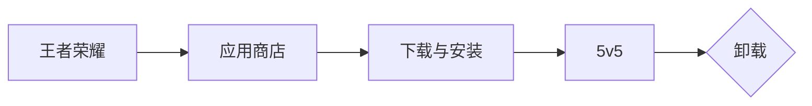
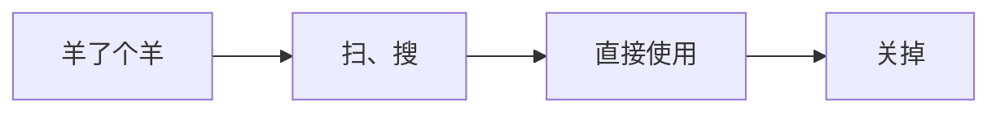

# 一、小程序基础

## 1.1 初识微信小程序

1. 小程序介绍

    - 微信小程序是一种运行在微信内部的`轻量级` 应用程序
    - 在使用小程序时 `不需要下载安装`，用户 `扫一扫` 或 `搜一下` 即可打开应用。它也体现了“用完即走”的理念，用户不用关心安装太多应用的问题。它实现了应用“触手可及”的梦想，应用无处不在，随时可用，但又 `无须安装卸载`。

2. 运行逻辑

APP： 

小程序：

3. 小程序四大特性
    - 无需安装
    - 用完即走
    - 无需卸载
    - 触手可及

## 1.2 小程序账号注册

### 1.2.1 注册准备

小程序开发 与 网页开发不一样，在开始微信小程序开发之前，需要访问 [微信公众平台](https://mp.weixin.qq.com/?token=&lang=zh_CN)，注册一个微信小程序账号。

有了小程序的账号以后，我们才可以开发和管理小程序，后续需要通过该账号进行 开发信息的设置、开发成员的添加，也可以用该账号查看小程序的运营数据。

- 在申请账号前，我们需要先 准备一个邮箱，该邮箱要求:

    - 未被微信公众平台注册!
    - 未被微信开放平台注册!
    - 未被个人微信号绑定过!如果被绑定了需要解绑 或 使用其他邮箱

### 1.2.2 开始注册

1. [进入官网](https://mp.weixin.qq.com/)选择小程序

2. 前往注册

3. 获取邮箱验证码

4. 完善信息后注册

5. 完善个人相关信息

6. 进入微信后台页面（注册成功）

### 1.2.3 完善小程序账号信息

需完善的信息

1. 完善小程序信息

2. 小程序类目

>注：不能选择小程序游戏，否则就是小游戏了

## 1.3 项目成员与体验成员

小程序提供了两种不同的成员角色:项目成员 和 体验成员

- 项目成员:表示参与小程序开发、运营的成员，包括运营者、开发者及数据分析者，项目成员可登陆微信公众后台，管理员可以在成员管理中添加、删除项目成员，并设置项目成员的角色。

- 体验成员:表示参与小程序内测体验的成员，可使用体验版小程序，但不属于项目成员。管理员及项目成员均可添加、删除体验成员。

**添加项目成员**

1. 点击添加按钮

2. 搜索项目成员的微信号

3. 管理员账号认证

4. 载人确认成员

5. 成员已添加

## 1.4 开发者ID

微信小程序账号只要开发者满足开发资质都可以进行注册，并且会获得对应的`开发者ID`一个完整的`开发者ID`由`小程序 ID(AppID)`和一个`小程序密钥(AppSecret)`组成

- `小程序 ID`: 是小程序在整个微信账号体系内的唯一身份凭证，后续在很多地方都会用到，例如:新建小程序项目、真机调试、发布小程序等操作时，必须有小程序ID。

- `小程序密钥`: 是开发者对小程序拥有所有权的凭证，在进行 微信登录、微信支付，或进行发送消息等高级开发时会使用到

## 1.5 微信开发者工具

为了帮助开发者简单和高效地开发和调试微信小程序，微信官方提供了 微信开发者工具，利用开发者工具可以很方便地进行小程序开发、代码查看以及编辑、预览和发布等。

微信开发者工具包含三个版本:

1. 稳定版:稳定性高，开发中一般推荐大家使用稳定版本
2. 预发布版:稳定性尚可，一般包含新的、大的特性，通过了内部测试
3. 开发版:稳定性差，主要用于尽快修复缺陷和敏捷上线小的特性

>注意事项:微信开发者工具必须联网使用!

[进入微信开发者下载页面](https://developers.weixin.qq.com/miniprogram/dev/devtools/download.html)

安装完成后

1. 扫码登录

2. 进入创建页面

## 1.6 创建小程序项目

1. 开始创建

2. 配置创建信息

3. 进入开发页面

## 1.7 文件和目录结构介绍

一个完整的小程序项目分为两个部分:`主体文件`、`页面文件`

### 1.7.1 主体文件

`主体文件` 又称 全局文件，能够作用于整个小程序，影响到小程序的每个页面，主体文件必须放到项目的根目录下

主体文件由三部分组成:

1. app.js:小程序入口文件
2. app.json:小程序的全局配置文件
3. app.wxss:小程序的全局样式

>注意事项:主体文件的名字必须是 app，app,js 和 app.json 文件是必须的!

### 1.7.2 页面文件

`页面文件` 是每个页面所需的文件，小程序页面文件都存放在 pages 目录下，一个页面一个文件夹

每个页面通常由四个文件组成，每个文件只对当前页面有效:

1. `.js`: 页面逻辑
2. `.wxml`: 页面结构
3. `.wxss`: 页面样式
4. `.json`: 小页面配置

>注意事项: `.js` 文件和 `.wxml` 文件是必须的!

### 1.7.3 切换渲染模式

控制台中打印 可以看到 `Skyline` 渲染模式并不成熟

去除 `skyline` 渲染模式，默认使用`webview`模式

### 1.7.4 文件结构介绍

## 1.8 创建页面

1. 第一种：右键创建

    - 右键-创建文件夹

    

    - 输入名称

    

    - 右键-创建Page

    

    - 输入名称

    

    - 创建结果

    

2. 第二种：app.json创建

    - app.json中输入路径

    

    - 创建结果

     

## 1.9 调试功能

### 1.9.1 调试基础库

小程序调试基础库是指 微信开发者工具中可以选择的微信基础库版本。

微信基础库是指小程序的运行环境，给小程序提供了运行所需的各种 AP1 和工具，以及基础框架和运行逻辑等。

小程序开发者可以在微信开发者工具中选择所需的微信基础库版本，作为运行和调试小程序时的运行环境。

每个小程序有自己所允许使用的基础库最低版本要求，开发者需要选择要兼容的基础库版本，从而确保小程序的功能正常运行

### 1.9.2 调试

1. 类似chrome的web页面调试

2. 真机调试与预览

微信开发者工具缓存非常严重，
如果发现代码和预期不一样，先点击编译!
编译后还是没有达到预期的效果，就需要清除缓存 !甚至重启项目才可以!

