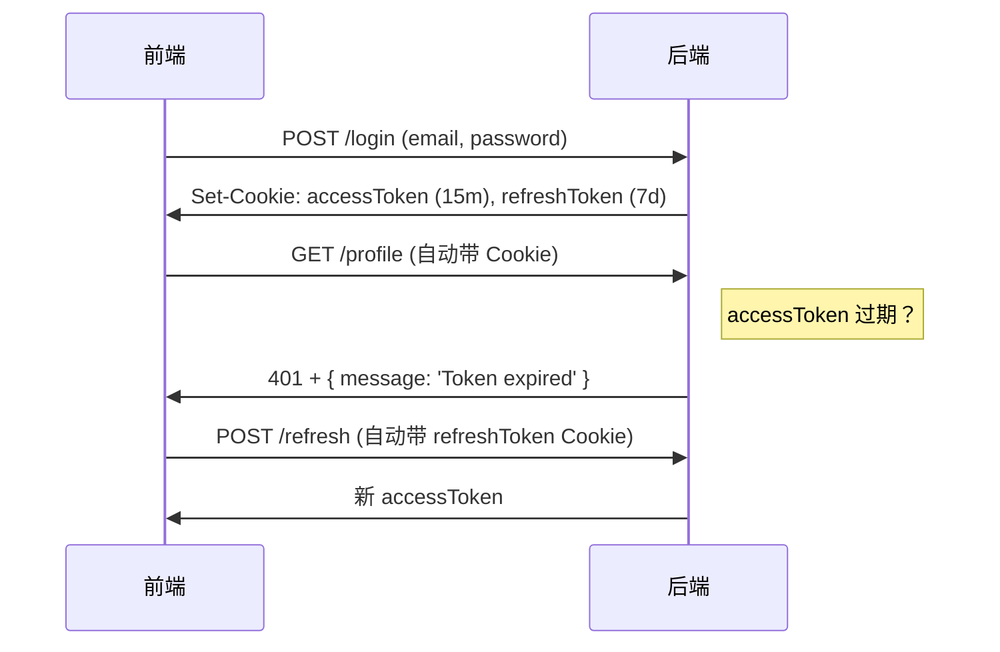

# 四、前端解析

## 4.1 `cors` 中间件

1. 什么是 CORS？

    当浏览器从 `http://localhost:3000`（前端）向 `http://localhost:5000`（后端）发起请求时，由于 **协议、域名或端口不同**，浏览器会阻止响应（同源策略）。  
    **CORS（Cross-Origin Resource Sharing）** 是一种机制，允许服务器声明哪些外部源可以访问其资源。

2. 安装

    ```bash
    npm install cors
    ```

3. 基础用法

    - 允许所有来源（开发环境常用）

        ```js
        const express = require('express');
        const cors = require('cors');

        const app = express();

        // 启用 CORS（允许任何 origin）
        app.use(cors());

        app.get('/api/data', (req, res) => {
          res.json({ message: 'Hello from server!' });
        });

        app.listen(5000);
        ```

    > **生产环境不要用 `app.use(cors())`**！应限制可信来源。


4. 高级配置（生产推荐）

- 仅允许可信域名

    ```js
    const corsOptions = {
      origin: ['http://localhost:3000', 'https://your-frontend.com'],
      credentials: true, // 允许携带 Cookie（关键！）
      optionsSuccessStatus: 200 // 旧版浏览器兼容
    };

    app.use(cors(corsOptions));
    ```

- 动态判断来源（白名单）

    ```js
    const whitelist = ['http://localhost:3000', 'https://your-app.com'];

    const corsOptions = {
      origin: (origin, callback) => {
        // 允许无 origin 的请求（如 Postman、curl）
        if (!origin || whitelist.includes(origin)) {
          callback(null, true);
        } else {
          callback(new Error('Not allowed by CORS'));
        }
      },
      credentials: true
    };

    app.use(cors(corsOptions));
    ```


5. 关键选项说明

    | 选项 | 作用 |
    |------|------|
    | `origin` | 允许的源（字符串/数组/函数） |
    | `credentials: true` | **必须设置** 才能发送 Cookie（配合前端 `withCredentials: true`） |
    | `methods` | 允许的 HTTP 方法（默认 `'GET,HEAD,PUT,PATCH,POST,DELETE'`） |
    | `allowedHeaders` | 允许的请求头（如 `'Content-Type', 'Authorization'`） |


## 4.2 cookie-parser` 中间件

1. 为什么需要它？

    Express 默认不解析 `Cookie` 请求头。`cookie-parser` 会：
    - 自动解析 `Cookie` 头 → 挂载到 `req.cookies`
    - 提供签名 Cookie 支持（防篡改）

2. 安装

    ```bash
    npm install cookie-parser
    ```

3. 基础用法

    ```js
    const express = require('express');
    const cookieParser = require('cookie-parser');

    const app = express();

    // 解析 Cookie（无签名）
    app.use(cookieParser());

    app.get('/set-cookie', (req, res) => {
      // 设置 Cookie
      res.cookie('username', 'Alice', { httpOnly: true });
      res.send('Cookie set!');
    });

    app.get('/get-cookie', (req, res) => {
      // 读取 Cookie
      console.log(req.cookies.username); // 'Alice'
      res.json({ cookies: req.cookies });
    });
    ```

4. 签名 Cookie（防篡改）

    ```js
    // 使用 secret 签名 Cookie
    app.use(cookieParser('your-secret-key-here'));

    app.get('/set-signed', (req, res) => {
      // signed: true 表示签名
      res.cookie('token', 'abc123', { signed: true });
      res.send('Signed cookie set!');
    });

    app.get('/get-signed', (req, res) => {
      // 读取签名 Cookie（自动验证）
      console.log(req.signedCookies.token); // 'abc123'（若被篡改则为 undefined）
      res.json({ token: req.signedCookies.token });
    });
    ```

    > **签名原理**：  
    > 实际 Cookie 值 = `abc123.sig`（`.sig` 是 HMAC 签名），服务端验证签名是否匹配。

## 4.3 jsonwebtoken
`jsonwebtoken`（简称 **JWT**）是 Node.js 中用于生成和验证 **JSON Web Token** 的标准库。它广泛应用于 **无状态身份认证（Stateless Authentication）** 场景，如 API 登录、单点登录（SSO）等。


### 4.3.1 什么是 JWT？

JWT 是一种 **开放标准（RFC 7519）**，用于在网络应用间安全地传递声明（claims）。  
一个 JWT 由三部分组成，用 `.` 分隔：

```
# 对应表格中的Header.Payload.Signature
xxxxx.yyyyy.zzzzz
```

| 部分 | 说明 |
|------|------|
| **Header** | 算法（如 HS256）和类型（JWT） |
| **Payload** | 用户数据（如 `{ userId: 1, email: '...' }`） + 标准字段（如 `exp`） |
| **Signature** | 签名（防止篡改） |

> **优点**：  
> - 无状态（服务端无需存储 Session）  
> - 跨域友好（通过 `Authorization` 头传递）  
> - 自包含（Payload 携带用户信息）

> **缺点**：  
> - 无法主动失效（除非用黑名单或短过期时间）  
> - Payload 默认不加密（仅 Base64 编码，**不要放敏感信息**）


### 4.3.2 安装

```bash
npm install jsonwebtoken
```

> 常配合 `@types/jsonwebtoken`（TypeScript）使用：
> ```bash
> npm install --save-dev @types/jsonwebtoken
> ```

### 4.3.3 核心 API

1. `jwt.sign(payload, secretOrPrivateKey, [options])` → 生成 Token

    ```ts
    import jwt from 'jsonwebtoken';

    const token = jwt.sign(
      { userId: 123, email: 'alice@example.com' }, // payload
      'your-secret-key',                          // 密钥（生产环境用强随机字符串）
      { expiresIn: '1h' }                         // 选项：1小时后过期
    );

    console.log(token);
    // eyJhbGciOiJIUzI1NiIsInR5cCI6IkpXVCJ9.xxxxx.yyyyy
    ```

    常用 `options`：

    | 选项 | 示例 | 说明 |
    |------|------|------|
    | `expiresIn` | `'1h'`, `'7d'`, `3600` | 过期时间（秒或字符串） |
    | `issuer` | `'my-app.com'` | 签发者（`iss`） |
    | `audience` | `'client-app'` | 接收方（`aud`） |
    | `subject` | `'user-auth'` | 主题（`sub`） |
    | `algorithm` | `'HS256'`（默认） | 签名算法 |

    > **密钥建议**：  
    > - 开发：`'secret'`  
    > - 生产：**至少 32 位随机字符串**（用 `crypto.randomBytes(32).toString('hex')` 生成）

2. `jwt.verify(token, secretOrPublicKey, [options])` → 验证 Token

    ```ts
    try {
      const decoded = jwt.verify(token, 'your-secret-key') as jwt.JwtPayload;
      console.log(decoded.userId); // 123
    } catch (err) {
      if (err instanceof jwt.TokenExpiredError) {
        console.log('Token 已过期');
      } else if (err instanceof jwt.JsonWebTokenError) {
        console.log('Token 无效');
      }
    }
    ```

    常见错误类型：

    | 错误 | 说明 |
    |------|------|
    | `TokenExpiredError` | `exp` 过期 |
    | `JsonWebTokenError` | 签名无效、格式错误等 |
    | `NotBeforeError` | `nbf`（生效时间）未到 |


3. `jwt.decode(token, [options])` → 仅解码（**不验证签名！**）

    ```ts
    const payload = jwt.decode(token); // 返回 null 或 payload 对象
    ```

    >  **仅用于调试！不要用于认证逻辑**，因为无法保证 Token 未被篡改。


### 4.3.4 在 Express/Koa/NestJS 中使用

**场景：用户登录 → 返回 JWT → 后续请求携带 JWT**

- 步骤 1：用户登录（生成 Token）

    ```ts
    // POST /login
    app.post('/login', (req, res) => {
      const { email, password } = req.body;

      // 1. 验证用户（伪代码）
      const user = db.findUserByEmail(email);
      if (!user || !comparePassword(password, user.password)) {
        return res.status(401).json({ error: 'Invalid credentials' });
      }

      // 2. 生成 JWT
      const token = jwt.sign(
        { userId: user.id, email: user.email },
        process.env.JWT_SECRET!,
        { expiresIn: '1d' }
      );

      // 3. 返回 Token（通常放在 JSON 中，而非 Cookie）
      res.json({ token });
    });
    ```

- 步骤 2：保护路由（验证 Token）

    ```ts
    // 中间件：验证 JWT
    function authenticateToken(req, res, next) {
      const authHeader = req.headers['authorization'];
      const token = authHeader && authHeader.split(' ')[1]; // Bearer <token>

      if (!token) {
        return res.sendStatus(401); // Missing token
      }

      jwt.verify(token, process.env.JWT_SECRET!, (err, user) => {
        if (err) {
          return res.sendStatus(403); // Invalid token
        }
        req.user = user; // 将用户信息挂载到 req
        next();
      });
    }

    // 受保护的路由
    app.get('/profile', authenticateToken, (req, res) => {
      res.json({ userId: req.user.userId, email: req.user.email });
    });
    ```

- 步骤 3：前端请求（Axios 示例）

    ```js
    // 登录
    const { data } = await axios.post('/login', { email, password });
    localStorage.setItem('token', data.token);

    // 带 Token 请求
    axios.get('/profile', {
      headers: {
        'Authorization': `Bearer ${localStorage.getItem('token')}`
      }
    });
    ```

### 4.3.5 JWT + HttpOnly Cookie（更安全的方案）

为防 XSS，可将 JWT 存入 **HttpOnly Cookie**（前端 JS 无法读取）：

1. 后端设置 Cookie

    ```ts
    // 登录成功后
    res.cookie('accessToken', token, {
      httpOnly: true,
      secure: true,        // 仅 HTTPS
      sameSite: 'lax',
      maxAge: 15 * 60 * 1000 // 15 分钟
    });
    ```

2. 前端无需处理 Token

    - 所有请求自动携带 Cookie
    - 无需手动设置 `Authorization` 头

3. 后端从 Cookie 读取 Token

    ```ts
    // 中间件
    function authenticateToken(req, res, next) {
      const token = req.cookies.accessToken; // 需配合 cookie-parser
      // ... 验证逻辑同上
    }
    ```

> **优势**：防 XSS  
> **劣势**：需处理 CSRF（但 `sameSite: 'lax'` 可缓解）


### 4.3.6 Refresh Token 机制（解决短过期问题）

1. **Access Token**：短有效期（15 分钟），用于 API 认证  
2. **Refresh Token**：长有效期（7 天），用于获取新 Access Token

- 流程：



- 刷新接口示例

    ```ts
    app.post('/refresh', (req, res) => {
      const refreshToken = req.cookies.refreshToken;
      if (!refreshToken) return res.sendStatus(401);

      jwt.verify(refreshToken, process.env.REFRESH_TOKEN_SECRET!, (err, user) => {
        if (err) return res.sendStatus(403);

        // 生成新 Access Token
        const newAccessToken = jwt.sign(
          { userId: user.userId },
          process.env.JWT_SECRET!,
          { expiresIn: '15m' }
        );
        res.json({ accessToken: newAccessToken });
      });
    });
    ```


### 4.3.7 在 NestJS 中使用（官方推荐方式）

NestJS 官方提供 `@nestjs/jwt` 包，封装了 `jsonwebtoken`：

1. 安装

    ```bash
    npm install @nestjs/jwt
    ```

2. 使用

    ```ts
    // auth.service.ts
    import { JwtService } from '@nestjs/jwt';

    @Injectable()
    export class AuthService {
      constructor(private jwtService: JwtService) {}

      async login(user: any) {
        const payload = { email: user.email, sub: user.userId };
        return {
          access_token: this.jwtService.sign(payload, {
            expiresIn: '1d',
            secret: process.env.JWT_SECRET
          })
        };
      }
    }
    ```

    >  自动处理类型、异常，与 NestJS 依赖注入无缝集成。


### 4.3.8 安全最佳实践

| 风险 | 解决方案 |
|------|----------|
| **密钥泄露** | 使用环境变量（`.env`），绝不提交到 Git |
| **Token 被盗** | 设置短过期时间（如 15 分钟），配合 Refresh Token |
| **XSS 攻击** | Token 存在 `localStorage` 有风险 → 改用 **HttpOnly Cookie** |
| **重放攻击** | 记录已用 Token ID（`jti`）并加入黑名单 |
| **算法混淆** | 强制使用 `HS256`，避免 `none` 算法 |

### 4.3.9 常见问题

- Q1: JWT 和 Session 有什么区别？

    | JWT | Session |
    |-----|--------|
    | 无状态（服务端不存） | 有状态（服务端存 Session） |
    | 适合分布式系统 | 需要 Session 共享（如 Redis） |
    | Payload 有大小限制 | 无限制 |
    | 无法主动失效 | 可随时销毁 Session |

- Q2: 该用 HS256 还是 RS256？
    - **HS256**：对称加密（同一密钥签发/验证），简单，适合单体应用  
    - **RS256**：非对称加密（私钥签发，公钥验证），适合微服务（各服务只需公钥）

- Q3: 如何注销 JWT？
    - **短期有效**：等待自然过期  
    - **黑名单**：将失效 Token 加入 Redis（需检查每次请求）  
    - **修改密钥**：强制所有 Token 失效（影响所有用户）
