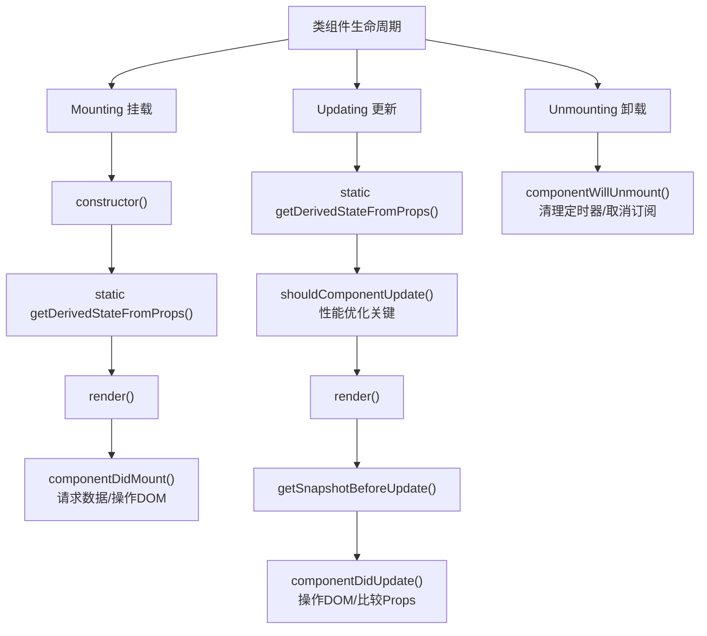

# 二、面向组件编程

## 2.1 基本理解与使用

1. 安装开发者工具

    

2. 创建函数式组件

    ```js
     // 1.创建函数式组件
    function MyComponent(){
        console.log(this);  // 此处的this是undefined，因为babel编译后开启了严格模式
        return <h2>我是用函数定义的组件（适用于【简单组件】的定义）</h2>
    }
    
    // 2.绑定根节点
    const root = ReactDOM.createRoot(document.querySelector('#test'));
    // 3.渲染虚拟DOM到页面
    root.render(<MyComponent/>);
    ```

    执行了`ReactDOM.render(<MyComponent/>)`...之后，发生了什么？

    1. React解析组件标签，找到了MyComponent组件
    2. 发现组件是使用函数定义的，随后调用该函数，将返回的虚拟DMO转为真实DOM，随后呈现在页面中

3. 类的基本知识

    ```html
    <!DOCTYPE html>
    <html lang="en">
    <head>
        <meta charset="UTF-8">
        <title>1_类的基本知识</title>
    </head>
    <body>
        <script>
            /* 
                总结：
                    1. 类中构造器不是必须写的，要对实例进行一些初始化的操作，如果添加指定属性才与
                    2. 如果A类继承了B类，且A类中写了构造器，那么A类构造器中的super是必须要调用的。
                    3. 类中所定义的方法，都是放在了类的圆形对象上，供实例去使用
            */


            // 创建一个Person类
            class Person{
                // 构造器方法
                constructor(name,age){
                    // 构造器中的this是谁？ - 类的实例对象
                    this.name = name
                    this.age = age
                    this.school = "尚硅谷"
                }

                // 一般方法
                speak(){
                    // speak方法放在了哪里？ - 类的原型对象上，供实例使用
                    // 通过Person实例调用speak时，speak中的this就是Person实例
                    console.log(`我叫${this.name},我的年龄是${this.age}`);
                }
            }

            // 创建Person的实例对象
            const p1 = new Person("tom",19)
            const p2 = new Person("jerry",55)
            // 查看对象
            console.log(p1);
            console.log(p2);
            // 调用方法
            p1.speak()
            p2.speak()


            // 创建一个Student类，继承于Person类
            class Student extends Person{
                constructor(name,age,grade){
                    super(name,age)
                    this.grade = grade
                }
                // 重写从父类继承过来的方法
                speak(){
                    console.log(`我叫${this.name},我的年龄是${this.age},我读的是${this.grade}`);
                }
                study(){
                    // study方法放在了哪里？ - 类的原型对象上，供实例使用
                    // 通过Student实例调用speak时，speak中的this就是Student实例
                    console.log('我很努力的学习');
                }
            }
            
        </script>
    </body>
    </html>
    ```

4. 创建类式组件

    ```js
    // 1.创建类式组件
    class MyComponent extends React.Component{
        render(){
            // render是放在哪里的？ - MyComponent的原型对象上，供实例调用
            // render中this是谁？ - MyComponent的实例对象 <=> MyComponent组件实例对象
            console.log('render中的this:',this); 
            return <h2>我是用类定义的组件（适用于【复杂组件】的定义）</h2>
        }
    }
    
    // 2.绑定根节点
    const root = ReactDOM.createRoot(document.querySelector('#test'));
    // 3.渲染虚拟DOM到页面
    root.render(<MyComponent/>);
    ```

    执行了`ReactDOM.render(<MyComponent/>)`...之后，发生了什么？

    1. React解析组件标签，找到了MyComponent组件
    2. 发现组件是使用类定义的，随后new 出该类的实例，并通过该实例调用到原型上的render方法。
    3. 将render返回的虚拟DM转为真实DOM，随后呈现在页面中。


## 2.2 组件的三大属性1: state

1. 初始化state 

    ```js
    // 1.创建组件
    class MyComponent extends React.Component{
        // 初始化
        constructor(props){
            super(props)
            // 初始化状态
            this.state = {isHot:true}
        }

        render(){
            const {isHot} = this.state
            return <h1>今天天气很{isHot ? '炎热' :"凉爽"}</h1>
        }
    }
    
    // 2.绑定根节点
    const root = ReactDOM.createRoot(document.querySelector('#test'));
    // 3.渲染虚拟DOM到页面
    root.render(<MyComponent/>);
    ```

2. 绑定事件

    ```js{6,21-23}
     // 1.创建组件
    class MyComponent extends React.Component{
        // 初始化
        constructor(props){
            super(props)
            // 初始化状态
            this.state = {isHot:true}
        }

        render(){
            const {isHot} = this.state
            return <h1 onClick={demo}>今天天气很{isHot ? '炎热' :"凉爽"}</h1>
        }
    }
    
    // 2.绑定根节点
    const root = ReactDOM.createRoot(document.querySelector('#test'));
    // 3.渲染虚拟DOM到页面
    root.render(<MyComponent/>);

    function demo(){
        console.log("标题被点击了");
    }
    ```

3. 类中方法中的this

    - 外部方法中使用this

        ```js{1,9,25}
        let that;
        // 1.创建组件
        class MyComponent extends React.Component{
            // 初始化
            constructor(props){
                super(props)
                // 初始化状态
                this.state = {isHot:true}
                that = this
            }

            render(){
                const {isHot} = this.state
                return <h1 onClick={changeWeather}>今天天气很{isHot ? '炎热' :"凉爽"}</h1>
            }
        }
        
        // 2.绑定根节点
        const root = ReactDOM.createRoot(document.querySelector('#test'));
        // 3.渲染虚拟DOM到页面
        root.render(<MyComponent/>);

        function changeWeather(){
            // 打印状态
            console.log(that.state.isHot);
        }
        ```
    - 内部方法this的问题

        ```js{15-20}
        // 1.创建组件
        class MyComponent extends React.Component{
            // 初始化
            constructor(props){
                super(props)
                // 初始化状态
                this.state = {isHot:true}
            }

            render(){
                const {isHot} = this.state
                return <h1 onClick={this.changeWeather}>今天天气很{isHot ? '炎热' :"凉爽"}</h1>
            }

            changeWeather(){
                // changeWeather放在哪里？ - weather的原型对象上，供实例使用
                // 由于changeWeather是作为onclick的回调，所以不是通过实例调用的，是直接调用
                // 类中的方法默认开启了局部的严格模式，所以changeWeather中的this为undefined
                console.log(this);
            }
        }
        
        // 2.绑定根节点
        const root = ReactDOM.createRoot(document.querySelector('#test'));
        // 3.渲染虚拟DOM到页面
        root.render(<MyComponent/>);
        ```

    - 内部方法使用this的解决方法

        ```js{9-12}
        // 1.创建组件
        class MyComponent extends React.Component{
            // 初始化
            constructor(props){
                super(props)
                // 初始化状态
                this.state = {isHot:true}

                // 解决changeWeather中this指向问题
                // 1. 更改this指向 
                // 2. 赋值给自身上一个新的changeWeather方法
                this.changeWeather = this.changeWeather.bind(this)
            }

            render(){
                const {isHot} = this.state
                return <h1 onClick={this.changeWeather}>今天天气很{isHot ? '炎热' :"凉爽"}</h1>
            }

            changeWeather(){
                // changeWeather放在哪里？ - weather的原型对象上，供实例使用
                // 由于changeWeather是作为onclick的回调，所以不是通过实例调用的，是直接调用
                // 类中的方法默认开启了局部的严格模式，所以changeWeather中的this为undefined
                console.log(this);
            }
        }

        // 2.绑定根节点
        const root = ReactDOM.createRoot(document.querySelector('#test'));
        // 3.渲染虚拟DOM到页面
        root.render(<MyComponent/>);
        ```

4. setState的使用

    - 基础使用

        ```js{15-23}
        // 1.创建组件
        class MyComponent extends React.Component{
            // 初始化
            constructor(props){
                super(props)
                // 初始化状态
                this.state = {isHot:true}
                this.changeWeather = this.changeWeather.bind(this)
            }

            render(){
                const {isHot} = this.state
                return <h1 onClick={this.changeWeather}>今天天气很{isHot ? '炎热' :"凉爽"}</h1>
            }

            changeWeather(){            
                // 获取原来的isHot值
                const isHot = this.state.isHot;
                // 严重注意：状态必须通过setState进行修改
                this.setState({isHot:!isHot})
                
                // 严重注意：状态（state）不可直接更改，下面这行就是直接更改！！！
                // this.state.isHot = !isHot; // 这是错误的写法
            }
        }
        
        // 2.绑定根节点
        const root = ReactDOM.createRoot(document.querySelector('#test'));
        // 3.渲染虚拟DOM到页面
        root.render(<MyComponent/>);
        ```

    - 问题与判断

        ```js{3,13,19,21}
        // 1.创建组件
        class MyComponent extends React.Component{
            // 构造器调用几次？ ———— 1次
            constructor(props){
                console.log('constructor');
                
                super(props)
                // 初始化状态
                this.state = {isHot:true,wind:'微风'}
                this.changeWeather = this.changeWeather.bind(this)
            }

            // render调用几次？ ———— 1+n次 1是初始化的那次 n是状态更新的次数
            render(){
                const {isHot,wind} = this.state
                return <h1 onClick={this.changeWeather}>今天天气很{isHot ? '炎热' :"凉爽"},{wind}</h1>
            }

            // changeWeather 调用几次？ ———— 点几次调用几次
            changeWeather(){
                // 问题：更新数据是合并还是替换？ ———— 更新是一种合并，不是替换

                // 获取原来的isHot值
                const isHot = this.state.isHot;
                // 严重注意：状态必须通过setState进行修改
                this.setState({isHot:!isHot})
                
                // 严重注意：状态（state）不可直接更改，下面这行就是直接更改！！！
                // this.state.isHot = !isHot; // 这是错误的写法
            }
        }
        
        // 2.绑定根节点
        const root = ReactDOM.createRoot(document.querySelector('#test'));
        // 3.渲染虚拟DOM到页面
        root.render(<MyComponent/>);
        ```

5. state的简写方式

    ```js
    // 1.创建组件
    class MyComponent extends React.Component{

        // 初始化状态
        state = {isHot:true,wind:'微风'}

        render(){
            const {isHot,wind} = this.state
            return <h1 onClick={this.changeWeather}>今天天气很{isHot ? '炎热' :"凉爽"},{wind}</h1>
        }

        // 箭头函数使用外层的this
        // 自定义方法 ———— 要用赋值语句 + 箭头函数和
        changeWeather = () =>{
            const isHot = this.state.isHot;
            this.setState({isHot:!isHot})
        }
    }
    
    // 2.绑定根节点
    const root = ReactDOM.createRoot(document.querySelector('#test'));
    // 3.渲染虚拟DOM到页面
    root.render(<MyComponent/>);
    ```

6. 总结

    - 理解←
        1. state 是组件对象最重要的属性,值是对象(可以包含多个key-value 的组合)
        2. 组件被称为"状态机",通过更新组件的 state 来更新对应的页面显示(重新渲染组件)
    - 强烈注意
        1. 组件中 render 方法中的 this 为组件实例对象
        2. 组件自定义的方法中this为undefined，如何解决?
            1. 强制绑定 this; 通过函数对象的 bind()
            2. 箭头函数
        3. 状态数据，不能直接修改或更新

## 2.3 组件的三大属性2：props

1. props基本使用

    ```js
    class Person extends React.Component{
        // 可以直接使用state 但数据需要从外部传递的
        state = {name:"tom",age:18,sex:"女"}
        render(){
            // 自身的props会出现数据
            console.log(this);
            const {name,age,sex} = this.props

            return (
                <ul>
                    <li>姓名：{name}</li>  
                    <li>年龄：{age}</li>   
                    <li>性别：{sex}</li>   
                </ul>
            )
            
        }
    }

    const root = ReactDOM.createRoot(document.querySelector('#test'));
    root.render(<Person name="tom" age="18" sex="男"/>);
    ```

2. 批量传递props

    ```js
    class Person extends React.Component{
        render(){
            const {name,age,sex} = this.props
            return (
                <ul>
                    <li>姓名：{name}</li>  
                    <li>年龄：{age}</li>   
                    <li>性别：{sex}</li>   
                </ul>
            )
            
        }
    }
    
    const root = ReactDOM.createRoot(document.querySelector('#test'));

    const p = {name:"zhangsan",age:"19",sex:"女"}

    // 直接使用对象中属性
    // root.render(<Person name={p.name} age={p.age} sex={p.sex}/>);
    root.render(<Person {...p}/>);
    ```
3. props是只读的

    ```js{6-7}
     class Person extends React.Component{
        state = {name:"tom",age:18,sex:"女"}
        render(){
            const {name,age,sex} = this.props

            // props是只读的
            // this.props.name = 'jack' // 此行代码会报错，因为props是只读的

            return (
                <ul>
                    <li>姓名：{name}</li>  
                    <li>年龄：{age}</li>   
                    <li>性别：{sex}</li>     
                </ul>
            )
        }
    }
    
    const root = ReactDOM.createRoot(document.querySelector('#test'));

    const p = {name:"zhangsan",age:"19",sex:"女"}
    root.render(<Person {...p}/>);
    ```

4. 对props的限制

    1. recat提供的类型检查
        - propTypes:类型检查，还可以限制不能为空
        - defaultProps：默认值

    2. 下载插件 

        地址：`https://unpkg.com/prop-types@15.8.1/prop-types.min.js`

    3. 代码

        ```html
        <!-- 准备好容器 -->
        <div id="test1"></div>
        <div id="test2"></div>
        <div id="test3"></div>

        <!-- 引入react核心库 -->
        <script type="text/javascript" src="../js/react.development.js"></script>
        <!-- 引入react-dom，用于支持react操作DOM -->
        <script type="text/javascript" src="../js/react-dom.development.js"></script>
        <!-- 引入babel，用于将jsx转为js -->
        <script type="text/javascript" src="../js/babel.min.js"></script>
        <!-- 限制props传递 -->
        <script type="text/javascript" src="../js/prop-types.min.js"></script>

        <script type="text/babel">
            class Person extends React.Component{
                render(){
                    // 自身的props会出现数据
                    console.log(this);
                    const {name,age,sex} = this.props

                    return (
                        <ul>
                            <li>姓名：{name}</li>  
                            <li>年龄：{age}</li>   
                            <li>性别：{sex}</li>    
                        </ul>
                    )
                    
                }
            }
            // 对标签属性进行类型，必要性的限制
            Person.propTypes = {
                name:PropTypes.string.isRequired,   // 限制name必传，且为字符串
                sex:PropTypes.string,   // 限制sex为字符串
                age:PropTypes.number,   // 限制age为数值
                speak:PropTypes.func    // 限制speak为函数
            }

            // 指定默认标签属性值
            Person.defaultProps = {
                sex:"男", // sex默认值为男
                age:18  // age默认值为18
            }

            
            const root1 = ReactDOM.createRoot(document.querySelector('#test1'));
            const root2 = ReactDOM.createRoot(document.querySelector('#test2'));
            const root3 = ReactDOM.createRoot(document.querySelector('#test3'));

            root1.render(<Person name="jerry" speak={speak}/>)
            root2.render(<Person name="tom" age={18} sex="女"/>)

            const p = {name:"zhangsan",age:"19",sex:"女"}
            // 直接使用对象中属性
            root3.render(<Person {...p}/>);

            function speak(){
                
            }
        </script>
        ```
    4. 运行结果

        

5. props的简写方式

    ```js
    class Person extends React.Component{
        // 对标签属性进行类型，必要性的限制
        static propTypes = {
            name:PropTypes.string.isRequired,   // 限制name必传，且为字符串
            sex:PropTypes.string,   // 限制sex为字符串
            age:PropTypes.number,   // 限制age为数值
            speak:PropTypes.func    // 限制speak为函数
        }

        // 指定默认标签属性值
        static defaultProps = {
            sex:"男", // sex默认值为男
            age:18  // age默认值为18
        }
        
        render(){
            const {name,age,sex} = this.props
            return (
                <ul>
                    <li>姓名：{name}</li>  
                    <li>性别：{age}</li>   
                    <li>年龄：{sex}</li>     
                </ul>
            )  
        }
    }
    
    const root1 = ReactDOM.createRoot(document.querySelector('#test1'));
    const root2 = ReactDOM.createRoot(document.querySelector('#test2'));
    const root3 = ReactDOM.createRoot(document.querySelector('#test3'));

    root1.render(<Person name="jerry" speak={speak}/>)
    root2.render(<Person name="tom" age={18} sex="女"/>)

    const p = {name:"zhangsan",age:"19",sex:"女"}
    // 直接使用对象中属性
    root3.render(<Person {...p}/>);

    function speak(){
        
    }
    ```

6. 类式组件中的构造器于props

    ```js
    constructor(props){
        // 构造器是否接收props，是否传递给super,取决于：是否希望在构造器中通过this访问props
        console.log(props);
        super(props)
        console.log('constructor',props);
    }
    ```
7. 函数式组件中的构造器于props

    ```js
    // 创建组件
    function Person(props){
        const {name,age,sex} = props

        return (
            <ul>
                <li>姓名：{name}</li>  
                <li>性别：{age}</li>   
                <li>年龄：{sex}</li>     
            </ul>
        )  
    }

    // 对标签属性进行类型，必要性的限制
    Person.propTypes = {
        name:PropTypes.string.isRequired,  
        sex:PropTypes.string,  
        age:PropTypes.number,  
    }

    // 指定默认标签属性值
    Person.defaultProps = {
        sex:"男",
        age:18 
    }
    
    const root1 = ReactDOM.createRoot(document.querySelector('#test1'));
    root1.render(<Person name="jerry" />)
    ```
8. 总结

    1. 理解
        - 每个组件对象都会有props(properties 的简写)属性
        - 组件标签的所有属性都保存在props中
    2. 作用
        - 标签属性从组件外向且件内传递变化的数据
        - 注意: 组件内部不要修改 props 数据

## 2.4 组件的三大属性：refs与事件处理

1. 字符串形式的ref

    ```js
    // 创建组件
    class Demo extends React.Component{
        // 展示上方输入框的数据
        showData1 = () =>{
            const {input1} = this.refs
            alert(input1.value)
        }
        // 展示下方输入框的数据
        showData2 = () =>{
            const {input2} = this.refs
            alert(input2.value)
        }

        render(){
            return(
                <div>
                    <input ref="input1" type="text" placeholder="点击按钮提示数据" /> <br/>
                    <button onClick={this.showData1}>点我展示上方的数据</button> <br/>
                    <input ref="input2" onBlur={this.showData2} type="text" placeholder="失去焦点提示数据" />
                </div>
            )
        }
        
    }
    
    const root1 = ReactDOM.createRoot(document.querySelector('#test'));
    root1.render(<Demo/>)
    ```
2. 回调函数形式的ref

    ```js
    // 创建组件
    class Demo extends React.Component{
        // 展示上方输入框的数据
        showData1 = () =>{
            const {input1} = this
            alert(input1.value)
        }
        // 展示下方输入框的数据
        showData2 = () =>{
            const {input2} = this
            alert(input2.value)
        }

        /* 
            ref={(c)=>{this.input1 = c}}
            其中参数c 是 当前input的DOM对象
            this由于是箭头函数，指向类自身
        */

        render(){
            return(
                <div>
                    <input ref={(c)=>{this.input1 = c}} type="text" placeholder="点击按钮提示数据" /> <br/>
                    <button onClick={this.showData1}>点我展示上方的数据</button> <br/>
                    <input ref={c=> this.input2 = c }  onBlur={this.showData2} type="text" placeholder="失去焦点提示数据" />
                </div>
            )
        }
        
    }
    
    const root1 = ReactDOM.createRoot(document.querySelector('#test'));
    root1.render(<Demo/>)
    ```
3. 回调ref中回调次数的问题

    ```js
    // 创建组件
    class Demo extends React.Component{
        state = { isHot:false }

        showInfo = () =>{
            const {input1} = this
            console.log("showInfo",input1);
        }

        // 内联的函数会调用两次
        // 如果要减少运行次数 调用类上的函数
        saveInput = (c) =>{
            this.input1 = c;
            console.log("@",c);
        }

        changeWeather = () =>{
            // 获取原来的状态
            const {isHot} = this.state
            // 更新状态
            this.setState({isHot:!isHot})
        }

        render(){
            const {isHot} = this.state
            return(
                <div>
                    {/*<input ref={(c) => {this.input1 = c; console.log("@",currentNode);}} type="text" placeholder="点击按钮提示数据" />*/}

                    <input ref={this.saveInput} type="text" placeholder="点击按钮提示数据" /> 
                    <button onClick={this.showInfo}>点我提示输入的数据</button>

                    <h2>今天天气很{isHot ? '炎热' :"凉爽"}</h2>
                    <button onClick={this.changeWeather}>点我切换天气</button>
                </div>
            )
        }
    }
    
    const root1 = ReactDOM.createRoot(document.querySelector('#test'));
    root1.render(<Demo/>)
    ```

4. createRef的使用

    ```js
    // 创建组件
    class Demo extends React.Component{
        /* 
            React.createRef调用后可以返回一个容器，该容器可以存储被ref所标识的节点
            该容器是“专人专用”的，每个容器只绑定一个DOM对象
        */
        myRef1 = React.createRef()
        myRef2 = React.createRef()

        showData1 = () =>{
            alert(this.myRef1.current.value);
        }
        showData2 = () =>{
            alert(this.myRef2.current.value)
        }

        render(){
            return(
                <div>
                    <input ref={this.myRef1} type="text" placeholder="点击按钮提示数据" /> <br/>
                    <button onClick={this.showData1}>点我展示上方的数据</button> <br/>
                    <input ref={this.myRef2}  onBlur={this.showData2} type="text" placeholder="失去焦点提示数据" />
                </div>
            )
        }
    }
    
    const root1 = ReactDOM.createRoot(document.querySelector('#test'));
    root1.render(<Demo/>)
    ```

## 2.5 react中的事件处理

1. 使用方式

    1. 通过onXxx属性指定事件处理函数（注意大小写）
        - React使用的是自定义(合成)事件，而不是使用的原生DOM事件 ———— 为了更好的兼容性
        - React中的事件是通过事件委托方式处理的（委托给组件最外层的元素） ———— 为了高效
    2. 通过event.target得到发生事件的DOM元素对象 ———— 不要过度的使用ref

2. 代码演示

    ```js
    // 创建组件
    class Demo extends React.Component{
        myRef1 = React.createRef()

        showData1 = () =>{
            alert(this.myRef1.current.value);
        }
        // 可以避免ref
        showData2 = (event) =>{
            console.log(event.target.value);
        }

        render(){
            return(
                <div>
                    <input ref={this.myRef1} type="text" placeholder="点击按钮提示数据" /> <br/>
                    <button onClick={this.showData1}>点我展示上方的数据</button> <br/>
                    <input  onBlur={this.showData2} type="text" placeholder="失去焦点提示数据" />
                </div>
            )
        }
    }

    const root1 = ReactDOM.createRoot(document.querySelector('#test'));
    root1.render(<Demo/>)
    ```

## 2.6 收集表单数据

1. 介绍

    1. 非受控组件 (Uncontrolled Components)
        - 核心思想：表单数据由 DOM 元素自身管理。你通过 ref 来直接从 DOM 节点获取表单值，而不是通过 React 的 state 来控制。

        - 如何工作：
            - 使用 useRef Hook（或在类组件中使用 React.createRef()）创建一个 ref。
            - 将 ref 关联到对应的表单元素（如 `<input>`）。
            - 当需要获取表单值时（例如提交时），通过 ref.current.value 来读取 DOM 节点的值。
    2. 受控组件 (Controlled Components)
        - 核心思想：表单数据由 React 的 state 完全控制。表单元素的值来自 state，而值的改变则由 React 通过事件处理函数来同步更新 state。

        - 如何工作：
            - 在 state 中定义存储表单数据的变量（如 const [name, setName] = useState('')）。
            - 将表单元素（如 `<input>`）的 value 属性设置为这个 state 变量。
            - 为表单元素添加 onChange 事件处理函数。当用户输入时，该函数被调用，通过 event.target.value 获取新值，并用它来更新 state。
            - state 更新后，组件重新渲染，表单元素会显示新的 state 值。

2. 非受控组件

    ```js
    // 创建组件
    class Login extends React.Component{
        

        handleSubmit = (event) =>{
            event.preventDefault() // 阻止表单提交
            const {username,password} = this
            alert(`你输入的用户名是${username.value},你输入的密码是：${password.value}`)
        }

        render(){
            return(
                <form onSubmit={this.handleSubmit}>
                    用户名：<input ref={c => this.username = c} type="text" name="username"/>
                    密码：<input ref={c => this.password = c} type="password" name="password"/>
                    <button>登录</button>
                </form>
            )
        }
    }
    
    const root1 = ReactDOM.createRoot(document.querySelector('#test'));
    root1.render(<Login/>)
    ```

3. 受控组件

    ```js
    // 创建组件
    class Login extends React.Component{

        // 初始化状态
        state = {
            username:'', // 用户名
            password:"",  // 密码
        }

        // 保存用户名到状态中
        saveUsername = (event) =>{
            this.setState({username:event.target.value})
        }
        // 保存密码到状态中
        savePassword = (event) =>{
            console.log(111);
            
            this.setState({password:event.target.value})
        }

        // 表单提交的回调
        handleSubmit = (event) =>{
            event.preventDefault() // 阻止表单提交
            const {username,password} = this.state
            alert(`你输入的用户名是：${username},你输入的密码是：${password}`)
        }

        render(){
            return(
                <form onSubmit={this.handleSubmit}>
                    用户名：<input onChange={this.saveUsername} type="text" name="username"/>
                    密码：<input  onChange={this.savePassword} type="password" name="password"/>
                    <button>登录</button>
                </form>
            )
        }
    }
    
    const root1 = ReactDOM.createRoot(document.querySelector('#test'));
    root1.render(<Login/>)
    ```

## 2.7 高阶函数_函数柯里化

1. 高阶函数与函数柯里化定义

    - 高阶函数：如果一个函数符合下面2个规范中的任何一个，那该函数就是高阶函数。
        1. 若A函数，接收的参数是一个函数，那么A就可以称之为高阶函数
        2. 若A函数，调用的返回值是一个函数，那么A就可以称之为高阶函数

        常见的高阶函数有：Promise、setTimout、arr.map()

    - 函数的柯里化：通过函数调用继续返回函数的方式，实现多次接收参数最后统一处理的函数编码形式。

2. 高阶函数_函数柯里化

    ```js
    // 创建组件
    class Login extends React.Component{

        // 初始化状态
        state = {
            username:'', // 用户名
            password:"",  // 密码
        }

        saveFormData = (dataType) =>{
            // 这个返回的函数才是 输入后的调用 
            return (event) =>{
                this.setState({[dataType]:event.target.value})
            }
        }
        
        
        // 表单提交的回调
        handleSubmit = (event) =>{
            event.preventDefault() // 阻止表单提交
            const {username,password} = this.state
            alert(`你输入的用户名是：${username},你输入的密码是：${password}`)
        }

        render(){
            return(
                <form onSubmit={this.handleSubmit}>
                    用户名：<input onChange={this.saveFormData('username')} type="text" name="username"/>
                    密码：<input  onChange={this.saveFormData('password')} type="password" name="password"/>
                    <button>登录</button>
                </form>
            )
        }
    }
    
    const root1 = ReactDOM.createRoot(document.querySelector('#test'));
    root1.render(<Login/>)
    ```
3. 不用柯里化的实现

    ```js
    // 创建组件
    class Login extends React.Component{

        // 初始化状态
        state = {
            username:'', // 用户名
            password:"",  // 密码
        }

        saveFormData = (dataType,event) =>{
            this.setState({[dataType]:event.target.value})
        }
        
        
        // 表单提交的回调
        handleSubmit = (event) =>{
            event.preventDefault() // 阻止表单提交
            const {username,password} = this.state
            alert(`你输入的用户名是：${username},你输入的密码是：${password}`)
        }

        render(){
            return(
                <form onSubmit={this.handleSubmit}>
                    用户名：<input onChange={(event) => {this.saveFormData('username',event)}} type="text" name="username"/>
                    密码：<input  onChange={event => this.saveFormData('password',event)} type="password" name="password"/>
                    <button>登录</button>
                </form>
            )
        }
    }
    
    const root1 = ReactDOM.createRoot(document.querySelector('#test'));
    root1.render(<Login/>)
    ```

## 2.8 类组件生命周期

1. 类组件声明周期的流程图



2. 各个阶段含义

    1. **挂载阶段 (Mounting)**

        当一个组件实例被创建并插入 DOM 时，调用顺序如下：

        - `constructor(props)`
            - 目的：初始化 state、绑定事件处理函数。
            - 注意：必须先调用 super(   - props)。
        - `static getDerivedStateFromProps(props, state)`
            - 目的：在渲染前根据新的 props 来返回一个对象以更新 state，或者返回 null 不更新任何内容。
            - 使用场景：罕见，通常用于 state 依赖于 props 随时间变化的极端情况。

        - `render()`
            - 目的：必须实现的唯一方法。它检查 this.props 和 this.state 并返回 React 元素（JSX）、数组、Fragment、Portal 或 null。
            - 注意：应为纯函数，不修改组件 state。

        - `componentDidMount()`
            - 目的：组件已被挂载到 DOM 后立即调用。
            - 常用场景：进行网络请求、订阅事件、操作 DOM 等副作用操作。

    2. **更新阶段 (Updating)**
        
        当组件的 props 或 state 发生变化时，会触发更新。调用顺序如下：

        - `static getDerivedStateFromProps(props, state)`

            挂载阶段也会调用，更新阶段是第一步。

        - `shouldComponentUpdate(nextProps, nextState)`

            - 目的：决定组件是否应该重新渲染。返回 true 则继续，返回 false 则跳过本次更新的 render 及之后的步骤。

            - 使用场景：主要的性能优化手段。通常使用 PureComponent 或 React.memo 来自动实现浅比较，而不是手动实现该方法。

        - `render()`

            根据新的 props 和 state 重新渲染。

        - `getSnapshotBeforeUpdate(prevProps, prevState)`
            - 目的：在 React 将渲染输出提交到 DOM之前捕获一些信息（例如滚动位置）。此方法的任何返回值将作为参数传递给 componentDidUpdate()。
            - 使用场景：不常用，主要用于处理 UI（如聊天窗口的滚动位置）。
        - `componentDidUpdate(prevProps, prevState, snapshot)`
            - 目的：更新完成后被调用。可以操作 DOM 或执行网络请求等副作用。
            - 注意：必须将本次 props 与上一次 props 进行比较（例如网络请求），否则可能导致无限循环。

    3. **卸载阶段 (Unmounting)**
        
        当组件从 DOM 中移除时调用：

        - `componentWillUnmount()`

            目的：进行必要的清理工作，如清除定时器、取消网络请求、移除事件监听器、取消订阅等。这是防止内存泄漏的关键方法。

    4. **错误处理 (Error Handling)**
        
        当子组件抛出错误时，会调用：

        - `static getDerivedStateFromError(error)`

            在后代组件抛出错误后被调用。它将抛出的错误作为参数，并返回一个值以更新 state，用于渲染降级 UI。

        - `componentDidCatch(error, info)`

            在后代组件抛出错误后被调用。用于记录错误信息。

2. 挂载案例

    - 代码

        ```js
        class MountingClassDemo extends React.Component {
            constructor(props) {
                super(props);
                console.log('1. constructor - 构造函数');
                this.state = {
                data: null,
                message: '组件正在初始化...'
                };
            }

            static getDerivedStateFromProps(nextProps, prevState) {
                console.log('2. getDerivedStateFromProps - 派生状态');
                return null; // 不更新state
            }

            componentDidMount() {
                console.log('4. componentDidMount - 组件已挂载');
                // 模拟数据请求
                this.setState({ message: '正在加载数据...' });
                
                setTimeout(() => {
                    this.setState({ 
                        data: { id: 1, name: '加载完成的数据' },
                        message: '数据加载成功！'
                    });
                }, 1500);
            }

        
            render() {
                console.log('3. render - 渲染');
                return (
                    <div style={{ padding: '20px', border: '2px solid blue', margin: '10px' }}>
                        <h3>类组件 - 挂载案例</h3>
                        <p>{this.state.message}</p>
                        {this.state.data && (
                            <div>
                                <p>ID: {this.state.data.id}</p>
                                <p>名称: {this.state.data.name}</p>
                            </div>
                        )}
                    </div>
                );
            }
        }
        
        const root = ReactDOM.createRoot(document.querySelector('#test'));
        root.render(<MountingClassDemo/>)
        ```
    - 页面运行

        

    - 控制台打印

        

2. 更新案例

    - 代码

        ```js
        // 创建组件
        class MountingClassDemo extends React.Component {
            constructor(props) {
                super(props);
                console.log('1. constructor - 构造函数');
                this.state = {
                data: null,
                message: '组件正在初始化...'
                };
            }

            static getDerivedStateFromProps(nextProps, prevState) {
                console.log('2. getDerivedStateFromProps - 派生状态');
                return null; // 不更新state
            }

            componentDidMount() {
                console.log('4. componentDidMount - 组件已挂载');
                // 模拟数据请求
                this.setState({ message: '正在加载数据...' });
                
                setTimeout(() => {
                    this.setState({ 
                        data: { id: 1, name: '加载完成的数据' },
                        message: '数据加载成功！'
                    });
                }, 1500);
            }

        
            render() {
                console.log('3. render - 渲染');
                return (
                    <div style={{ padding: '20px', border: '2px solid blue', margin: '10px' }}>
                        <h3>类组件 - 挂载案例</h3>
                        <p>{this.state.message}</p>
                        {this.state.data && (
                            <div>
                                <p>ID: {this.state.data.id}</p>
                                <p>名称: {this.state.data.name}</p>
                            </div>
                        )}
                    </div>
                );
            }
        }
        
        const root = ReactDOM.createRoot(document.querySelector('#test'));
        root.render(<MountingClassDemo/>)
        ```

    - 页面运行

        

    - 控制台打印

        

3. 卸载案例

    - 代码

        ```js
        class UnmountingClassDemo extends React.Component {
            constructor(props) {
                super(props);
                this.state = {
                timer: 0
                };
                this.intervalId = null;
            }

            componentDidMount() {
                console.log('组件已挂载，启动定时器');
                
                // 启动定时器
                this.intervalId = setInterval(() => {
                this.setState(prevState => ({ 
                    timer: prevState.timer + 1 
                }));
                }, 1000);

                // 添加事件监听
                window.addEventListener('beforeunload', this.handleBeforeUnload);
            }

            componentWillUnmount() {
                console.log('componentWillUnmount - 组件即将卸载');
                
                // 清理定时器
                if (this.intervalId) {
                    clearInterval(this.intervalId);
                    console.log('定时器已清理');
                }
                
                // 移除事件监听
                window.removeEventListener('beforeunload', this.handleBeforeUnload);
                console.log('事件监听器已移除');
                
                console.log('所有资源清理完成');
            }

            handleBeforeUnload = (e) => {
                e.preventDefault();
                e.returnValue = '';
            }

            render() {
                return (
                <div style={{ padding: '20px', border: '2px solid brown', margin: '10px' }}>
                    <h3>类组件 - 卸载案例</h3>
                    <p>定时器运行: {this.state.timer} 秒</p>
                    <p>打开控制台，然后卸载组件查看清理过程</p>
                    <div style={{ backgroundColor: '#ffe6e6', padding: '10px', margin: '10px' }}>
                    <strong>注意：</strong>观察组件卸载时的清理日志
                    </div>
                </div>
                );
            }
        }
        
        const root = ReactDOM.createRoot(document.querySelector('#test'));
        root.render(<UnmountingClassDemo/>)
        ```

    - 页面运行

        

    - 控制台打印

        

## 2.10 虚拟DOM与DOM Diff 算法

1. 虚拟DOM中key的作用:
    - 简单的说:key是虚拟DOM对象的标识，在更新显示时key起着极其重要的作用。
    - 详细的说:当状态中的数据发生变化时，react会根据【新数据】生成【新的虚拟DOM】随后React进行【新虚拟DOM】与【旧虚拟DOM】的diff比较，比较规则如下:
        - 旧虚拟DOM中找到了与新虚拟DOM相同的key:
            1. 若虚拟DOM中内容没变，直接使用之前的真实DOM
            2. 若虚拟DOM中内容变了，则生成新的真实DOM，随后替换掉页面中之前的真实DOM
        - 旧虚拟DOM中未找到与新虚拟DOM相同的key
            
            根据数据创建新的真实DOM，随后渲染到到页面

2. 用index作为key可能会引发的问题:

    1. 若对数据进行:逆序添加、逆序删除等破坏顺序操作:
    
        会产生没有必要的真实DOM更新 ==>界面效果没问题，但效率低。
    2. 如果结构中还包含输入类的DOM:
    
        会产生错误DOM更新 ==>界面有问题。
    3.注意!如果不存在对数据的逆序添加、逆序删除等破坏顺序操作，仅用于渲染列表用于展示，使用index作为key是没有问题的。

3. 开发中如何选择key?:
    1. 最好使用每条数据的唯一标识作为key，比如id、手机号、身份证号、学号等唯一值。
    2. 如果确定只是简单的展示数据，用index也是可以的。


