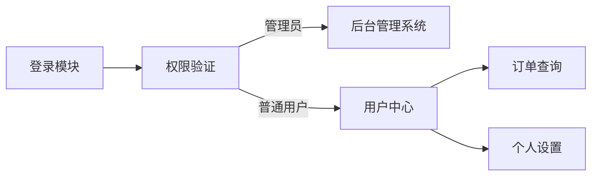
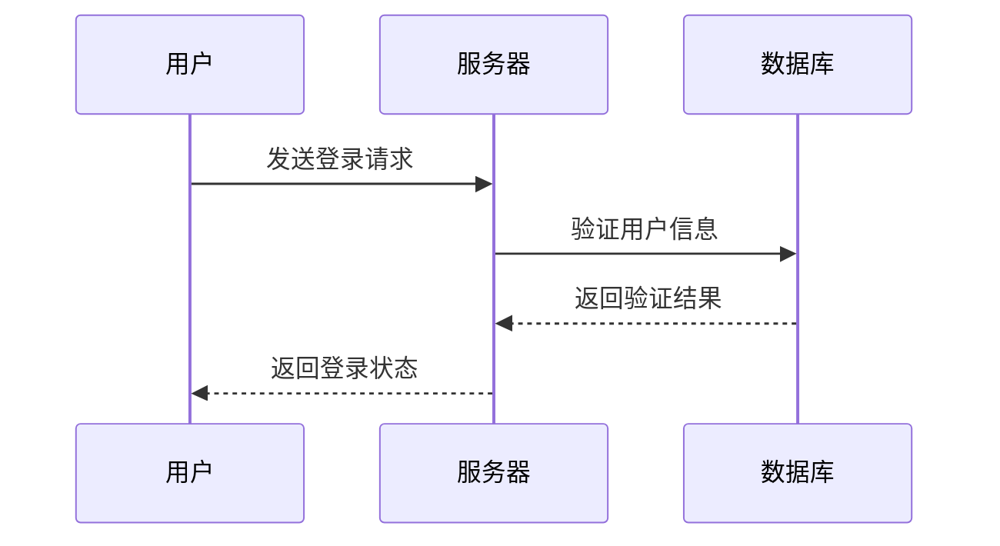
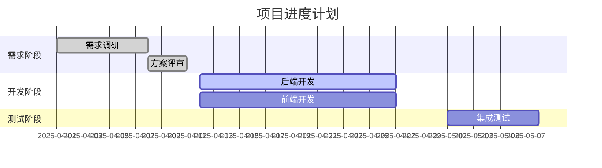
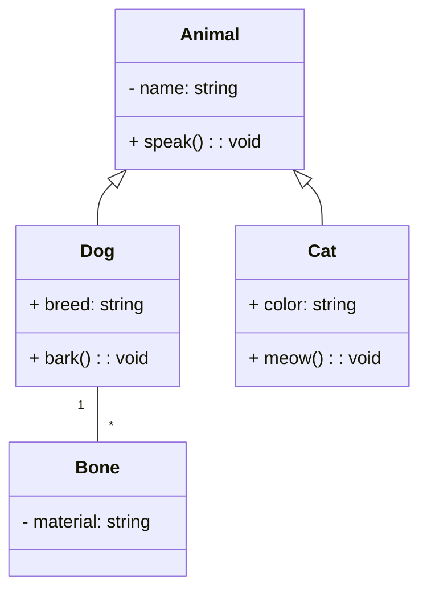
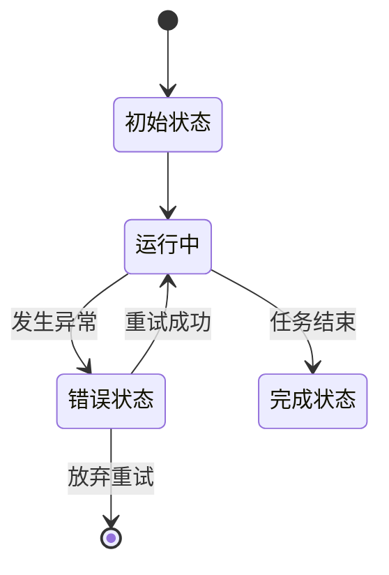
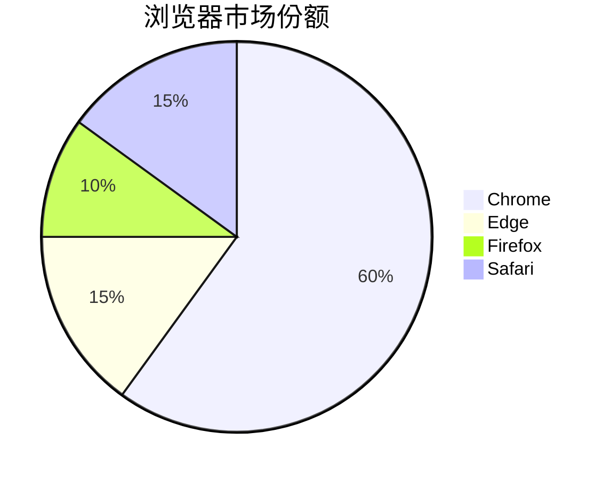
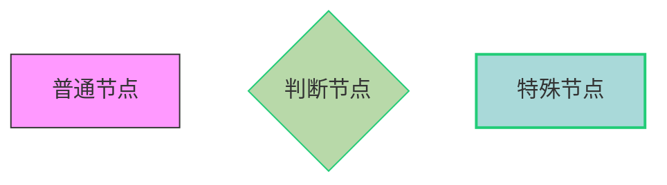
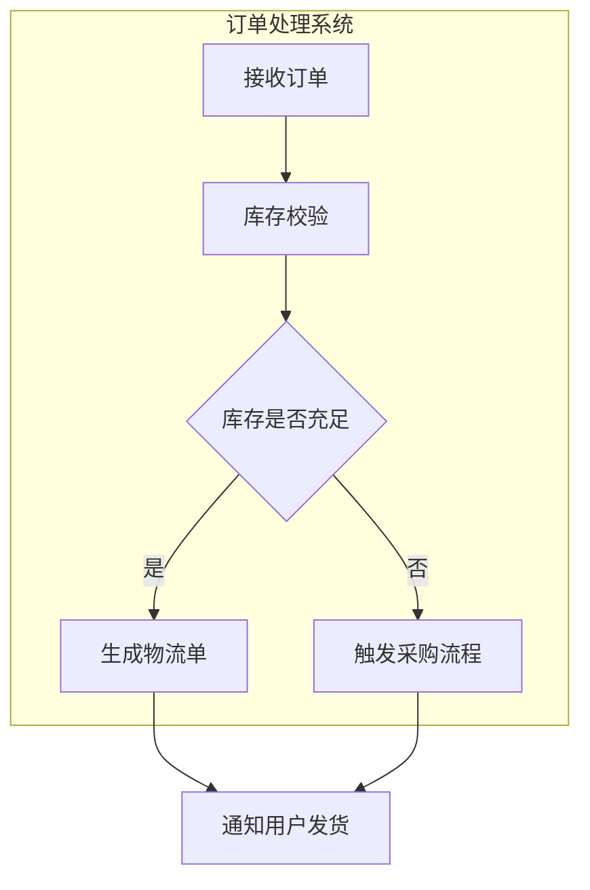
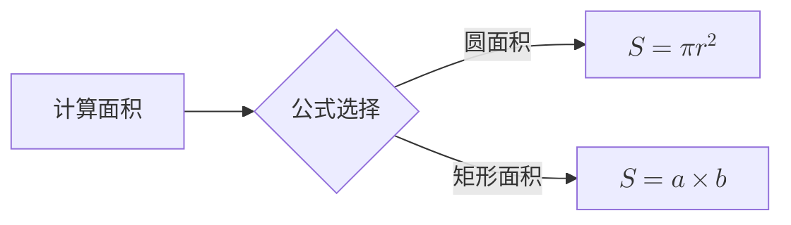

# 五、简单 mermaid 使用


## 1. 常见图表类型及语法示例

### （1） 流程图（Flowchart）

-   **方向控制**：`TD`（从上到下）、`LR`（从左到右）、`BT`（从下到上）、`RL`（从右到左）
-   **节点类型**：
    *   矩形：`A[节点名称]`
    *   菱形（判断）：`B{选择分支}`
    *   圆形：`C((圆角节点))`
    *   平行四边形（输入输出）：`D[/输入信息/]`

- 代码

```
graph LR
  登录模块 --> 权限验证
  权限验证 -->|管理员| 后台管理系统
  权限验证 -->|普通用户| 用户中心
  用户中心 --> 订单查询
  用户中心 --> 个人设置
```

- 展示图




### （2） 序列图（Sequence Diagram）

用于描述对象之间的交互顺序，关键词：`participant`（参与者）、`->`不带箭头实线 `->>` 带箭头实线、`-->` 带箭头虚线、`<<->>` 双向箭头实线


- 代码

```
sequenceDiagram
    用户->>服务器: 发送登录请求
    服务器->>数据库: 验证用户信息
    数据库-->>服务器: 返回验证结果
    服务器-->>用户: 返回登录状态
```

- 展示图



### （3） 甘特图（Gantt Chart）

项目管理神器，支持任务时间规划、依赖关系


- 代码

```
gantt
  title 项目进度计划
  dateFormat  YYYY-MM-DD
  section 需求阶段
  需求调研       :done, des1, 2025-04-01, 7d
  方案评审       :done, des2, 2025-04-08, 3d
  section 开发阶段
  后端开发       :active, dev1, 2025-04-12, 15d
  前端开发       :dev2, 2025-04-12, 15d
  section 测试阶段
  集成测试       :test1, 2025-05-01, 7d
```

- 展示图



### （4） 类图（Class Diagram）


面向对象设计必备，支持继承（`--|>`）、实现（`..|>`）、关联（`--`）、依赖（`..>`）：


- 代码

```
classDiagram
  class Animal {
    - name: string
    + speak(): void
  }
  class Dog {
    + breed: string
    + bark(): void
  }
  class Cat {
    + color: string
    + meow(): void
  }
  Animal <|-- Dog
  Animal <|-- Cat
  Dog "1" -- "*" Bone
  class Bone {
    - material: string
  }
```
-  展示图




### （5） 状态图（State Diagram）


描述对象状态转换逻辑：


- 代码

```
stateDiagram-v2
  [*] --> 初始状态
  初始状态 --> 运行中
  运行中 --> 错误状态: 发生异常
  运行中 --> 完成状态: 任务结束
  错误状态 --> 运行中: 重试成功
  错误状态 --> [*]: 放弃重试
```

- 展示图



### （6） 饼图（Pie Chart）


数据可视化场景：


- 代码

```
pie
  title 浏览器市场份额
  "Chrome" : 60
  "Edge" : 15
  "Firefox" : 10
  "Safari" : 15
```

- 展示图




## 2. 高级技巧：让图表更专业

### （1） 自定义样式

通过 `class` 和 CSS 自定义节点样式：


- 代码

```
graph TD
  A[普通节点]:::normal
  B{判断节点}:::decision
  C[特殊节点]:::special

  classDef normal fill:#f9f,stroke:#333
  classDef decision fill:#b8d9a9,stroke:#2c7
  classDef special fill:#a9d9d9,stroke:#2c7,stroke-width:2px
```

- 展示图



### （2） 子图（Subgraph）

组织复杂图表结构

- 代码

```
graph TD
  subgraph 订单处理系统
    A[接收订单] --> B[库存校验]
    B --> C{库存是否充足}
    C -->|是| D[生成物流单]
    C -->|否| E[触发采购流程]
  end
  D --> F[通知用户发货]
  E --> F
```

- 展示图



### （3） 数学公式集成

在节点中插入 LaTeX 公式（需配合渲染工具）


- 代码

```
graph LR
  A[计算面积] --> B{公式选择}
  B -->|圆面积| C[$$S = \pi r^2$$]
  B -->|矩形面积| D[$$S = a \times b$$]
```

- 展示图



