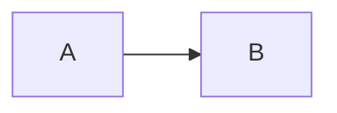
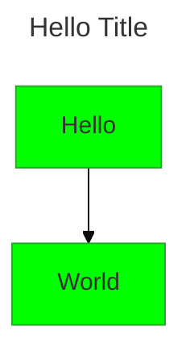
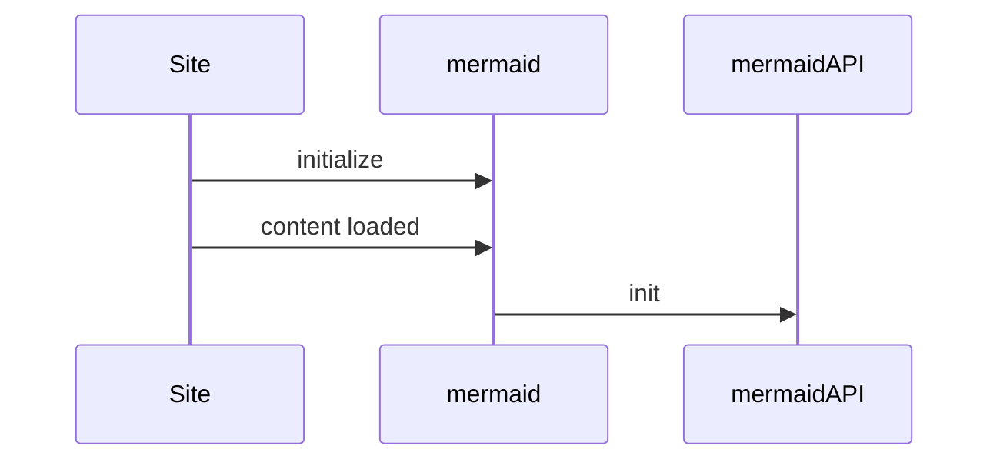

# 零、mermaid基础知识

它是一个基于JavaScript的绘图和图表工具，可以呈现受markdown启发的文本定义，以动态地创建和修改图表。

## 1. markdown 使用 mermaid

````
以下代码块将呈现为Mermaid图：


````

## 2. html代码使用 

通过 mermaid.esm.mjs 或 mermaid.esm.min.mjs 和 mermaid.initialize() 调用导入Mermaid库

```html
<html>
  <body>
    Here is one mermaid diagram:
    <pre class="mermaid">
            graph TD
            A[Client] --> B[Load Balancer]
            B --> C[Server1]
            B --> D[Server2]
    </pre>

    And here is another:
    <pre class="mermaid">
            graph TD
            A[Client] -->|tcp_123| B
            B(Load Balancer)
            B -->|tcp_456| C[Server1]
            B -->|tcp_456| D[Server2]
    </pre>

    <script type="module">
      import mermaid from 'https://cdn.jsdelivr.net/npm/mermaid@11/dist/mermaid.esm.min.mjs';
      mermaid.initialize({ startOnLoad: true });
    </script>
  </body>
</html>
```

## 3. Mermaid使用npm引入

1. 安装

```sh
npm install -D mermaid
```

2. mermaid引入和初始化

```js
import  mermaid from 'mermaid'
mermaid.initialize({ startOnLoad: false })
```

3. 通过v-html进行渲染

```vue
<template>
  <div v-html="mermaidCode"></div>
</template>

<script>
import mermaid from "mermaid";
export default {
  created(){
    mermaid.initialize({
        startOnLoad: true,
        securityLevel:"loose"
    })
  },
  computed: {
    mermaidCode() {
      return `
        <div class="mermaid" id="mermaidChart">
          flowchart LR;
          A-->B;
          B-->C;
          C-->D;
        </div>
      `;
    }
  }
}
</script>
```

## 4. mermaid 配置

- 站点级别的覆盖由initialize调用设置，并将应用于站点/应用程序中的所有图。这个术语是siteConfig。
- Frontmatter ——可以在图表的Frontmatter中更新所选的配置参数。这些应用于渲染配置。

### 4.1 Frontmatter配置
可以在图的顶端覆盖整个美人鱼配置（除了安全配置）。前端内容是位于图表顶部的一个YAML块。

- 代码

```
---
title: Hello Title
config:
  theme: base
  themeVariables:
    primaryColor: "#00ff00"
---
flowchart
	Hello --> World
```

- 展示图



### 4.2 initialize

1. 初始化的序列图




2. 初始化配置

[配置项查看](https://mermaid.js.org/config/schema-docs/config.html)

```
mermaid.initialize({
  ...
});
```


## 5. mermaid api与接口


### 5.1 安装等级(securityLevel)


| 参数            | 描述        | 类型  | 要求 | 值                                          |
|---------------|-----------|-----|----|--------------------------------------------|
| securityLevel | 已解析图的信任级别 | 字符串 | 可选 | `sandbox`、 `strict`、 `loose`、 `antiscript` |

- 值
  - strict:（默认）对文本中的HTML标记进行编码，并且禁用单击功能。
  - antiscript：允许文本中的HTML标记（仅删除脚本元素），并启用单击功能。
  - loose：允许文本中的HTML标记，并启用单击功能。
  - sandbox：使用此安全级别，所有渲染都在沙盒框架中进行。这可以防止任何JavaScript在上下文中运行。这可能会阻碍图的交互功能，如脚本、序列图中的弹出窗口、到其他选项卡或目标的链接等。

- 代码写法

```js
mermaid.initialize({
  securityLevel: 'loose',
});
```

### 5.2 mermaid.run


run是在v10中添加的，是处理更复杂集成的首选方式。默认情况下，当文档准备好时将调用 `mermaid.run` ，呈现所有 `class="mermaid"` 的元素。

您可以通过调用 `await mermaid.run(<config>)` 来定制该行为。

`mermaid.initialize({startOnLoad: false})` 将阻止 `mermaid.run` 在加载后被自动调用。

使用querySelector “.someOtherClass”渲染所有元素


```js
mermaid.initialize({ startOnLoad: false });
await mermaid.run({
  querySelector: '.someOtherClass',
});
```

渲染作为数组传递的所有元素


```js
mermaid.initialize({ startOnLoad: false });

await mermaid.run({
  nodes: [document.getElementById('someId'), document.getElementById('anotherId')],
});

await mermaid.run({
  nodes: document.querySelectorAll('.yetAnotherClass'),
});
```

渲染所有 `.mermaid` 元素，同时抑制任何错误


```js
mermaid.initialize({ startOnLoad: false });
await mermaid.run({
  suppressErrors: true,
});
```

### 5.3 `mermaid.init`-已弃用

Init在v10中已弃用，并将在未来的版本中删除。请使用mermaid.run代替。

默认情况下，当文档准备好时将调用 `mermaid.init` ，查找所有 `class="mermaid"` 的元素。如果你在mermaid加载后添加内容，或者需要更细粒度地控制此行为，你可以自己调用 `init` ：

*   配置对象
*   有些节点，如

例子:


```javascript
mermaid.init({ noteMargin: 10 }, '.someOtherClass');
```

或者没有配置对象，只有一个jQuery选择：

```javascript
mermaid.init(undefined, $('#someId .yetAnotherClass'));
```


## 6. 注意点

1. 转义所有尖括号 
  - `<` → `&lt;`
  - `>` → `&gt;`
  - 所有泛型声明都需要转义


2. 包裹含特殊符号的文本
  - 如果文本包含 `[]`, `()`, `<br>`, `/` 或`空格`，必须用双引号包裹：`["Text with symbols"]`
  - 重要提示：箭头后的节点定义必须立刻接双引号，例如 --> `C["描述文本"]`

3. 换行符保留规则 
  - `<br>` 可以正常使用，但必须位于双引号包裹的文本块内

4. 箭头语法的纯净性
  - 确保连接符 `-->` 后面紧跟节点定义，不要掺杂未包裹的文本


5. 类图最好不要以 `{}` 结尾，vue页面识别错误

可以加上end

```
classDiagram
    class MyClass {

    }
end
```

## 7. 在线使用

网站：`https://mermaid-live.nodejs.cn/`