# 一、流程图

<!-- ## 1.1 流程图-基本语法 -->

流程图由节点（几何形状）和边（箭头或线）组成。Mermaid代码定义了如何创建节点和边，并适应不同的箭头类型、多向箭头以及与子图之间的任何链接。

>注意1：如果您在流程图节点中使用单词`end`，请将整个单词或任何字母（例如，`end`或`END`）大写，或应用此解决方案。以小写字母输入`end`将中断流程图。

>注意2：如果您使用字母`o`或`x`作为连接流程图节点中的第一个字母，请在字母之前添加空格或将字母大写
（例如, `dev--- ops`, `dev---Ops`）
>   - 输入"A---oB" 将创建一个圆形边缘。
>   - 输入"A---xB" 将创建一个十字边。

## 1.1 单节点

- 代码

```
flowchart LR
    id
```

- 展示图

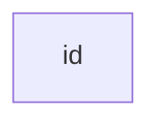

- 信息

    id是框中显示的内容。

- 提示

    除了 flowchart 之外，还可以使用 graph 。

## 1.2 文本节点

也可以在框中设置与id不同的文本。如果多次执行此操作，则将使用为节点找到的最后一个文本。此外，如果稍后为节点定义边缘，则可以省略文本定义。在呈现框时将使用前面定义的那个。

- 代码

```
---
title: Node with text
---
flowchart LR
    id1[This is the text in the box]
```


- 展示图

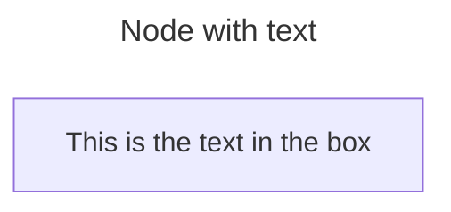

### 1.2.1 Unicode文本

使用 `"` 来括起unicode文本。

- 代码

```
flowchart LR
    id["This ❤ Unicode"]
```

- 展示图

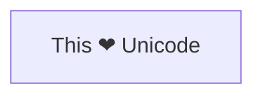

### 1.2.2 格式化文本


使用双引号和反引号`text`来括住降价文本。

- 代码

```
%%{init: {"flowchart": {"htmlLabels": false}} }%%
flowchart LR
    markdown["`This **is** _Markdown_`"]
    newLines["`Line1
    Line 2
    Line 3`"]
    markdown --> newLines
```

- 展示图

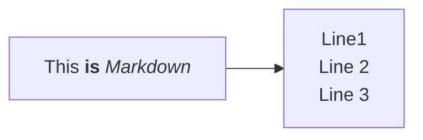

## 1.3 方向

1. 流程图是从上到下的（ `TD` 或 `TB` ）。

- 代码

```
flowchart TD
    Start --> Stop
```

- 展示图

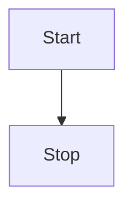

2. 流程图是从左到右（ LR ）。

- 代码

```
flowchart LR
    Start --> Stop
```

- 展示图

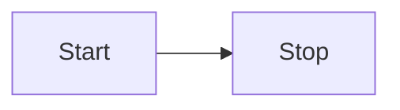

3. 流程图方向有

- TB - 从上到下
- TD - 自上而下/与自上而下相同
- BT - 从下到上
- RL - 从右到左
- LR - 从左到右


## 1.4 节点的形状

1. 圆角矩形节点

- 代码

```
flowchart LR
    id1(文本在容器中)
```

- 展示图


2. 圆边矩形节点


- 代码

```
flowchart LR
    id1([文本在容器中])
```

- 展示图


3. 子程序节点

- 代码

```
flowchart LR
    id1[[文本在容器中]]
```

- 展示图

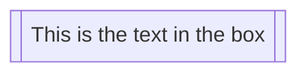


4. 圆柱形节点


- 代码

```
flowchart LR
    id1[(Database)]
```

- 展示图

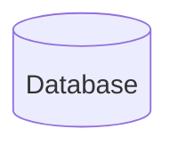

5. 圆形节点

- 代码

```
flowchart LR
    id1((文本在圆中))
```

- 展示图

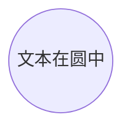

6. 剪角节点


- 代码

```
flowchart LR
    id1>文本在容器中]
```

- 展示图

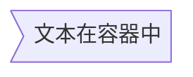

目前只有上面的形状是可能的，而不是它的镜像。

7. 菱形节点


- 代码

```
flowchart LR
    id1{文本在容器中}
```

- 展示图

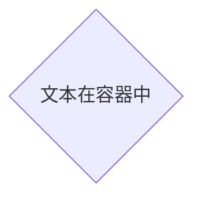

8. 六边形节点


- 代码

```
flowchart LR
    id1{{文本在容器中}}
```

- 展示图


9. 平行四边形节点


- 代码

```
flowchart LR
    id1[/文本在容器中/]
```

- 展示图

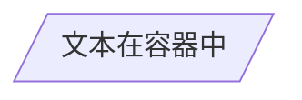


- 代码

```
flowchart LR
    id1[\文本在容器中\]
```

- 展示图

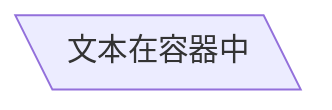

10. 梯形节点

- 代码

```
flowchart TD
    A[/梯形\]
```

- 展示图

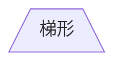


- 代码

```
flowchart TD
    A[\梯形/]
```

- 展示图

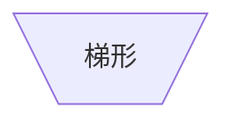

11. 双圈节点


- 代码

```
flowchart TD
    A(((文本在圆中)))
```

- 展示图

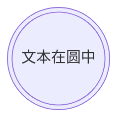

## 1.5 节点扩展形状

### 1.5.1 语法与名称列表

美人鱼引入了30个新的形状，以提高流程图创建的灵活性和精度。这些新形状提供了更多的选项来可视化地表示流程、决策、事件、数据存储和流程图中的其他元素，从而提高了清晰度和语义意义。

1. 形状定义的新语法

Mermaid现在支持定义形状类型的通用语法，以适应越来越多的形状。这种语法允许你用一种清晰灵活的格式给节点分配特定的形状：

```
A@{ shape: rect }
```

该语法将节点a创建为矩形。它以与 A["A"] 或 A 相同的方式呈现。

2. 完整的新形状列表

引入的形状及其相应的语义、短名和别名的综合列表：

| 语义的名字     | 形状的名字       | 短名称        | 描述         | 别名支持                                                     |
|-----------|-------------|------------|------------|----------------------------------------------------------|
| 卡片        | 切口矩形        | notch-rect | 代表一张牌      | card 、 notched-rectangle                                 |
| 核对        | 沙漏          | hourglass  | 表示一个排序操作   | collate 、 hourglass                                      |
| 网络链接      | 闪电          | bolt       | 通信链路       | com-link 、lightning-bolt                                 |
| 内容        | 花括号         | brace      | 添加注释       | brace-l 、 comment                                        |
| 右边评论      | 花括号         | brace-r    | 添加注释       |                                                          |
| 两边用大括号注释  | 花括号         | braces     | 添加注释       |                                                          |
| 数据输入/输出   | 右倾斜         | lean-r     | 表示输入或输出    | in-out 、 lean-right                                      |
| 数据输入/输出   | 左倾斜         | lean-l     | 表示输出或输入    | lean-left 、 out-in                                       |
| 数据库       | 圆柱          | cyl        | 数据库存储      | cylinder, database, db                                   |
| 决定/判断     | 菱形          | diam       | 决策的步骤      | decision, diamond, question                              |
| 延迟        | 半圆的矩形       | delay      | 表示延迟       | half-rounded-rectangle                                   |
| 直接存储通道    | 水平圆柱        | h-cyl      | 直接存取存储器    | das 、 horizontal-cylinder                                |
| 磁盘存储      | 线性圆柱        | lin-cyl    | 磁盘存储       | disk 、 lined-cylinder                                    |
| 显示        | 弯曲的梯形       | curv-trap  | 表示一个显示     | curved-trapezoid 、 display                               |
| 分裂过程      | 分裂矩形        | div-rect   | 分割过程形状     | div-proc, divided-process, divided-rectangle             |
| 文档        | 文档          | doc        | 表示一个文档     | doc 、 document                                           |
| 事件        | 圆角矩形        | rounded    | 表示一个事件     | event                                                    |
| 得到        | 三角形         | tri        | 得到流程       | extract 、 triangle                                       |
| Fork/Join | 填充矩形        | fork       | 在流程流中分叉或连接 | join                                                     |
| 内部存储      | Window Pane | win-pane   | 内部存储       | internal-storage 、 window-pane                           |
| 结         | 填充圆         | f-circ     | 结点         | filled-circle 、 junction                                 |
| 排列文档      | 排列文档        | lin-doc    | 排列文档       | lined-document                                           |
| 排/阴影过程    | 排矩形         | lin-rect   | 衬里工艺形状     | lin-proc, lined-process, lined-rectangle, shaded-process |
| 循环限制      | 梯形五角大楼      | notch-pent | 环限阶跃       | loop-limit 、 notched-pentagon                            |
| 手册文件      | 翻转三角        | flip-tri   | 手动文件操作     | flipped-triangle 、 manual-file                           |
| 手动输入      | 倾斜的矩形       | sl-rect    | 手动输入步骤     | manual-input 、 sloped-rectangle                          |
| 手动操作      | 梯形底座顶部      | trap-t     | 表示手动任务     | inv-trapezoid, manual, trapezoid-top                     |
| 多文档       | 堆叠文档        | docs       | 多个文档       | documents, st-doc, stacked-document                      |
| 多进程       | 堆叠的矩形       | st-rect    | 多个进程       | processes, procs, stacked-rectangle                      |
| 奇怪的       | 奇怪的         | odd        | 奇怪的形状      |                                                          |
| 纸带        | 国旗          | flag       | 纸带         | paper-tape                                               |
| 准备条件      | 六角          | hex        | 准备或条件步骤    | hexagon 、 prepare                                        |
| 优先行动      | 梯形底部        | trap-b     | 优先行动       | priority, trapezoid, trapezoid-bottom                    |
| 过程        | 矩形          | rect       | 标准工艺形状     | proc, process, rectangle                                 |
| 开始        | 圆           | circle     | 起点         | circ                                                     |
| 开始        | 小圆          | sm-circ    | 起点小        | small-circle 、 start                                     |
| 停止        | 双圈          | dbl-circ   | 表示停止点      | double-circle                                            |
| 停止        | 陷害圆         | fr-circ    | 停止点        | framed-circle 、 stop                                     |
| 存储的数据     | 长方形领结       | bow-rect   | 存储的数据      | bow-tie-rectangle 、 stored-data                          |
| 子流程       | 框架矩形        | fr-rect    | 子流程        | framed-rectangle, subproc, subprocess, subroutine        |
| 总结        | 交叉循环        | cross-circ | 总结         | crossed-circle 、 summary                                 |
| 标记的文档     | 标记的文档       | tag-doc    | 标记的文档      | tag-doc 、 tagged-document                                |
| 标记的过程     | 标记的矩形       | tag-rect   | 标记的过程      | tag-proc, tagged-process, tagged-rectangle               |
| 终点        | 体育场         | stadium    | 终点         | pill 、 terminal                                          |
| 文本块       | 文本块         | text       | 文本块        |                                                          |

3. 新形状的示例流程图

- 代码

```
flowchart RL
    A@{ shape: manual-file, label: "File Handling"}
    B@{ shape: manual-input, label: "User Input"}
    C@{ shape: docs, label: "Multiple Documents"}
    D@{ shape: procs, label: "Process Automation"}
    E@{ shape: paper-tape, label: "Paper Records"}
```

- 展示图


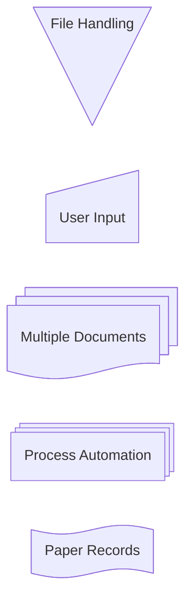


### 1.5.2 具体示例

1. 过程

- 代码

```
flowchart TD
    A@{ shape: rect, label: "This is a process" }
```

- 展示图


```mermaid
flowchart TD
    A@{ shape: rect, label: "This is a process" }
```


2. 事件

- 代码

```
flowchart TD
    A@{ shape: rounded, label: "This is an event" }
```

- 展示图


```mermaid
flowchart TD
    A@{ shape: rounded, label: "This is an event" }
```

3. 终点站（大球场）


- 代码

```
flowchart TD
    A@{ shape: stadium, label: "Terminal point" }
```

- 展示图


```mermaid
flowchart TD
    A@{ shape: stadium, label: "Terminal point" }
```

4. 数据库(圆柱体)


- 代码

```
flowchart TD
    A@{ shape: cyl, label: "Database" }
```

- 展示图


```mermaid
flowchart TD
    A@{ shape: cyl, label: "Database" }
```

5. 开始(圆)


- 代码

```
flowchart TD
    A@{ shape: circle, label: "Start" }
```

- 展示图


```mermaid
flowchart TD
    A@{ shape: circle, label: "Start" }
```

6. 奇怪形状


- 代码

```
flowchart TD
    A@{ shape: odd, label: "Odd shape" }
```

- 展示图


```mermaid
flowchart TD
    A@{ shape: odd, label: "Odd shape" }
```

7. 决定（菱形）


- 代码

```
flowchart TD
    A@{ shape: diamond, label: "Decision" }
```

- 展示图


```mermaid
flowchart TD
    A@{ shape: diamond, label: "Decision" }
```

8. 准备条件（六边形）

- 代码

```
flowchart TD
    A@{ shape: hex, label: "Prepare conditional" }
```

- 展示图


```mermaid
flowchart TD
    A@{ shape: hex, label: "Prepare conditional" }
```

9. 数据输入/输出（右倾）


- 代码

```
flowchart TD
    A@{ shape: lean-r, label: "Input/Output" }
```

- 展示图


```mermaid
flowchart TD
    A@{ shape: lean-r, label: "Input/Output" }
```

10. 数据输入/输出（左倾）


- 代码

```
flowchart TD
    A@{ shape: lean-l, label: "Output/Input" }
```

- 展示图


```mermaid
flowchart TD
    A@{ shape: lean-l, label: "Output/Input" }
```


11. 优先动作（上窄梯形）


- 代码

```
flowchart TD
    A@{ shape: trap-b, label: "Priority action" }
```

- 展示图

```mermaid
flowchart TD
    A@{ shape: trap-b, label: "Priority action" }
```

12. 手动操作（上宽梯形）

- 代码

```
flowchart TD
    A@{ shape: trap-t, label: "Manual operation" }
```

- 展示图

```mermaid
flowchart TD
    A@{ shape: trap-t, label: "Manual operation" }
```

13. 停止（双循环）

- 代码

```
flowchart TD
    A@{ shape: dbl-circ, label: "Stop" }
```

- 展示图

```mermaid
flowchart TD
    A@{ shape: dbl-circ, label: "Stop" }
```

14. 文本块

- 代码

```
flowchart TD
    A@{ shape: notch-rect, label: "Card" }
```

- 展示图

```mermaid
flowchart TD
    A@{ shape: notch-rect, label: "Card" }
```


15. 卡片（凹边矩形）


- 代码

```
flowchart TD
    A@{ shape: notch-rect, label: "Card" }
```

- 展示图

```mermaid
flowchart TD
    A@{ shape: notch-rect, label: "Card" }
```

16.  排/阴影过程

- 代码

```
flowchart TD
    A@{ shape: lin-rect, label: "Lined process" }
```

- 展示图

```mermaid
flowchart TD
    A@{ shape: lin-rect, label: "Lined process" }
```


17. 开始（小圈子）

- 代码

```
flowchart TD
    A@{ shape: sm-circ, label: "Small start" }
```

- 展示图

```mermaid
flowchart TD
    A@{ shape: sm-circ, label: "Small start" }
```

18. 停止（框架圈）

- 代码

```
flowchart TD
    A@{ shape: framed-circle, label: "Stop" }
```

- 展示图

```mermaid
flowchart TD
    A@{ shape: framed-circle, label: "Stop" }
```

19. 叉/连接（长矩形）

- 代码

```
flowchart TD
    A@{ shape: fork, label: "Fork or Join" }
```

- 展示图

```mermaid
flowchart TD
    A@{ shape: fork, label: "Fork or Join" }
```

20. 整理(沙漏)

- 代码

```
flowchart TD
    A@{ shape: hourglass, label: "Collate" }
```

- 展示图

```mermaid
flowchart TD
    A@{ shape: hourglass, label: "Collate" }
```

21. 注释（大括号）

- 代码

```
flowchart TD
    A@{ shape: comment, label: "Comment" }
```

- 展示图

```mermaid
flowchart TD
    A@{ shape: comment, label: "Comment" }
```


22. 右注释（右大括号）

- 代码

```
flowchart TD
    A@{ shape: brace-r, label: "Comment" }
```

- 展示图

```mermaid
flowchart TD
    A@{ shape: brace-r, label: "Comment" }
```

23. 两边用大括号注释

- 代码

```
flowchart TD
    A@{ shape: braces, label: "Comment" }
```

- 展示图

```mermaid
flowchart TD
    A@{ shape: braces, label: "Comment" }
```


24. Com连接（闪电）

- 代码

```
flowchart TD
    A@{ shape: bolt, label: "Communication link" }
```

- 展示图

```mermaid
flowchart TD
    A@{ shape: bolt, label: "Communication link" }
```

25. 文档

- 代码

```
flowchart TD
    A@{ shape: doc, label: "Document" }
```

- 展示图

```mermaid
flowchart TD
    A@{ shape: doc, label: "Document" }
```

Document

26. 延时（半圆矩形）

- 代码

```
flowchart TD
    A@{ shape: delay, label: "Delay" }
```

- 展示图

```mermaid
flowchart TD
    A@{ shape: delay, label: "Delay" }
```


27. 直接存取存储器（卧式圆柱体）

- 代码

```
flowchart TD
    A@{ shape: das, label: "Direct access storage" }
```

- 展示图

```mermaid
flowchart TD
    A@{ shape: das, label: "Direct access storage" }
```

Direct access storage

28. 磁盘存储（内衬圆柱体）

- 代码

```
flowchart TD
    A@{ shape: lin-cyl, label: "Disk storage" }
```

- 展示图

```mermaid
flowchart TD
    A@{ shape: lin-cyl, label: "Disk storage" }
```

Disk storage

29. 显示（曲面梯形）

- 代码

```
flowchart TD
    A@{ shape: curv-trap, label: "Display" }
```

- 展示图

```mermaid
flowchart TD
    A@{ shape: curv-trap, label: "Display" }
```

30. 分割过程（分割矩形）

- 代码

```
flowchart TD
    A@{ shape: div-rect, label: "Divided process" }
```

- 展示图

```mermaid
flowchart TD
    A@{ shape: div-rect, label: "Divided process" }
```

31. 摘录（小三角）

- 代码

```
flowchart TD
    A@{ shape: tri, label: "Extract" }
```

- 展示图

```mermaid
flowchart TD
    A@{ shape: tri, label: "Extract" }
```


32. 内部存储（窗口窗格）

- 代码

```
flowchart TD
    A@{ shape: win-pane, label: "Internal storage" }
```

- 展示图

```mermaid
flowchart TD
    A@{ shape: win-pane, label: "Internal storage" }
```

33. 路口（填满的圆圈）

- 代码

```
flowchart TD
    A@{ shape: f-circ, label: "Junction" }
```

- 展示图

```mermaid
flowchart TD
    A@{ shape: f-circ, label: "Junction" }
```

34. 排列文档

- 代码

```
flowchart TD
    A@{ shape: lin-doc, label: "Lined document" }
```

- 展示图

```mermaid
flowchart TD
    A@{ shape: lin-doc, label: "Lined document" }
```

Lined document

35. 环路限制（缺口五边形）

- 代码

```
flowchart TD
    A@{ shape: notch-pent, label: "Loop limit" }
```

- 展示图

```mermaid
flowchart TD
    A@{ shape: notch-pent, label: "Loop limit" }
```


37. 手动文件（翻转三角形）

- 代码

```
flowchart TD
    A@{ shape: flip-tri, label: "Manual file" }
```

- 展示图

```mermaid
flowchart TD
    A@{ shape: flip-tri, label: "Manual file" }
```


38. 手动输入（倾斜矩形）

- 代码

```
flowchart TD
    A@{ shape: sl-rect, label: "Manual input" }
```

- 展示图

```mermaid
flowchart TD
    A@{ shape: sl-rect, label: "Manual input" }
```


39. 多文档（堆叠文档）

- 代码

```
flowchart TD
    A@{ shape: docs, label: "Multiple documents" }
```

- 展示图

```mermaid
flowchart TD
    A@{ shape: docs, label: "Multiple documents" }
```


40. 多工序（堆叠矩形）

- 代码

```
flowchart TD
    A@{ shape: processes, label: "Multiple processes" }
```

- 展示图

```mermaid
flowchart TD
    A@{ shape: processes, label: "Multiple processes" }
```


41. 纸带（旗帜）

- 代码

```
flowchart TD
    A@{ shape: flag, label: "Paper tape" }
```

- 展示图

```mermaid
flowchart TD
    A@{ shape: flag, label: "Paper tape" }
```


42. 存储数据（领结矩形）

- 代码

```
flowchart TD
    A@{ shape: bow-rect, label: "Stored data" }
```

- 展示图

```mermaid
flowchart TD
    A@{ shape: bow-rect, label: "Stored data" }
```


43. 摘要（交叉圈）

- 代码

```
flowchart TD
    A@{ shape: cross-circ, label: "Summary" }
```

- 展示图

```mermaid
flowchart TD
    A@{ shape: cross-circ, label: "Summary" }
```

43. 标记的文档

- 代码

```
flowchart TD
    A@{ shape: tag-doc, label: "Tagged document" }
```

- 展示图

```mermaid
flowchart TD
    A@{ shape: tag-doc, label: "Tagged document" }
```

44. 带标签的进程（带标签的矩形）

- 代码

```
flowchart TD
    A@{ shape: tag-rect, label: "Tagged process" }
```

- 展示图

```mermaid
flowchart TD
    A@{ shape: tag-rect, label: "Tagged process" }
```


## 1.6 节点特殊形状


美人鱼还引入了2种特殊的形状来增强您的流程图：图标和图像。这些形状允许您直接在流程图中包含图标和图像，提供更多的视觉背景和清晰度。

### 1.6.1 图标的形状

可以使用 `icon` 形状在流程图中包含图标。要使用图标，您需要先注册图标包。按照这里提供的说明操作。定义图标形状的语法如下：

1. 代码

```
flowchart TD
    A@{ icon: "fa:user", form: "square", label: "User Icon", pos: "t", h: 60 }
```

2. 展示图

```mermaid
flowchart TD
    A@{ icon: "fa:user", form: "square", label: "User Icon", pos: "t", h: 60 }
```

3. 参数

*   icon：已注册图标包中的图标名称。
*   窗体：指定图标的背景形状。如果没有定义，将没有背景图标。选项包括:
*   label：与图标相关联的文本标签。这可以是任何字符串。如果没有定义，则不显示任何标签。
*   pos：标签的位置。如果没有定义，标签将默认位于图标的底部。可能的值有：
*   h：图标的高度。如果没有定义，则默认为48，这是最小值。

### 1.6.2 图像的形状

可以使用 `image` 形状在流程图中包含图像。定义图像形状的语法如下：

1. 代码

```
flowchart TD
    A@{ img: "https://example.com/image.png", label: "Image Label", pos: "t", w: 60, h: 60, constraint: "off" }
```

2. 展示图

```mermaid
flowchart TD
    A@{ img: "", label: "Image Label", pos: "t", w: 60, h: 60, constraint: "off" }
```


3. 参数

*   img：要显示的图片的URL。
*   label：与图像相关联的文本标签。这可以是任何字符串。如果没有定义，则不显示任何标签。
*   pos：标签的位置。如果未定义，则标签默认位于图像的底部。可能的值有：
*   w：图像的宽度。如果没有定义，这将默认为图像的自然宽度。
*   h：图像的高度。如果没有定义，这将默认为图像的自然高度。
*   constraint：确定图像是否应该约束节点大小。此设置还确保图像保持其原始长宽比，根据宽度（ `w` ）相应地调整高度（ `h` ）。如果没有定义，默认值为 `off` 

这些新形状为流程图提供了额外的灵活性和视觉吸引力，使它们更具信息性和吸引力。

## 1.7 节点间链路

节点可以通过链路/边连接。可以有不同类型的链接或将文本字符串附加到链接上。

对于点链接或粗链接，需要添加的字符为等号或点，汇总如下表：

| 长度    | 1    | 2     | 3      |
|-------|------|-------|--------|
| 正常的   | `---`  | `----`  | `-----`  |
| 正常带箭头 | `-->`  | `--->`  | `---->`  |
| 厚     | `===`  | `====`  | `=====`  |
| 厚厚的箭  | `==>`  | `===>`  | `====>`  |
| 有点的   | `-.-`  | `-..-`  | `-...-`  |
| 带箭头点  | `-.->` | `-..->` | `-...->` |


### 1.7.1 基础链接


1. 带箭头的连杆

- 代码

```
flowchart LR
    A-->B
```

- 展示图

```mermaid
flowchart LR
    A-->B
```


2. 开放链接

- 代码

```
flowchart LR
    A --- B
```

- 展示图

```mermaid
flowchart LR
    A --- B
```


3. 链接的文字

- 代码

```
flowchart LR
    A-- This is the text! ---B
```

- 展示图

```mermaid
flowchart LR
    A-- This is the text! ---B
```

---

- 代码

```
flowchart LR
    A---|This is the text|B
```

- 展示图

```mermaid
flowchart LR
    A---|This is the text|B
```


4. 带有箭头和文字的链接

- 代码

```
flowchart LR
    A-->|text|B
```

- 展示图

```mermaid
flowchart LR
    A-->|text|B
```

---

- 代码

```
flowchart LR
    A-- text -->B
```

- 展示图

```mermaid
flowchart LR
    A-- text -->B
```


### 1.7.2 基础链接扩展


1. 点链接

- 代码

```
flowchart LR
   A-.->B;
```

- 展示图

```mermaid
flowchart LR
   A-.->B;
```


2. 带文本的点链接

- 代码

```
flowchart LR
   A-. text .-> B
```

- 展示图

```mermaid
flowchart LR
   A-. text .-> B
```


3. 粗链接

- 代码

```
flowchart LR
   A ==> B
```

- 展示图

```mermaid
flowchart LR
   A ==> B
```


4. 带文本的粗链接

- 代码

```
flowchart LR
   A == text ==> B
```

- 展示图

```mermaid
flowchart LR
   A == text ==> B
```


5. 无形链接

在某些情况下，当您希望更改节点的默认位置时，这可能是一个有用的工具。

- 代码

```
flowchart LR
    A ~~~ B
```

- 展示图

```mermaid
flowchart LR
    A ~~~ B
```


### 1.7.3  链式链接

可以在同一行声明多个链接，如下所示：

- 代码

```
flowchart LR
   A -- text --> B -- text2 --> C
```

- 展示图

```mermaid
flowchart LR
   A -- text --> B -- text2 --> C
```


也可以在同一行声明多个节点链接，如下所示：

- 代码

```
flowchart LR
   a --> b & c--> d
```

- 展示图

```mermaid
flowchart LR
   a --> b & c--> d
```


然后，您可以以一种非常富有表现力的方式描述依赖关系。就像下面的一行：

- 代码

```
flowchart TB
    A & B--> C & D
```

- 展示图

```mermaid
flowchart TB
    A & B--> C & D
```


如果使用基本语法描述相同的图，则需要四行。需要提醒的是，这样做可能会让流程图更难以阅读。我想到了瑞典语 `lagom` 。意思是，不要太多也不要太少。这也适用于表达语法。

- 代码

```
flowchart TB
    A --> C
    A --> D
    B --> C
    B --> D
```

- 展示图

```mermaid
flowchart TB
    A --> C
    A --> D
    B --> C
    B --> D
```


### 1.7.4 动画链接

1. 将ID附加到Edges

Mermaid现在支持为边缘分配id，类似于将id和元数据附加到节点的方式。这个特性为边缘上更高级的样式、类和动画功能奠定了基础。

**语法:**

要给边一个ID，在边语法前加上ID，后面跟着 `@` 字符。例如:

- 代码

```
flowchart LR
  A e1@–> B
```


在此例中， `e1` 是连接 `A` 到 `B` 的边的ID。然后，您可以在以后的定义或样式语句中使用这个ID，就像节点一样。


2. 打开动画

一旦你给边缘分配了ID，你就可以通过定义边缘的属性来打开该边缘的动画：

- 代码

```
flowchart LR
  A e1@==> B
  e1@{ animate: true }
```

- 展示图

```mermaid
flowchart LR
  A e1@==> B
  e1@{ animate: true }
```


这告诉Mermaid边缘 `e1` 应该动画化。


3. 选择动画类型

初始版本支持 `fast` 和 `slow` 两种动画速度。选择特定的动画类型是启用动画和一次设置动画速度的简写。

**例子:**

- 代码

```
flowchart LR
  A e1@==> B
  e1@{ animation: fast }
```

- 展示图

```mermaid
flowchart LR
  A e1@==> B
  e1@{ animation: fast }
```

这相当于 `{ animate: true, animation: fast }` 。


4. 为动画使用classDef语句

你也可以给边缘赋一个类，然后在 `classDef` 语句中定义动画属性。例如:

- 代码

```
flowchart LR
  A e1@--> B
  classDef animate stroke-dasharray: 9,5,stroke-dashoffset: 900,animation: dash 25s linear infinite;
  class e1 animate
```

- 展示图

```mermaid
flowchart LR
  A e1@--> B
  classDef animate stroke-dasharray: 9,5,stroke-dashoffset: 900,animation: dash 25s linear infinite;
  class e1 animate
```

在这个片段中：

*   `e1@-->` 创建ID  `e1` 的边。
*   `classDef animate` 定义了一个名为 `animate` 的类，具有样式和动画属性。
*   `class e1 animate` 将 `animate` 类应用于边缘 `e1` 。

注意转义逗号：当设置 `stroke-dasharray` 属性时，记住转义逗号为 `\,` ，因为逗号在Mermaid的样式定义中用作分隔符。


### 1.7.5 其他箭头

1. 箭头-圆边

- 代码

```
flowchart LR
    A --o B
```

- 展示图

```mermaid
flowchart LR
    A --o B
```


2. 箭头-交叉

- 代码

```
flowchart LR
    A --x B
```

- 展示图

```mermaid
flowchart LR
    A --x B
```

3. 多向箭头

有可能使用多向箭头。

- 代码

```
flowchart LR
    A o--o B
    B <--> C
    C x--x D
```

- 展示图

```mermaid
flowchart LR
    A o--o B
    B <--> C
    C x--x D
```


### 1.7.6 链路的最小长度

流程图中的每个节点最终被分配到渲染图中的一个等级，即垂直或水平水平（取决于流程图的方向），基于它链接到的节点。默认情况下，链接可以跨越任意数量的等级，但您可以通过在链接定义中添加额外的破折号来要求任何链接比其他链接长。

在下面的例子中，在从节点B到节点E的链接中添加了两个额外的破折号，因此它比常规链接跨越了两个等级：

- 代码

```
flowchart TD
    A[Start] --> B{Is it?}
    B -->|Yes| C[OK]
    C --> D[Rethink]
    D --> B
    B ---->|No| E[End]
```

- 展示图

```mermaid
flowchart TD
    A[Start] --> B{Is it?}
    B -->|Yes| C[OK]
    C --> D[Rethink]
    D --> B
    B ---->|No| E[End]
```


> 注意：为了适应其他请求，渲染引擎仍然可能使链接比请求的排名长。

当链接标签写在链接中间时，必须在链接的右侧添加额外的破折号。下面的示例与前面的示例等效：

- 代码

```
flowchart TD
    A[Start] --> B{Is it?}
    B -- Yes --> C[OK]
    C --> D[Rethink]
    D --> B
    B -- No ----> E[End]
```

- 展示图

```mermaid
flowchart TD
    A[Start] --> B{Is it?}
    B -- Yes --> C[OK]
    C --> D[Rethink]
    D --> B
    B -- No ----> E[End]
```

## 1.8  字符相关

### 1.8.1 破坏语法的特殊字符

为了呈现更多麻烦的字符，可以将文本放在引号内。如下例所示：

- 代码

```
flowchart LR
    id1["This is the (text) in the box"]
```

- 展示图

```mermaid
flowchart LR
    id1["This is the (text) in the box"]
```

This is the (text) in the box

### 1.8.2 转义字符的实体代码

可以使用这里示例的语法转义字符。

- 代码

```
flowchart LR
    A["A double quote:#quot;"] --> B["A dec char:#9829;"]
```

- 展示图

```mermaid
flowchart LR
    A["A double quote:#quot;"] --> B["A dec char:#9829;"]
```


给定的数字以10为基数，因此 `#` 可以编码为 `#35;` 。还支持使用HTML字符名。

## 1.9 子图


### 1.9.1 基础使用

1. 语法

```
subgraph title
    graph definition
end
```

2. 下面是一个例子：

- 代码

```
flowchart TB
    c1-->a2
    subgraph one
    a1-->a2
    end
    subgraph two
    b1-->b2
    end
    subgraph three
    c1-->c2
    end
```

- 展示图

```mermaid
flowchart TB
    c1-->a2
    subgraph one
    a1-->a2
    end
    subgraph two
    b1-->b2
    end
    subgraph three
    c1-->c2
    end
```

3. 为子图设置显式id。

- 代码

```
flowchart TB
    c1-->a2
    subgraph ide1 [one]
    a1-->a2
    end
```

- 展示图

```mermaid
flowchart TB
    c1-->a2
    subgraph ide1 [one]
    a1-->a2
    end
```


### 1.9.2 子图作为流程图

使用图形类型流程图，也可以像下面的流程图一样设置子图之间的边。

- 代码

```
flowchart TB
    c1-->a2
    subgraph one
    a1-->a2
    end
    subgraph two
    b1-->b2
    end
    subgraph three
    c1-->c2
    end
    one --> two
    three --> two
    two --> c2
```

- 展示图

```mermaid
flowchart TB
    c1-->a2
    subgraph one
    a1-->a2
    end
    subgraph two
    b1-->b2
    end
    subgraph three
    c1-->c2
    end
    one --> two
    three --> two
    two --> c2
```


### 1.9.3 子图中的方向

对于graphtype流程图，您可以使用direction语句来设置子图将呈现的方向，就像这个例子一样。

- 代码

```
flowchart LR
  subgraph TOP
    direction TB
    subgraph B1
        direction RL
        i1 -->f1
    end
    subgraph B2
        direction BT
        i2 -->f2
    end
  end
  A --> TOP --> B
  B1 --> B2
```

- 展示图

```mermaid
flowchart LR
  subgraph TOP
    direction TB
    subgraph B1
        direction RL
        i1 -->f1
    end
    subgraph B2
        direction BT
        i2 -->f2
    end
  end
  A --> TOP --> B
  B1 --> B2
```


### 1.9.4 限制

如果子图的任何节点链接到外部，子图的方向将被忽略。相反，子图将继承父图的方向：

- 代码

```
flowchart LR
    subgraph subgraph1
        direction TB
        top1[top] --> bottom1[bottom]
    end
    subgraph subgraph2
        direction TB
        top2[top] --> bottom2[bottom]
    end
    %% ^ These subgraphs are identical, except for the links to them:

    %% Link *to* subgraph1: subgraph1 direction is maintained
    outside --> subgraph1
    %% Link *within* subgraph2:
    %% subgraph2 inherits the direction of the top-level graph (LR)
    outside ---> top2
```

- 展示图

```mermaid
flowchart LR
    subgraph subgraph1
        direction TB
        top1[top] --> bottom1[bottom]
    end
    subgraph subgraph2
        direction TB
        top2[top] --> bottom2[bottom]
    end
    %% ^ These subgraphs are identical, except for the links to them:

    %% Link *to* subgraph1: subgraph1 direction is maintained
    outside --> subgraph1
    %% Link *within* subgraph2:
    %% subgraph2 inherits the direction of the top-level graph (LR)
    outside ---> top2
```


## 1.10 markdown字符串

“markdown字符串”功能通过提供更通用的字符串类型来增强流程图和思维导图，它支持文本格式选项，如粗体和斜体，并在标签内自动换行文本。

- 代码

```
%%{ init: { "flowchart":  {"htmlLabels"}:false } }%%
flowchart LR
subgraph "One"
  a("`The **cat**
  in the hat`") -- "edge label" --> b{{"`The **dog** in the hog`"}}
end
subgraph "`**Two**`"
  c("`The **cat**
  in the hat`") -- "`Bold **edge label**`" --> d("The dog in the hog")
end
```

- 展示图


格式:

*   对于粗体文本，在文本前后使用双星号（ `**` ）。
*   对于斜体，在文本前后使用单个星号（ `*` ）。
*   对于传统字符串，您需要添加 `<br>` 标记，以便文本在节点中包装。但是，当文本变得太长时，标记字符串会自动换行，并允许您通过简单地使用换行符而不是 `<br>` 标记来开始新行。

该特性适用于节点标签、边标签和子图标签。

可以使用命令禁用自动包装

```
---
config:
  markdownAutoWrap: false
---
graph LR
```

## 1.11 交互

可以将单击事件绑定到节点，单击可以导致javascript回调或链接，该链接将在新的浏览器选项卡中打开。

>当使用 `securityLevel='strict'` 时禁用此功能，当使用 `securityLevel='loose'` 时启用此功能。

```
click nodeId callback
click nodeId call callback()
```

*   nodeId为节点id
*   callback是在显示图形的页面上定义的javascript函数的名称，该函数将以nodeId作为参数调用。

工具提示用法示例如下：

```html
<script>
  window.callback = function () {
    alert('A callback was triggered');
  };
</script>
```

工具提示文本用双引号括起来。工具提示的样式由类 `.mermaidTooltip` 设置。

- 代码

```
flowchart LR
    A-->B
    B-->C
    C-->D
    click A callback "Tooltip for a callback"
    click B "https://www.github.com" "This is a tooltip for a link"
    click C call callback() "Tooltip for a callback"
    click D href "https://www.github.com" "This is a tooltip for a link"
```

- 展示图

```mermaid
flowchart LR
    A-->B
    B-->C
    C-->D
    click A callback "Tooltip for a callback"
    click B "https://www.github.com" "This is a tooltip for a link"
    click C call callback() "Tooltip for a callback"
    click D href "https://www.github.com" "This is a tooltip for a link"
```


> 工具提示功能和链接到url的能力从0.5.2版本开始可用。

由于Docsify处理JavaScript回调函数的方式存在限制，可以在本文中查看上述代码的另一个工作演示。

默认情况下，链接在相同的浏览器选项卡/窗口中打开。可以通过在click定义中添加链接目标来改变这一点（支持 `_self` ,  `_blank` ,  `_parent` 和 `_top` ）：

- 代码

```
flowchart LR
    A-->B
    B-->C
    C-->D
    D-->E
    click A "https://www.github.com" _blank
    click B "https://www.github.com" "Open this in a new tab" _blank
    click C href "https://www.github.com" _blank
    click D href "https://www.github.com" "Open this in a new tab" _blank
```

- 展示图

```mermaid
flowchart LR
    A-->B
    B-->C
    C-->D
    D-->E
    click A "https://www.github.com" _blank
    click B "https://www.github.com" "Open this in a new tab" _blank
    click C href "https://www.github.com" _blank
    click D href "https://www.github.com" "Open this in a new tab" _blank
```


初学者提示——在html上下文中使用交互式链接的完整示例：


```html
<body>
  <pre class="mermaid">
    flowchart LR
        A-->B
        B-->C
        C-->D
        click A callback "Tooltip"
        click B "https://www.github.com" "This is a link"
        click C call callback() "Tooltip"
        click D href "https://www.github.com" "This is a link"
  </pre>

  <script>
    window.callback = function () {
      alert('A callback was triggered');
    };
    const config = {
      startOnLoad: true,
      flowchart: { useMaxWidth: true, htmlLabels: true, curve: 'cardinal' },
      securityLevel: 'loose',
    };
    mermaid.initialize(config);
  </script>
</body>
```

## 1.12 注释

可以在流程图中输入注释，解析器将忽略这些注释。注释需要在单独的行上，并且必须以 `%%` （双百分号）作为前缀。在注释开始到下一个换行符之后的任何文本都将被视为注释，包括任何流语法

- 代码

```
flowchart LR
%% this is a comment A -- text --> B{node}
   A -- text --> B -- text2 --> C
```

- 展示图

```mermaid
flowchart LR
%% this is a comment A -- text --> B{node}
   A -- text --> B -- text2 --> C
```


## 1.13 样式

### 1.13.1 样式的链接

可以为链接设置样式。例如，您可能希望样式化流中向后移动的链接。由于链接与节点一样没有id，因此需要采用其他方式来决定链接应该附加到什么样式。使用在图中定义链接时的顺序号而不是id，或者使用default应用于所有链接。在下面的例子中，在linkStyle语句中定义的样式将属于图中的第四个链接：

```
linkStyle 3 stroke:#ff3,stroke-width:4px,color:red;
```

通过用逗号分隔链接号，也可以在单个语句中为多个链接添加样式：

```
linkStyle 1,2,7 color:blue;
```

### 1.13.2 造型线曲线

如果默认方法不能满足您的需要，则可以对项目之间的线条使用的曲线类型进行样式设置。可用曲线风格包括 `basis` ,  `bumpX` ,  `bumpY` ,  `cardinal` ,  `catmullRom` ,  `linear` ,  `monotoneX` ,  `monotoneY` ,  `natural` ,  `step` ,  `stepAfter` ,和 `stepBefore` 。

在这个例子中，从左到右的图形使用 `stepBefore` 曲线样式：

```
%%{ init: { 'flowchart': { 'curve': 'stepBefore' } } }%%
graph LR
```

有关可用曲线的完整列表（包括自定义曲线的说明），请参阅3d -shape项目中的Shapes文档。

### 1.13.3 样式化节点

可以对节点应用特定的样式，例如更厚的边框或不同的背景颜色。

-  代码

```
flowchart LR
    id1(Start)-->id2(Stop)
    style id1 fill:#f9f,stroke:#333,stroke-width:4px
    style id2 fill:#bbf,stroke:#f66,stroke-width:2px,color:#fff,stroke-dasharray: 5 5
```

- 展示图

```mermaid
flowchart LR
    id1(Start)-->id2(Stop)
    style id1 fill:#f9f,stroke:#333,stroke-width:4px
    style id2 fill:#bbf,stroke:#f66,stroke-width:2px,color:#fff,stroke-dasharray: 5 5
```


## 1.14 类


### 1.14.1 基础定义并使用

比每次定义样式更方便的方法是定义一个样式类，并将该类附加到应该具有不同外观的节点上。

类定义看起来像下面的例子：

```
    classDef className fill:#f9f,stroke:#333,stroke-width:4px;
```

此外，可以在一个语句中定义多个类的样式：

```
    classDef firstClassName,secondClassName font-size:12pt;
```

将类附加到节点的操作如下：

```
    class nodeId1 className;
```

也可以在一条语句中将一个类附加到节点列表：

```
    class nodeId1,nodeId2 className;
```

添加类的较短形式是使用 `:::` 操作符将类名附加到节点上，如下所示：

- 代码

```
flowchart LR
    A:::someclass --> B
    classDef someclass fill:#f96
```

- 展示图

```mermaid
flowchart LR
    A:::someclass --> B
    classDef someclass fill:#f96
```


当声明节点间的多个链接时，可以使用这种形式：

- 代码

```
flowchart LR
    A:::foo & B:::bar --> C:::foobar
    classDef foo stroke:#f00
    classDef bar stroke:#0f0
    classDef foobar stroke:#00f
```

- 展示图

```mermaid
flowchart LR
    A:::foo & B:::bar --> C:::foobar
    classDef foo stroke:#f00
    classDef bar stroke:#0f0
    classDef foobar stroke:#00f
```


### 1.14.2 使用CSS类

也可以在CSS样式中预定义类，这些类可以从图形定义中应用，如下例所示：

**例子的风格**

```html
<style>
  .cssClass > rect {
    fill: #ff0000;
    stroke: #ffff00;
    stroke-width: 4px;
  }
</style>
```

**示例定义**

- 代码

```
flowchart LR
    A-->B[AAA<span>BBB</span>]
    B-->D
    class A cssClass
```

- 展示图

<style scoped>
  .cssClass > rect {
    fill: #ff0000;
    stroke: #ffff00;
    stroke-width: 4px;
  }
</style>

```mermaid
flowchart LR
    A-->B[AAA<span>BBB</span>]
    B-->D
    class A cssClass
```


### 1.14.3 默认的类

如果一个类被命名为default，它将被分配给所有的类，而不需要特定的类定义。

```
classDef default fill:#f9f,stroke:#333,stroke-width:4px;
```


## 1.15 图标的支持

### 1.15.1 对fontawesome的基本支持

可以从fontaawesome添加图标。

通过语法fa:#图标类名#访问图标。

- 代码

```
flowchart TD
    B["fa:fa-twitter for peace"]
    B-->C[fa:fa-ban forbidden]
    B-->D(fa:fa-spinner)
    B-->E(A fa:fa-camera-retro perhaps?)
```

- 展示图

```mermaid
flowchart TD
    B["fa:fa-twitter for peace"]
    B-->C[fa:fa-ban forbidden]
    B-->D(fa:fa-spinner)
    B-->E(A fa:fa-camera-retro perhaps?)
```


mermaid支持字体Awesome，如果CSS包含在网站上。mermaid对可以使用的字体Awesome的版本没有任何限制。

请参考官方字体Awesome文档，了解如何将其包含在您的网站中。

在 `<head>` 中添加这个代码片段将增加对Font Awesome v6.5.1的支持

```html
<link
  href="https://cdnjs.cloudflare.com/ajax/libs/font-awesome/6.5.1/css/all.min.css"
  rel="stylesheet"
/>
```

### 1.15.2 自定义图标

只要网站导入相应的工具包，就可以使用从字体Awesome服务的自定义图标。

请注意，这是目前从字体Awesome付费功能。

对于自定义图标，您需要使用 `fak` 前缀。

**例子**

```plain
flowchart TD
    B[fa:fa-twitter] %% standard icon
    B-->E(fak:fa-custom-icon-name) %% custom icon
```

并试图渲染它

- 代码

```
flowchart TD
    B["fa:fa-twitter for peace"]
    B-->C["fab:fa-truck-bold a custom icon"]
```

- 展示图

```mermaid
flowchart TD
    B["fa:fa-twitter for peace"]
    B-->C["fab:fa-truck-bold a custom icon"]
```

### 1.15.3 注意点

>图形声明在顶点和链接之间带有空格，并且没有分号

*   在图形声明中，语句现在也可以不使用分号结束。在0.2.16版本之后，以分号结束图形语句是可选的。所以下面的图声明和旧的图声明一样有效。
    
*   在顶点和链接之间只允许有一个空格。但是，顶点和它的文本之间以及链接和它的文本之间不应该有任何空格。旧的图形声明语法也可以工作，因此这个新特性是可选的，是为了提高可读性而引入的。
    

下面是新的图边声明，它与旧的图边声明一起有效。

- 代码

```
flowchart LR
    A[Hard edge] -->|Link text| B(Round edge)
    B --> C{Decision}
    C -->|One| D[Result one]
    C -->|Two| E[Result two]
```

- 展示图

```mermaid
flowchart LR
    A[Hard edge] -->|Link text| B(Round edge)
    B --> C{Decision}
    C -->|One| D[Result one]
    C -->|Two| E[Result two]
```


## 1.16 配置

### 1.16.1 渲染器

图的布局是用渲染器完成的。默认的渲染器是dagre。

从9.4版`Mermaid`开始，您可以使用名为elk的替代渲染器。elk渲染器更适合大型和/或更复杂的图表。

麋鹿渲染器是一个实验性的功能。你可以通过添加这个指令将渲染器改为elk：

```
%%{init: {"flowchart": {"defaultRenderer": "elk"}} }%%
```

>请注意，该站点需要使用`mermaid`9.4版本才能正常工作，并在延迟加载配置中启用此功能。

### 1.16.3 宽度

可以调整渲染流程图的宽度。

这是通过定义`mermaid`来实现的。`flowchartConfig`或通过CLI使用JSON文件进行配置。CLI的使用方法请参见`mermaidCLI`界面。美人鱼。`flowchartConfig`可以设置为带有配置参数的JSON字符串或相应的对象。


```javascript
mermaid.flowchartConfig = {
    width: 100%
}
```