# 二、序列图

> 序列图是一种交互图，它显示了流程如何相互操作以及以何种顺序操作。

Mermaid可以渲染序列图。

- 代码

```
sequenceDiagram
    Alice->>John: Hello John, how are you?
    John-->>Alice: Great!
    Alice-)John: See you later!
```

- 展示图

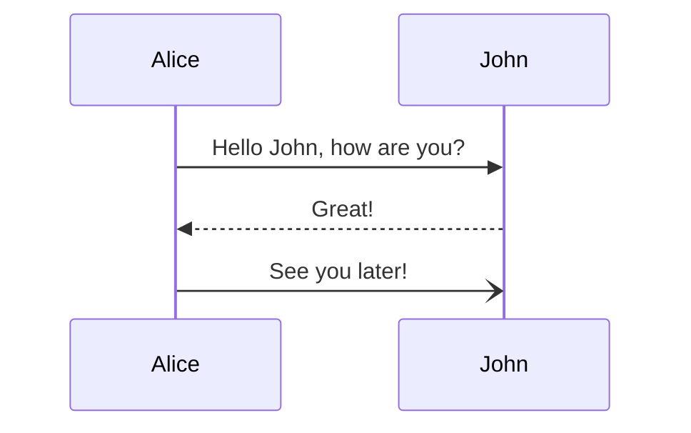
```mermaid
sequenceDiagram
    Alice->>John: Hello John, how are you?
    John-->>Alice: Great!
    Alice-)John: See you later!
```


>关于节点的注释，由于美人鱼语言的脚本方式，单词“end”可能会破坏图。
>如果不可避免，必须使用括号（），引号“”或括号{}，`\[\]`来括住单词“end”。即：（end）， `\[end\]`, `{end}`。

## 2.1 语法

### 2.1.1 participants（参与者）

`participant`可以隐式地定义，如本页第一个示例所示。参与者或参与者在图源文本中按外观顺序呈现。有时，您可能希望以不同于第一条消息中的顺序显示参与者。可以通过执行以下操作来指定演员的出场顺序：

- 代码

```
sequenceDiagram
    participant Alice 
    participant Bob   
    Bob->>Alice: Hi Alice 
    Alice->>Bob: Hi Bob   
```

- 代码解释
  - 第一行： `sequenceDiagram` 确认流程图类型
  - 第二行： `participant` 定义的参与者Alice
  - 第二行： `participant` 定义的参与者Bob
  - 第二行： `->>` Bob向Alice发送信息
  - 第二行： `->>` Alice向Bob 发送信息

- 展示图

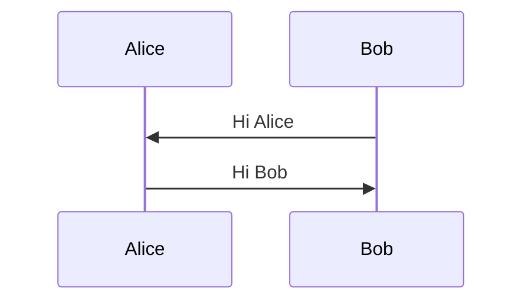
```mermaid
sequenceDiagram
    participant Alice
    participant Bob
    Bob->>Alice: Hi Alice
    Alice->>Bob: Hi Bob
```


### 2.1.2 actor （演员）

如果你特别想用actor符号代替矩形文本，你可以使用actor语句，如下所示。

- 代码

```
sequenceDiagram
    actor Alice
    actor Bob
    Alice->>Bob: Hi Bob
    Bob->>Alice: Hi Alice
```

- 代码解释
  - 第一行： `sequenceDiagram` 确认流程图类型
  - 第二行： `actor` 定义的演员Alice
  - 第二行： `actor` 定义的演员Bob
  - 第二行： `->>` Bob向Alice发送信息
  - 第二行： `->>` Alice向Bob 发送信息

- 展示图

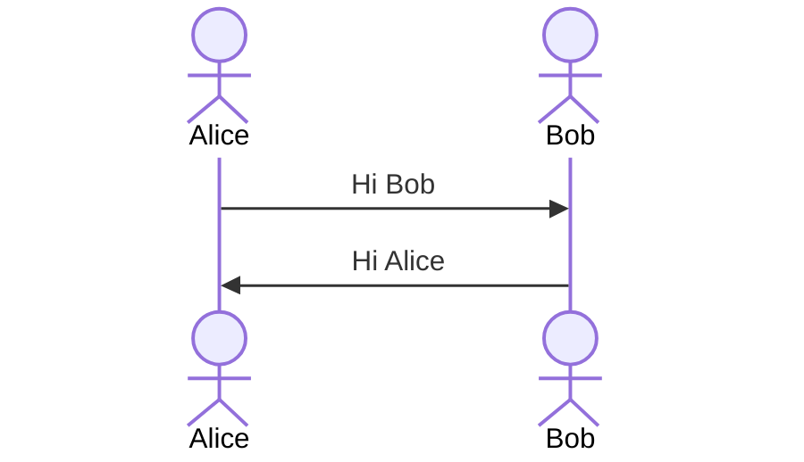
```mermaid
sequenceDiagram
    actor Alice
    actor Bob
    Alice->>Bob: Hi Bob
    Bob->>Alice: Hi Alice
```


### 2.1.3 别名

参与者可以有一个方便的标识符和一个描述性标签。

- 代码

```
sequenceDiagram
    participant A as Alice
    participant J as John
    A->>J: Hello John, how are you?
    J->>A: Great!
```

- 展示图

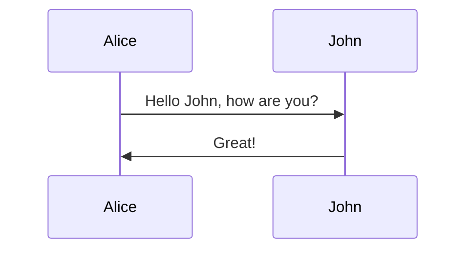
```mermaid
sequenceDiagram
    participant A as Alice
    participant J as John
    A->>J: Hello John, how are you?
    J->>A: Great!
```


### 2.1.4 创建和销毁

可以通过消息创建和销毁参与者。为此，在消息之前添加一个`create`或`destroy`指令。

```
create participant B
A --> B: Hello
```

创建支持参与者/参与者区分和别名的指令。可以销毁消息的发送方或接收方，但只能创建接收方。

- 代码

```
sequenceDiagram
    Alice->>Bob: Hello Bob, how are you ?
    Bob->>Alice: Fine, thank you. And you?
    create participant Carl
    Alice->>Carl: Hi Carl!
    create actor D as Donald
    Carl->>D: Hi!
    destroy Carl
    Alice-xCarl: We are too many
    destroy Bob
    Bob->>Alice: I agree
```

- 展示图

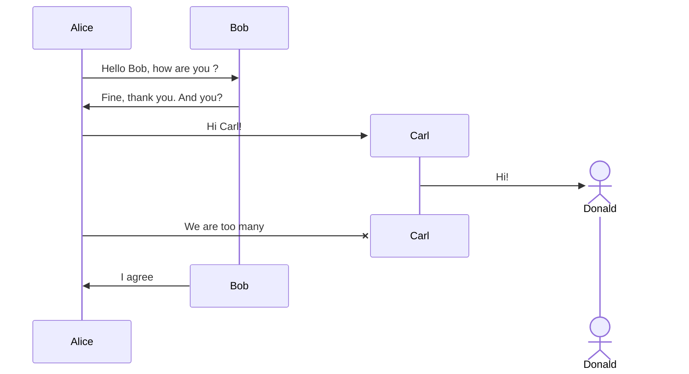
```mermaid
sequenceDiagram
    Alice->>Bob: Hello Bob, how are you ?
    Bob->>Alice: Fine, thank you. And you?
    create participant Carl
    Alice->>Carl: Hi Carl!
    create actor D as Donald
    Carl->>D: Hi!
    destroy Carl
    Alice-xCarl: We are too many
    destroy Bob
    Bob->>Alice: I agree
```

- 如果在创建或删除参与者时出现以下类型的错误：

> The destroyed participant participant-name does not have an associated destroying message after its declaration. Please check the sequence diagram.

并且固定图代码并没有摆脱这个错误，所有其他图的渲染结果在相同的错误，那么你需要更新美人鱼版本到（v10.7.0）。

### 2.1.5 分组/箱

参与者可以在垂直框中分组。你可以定义一个颜色（如果没有，它将是透明的）和/或描述性标签使用以下符号：

```
box Aqua Group Description
... actors ...
end
box Group without description
... actors ...
end
box rgb(33,66,99)
... actors ...
end
box rgba(33,66,99,0.5)
... actors ...
end
```

>如果你的组名是一种颜色，你可以强制它是透明的：

```
box transparent Aqua
... actors ...
end
```

- 代码

```
sequenceDiagram
    box Purple Alice & John
    participant A
    participant J
    end
    box Another Group
    participant B
    participant C
    end
    A->>J: Hello John, how are you?
    J->>A: Great!
    A->>B: Hello Bob, how is Charley?
    B->>C: Hello Charley, how are you?
```


- 展示图

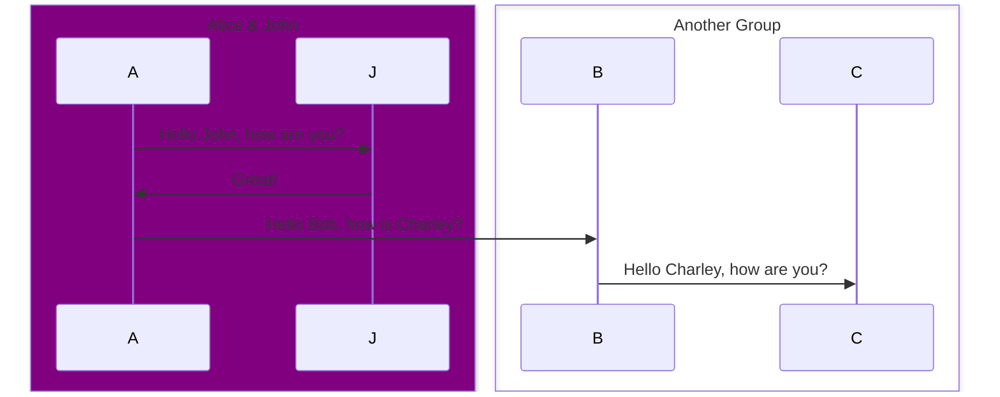
```mermaid
sequenceDiagram
    box Purple Alice & John
    participant A
    participant J
    end
    box Another Group
    participant B
    participant C
    end
    A->>J: Hello John, how are you?
    J->>A: Great!
    A->>B: Hello Bob, how is Charley?
    B->>C: Hello Charley, how are you?
```

Another GroupAlice & JohnCBJACBJAHello John, how are you?Great!Hello Bob, how is Charley?Hello Charley, how are you?

## 2.2 messages (传递信息)

消息可以显示为实线或虚线两种形式。

```
[Actor][Arrow][Actor]:Message text
```

目前支持十种类型的箭头：

| 类型  | 描述  |
| --- | --- |
| `->` | 无箭头实线 |
| `-->` | 虚线无箭头 |
| `->>` | 带箭头的实线 |
| `-->>` | 带箭头的虚线 |
| `<<->>` | 带双向箭头的实线（v11.0.0） |
| `<<-->>` | 带有双向箭头的虚线（v11.0.0） |
| `-x` | 实线，最后有一个叉 |
| `--x` | 虚线的末尾有一个叉 |
| `-)` | 实线，末尾有一个开箭头（异步） |
| `--)` | 末尾带开箭头的虚线（async） |

## 2.3 (activate) 激活

### 2.3.1 基础使用

使用 `activate ` 进行激活，使用 `deactivate` 进行停用

- 代码

```
sequenceDiagram
    Alice->>John: Hello John, how are you?
    activate John
    John-->>Alice: Great!
    deactivate John
```

- 展示图

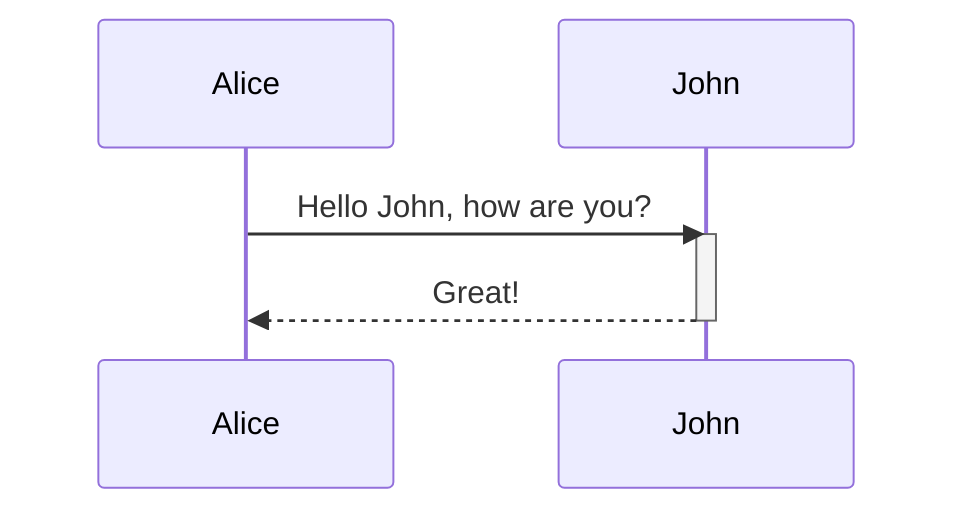
```mermaid
sequenceDiagram
    Alice->>John: Hello John, how are you?
    activate John
    John-->>Alice: Great!
    deactivate John
```

### 2.3.2 使用  `+` / `-` 代替

在消息箭头后面附加 `+` / `-` 后缀，代替 `activate ` / `deactivate`

- 代码

```
sequenceDiagram
    Alice->>+John: Hello John, how are you?
    John-->>-Alice: Great!
```

- 展示图

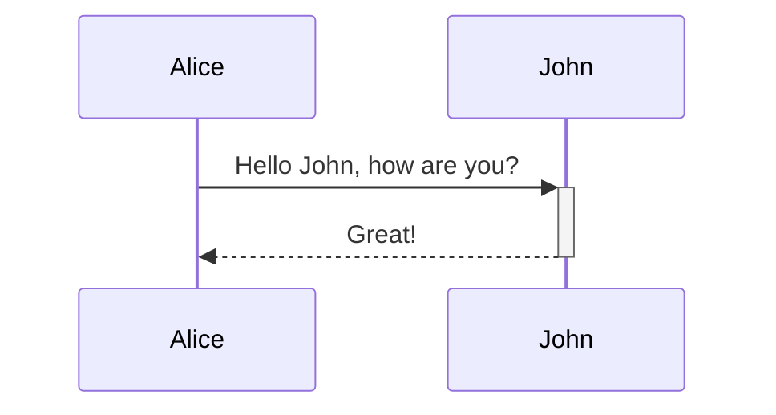
```mermaid
sequenceDiagram
    Alice->>+John: Hello John, how are you?
    John-->>-Alice: Great!
```


### 2.3.3 activated堆叠

`activate` 可以堆叠 一个 `participant` (参与者) 或 `actor`(演员)

- 代码

```
sequenceDiagram
    Alice->>+John: Hello John, how are you?
    Alice->>+John: John, can you hear me?
    John-->>-Alice: Hi Alice, I can hear you!
    John-->>-Alice: I feel great!
```

- 展示图

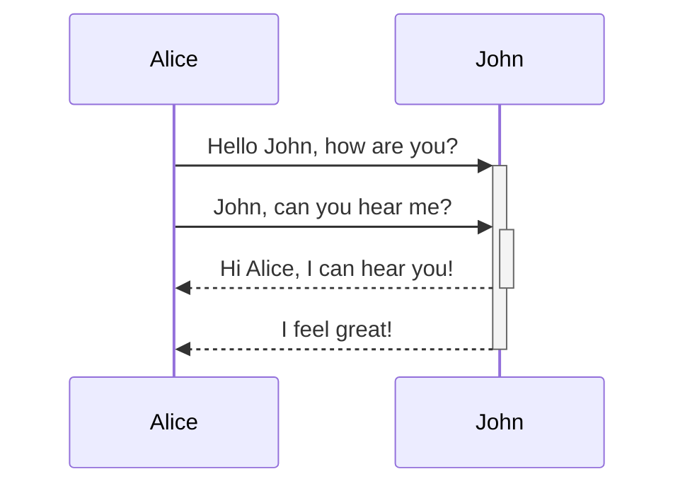
```mermaid
sequenceDiagram
    Alice->>+John: Hello John, how are you?
    Alice->>+John: John, can you hear me?
    John-->>-Alice: Hi Alice, I can hear you!
    John-->>-Alice: I feel great!
```


## 2.4 notes (笔记)

可以在序列图中添加注释。这是通过注释 `Note [ right of | left of | over ] [Actor]`: 来完成的：注释内容中的文本

请看下面的例子：

- 代码

```
sequenceDiagram
    participant John
    Note right of John: Text in note
```

- 展示图

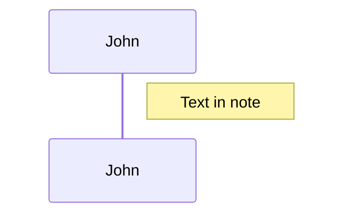
```mermaid
sequenceDiagram
    participant John
    Note right of John: Text in note
```


也可以创建跨越两个参与者的笔记：

- 代码

```
sequenceDiagram
    Alice->John: Hello John, how are you?
    Note over Alice,John: A typical interaction
```

- 展示图

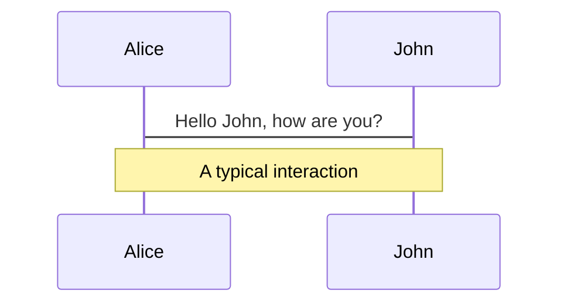
```mermaid
sequenceDiagram
    Alice->John: Hello John, how are you?
    Note over Alice,John: A typical interaction
```

## 2.5 换行符

可以在Note和Message中添加换行：

- 代码

```
sequenceDiagram
    Alice->John: Hello John,<br/>how are you?
    Note over Alice,John: A typical interaction<br/>But now in two lines
```

- 展示图

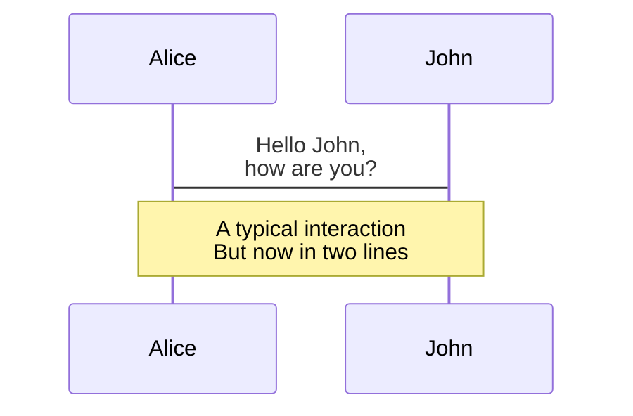
```mermaid
sequenceDiagram
    Alice->John: Hello John,<br/>how are you?
    Note over Alice,John: A typical interaction<br/>But now in two lines
```


`participant` (参与者) 或 `actor`(演员) 的 换行符别名：

- 代码

```
sequenceDiagram
    participant Alice as Alice<br/>Johnson
    Alice->John: Hello John,<br/>how are you?
    Note over Alice,John: A typical interaction<br/>But now in two lines
```

- 展示图

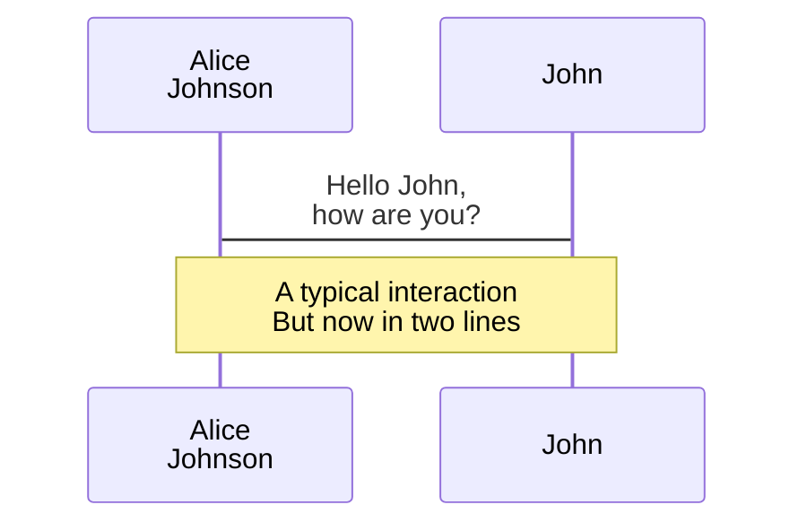
```mermaid
sequenceDiagram
    participant Alice as Alice<br/>Johnson
    Alice->John: Hello John,<br/>how are you?
    Note over Alice,John: A typical interaction<br/>But now in two lines
```


## 2.6 循环

可以在序列图中表示循环。这是用符号表示的

```
loop Loop text
... statements ...
end
```

请看下面的例子：

- 代码

```
sequenceDiagram
    Alice->John: Hello John, how are you?
    loop Every minute
        John-->Alice: Great!
    end
```

- 展示图

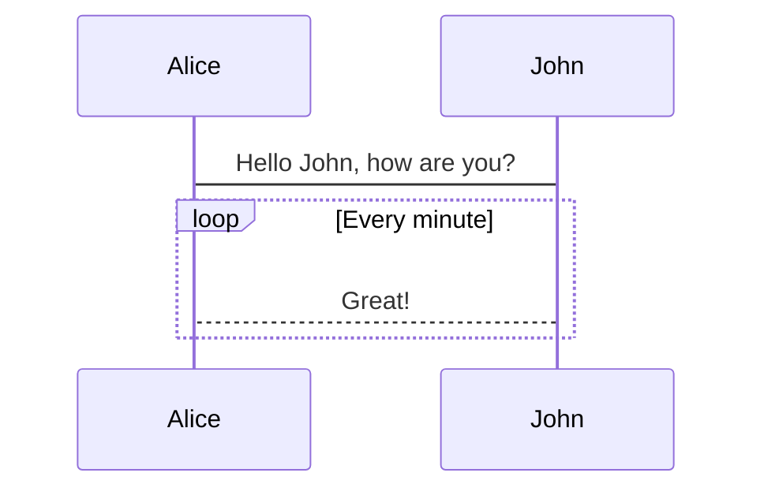
```mermaid
sequenceDiagram
    Alice->John: Hello John, how are you?
    loop Every minute
        John-->Alice: Great!
    end
```


## 2.7 可选路径


1. 使用 alt 定义可选路径 

在序列图中表达可选路径。

```
alt Describing text
... statements ...
else
... statements ...
end
```

2. 使用 opt 定义可选路径 

存在可选的序列（如果没有else）。

```
opt Describing text
... statements ...
end
```


3. 示例


- 代码

```
sequenceDiagram
    Alice->>Bob: Hello Bob, how are you?
    alt is sick
        Bob->>Alice: Not so good :(
    else is well
        Bob->>Alice: Feeling fresh like a daisy
    end
    opt Extra response
        Bob->>Alice: Thanks for asking
    end
```

- 展示图

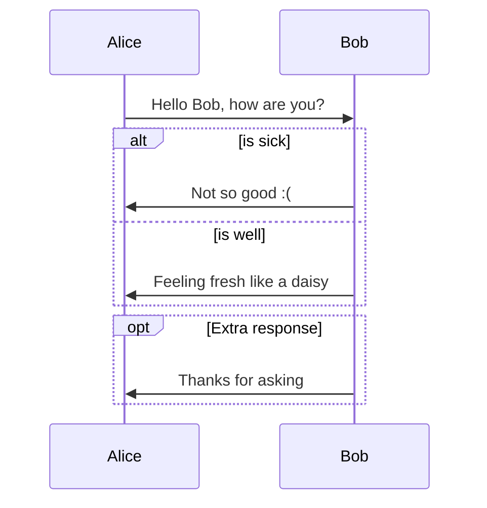
```mermaid
sequenceDiagram
    Alice->>Bob: Hello Bob, how are you?
    alt is sick
        Bob->>Alice: Not so good :(
    else is well
        Bob->>Alice: Feeling fresh like a daisy
    end
    opt Extra response
        Bob->>Alice: Thanks for asking
    end
```


## 2.8 Parallel（平行）

可以显示并行发生的操作。

1. 语法

```
par [Action 1]
... statements ...
and [Action 2]
... statements ...
and [Action N]
... statements ...
end
```

2. 示例1

- 代码

```
sequenceDiagram
    par Alice to Bob
        Alice->>Bob: Hello guys!
    and Alice to John
        Alice->>John: Hello guys!
    end
    Bob-->>Alice: Hi Alice!
    John-->>Alice: Hi Alice!
```

- 展示图

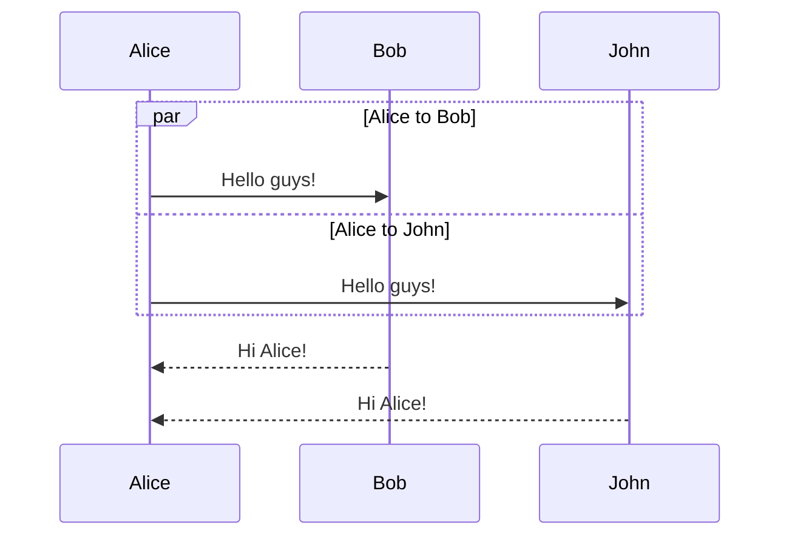
```mermaid
sequenceDiagram
    par Alice to Bob
        Alice->>Bob: Hello guys!
    and Alice to John
        Alice->>John: Hello guys!
    end
    Bob-->>Alice: Hi Alice!
    John-->>Alice: Hi Alice!
```


3. 示例2-嵌套并行块

- 代码

```
sequenceDiagram
    par Alice to Bob
        Alice->>Bob: Go help John
    and Alice to John
        Alice->>John: I want this done today
        par John to Charlie
            John->>Charlie: Can we do this today?
        and John to Diana
            John->>Diana: Can you help us today?
        end
    end
```

- 展示图

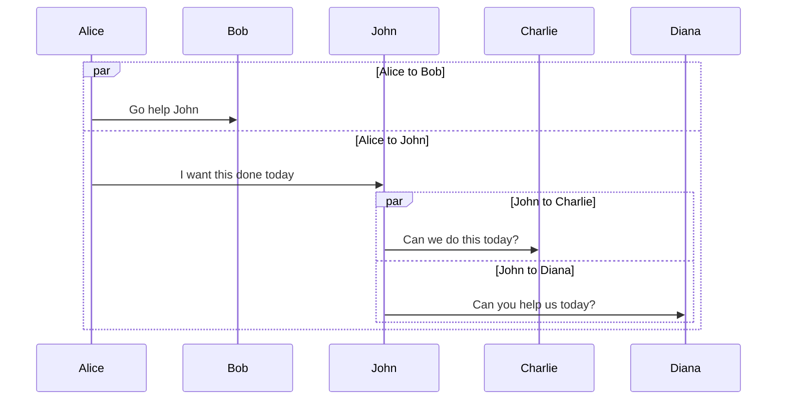
```mermaid
sequenceDiagram
    par Alice to Bob
        Alice->>Bob: Go help John
    and Alice to John
        Alice->>John: I want this done today
        par John to Charlie
            John->>Charlie: Can we do this today?
        and John to Diana
            John->>Diana: Can you help us today?
        end
    end
```


## 2.9 Critical Region（临界区）

可以通过条件处理显示必须自动发生的操作。

1. 语法

```
critical [Action that must be performed]
... statements ...
option [Circumstance A]
... statements ...
option [Circumstance B]
... statements ...
end
```

2. 示例1

- 代码

```
sequenceDiagram
    critical Establish a connection to the DB
        Service-->DB: connect
    option Network timeout
        Service-->Service: Log error
    option Credentials rejected
        Service-->Service: Log different error
    end
```

- 展示图

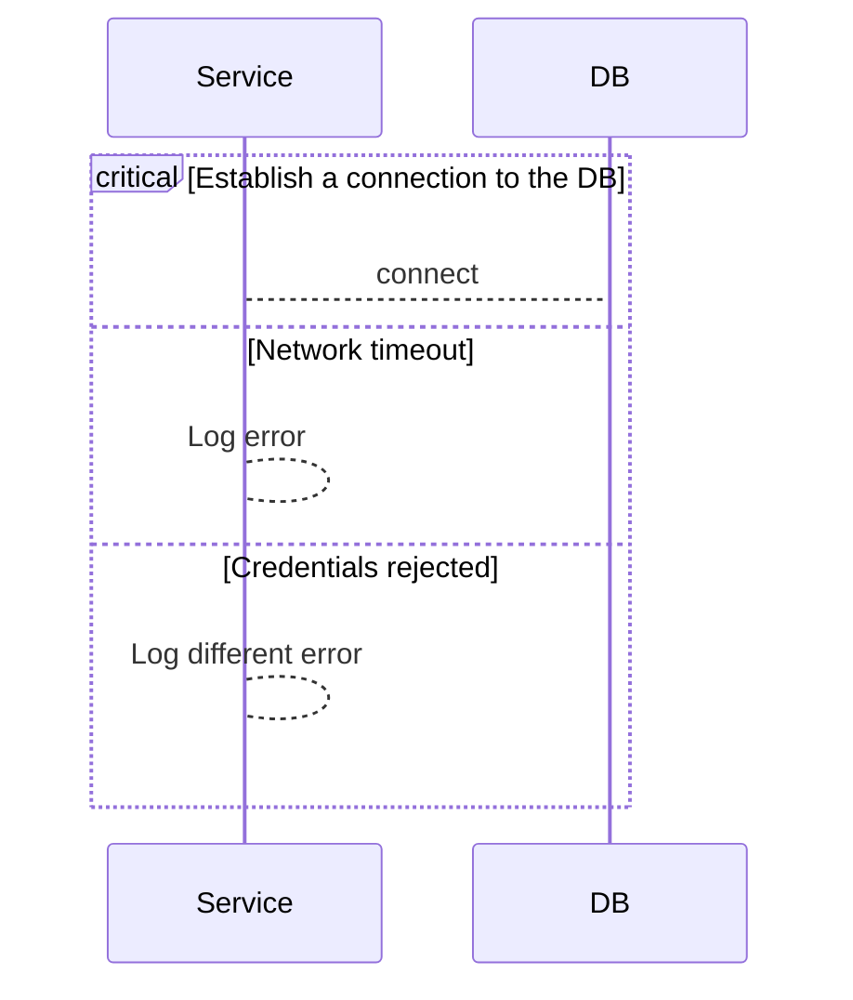
```mermaid
sequenceDiagram
    critical Establish a connection to the DB
        Service-->DB: connect
    option Network timeout
        Service-->Service: Log error
    option Credentials rejected
        Service-->Service: Log different error
    end
```

3. 示例2

有可能根本没有选择

- 代码

```
sequenceDiagram
    critical Establish a connection to the DB
        Service-->DB: connect
    end
```

- 展示图

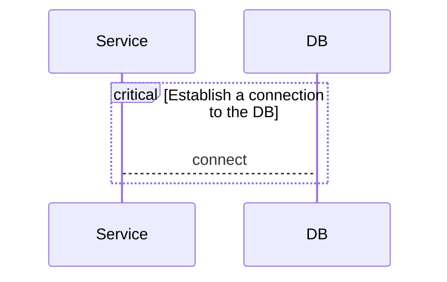
```mermaid
sequenceDiagram
    critical Establish a connection to the DB
        Service-->DB: connect
    end
```

这个关键块也可以嵌套，相当于上面看到的 `par` 语句。

## 2.10 break（跳出）

可以在流中指示序列的停止（通常用于对异常建模）。

1. 语法

```
break [something happened]
... statements ...
end
```

2. 示例

- 代码

```
sequenceDiagram
    Consumer-->API: Book something
    API-->BookingService: Start booking process
    break when the booking process fails
        API-->Consumer: show failure
    end
    API-->BillingService: Start billing process
```

- 展示图

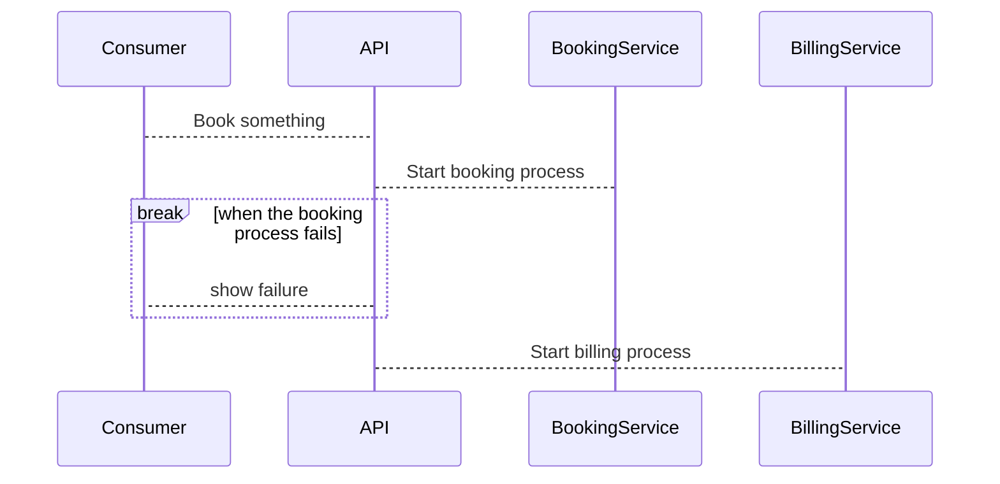
```mermaid
sequenceDiagram
    Consumer-->API: Book something
    API-->BookingService: Start booking process
    break when the booking process fails
        API-->Consumer: show failure
    end
    API-->BillingService: Start billing process
```


## 2.11 背景高亮显示

可以通过提供彩色背景矩形来突出显示流。这是用符号表示的


1. 语法


```
rect COLOR
... content ...
end
```

2. 使用rgb和rgba语法定义颜色。

```
rect rgb(0, 255, 0)
... content ...
end
```

```
rect rgba(0, 0, 255, .1)
... content ...
end
```

3. 示例

- 代码

```
sequenceDiagram
    participant Alice
    participant John

    rect rgb(191, 223, 255)
    note right of Alice: Alice calls John.
    Alice->>+John: Hello John, how are you?
    rect rgb(200, 150, 255)
    Alice->>+John: John, can you hear me?
    John-->>-Alice: Hi Alice, I can hear you!
    end
    John-->>-Alice: I feel great!
    end
    Alice ->>+ John: Did you want to go to the game tonight?
    John -->>- Alice: Yeah! See you there.
```

- 展示图

```mermaid
sequenceDiagram
    participant Alice
    participant John

    rect rgb(191, 223, 255)
    note right of Alice: Alice calls John.
    Alice->>+John: Hello John, how are you?
    rect rgb(200, 150, 255)
    Alice->>+John: John, can you hear me?
    John-->>-Alice: Hi Alice, I can hear you!
    end
    John-->>-Alice: I feel great!
    end
    Alice ->>+ John: Did you want to go to the game tonight?
    John -->>- Alice: Yeah! See you there.
```

## 2.12 注释

可以在序列图中输入注释，解析器将忽略这些注释。注释需要在单独的行上，并且必须以 `%%` （双百分号）作为前缀。在注释开始到下一个换行符之后的任何文本都将被视为注释，包括任何图表语法

- 代码

```
sequenceDiagram
    Alice->>John: Hello John, how are you?
    %% this is a comment
    John-->>Alice: Great!
```

- 展示图

```mermaid
sequenceDiagram
    Alice->>John: Hello John, how are you?
    %% this is a comment
    John-->>Alice: Great!
```


## 2.13 转义字符

可以使用这里示例的语法转义字符。

- 代码

```
sequenceDiagram
    A->>B: I #9829; you!
    B->>A: I #9829; you #infin; times more!
```

- 展示图

```mermaid
sequenceDiagram
    A->>B: I #9829; you!
    B->>A: I #9829; you #infin; times more!
```

给定的数字以10为基数，因此 `#` 可以编码为 `#35;` 。还支持使用HTML字符名。

因为分号可以代替换行符来定义标记，所以需要使用 `#59;` 来在消息文本中包含分号。

## 2.14 sequenceNumbers（序列号）

在序列图中，可以为每个箭头附加一个序列号。这可以在将mermaid添加到网站时配置，如下所示：


```html
<script>
  mermaid.initialize({ sequence: { showSequenceNumbers: true } });
</script>
```

它也可以通过图表代码打开，如下图所示：

- 代码

```
sequenceDiagram
    autonumber
    Alice->>John: Hello John, how are you?
    loop HealthCheck
        John->>John: Fight against hypochondria
    end
    Note right of John: Rational thoughts!
    John-->>Alice: Great!
    John->>Bob: How about you?
    Bob-->>John: Jolly good!
```

- 展示图

```mermaid
sequenceDiagram
    autonumber
    Alice->>John: Hello John, how are you?
    loop HealthCheck
        John->>John: Fight against hypochondria
    end
    Note right of John: Rational thoughts!
    John-->>Alice: Great!
    John->>Bob: How about you?
    Bob-->>John: Jolly good!
```


## 2.15  `participant/actor` 菜单

### 2.15.1 基础菜单

actor可以有包含到外部页面的个性化链接的弹出式菜单。例如，如果参与者表示web服务，则有用的链接可能包括指向服务运行状况指示板的链接、包含服务代码的repo或描述服务的wiki页面。

这可以通过添加一个或多个链接行来配置，格式为：

```
link <actor>: <link-label> @ <link-url>
```

- 代码

```
sequenceDiagram
    participant Alice
    participant John
    link Alice: Dashboard @ https://dashboard.contoso.com/alice
    link Alice: Wiki @ https://wiki.contoso.com/alice
    link John: Dashboard @ https://dashboard.contoso.com/john
    link John: Wiki @ https://wiki.contoso.com/john
    Alice->>John: Hello John, how are you?
    John-->>Alice: Great!
    Alice-)John: See you later!
```

- 展示图

```mermaid
sequenceDiagram
    participant Alice
    participant John
    link Alice: Dashboard @ https://dashboard.contoso.com/alice
    link Alice: Wiki @ https://wiki.contoso.com/alice
    link John: Dashboard @ https://dashboard.contoso.com/john
    link John: Wiki @ https://wiki.contoso.com/john
    Alice->>John: Hello John, how are you?
    John-->>Alice: Great!
    Alice-)John: See you later!
```


### 2.15.2 高级菜单

有一种高级语法依赖于JSON格式。如果您对JSON格式感到满意，那么它也存在。

这可以通过添加links行来配置，格式如下：

```
links <actor>: <json-formatted link-name link-url pairs>
```

下面是一个例子：

- 代码

```
sequenceDiagram
    participant Alice
    participant John
    links Alice: {"Dashboard": "https://dashboard.contoso.com/alice", "Wiki": "https://wiki.contoso.com/alice"}
    links John: {"Dashboard": "https://dashboard.contoso.com/john", "Wiki": "https://wiki.contoso.com/john"}
    Alice->>John: Hello John, how are you?
    John-->>Alice: Great!
    Alice-)John: See you later!
```

- 展示图

```mermaid
sequenceDiagram
    participant Alice
    participant John
    links Alice: {"Dashboard": "https://dashboard.contoso.com/alice", "Wiki": "https://wiki.contoso.com/alice"}
    links John: {"Dashboard": "https://dashboard.contoso.com/john", "Wiki": "https://wiki.contoso.com/john"}
    Alice->>John: Hello John, how are you?
    John-->>Alice: Great!
    Alice-)John: See you later!
```


## 2.16 样式

序列图的样式化是通过定义一些css类来完成的。在渲染过程中，这些类从位于src/themes/sequence.scss的文件中提取出来

### 2.16.1 使用的类

| 类   | 描述  |
| --- | --- |
| actor  | 演员框的样式。 |
| actor-top | 图顶部角色图/框的样式。 |
| actor-bottom | 图底部角色图/框的样式。 |
| text.actor | 所有角色文本的样式。 |
| text.actor-box | actor框文本的样式。 |
| text.actor-man | 演员图形文本的样式。 |
| actor-line | 演员的垂直线。 |
| messageLine0 | 实体消息行的样式。 |
| messageLine1 | 虚线消息行的样式。 |
| messageText | 定义消息箭头上文本的样式。 |
| labelBox | 定义要在循环中留下的样式标签。 |
| labelText | 标签for循环文本的样式。 |
| loopText | 循环框中文本的样式。 |
| loopLine | 定义循环框中行的样式。 |
| note | 注释框的样式。 |
| noteText | 注释框中文本的样式。 |

### 2.16.2 样本样式表

```css
body {
  background: white;
}

.actor {
  stroke: #ccccff;
  fill: #ececff;
}
text.actor {
  fill: black;
  stroke: none;
  font-family: Helvetica;
}

.actor-line {
  stroke: grey;
}

.messageLine0 {
  stroke-width: 1.5;
  stroke-dasharray: '2 2';
  marker-end: 'url(#arrowhead)';
  stroke: black;
}

.messageLine1 {
  stroke-width: 1.5;
  stroke-dasharray: '2 2';
  stroke: black;
}

#arrowhead {
  fill: black;
}

.messageText {
  fill: black;
  stroke: none;
  font-family: 'trebuchet ms', verdana, arial;
  font-size: 14px;
}

.labelBox {
  stroke: #ccccff;
  fill: #ececff;
}

.labelText {
  fill: black;
  stroke: none;
  font-family: 'trebuchet ms', verdana, arial;
}

.loopText {
  fill: black;
  stroke: none;
  font-family: 'trebuchet ms', verdana, arial;
}

.loopLine {
  stroke-width: 2;
  stroke-dasharray: '2 2';
  marker-end: 'url(#arrowhead)';
  stroke: #ccccff;
}

.note {
  stroke: #decc93;
  fill: #fff5ad;
}

.noteText {
  fill: black;
  stroke: none;
  font-family: 'trebuchet ms', verdana, arial;
  font-size: 14px;
}
```

## 2.17 配置

可以调整显示序列图的边距。

1. 定义配置

这可以通过定义 `mermaid.sequenceConfig` 或通过CLI使用json文件进行配置来完成。CLI的使用方法请参见mermaidCLI界面。 `mermaid.sequenceConfig` 可设置为带配置参数的JSON字符串或对应的对象。

```javascript
mermaid.sequenceConfig = {
  diagramMarginX: 50,
  diagramMarginY: 10,
  boxTextMargin: 5,
  noteMargin: 10,
  messageMargin: 35,
  mirrorActors: true,
};
```

2. 可能的配置参数：

| 参数  | 描述  | 默认值 |
| --- | --- | --- |
| mirrorActors | 打开/关闭角色在图表下方和上方的渲染 | false   |
| bottomMarginAdj | 调整图形结束的位置。css的宽边框样式可能会产生不必要的剪切，这就是为什么这个配置参数存在的原因。 | 1   |
| actorFontSize | 设置演员描述的字体大小 | 14  |
| actorFontFamily | 为演员的描述设置字体族 | "Open Sans", sans-serif |
| actorFontWeight | 设置演员描述的字体粗细 | "Open Sans", sans-serif |
| noteFontSize | 设置演员附加说明的字体大小 | 14  |
| noteFontFamily | 设置演员附加注释的字体族 | "trebuchet ms", verdana, arial |
| noteFontWeight | 设置演员附注的字体粗细 | "trebuchet ms", verdana, arial |
| noteAlign | 设置角色附加注释中的文本对齐方式 | center  |
| messageFontSize | 设置actor<->actor消息的字体大小 | 16  |
| messageFontFamily | 为actor<->actor消息设置字体族 |"trebuchet ms", verdana, arial |
| messageFontWeight | 设置actor<->actor消息的字体粗细 |"trebuchet ms", verdana, arial |