# 三、类图

> 在软件工程中，统一建模语言（UML）中的类图是一种静态结构图，它通过显示系统的类、它们的属性、操作（或方法）以及对象之间的关系来描述系统的结构。


类图是面向对象建模的主要构建块。它用于应用程序结构的一般概念建模，以及将模型转换为编程代码的详细建模。类图也可以用于数据建模。类图中的类既表示应用程序中的主要元素、交互，也表示要编程的类。

Mermaid可以渲染类图。

- 代码

```
---
title: Animal example
---
classDiagram
    note "From Duck till Zebra"
    Animal <|-- Duck
    note for Duck "can fly\ncan swim\ncan dive\ncan help in debugging"
    Animal <|-- Fish
    Animal <|-- Zebra
    Animal : +int age
    Animal : +String gender
    Animal: +isMammal()
    Animal: +mate()
    class Duck{
        +String beakColor
        +swim()
        +quack()
    }
    class Fish{
        -int sizeInFeet
        -canEat()
    }
    class Zebra{
        +bool is_wild
        +run()
    }
```

- 展示图

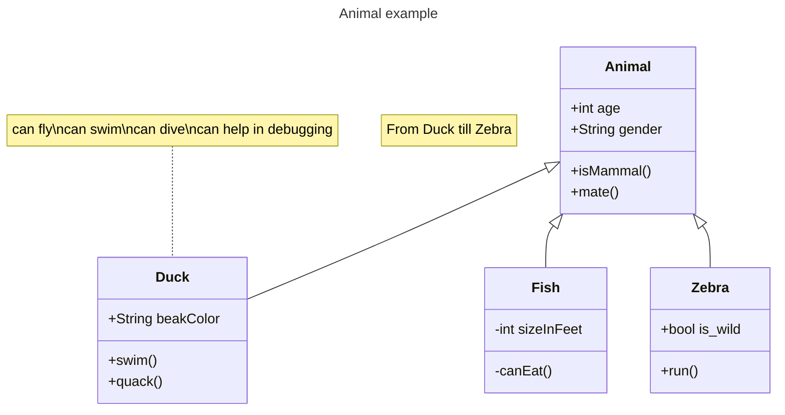


## 3.1 定义类

### 3.1.1 类标准

UML提供了表示类成员的机制，例如属性和方法，以及关于它们的附加信息。图中一个类的单个实例包含三个部分：

*   最上面的隔层包含了类的名称。它以粗体居中印刷，第一个字母大写。它还可以包含描述类性质的可选注释文本。
*   中间的隔间包含类的属性。它们左对齐，第一个字母是小写的。
*   底层隔间包含类可以执行的操作。它们也是左对齐的，第一个字母是小写的。

- 代码

```
---
title: Bank example
---
classDiagram
    class BankAccount
    BankAccount : +String owner
    BankAccount : +Bigdecimal balance
    BankAccount : +deposit(amount)
    BankAccount : +withdrawal(amount)
```

- 展示图

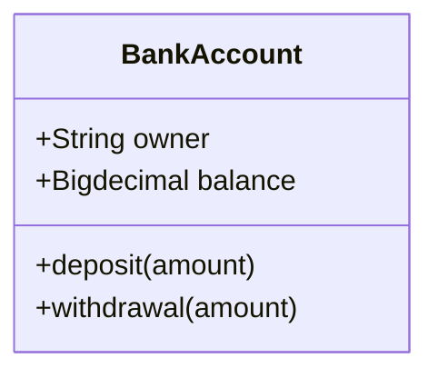


### 3.1.2 定义类

定义类有两种方法：

*   显式地使用关键字class，如 `class Animal` ，这将定义Animal类。
*   通过一个关系，一次定义两个类以及它们之间的关系。例如， `Vehicle <|-- Car` 。

- 代码

```
classDiagram
    class Animal
    Vehicle <|-- Car
```

- 展示图

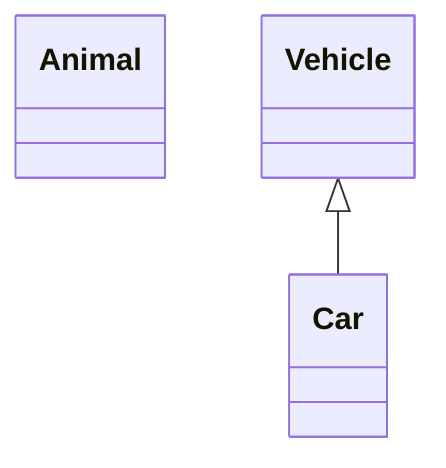


命名约定：类名应该只由字母数字字符（包括unicode）、下划线和破折号（-）组成。

### 3.1.3 类标签

如果你需要为一个类提供一个标签，你可以使用以下语法：

- 代码

```
classDiagram
    class Animal["Animal with a label"]
    class Car["Car with *! symbols"]
    Animal --> Car
```

- 展示图

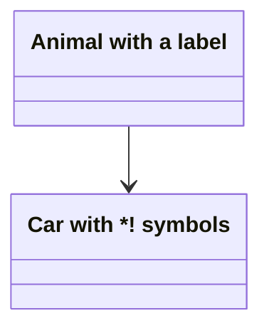


还可以使用反号转义标签中的特殊字符：

- 代码

```
classDiagram
    class `Animal Class!`
    class `Car Class`
    `Animal Class!` --> `Car Class`
```

- 展示图

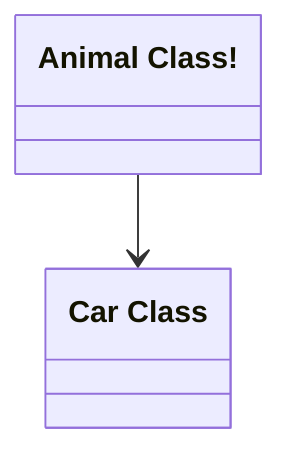

Animal Class!

Car Class

## 3.2 定义类的成员


### 3.2.1 属性与方法

UML提供了表示类成员的机制，例如属性和方法，以及关于它们的附加信息。

Mermaid根据括号 `()` 是否存在来区分属性和函数/方法。 `()` 的被视为函数/方法，所有其他的作为属性。

有两种方法可以定义类的成员，无论使用哪种语法定义成员，输出都是相同的。两种不同的方式是：

*   使用：（冒号）后跟成员名来关联类的成员，这对于一次定义一个成员很有用。例如:

- 代码

```
classDiagram
class BankAccount
BankAccount : +String owner
BankAccount : +BigDecimal balance
BankAccount : +deposit(amount)
BankAccount : +withdrawal(amount)
```

- 展示图

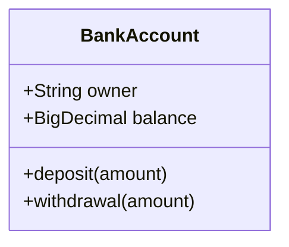


*   使用{}括号的类的关联成员，其中成员被分组在花括号内。适合一次定义多个成员。例如:

- 代码

```
classDiagram
class BankAccount{
    +String owner
    +BigDecimal balance
    +deposit(amount)
    +withdrawal(amount)
}
```

- 展示图


### 3.2.2 方法返回类型

你可以选择用将要返回的数据类型结束方法/函数定义（注意：在最后的 `)` 和返回类型之间必须有一个空格）。一个例子:

- 代码

```
classDiagram
class BankAccount{
    +String owner
    +BigDecimal balance
    +deposit(amount) bool
    +withdrawal(amount) int
}
```

- 展示图

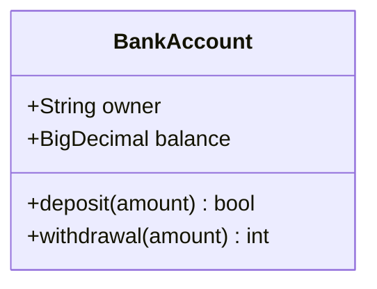


### 3.2.3 泛型类型

泛型可以表示为类定义的一部分，也可以表示为类成员/返回类型。为了将项目表示为通用类型，您将该类型包含在 `~` （波浪线）中。支持嵌套类型声明，如 `List<List<int>>` ，但目前不支持包含逗号的泛型。（如 `List<List<K, V>>` ）

> 注意，当泛型在类定义中使用时，泛型类型不被视为类名的一部分。也就是说：对于任何需要你引用类名的语法，你需要去掉定义的类型部分。这也意味着mermaid目前不支持两个具有相同名称但不同泛型类型的类。

- 代码

```
classDiagram
class Square~Shape~{
    int id
    List~int~ position
    setPoints(List~int~ points)
    getPoints() List~int~
}

Square : -List~string~ messages
Square : +setMessages(List~string~ messages)
Square : +getMessages() List~string~
Square : +getDistanceMatrix() List~List~int~~
```

- 展示图

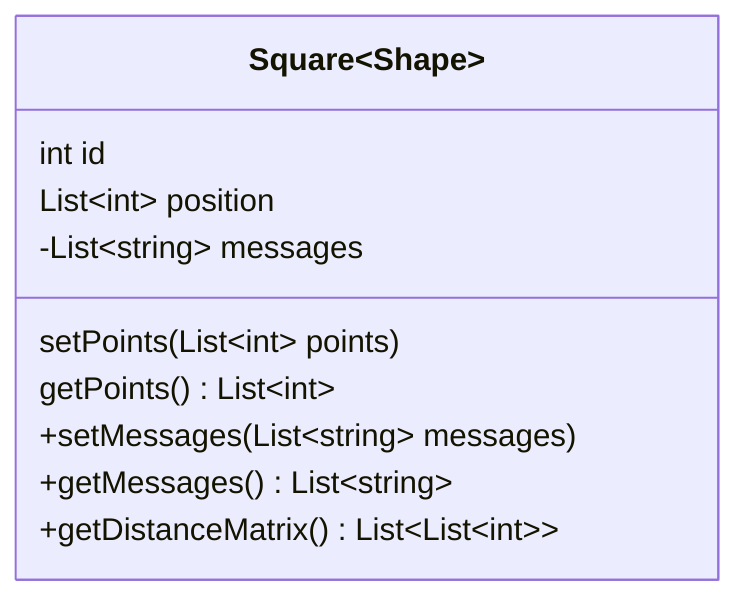


### 3.2.4 可见性

为了描述作为类（即类成员）一部分的属性或方法/函数的可见性（或封装），可选符号可以放在成员名之前：

*   `+` 
*   `-` 私有的
*   `#` 保护
*   `~` 包/内部

> 注意，你也可以通过在方法的末尾添加以下符号来在方法定义中包含额外的分类器，即：在 `()` 之后或在返回类型之后：
> 
> *   `*` 摘要例如： `someAbstractMethod()*` 或 `someAbstractMethod() int*`
> *   `$` 静态例如： `someStaticMethod()$` 或 `someStaticMethod() String$`

> 注意，您还可以通过在字段定义的最后添加以下符号来包含额外的分类器：
> 
> *   `$` 静态例如： `String someField$`

## 3.3 定义关系


### 3.3.1 基础定义

关系是一个通用术语，涵盖了在类图和对象图中发现的特定类型的逻辑连接。


1.  语法

```
[classA][Arrow][ClassB]
```


2. 关系类型与写法

目前支持的UML中为类定义的关系有八种不同类型：

| 类型  | 描述  |
| --- | --- |
| `<\|--` | 继承  |
| `*--` | 作文  |
| `o--` | 聚合  |
| `-->` | 协会  |
| `--` | 链接(固体) |
| `..>` | 依赖  |
| `..\|>` | 实现  |
| `..` | 链接(虚线) |

- 代码

```
classDiagram
classA <|-- classB
classC *-- classD
classE o-- classF
classG <-- classH
classI -- classJ
classK <.. classL
classM <|.. classN
classO .. classP
```

- 展示图

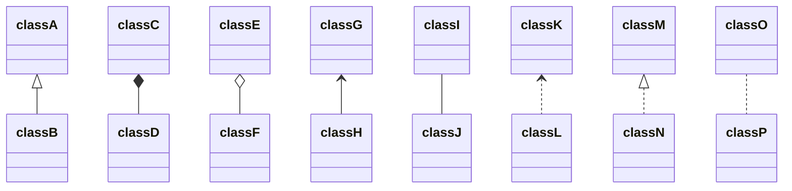


3. 使用标签

使用标签来描述两个类之间关系的性质。此外，箭头也可以用于相反的方向：


- 代码

```
classDiagram
classA --|> classB : Inheritance
classC --* classD : Composition
classE --o classF : Aggregation
classG --> classH : Association
classI -- classJ : Link(Solid)
classK ..> classL : Dependency
classM ..|> classN : Realization
classO .. classP : Link(Dashed)
```

- 展示图

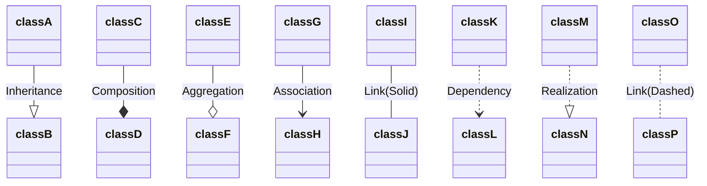


### 3.3.2 关系标签

可以将标签文本添加到关系中：

- 语法

```
[classA][Arrow][ClassB]:LabelText
```

- 代码

```
classDiagram
classA <|-- classB : implements
classC *-- classD : composition
classE o-- classF : aggregation
```

- 展示图

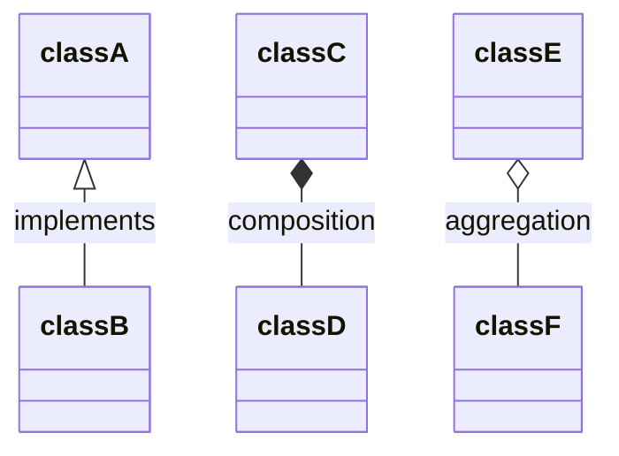


### 3.3.3 双向关系

1. 关系可以在逻辑上表示一个N:M关联：

- 代码

```
classDiagram
    Animal <|--|> Zebra
```

- 展示图

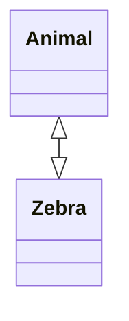


2. 语法

```
[Relation Type][Link][Relation Type]
```

其中 `Relation Type` 可以是：

| 类型  | 描述  |
| --- | --- |
| `<\|` | 继承  |
| `\*` | 作文  |
| `o` | 聚合  |
| `>` | 协会  |
| `<` | 协会  |
| `\|>` | 实现  |

 `Link` 可以是：

| 类型  | 描述  |
| --- | --- |
| \-- | 固体  |
| ..  | 冲   |

### ‌3.3.4 Lollipop（棒棒糖）的接口

目前好像只用于andriod

还可以给类指定一个特殊的关系类型，该类型在类上定义一个棒棒糖接口。棒棒糖接口使用以下语法定义：

*   `bar ()-- foo`
*   `foo --() bar`

带有棒棒糖的接口（bar）连接到类（foo）。

注意：定义的每个接口都是唯一的，意味着不能在类之间共享/有多个边连接到它。

- 代码

```
classDiagram
  bar ()-- foo
```

- 展示图

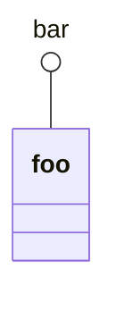

- 代码

```
classDiagram
  class Class01 {
    int amount
    draw()
  }
  Class01 --() bar
  Class02 --() bar

  foo ()-- Class01
```

- 展示图

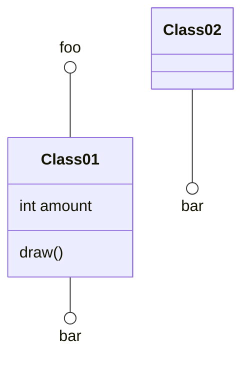


## 3.4 定义命名空间

名称空间对类进行分组。

- 代码

```
classDiagram
namespace BaseShapes {
    class Triangle
    class Rectangle {
      double width
      double height
    }
}
```

- 展示图

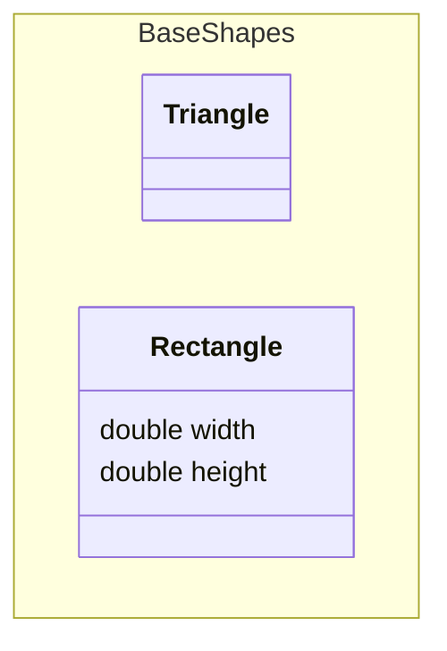


## 3.5 关系的基数性/多重性

类图中的多重性或基数表示可以链接到另一个类的实例的一个类的实例的数量。例如，每个公司将有一个或多个员工（不是零），并且每个员工当前为零个或一个公司工作。

多重符号被放置在一个关联的末尾。

不同的基数选项有：

*   `1` 仅1
*   `0..1`  0或1
*   `1..*` 一个或多个
*   `*` 很多
*   `n`  n（其中n>1）
*   `0..n`  0到n（其中n>为1）
*   `1..n`  1到n（其中n>1）

基数可以通过在给定箭头之前或之后的引号 `"` 中放置文本选项来轻松定义。例如:

```
[classA] "cardinality1" [Arrow] "cardinality2" [ClassB]:LabelText
```

- 代码

```
classDiagram
    Customer "1" --> "*" Ticket
    Student "1" --> "1..*" Course
    Galaxy --> "many" Star : Contains
```

- 展示图

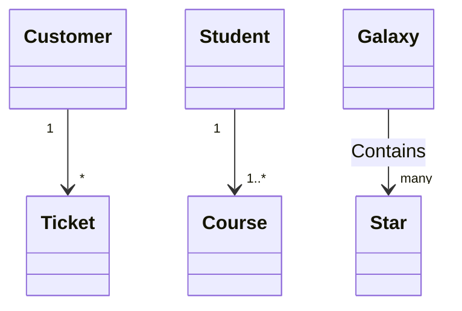


## 3.6 类上的注释

可以用标记对类进行注释，以提供有关该类的额外元数据。这可以更清楚地说明它的性质。一些常见的注释包括：

*   `<<Interface>>` 表示一个接口类
*   `<<Abstract>>` 表示一个抽象类
*   `<<Service>>` 表示一个服务类
*   `<<Enumeration>>` 表示枚举类（enum）

注释定义在开头 `<<` 和结尾 `>>` 内。有两种方法可以向类中添加注释，无论哪种方式的输出都是相同的：

*   在定义类之后的单独一行中：

- 代码

```
classDiagram
  class Shape
  <<interface>> Shape
  Shape : noOfVertices
  Shape : draw()
```

- 展示图

```mermaid
classDiagram
  class Shape
  &lt;&lt;interface&gt;&gt; Shape
  Shape : noOfVertices
  Shape : draw()
```


*   在类定义的嵌套结构中：

- 代码

```
classDiagram
class Shape{
    <<interface>>
    noOfVertices
    draw()
}
class Color{
    <<enumeration>>
    RED
    BLUE
    GREEN
    WHITE
    BLACK
}
```

- 展示图

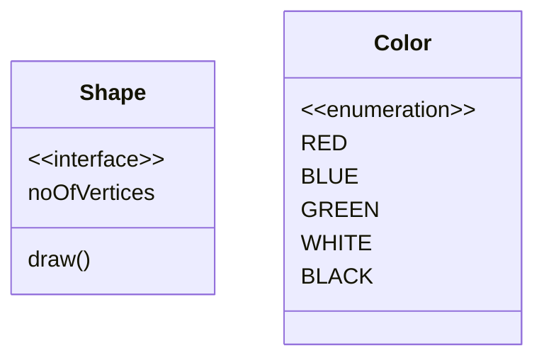


## 3.7 注释

注释可以在类图中输入，解析器将忽略注释。注释需要在单独的行上，并且必须以 `%%` （双百分号）作为前缀。直到下一个换行符之前的任何文本都将被视为注释，包括任何类图语法。

- 代码

```
classDiagram
%% This whole line is a comment classDiagram class Shape <<interface>>
class Shape{
    <<interface>>
    noOfVertices
    draw()
}
```

- 展示图

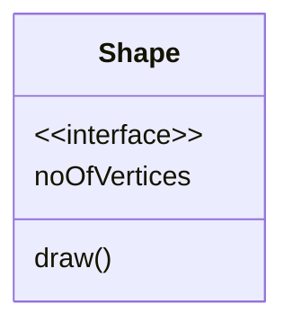


## 3.8 设置图表的方向

对于类图，你可以使用direction语句来设置渲染图的方向：

- 代码

```
classDiagram
  direction RL
  class Student {
    -idCard : IdCard
  }
  class IdCard{
    -id : int
    -name : string
  }
  class Bike{
    -id : int
    -name : string
  }
  Student "1" --o "1" IdCard : carries
  Student "1" --o "1" Bike : rides
```

- 展示图

```mermaid
classDiagram
  direction RL
  class Student {
    -idCard : IdCard
  }
  class IdCard{
    -id : int
    -name : string
  }
  class Bike{
    -id : int
    -name : string
  }
  Student "1" --o "1" IdCard : carries
  Student "1" --o "1" Bike : rides
```


## 3.9 交互

可以将单击事件绑定到节点。点击可以导致javascript回调或链接，这将在一个新的浏览器选项卡中打开。注意：当使用 `securityLevel='strict'` 时禁用此功能，当使用 `securityLevel='loose'` 时启用此功能。

在声明了所有类之后，您可以在单独的一行中定义这些操作。

```plain
action className "reference" "tooltip"
click className call callback() "tooltip"
click className href "url" "tooltip"
```

*   Action要么 `link` ，要么 `callback` ，这取决于您想要调用的交互类型
*   className是操作将与之关联的节点的id
*   引用可以是url链接，也可以是回调函数的名称。
*   （可选）tooltip是悬停在元素上时显示的字符串（注意：工具提示的样式是由. mermaidtooltip类设置的）。
*   注意：回调函数将以nodeId作为参数调用。

## 3.10 笔记-注释

可以使用 `note "line1\nline2"` 在图上添加注释。可以使用 `note for <CLASS NAME> "line1\nline2"` 为特定类添加注释。

### 3.10.1 例子

- 代码

```
classDiagram
    note "This is a general note"
    note for MyClass "This is a note for a class"
    class MyClass{
    }
```

- 展示图

```mermaid
classDiagram
    note "This is a general note"
    note for MyClass "This is a note for a class"
    class MyClass {

    }
end
```


- 代码

```
classDiagram
class Shape
link Shape "https://www.github.com" "This is a tooltip for a link"
class Shape2
click Shape2 href "https://www.github.com" "This is a tooltip for a link"
```

- 展示图

```mermaid
classDiagram
class Shape
link Shape "https://www.github.com" "This is a tooltip for a link"
class Shape2
click Shape2 href "https://www.github.com" "This is a tooltip for a link"
```


- 代码

```
classDiagram
class Shape
callback Shape "callbackFunction" "This is a tooltip for a callback"
class Shape2
click Shape2 call callbackFunction() "This is a tooltip for a callback"
```

- 展示图

```mermaid
classDiagram
class Shape
callback Shape "callbackFunction" "This is a tooltip for a callback"
class Shape2
click Shape2 call callbackFunction() "This is a tooltip for a callback"
```


```html
<script>
  const callbackFunction = function () {
    alert('A callback was triggered');
  };
</script>
```

- 代码

```
classDiagram
    class Class01
    class Class02
    callback Class01 "callbackFunction" "Callback tooltip"
    link Class02 "https://www.github.com" "This is a link"
    class Class03
    class Class04
    click Class03 call callbackFunction() "Callback tooltip"
    click Class04 href "https://www.github.com" "This is a link"
```

- 展示图

```mermaid
classDiagram
    class Class01
    class Class02
    callback Class01 "callbackFunction" "Callback tooltip"
    link Class02 "https://www.github.com" "This is a link"
    class Class03
    class Class04
    click Class03 call callbackFunction() "Callback tooltip"
    click Class04 href "https://www.github.com" "This is a link"
```

### 3.10.2 html页面展示

初学者提示——在HTML页面中使用交互式链接的完整示例：


```html
<body>
  <pre class="mermaid">
    classDiagram
    Animal <|-- Duck
    Animal <|-- Fish
    Animal <|-- Zebra
    Animal : +int age
    Animal : +String gender
    Animal: +isMammal()
    Animal: +mate()
    class Duck{
      +String beakColor
      +swim()
      +quack()
      }
    class Fish{
      -int sizeInFeet
      -canEat()
      }
    class Zebra{
      +bool is_wild
      +run()
      }

      callback Duck callback "Tooltip"
      link Zebra "https://www.github.com" "This is a link"
  </pre>

  <script>
    const callback = function () {
      alert('A callback was triggered');
    };
    const config = {
      startOnLoad: true,
      securityLevel: 'loose',
    };
    mermaid.initialize(config);
  </script>
</body>
```

## 3.11 样式

### 3.11.1 样式化节点

可以使用 `style` 关键字对单个节点应用特定样式，例如更厚的边框或不同的背景颜色。

注意，注释和名称空间不能单独设置样式，但它们支持主题。

- 代码

```
classDiagram
  class Animal
  class Mineral
  style Animal fill:#f9f,stroke:#333,stroke-width:4px
  style Mineral fill:#bbf,stroke:#f66,stroke-width:2px,color:#fff,stroke-dasharray: 5 5
```

- 展示图

```mermaid
classDiagram
  class Animal
  class Mineral
  style Animal fill:#f9f,stroke:#333,stroke-width:4px
  style Mineral fill:#bbf,stroke:#f66,stroke-width:2px,color:#fff,stroke-dasharray: 5 5
```


### 3.11.2 样式中类定义

比每次定义样式更方便的方法是定义一个样式类，并将该类附加到应该具有不同外观的节点上。

类定义看起来像下面的例子：

```
classDef className fill:#f9f,stroke:#333,stroke-width:4px;
```

此外，可以在一个语句中定义多个类的样式：

```
classDef firstClassName,secondClassName font-size:12pt;
```

将类附加到节点的操作如下：

```
cssClass "nodeId1" className;
```

也可以在一条语句中将一个类附加到节点列表：

```
cssClass "nodeId1,nodeId2" className;
```

添加类的较短形式是使用 `:::` 操作符将类名附加到节点上：

- 代码

```
classDiagram
    class Animal:::someclass
    classDef someclass fill:#f96
```

- 展示图

```mermaid
classDiagram
    class Animal:::someclass
    classDef someclass fill:#f96
```

或者:

- 代码

```
classDiagram
    class Animal:::someclass {
        -int sizeInFeet
        -canEat()
    }
    classDef someclass fill:#f96
```

- 展示图

```mermaid
classDiagram
    class Animal:::someclass {
        -int sizeInFeet
        -canEat()
    }
    classDef someclass fill:#f96
```


### 3.11.3 默认的类

如果一个类被命名为default，它将应用于所有节点。之后应该定义特定的样式和类来覆盖应用的默认样式。

```plain
classDef default fill:#f9f,stroke:#333,stroke-width:4px;
```

- 代码

```
classDiagram
  class Animal:::pink
  class Mineral

  classDef default fill:#f96,color:red
  classDef pink color:#f9f
```

- 展示图

```mermaid
classDiagram
  class Animal:::pink
  class Mineral

  classDef default fill:#f96,color:red
  classDef pink color:#f9f
```


### 3.11.4 CSS类

也可以在CSS样式中预定义类，这些类可以从图形定义中应用，如下例所示：

**例子的风格**

```html
<style>
  .styleClass > * > g {
    fill: #ff0000;
    stroke: #ffff00;
    stroke-width: 4px;
  }
</style>
```

**示例定义**

- 代码

```
classDiagram
    class Animal:::styleClass
```

- 展示图

```mermaid
classDiagram
    class Animal:::styleClass
```


> 不能将此简写方法与关系语句同时添加cssClasses。

## 3.12 配置

### 3.12.1 成员框

可以隐藏类节点的空成员框。

这是通过更改类图配置的hideEmptyMembersBox值来完成的。有关如何编辑Mermaid配置的详细信息，请参阅配置页面。

- 代码

```
---
  config:
    class:
      hideEmptyMembersBox: true
---
classDiagram
  class Duck
```

- 展示图

```mermaid
---
  config:
    class:
      hideEmptyMembersBox: true
---
classDiagram
  class Duck
```
