# 四、状态图

> 状态图是计算机科学和相关领域中用于描述系统行为的一种图。状态图要求所描述的系统由有限数量的状态组成；有时，这确实是事实，而在其他时候，这是一个合理的抽象。”

mermaid可以渲染状态图。该语法试图与plantUml中使用的语法兼容，因为这将使用户更容易在mermaid和plantUml之间共享图表。


- 代码

```
---
title: Simple sample
---
stateDiagram-v2
    [*] --> Still
    Still --> [*]

    Still --> Moving
    Moving --> Still
    Moving --> Crash
    Crash --> [*]
```

- 展示图

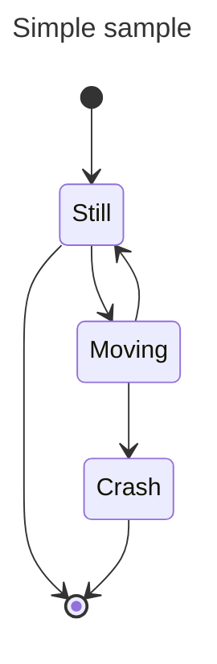

旧的渲染器:

- 代码

```
stateDiagram
    [*] --> Still
    Still --> [*]

    Still --> Moving
    Moving --> Still
    Moving --> Crash
    Crash --> [*]
```

- 展示图

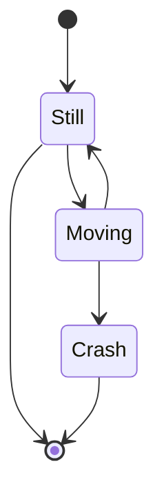

在状态图中，系统是根据状态以及一种状态如何通过转换转变为另一种状态来描述的。上面的示例图显示了三种状态：静止、移动和崩溃。你从静止状态开始。你可以从静止状态切换到移动状态。从移动中，您可以更改回静止状态或崩溃状态。没有从静止到崩溃的过渡。（如果你是静止的，你就不会崩溃。）

## 4.1 状态

1. 状态可以通过多种方式声明。最简单的方法是用id定义一个状态：

- 代码

```
stateDiagram-v2
    stateId
```

- 展示图

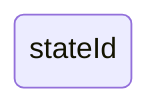

2. 使用state关键字和描述，如下所示：

- 代码

```
stateDiagram-v2
    state "This is a state description" as s2
```

- 展示图

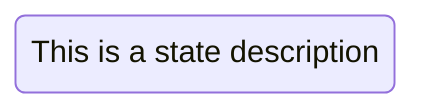

3. 用描述定义状态的另一种方法是定义状态id，后面跟着冒号和描述：

- 代码

```
stateDiagram-v2
    s2 : This is a state description
```

- 展示图


## 4.2 转换

当一个状态进入另一个状态时，转换是路径/边。这是用文本箭头“——>”表示的。

当您定义两个状态之间的转换并且状态尚未定义时，未定义的状态将使用转换的id来定义。以后可以向以这种方式定义的状态添加描述。

- 代码

```
stateDiagram-v2
    s1 --> s2
```

- 展示图

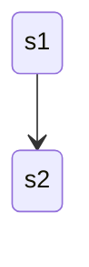

可以在过渡中添加文字来描述它所代表的内容：

- 代码

```
stateDiagram-v2
    s1 --> s2: A transition
```

- 展示图

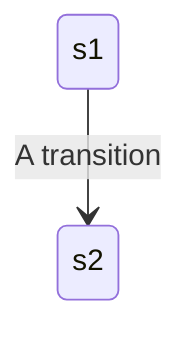

## 4.3 开始和结束

有两种特殊的状态表示图表的开始和停止。这些是用`[*]`语法编写的，并且转换到它的方向将其定义为开始状态或停止状态。

- 代码

```
stateDiagram-v2
    [*] --> s1
    s1 --> [*]
```

- 展示图

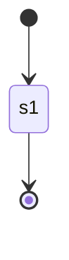

## 4.4 组合状态

在现实世界中使用状态图时，您经常会得到多维的图，因为一个状态可以有多个内部状态。这些在这个术语中被称为复合状态。

为了定义一个复合状态，你需要使用state关键字，后面跟一个id，复合状态的主体在{}之间。您可以像命名简单状态一样，在单独的一行上命名复合状态。请看下面的例子：

- 代码

```
stateDiagram-v2
    [*] --> First
    state First {
        [*] --> second
        second --> [*]
    }

    [*] --> NamedComposite
    NamedComposite: Another Composite
    state NamedComposite {
        [*] --> namedSimple
        namedSimple --> [*]
        namedSimple: Another simple
    }
```

- 展示图

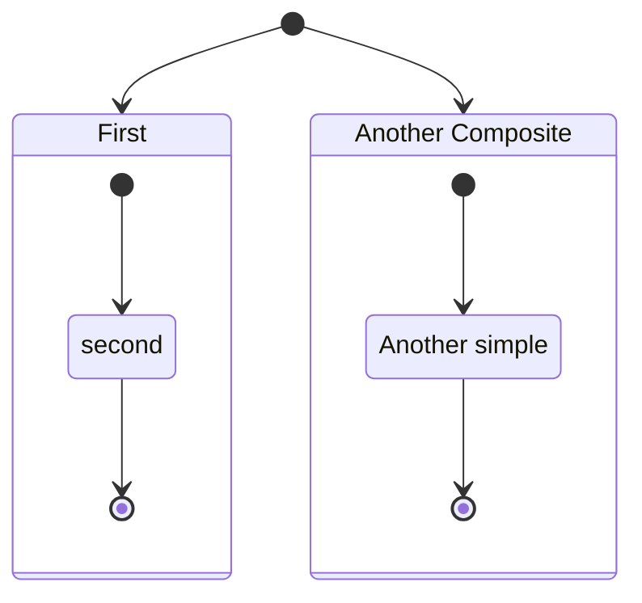

你可以在几个图层中这样做：

- 代码

```
stateDiagram-v2
    [*] --> First

    state First {
        [*] --> Second

        state Second {
            [*] --> second
            second --> Third

            state Third {
                [*] --> third
                third --> [*]
            }
        }
    }
```

- 展示图

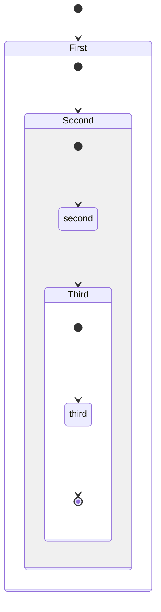

你也可以定义复合状态之间的转换：

- 代码

```
stateDiagram-v2
    [*] --> First
    First --> Second
    First --> Third

    state First {
        [*] --> fir
        fir --> [*]
    }
    state Second {
        [*] --> sec
        sec --> [*]
    }
    state Third {
        [*] --> thi
        thi --> [*]
    }
```

- 展示图

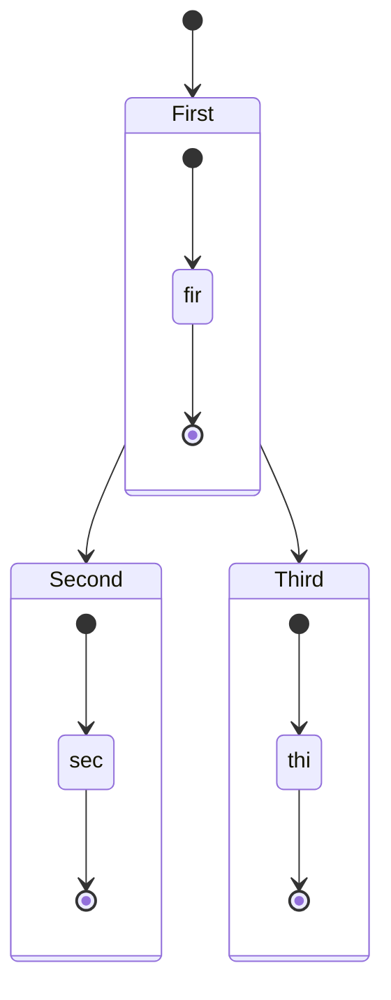

_您不能定义属于不同复合状态的内部状态之间的转换_

## 4.5 选择

有时需要对两个或多个路径之间的选择进行建模，可以使用`<\>`。

- 代码

```
stateDiagram-v2
    state if_state <<choice>>
    [*] --> IsPositive
    IsPositive --> if_state
    if_state --> False: if n < 0
    if_state --> True : if n >= 0
```

- 展示图

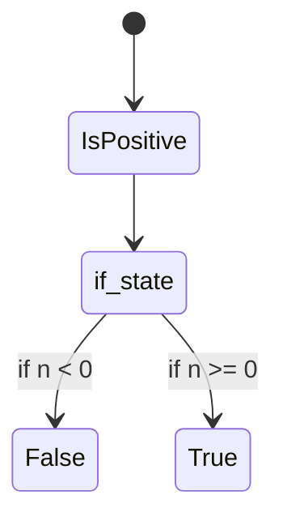

## 4.6 分支

可以使用`<\> <\>`在图中指定一个分支。

- 代码

```
   stateDiagram-v2
    state fork_state <<fork>>
      [*] --> fork_state
      fork_state --> State2
      fork_state --> State3

      state join_state <<join>>
      State2 --> join_state
      State3 --> join_state
      join_state --> State4
      State4 --> [*]
```

- 展示图

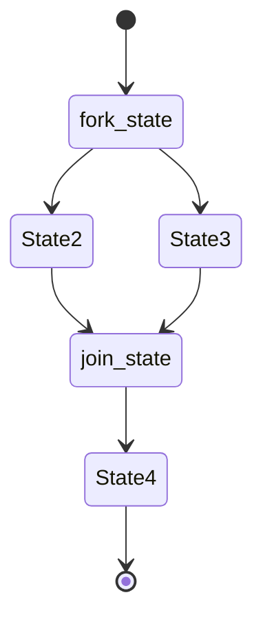

## 4.7 标记-注释


在这里，您可以选择将注释放在节点的右侧或左侧。

- 代码

```
stateDiagram-v2
    State1: The state with a note
    note right of State1
        Important information! You can write
        notes.
    end note
    State1 --> State2
    note left of State2 : This is the note to the left.
```

- 展示图

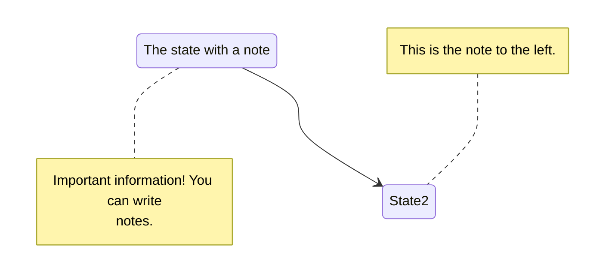

## 4.8 并发性

与plantUml一样，您可以使用——符号指定并发性。

- 代码

```
stateDiagram-v2
    [*] --> Active

    state Active {
        [*] --> NumLockOff
        NumLockOff --> NumLockOn : EvNumLockPressed
        NumLockOn --> NumLockOff : EvNumLockPressed
        --
        [*] --> CapsLockOff
        CapsLockOff --> CapsLockOn : EvCapsLockPressed
        CapsLockOn --> CapsLockOff : EvCapsLockPressed
        --
        [*] --> ScrollLockOff
        ScrollLockOff --> ScrollLockOn : EvScrollLockPressed
        ScrollLockOn --> ScrollLockOff : EvScrollLockPressed
    }
```

- 展示图

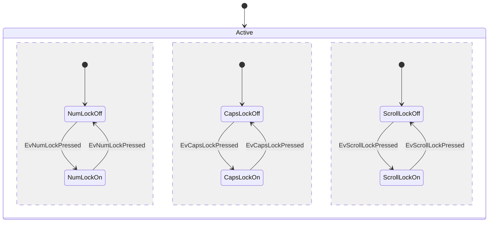

## 4.9 设置图表的方向

对于状态图，您可以使用方向语句来设置图将呈现的方向，就像这个例子一样。

- 代码

```
stateDiagram
    direction LR
    [*] --> A
    A --> B
    B --> C
    state B {
      direction LR
      a --> b
    }
    B --> D
```

- 展示图

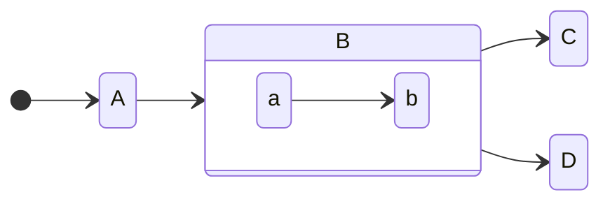

## 4.10 注释

可以在状态图中输入注释，解析器将忽略这些注释。注释需要在单独的行上，并且必须以 `%%` （双百分号）作为前缀。在注释开始到下一个换行符之后的任何文本都将被视为注释，包括任何图表语法

- 代码

```
stateDiagram-v2
    [*] --> Still
    Still --> [*]
%% this is a comment
    Still --> Moving
    Moving --> Still %% another comment
    Moving --> Crash
    Crash --> [*]
```

- 展示图


## 4.11 使用classdef进行样式化


### 4.11.1 基础应用

与其他图（如流程图）一样，您可以在图本身中定义样式，并将该命名样式应用于图中的一个或多个状态。

**这些是当前状态图classdef的限制：**

1.  不能应用于开始或结束状态
2.  不能应用于复合状态或在复合状态内

_这些都在开发中，并将在未来的版本中提供。_

您使用 `classDef` 关键字定义样式，该关键字是“类定义”的缩写（其中“类”表示类似CSS类的东西），后跟样式的名称，然后是一个或多个属性值对。每个属性值对都是一个有效的CSS属性名，后面跟着一个冒号（ `:` ），然后是一个值。

下面是一个只有一个属性值对的classDef的例子：


```
classDef movement font-style:italic;
```

在

*   样式的名称为 `movement`
*   唯一的属性为 `font-style` ，其值为 `italic`

如果希望有多个属性值对，则在每个属性值对之间使用逗号（ `,` ）。

下面是一个包含三个属性-值对的例子：


```
classDef badBadEvent fill:#f00,color:white,font-weight:bold,stroke-width:2px,stroke:yellow
```

*   样式的名称为 `badBadEvent`
*   第一个属性为 `fill` ，其值为 `#f00`
*   第二个属性为 `color` ，其值为 `white`
*   第三个属性 `font-weight` ，其值 `bold`
*   第四个属性 `stroke-width` ，其值 `2px`
*   第五个属性 `stroke` ，其值 `yellow`

### 4.11.2 对状态应用classDef样式

有两种方法可以将 `classDef` 样式应用到状态：

-  使用 `class` 关键字将classDef样式应用于单个语句中的一个或多个状态，或者
-  使用 `:::` 操作符将classDef样式应用于一个状态，因为它正在转换语句中使用（例如，与另一个状态的箭头）


1. `class` 语句

`class` 语句告诉Mermaid将命名的classDef应用于一个或多个类。表格如下：

```
class [one or more state names, separated by commas] [name of a style defined with classDef]
```

下面是一个将 `badBadEvent` 样式应用到名为 `Crash` 的状态的示例：

```
class Crash badBadEvent
```

下面是将 `movement` 样式应用于 `Moving` 和 `Crash` 两个状态的示例：


```
class Moving, Crash movement
```

这里有一个图表显示了使用中的例子。注意， `Crash` 状态有两个classDef样式应用： `movement` 和 `badBadEvent`

- 代码

```
   stateDiagram
   direction TB

   accTitle: This is the accessible title
   accDescr: This is an accessible description

   classDef notMoving fill:white
   classDef movement font-style:italic
   classDef badBadEvent fill:#f00,color:white,font-weight:bold,stroke-width:2px,stroke:yellow

   [*]--> Still
   Still --> [*]
   Still --> Moving
   Moving --> Still
   Moving --> Crash
   Crash --> [*]

   class Still notMoving
   class Moving, Crash movement
   class Crash badBadEvent
   class end badBadEvent
```

- 展示图

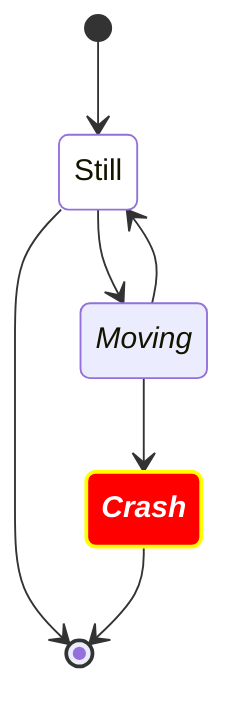

2. `:::` 操作符将样式应用于状态

您可以使用 `:::` （三冒号）操作符将classDef样式应用于状态。语法是

```
[state]:::[style name]
```

您可以在使用类的语句中的关系图中使用它。这包括开始状态和结束状态。例如:

- 代码

```
stateDiagram
   direction TB

   accTitle: This is the accessible title
   accDescr: This is an accessible description

   classDef notMoving fill:white
   classDef movement font-style:italic;
   classDef badBadEvent fill:#f00,color:white,font-weight:bold,stroke-width:2px,stroke:yellow

   [*] --> Still:::notMoving
   Still --> [*]
   Still --> Moving:::movement
   Moving --> Still
   Moving --> Crash:::movement
   Crash:::badBadEvent --> [*]
```

- 展示图


## 4.12 状态名中的空格

可以先用id定义状态，然后再引用id，从而在状态中添加空格。

在下面的示例中，有一个id为yswsii的状态和描述，其中包含空格。定义之后，在图中第一次转换（ `[*] --> yswsii` ）以及到YetAnotherState （ `yswsii --> YetAnotherState` ）的转换中使用yswsii。（瑞士的风格与其他州不同。）

- 代码

```
stateDiagram
    classDef yourState font-style:italic,font-weight:bold,fill:white

    yswsii: Your state with spaces in it
    [*] --> yswsii:::yourState
    [*] --> SomeOtherState
    SomeOtherState --> YetAnotherState
    yswsii --> YetAnotherState
    YetAnotherState --> [*]
```

- 展示图

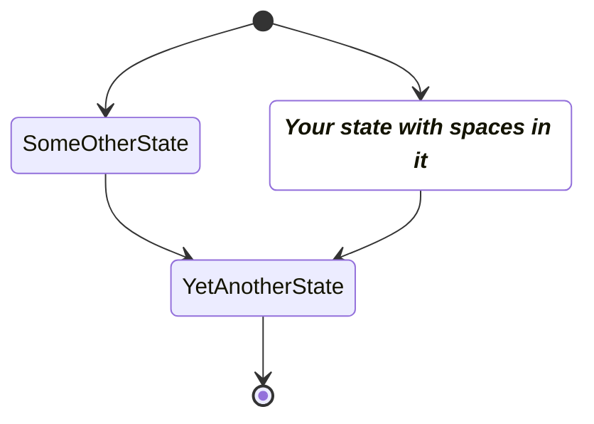