# 五、实体关系图

## 5.1 介绍

> 实体-关系模型（或ER模型）描述特定知识领域中感兴趣的相互关联的事物。基本的ER模型由实体类型（对感兴趣的事物进行分类）组成，并指定实体（这些实体类型的实例）之间可以存在的关系。

请注意，ER建模的实践者几乎总是将实体类型简单地称为实体。例如， `CUSTOMER` 实体类型可以简单地称为 `CUSTOMER` 实体。这是非常常见的，不建议做任何其他事情，但从技术上讲，实体是实体类型的抽象实例，这就是ER图所显示的-抽象实例以及它们之间的关系。这就是为什么实体总是用单数名词命名。


- 代码

```
---
title: Order example
---
erDiagram
    CUSTOMER ||--o{ ORDER : places
    ORDER ||--|{ LINE-ITEM : contains
    CUSTOMER }|..|{ DELIVERY-ADDRESS : uses
```

- 展示图

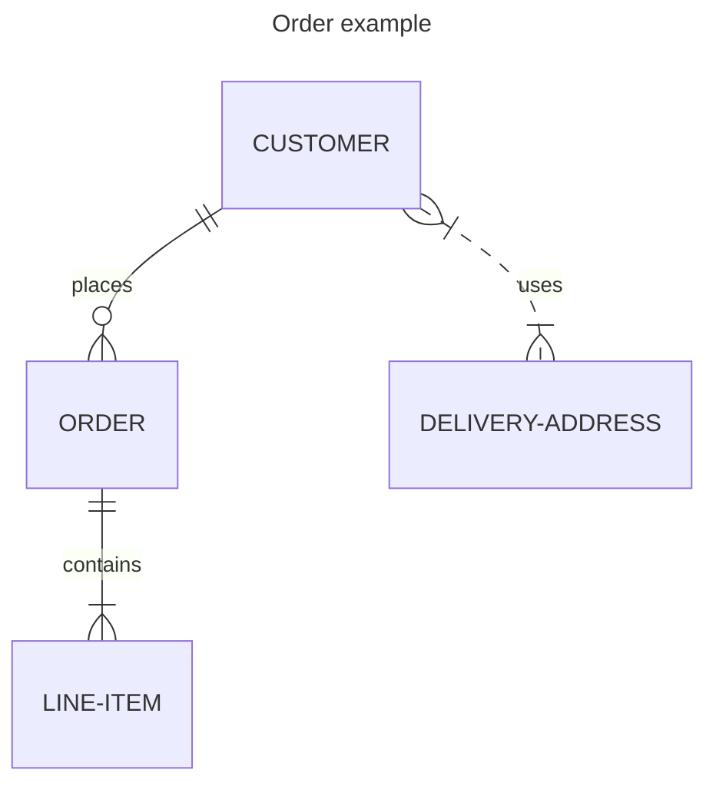


实体名称通常是大写的，尽管在这方面没有公认的标准，在Mermaid中也不是必需的。

实体之间的关系由线条表示，线条的结束标记表示基数。美人鱼使用最流行的鱼尾纹符号。鱼尾纹直观地传达了它所连接的实体的许多实例的可能性。

ER图可以用于各种目的，从缺乏任何实现细节的抽象逻辑模型，到关系数据库表的物理模型。在ER图中包含属性定义有助于理解实体的目的和含义，这是很有用的。这些并不一定需要详尽无遗；通常，一小部分属性就足够了。Mermaid允许根据它们的类型和名称定义它们。

- 代码

```
erDiagram
    CUSTOMER ||--o{ ORDER : places
    CUSTOMER {
        string name
        string custNumber
        string sector
    }
    ORDER ||--|{ LINE-ITEM : contains
    ORDER {
        int orderNumber
        string deliveryAddress
    }
    LINE-ITEM {
        string productCode
        int quantity
        float pricePerUnit
    }
```

- 展示图

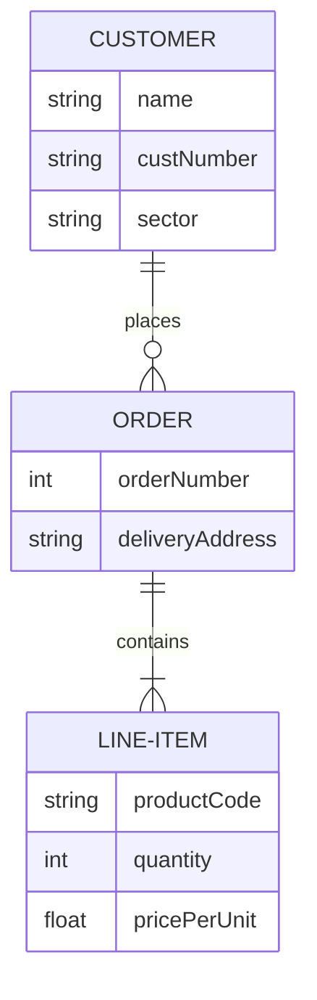


在ER图中包含属性时，必须决定是否将外键作为属性包含。这可能取决于您试图表示关系表结构的程度。如果您的图是一个逻辑模型，并不意味着隐含关系实现，那么最好省略这些，因为关联关系已经传达了实体关联的方式。例如，JSON数据结构可以使用数组实现一对多关系，而不需要外键属性。类似地，面向对象编程语言可以使用指针或对集合的引用。即使对于用于关系实现的模型，您也可能认为包含外键属性会重复关系已经描述的信息，并且不会为实体增加意义。最终，这是你的选择。


## 5.2 实体和关系

用于ER图的Mermaid语法与PlantUML兼容，并带有标记关系的扩展。每个语句由以下部分组成：

```
    <first-entity> [<relationship> <second-entity> : <relationship-label>]
```

地点:

*   `first-entity` 为实体名称。名称支持任何unicode字符，如果被双引号包围，可以包括空格(例如：“name with space”)。
*   `relationship` 描述了两个实体相互关联的方式。见下文。
*   `second-entity` 是另一个实体的名称。
*   `relationship-label` 从第一个实体的角度描述关系。

例如:

```
    PROPERTY ||--|{ ROOM : contains
```

这个语句可以被理解为一个属性包含一个或多个房间，一个房间是一个且只有一个属性的一部分。您可以看到这里的标签是从第一个实体的角度来看的：属性包含房间，但房间不包含属性。当从第二个实体的角度考虑时，等效标签通常很容易推断出来。（一些ER图从两个透视图标记关系，但这里不支持，而且通常是多余的）。

语句中只有 `first-entity` 部分是必须的。这使得显示没有关系的实体成为可能，这在图的迭代构建过程中是有用的。如果指定了语句的任何其他部分，则所有部分都是强制性的。

## 5.3 文本格式化

### 5.3.1 Unicode文本

实体名称、关系和属性都支持unicode文本。

- 代码

```
erDiagram
    "This ❤ Unicode"
```

- 展示图

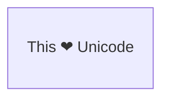


### 5.3.2 markdown格式化

还支持Markdown格式和文本。

- 代码

```
erDiagram
    "This **is** _Markdown_"
```

- 展示图


### 5.4 语法的关系

每条语句的 `relationship` 部分可以分解为三个子组件：

*   第一个实体相对于第二个实体的基数
*   关系是否赋予“子”实体身份
*   第二个实体相对于第一个实体的基数

基数是一种属性，它描述了另一个实体中有多少元素可以与所讨论的实体相关。在上面的例子中， `PROPERTY` 可以关联一个或多个 `ROOM` 实例，而 `ROOM` 只能关联一个 `PROPERTY` 。在每个基数标记中有两个字符。最外面的字符表示最大值，最里面的字符表示最小值。下表总结了可能的基数。

| 值(左) | 值(右) | 意义  |
| --- | --- | --- |
| `\|o` | `o\|` | 0或1 |
| `\|` | `\|` | 一个  |
| `}o` | `o{` | 零或更多（没有上限） |
| `}\|` | `\|{` | 一个或多个（没有上限） |

**别名**

| Value (left) | Value (right) | 别名    |
|--------------|---------------|--------------|
| one or zero  | one or zero   | Zero or one  |
| zero or one  | zero or one   | Zero or one  |
| one or more  | one or more   | One or more  |
| one or many  | one or many   | One or more  |
| many(1)      | many(1)       | One or more  |
| 1+           | 1+            | One or more  |
| zero or more | zero or more  | Zero or more |
| zero or many | zero or many  | Zero or more |
| many(0)      | many(0)       | Zero or more |
| 0+           | 0+            | Zero or more |
| only one     | only one      | Exactly one  |
| 1            | 1             | Exactly one  |


## 5.5 序列化

关系可以被分类为标识或非标识，它们分别用实线或虚线表示。当问题中的一个实体不能独立存在而没有另一个实体时，这是相关的。例如，一家为人们驾驶汽车提供保险的公司可能需要将数据存储在 CAR 可以由许多 `PERSON` 实例驱动，而 `PERSON` 可以驱动许多 `CAR`  -两个实体可以独立存在，因此这是一个非识别关系，我们可以在Mermaid中指定为： `PERSON }|..|{ CAR : "driver"` 。请注意，关系中间的两个点将导致在两个实体之间绘制虚线。但是，当这种多对多关系被分解成两个一对多关系时，我们观察到，如果没有 `PERSON` 和 `CAR` ，则 `NAMED-DRIVER` 就不可能存在——这些关系变得具有识别性，并且将使用连字符来指定，它转换为实线：

| Value | 别名  |
| --- | --- |
| \-- | _identifying_ |
| ..  | _non-identifying_ |

**别名**

| Value | 别名  |
| --- | --- |
| to  | _identifying_ |
| optionally to | _non-identifying_ |

- 代码

```
erDiagram
    CAR ||--o{ NAMED-DRIVER : allows
    PERSON }o..o{ NAMED-DRIVER : is
```

- 展示图

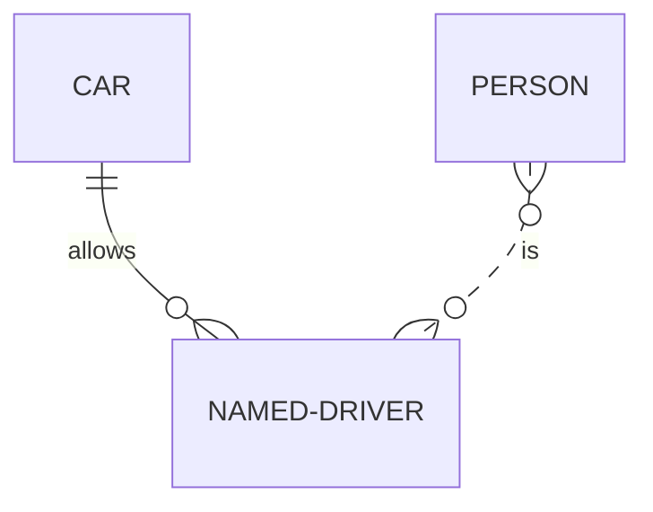


- 代码

```
erDiagram
    CAR 1 to zero or more NAMED-DRIVER : allows
    PERSON many(0) optionally to 0+ NAMED-DRIVER : is
```

- 展示图


## 5.6 实体属性

实体定义属性的方法是：指定实体名，后跟一个包含多个 `type name` 对的块，其中一个块由开头 `{` 和结束 `}` 分隔。属性在实体框内呈现。例如:

- 代码

```
erDiagram
    CAR ||--o{ NAMED-DRIVER : allows
    CAR {
        string registrationNumber
        string make
        string model
    }
    PERSON ||--o{ NAMED-DRIVER : is
    PERSON {
        string firstName
        string lastName
        int age
    }
```

- 展示图

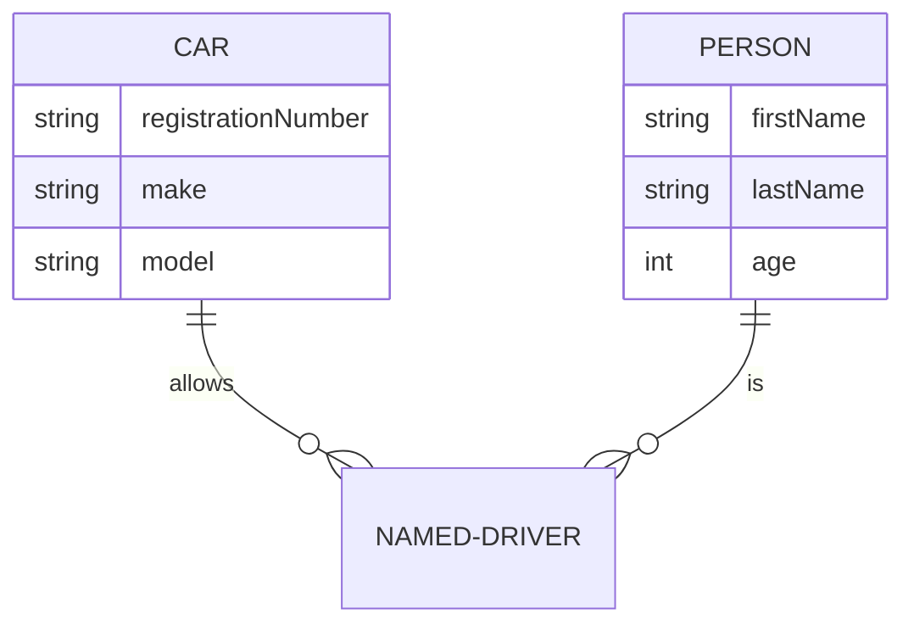


 `type` 必须以字母开头，可以包含数字、连字符、下划线、圆括号和方括号。 `name` 值遵循与 `type` 类似的格式，但可以以星号开头，作为另一个选项，表明属性是主键。除此之外，没有任何限制，也没有隐含的有效数据类型集。

## 5.7 实体名称别名

可以使用方括号将别名添加到实体中。如果提供了别名，将在图中显示，而不是实体名称。别名遵循与实体名称相同的所有规则。

- 代码

```
erDiagram
    p[Person] {
        string firstName
        string lastName
    }
    a["Customer Account"] {
        string email
    }
    p ||--o| a : has
```

- 展示图

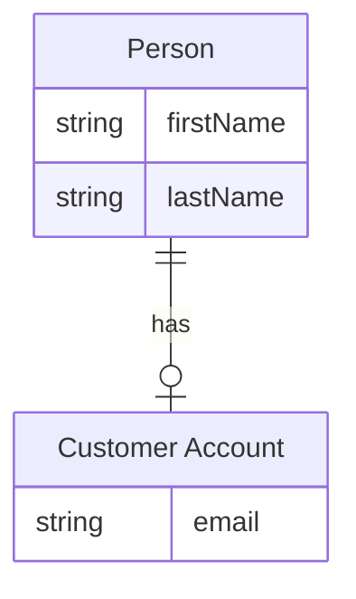


## 5.8 属性键和注释

属性也可以有 `key` 或注释定义。对于主键、外键或唯一键，键可以是 `PK` ,  `FK` 或 `UK` （键不支持标记格式和unicode）。要在单个属性上指定多个键约束，用逗号分隔它们（例如， `PK, FK` ）。A  `comment` 由属性末尾的双引号定义。注释本身不能包含双引号字符。

- 代码

```
erDiagram
    CAR ||--o{ NAMED-DRIVER : allows
    CAR {
        string registrationNumber PK
        string make
        string model
        string[] parts
    }
    PERSON ||--o{ NAMED-DRIVER : is
    PERSON {
        string driversLicense PK "The license #"
        string(99) firstName "Only 99 characters are allowed"
        string lastName
        string phone UK
        int age
    }
    NAMED-DRIVER {
        string carRegistrationNumber PK, FK
        string driverLicence PK, FK
    }
    MANUFACTURER only one to zero or more CAR : makes
```

- 展示图

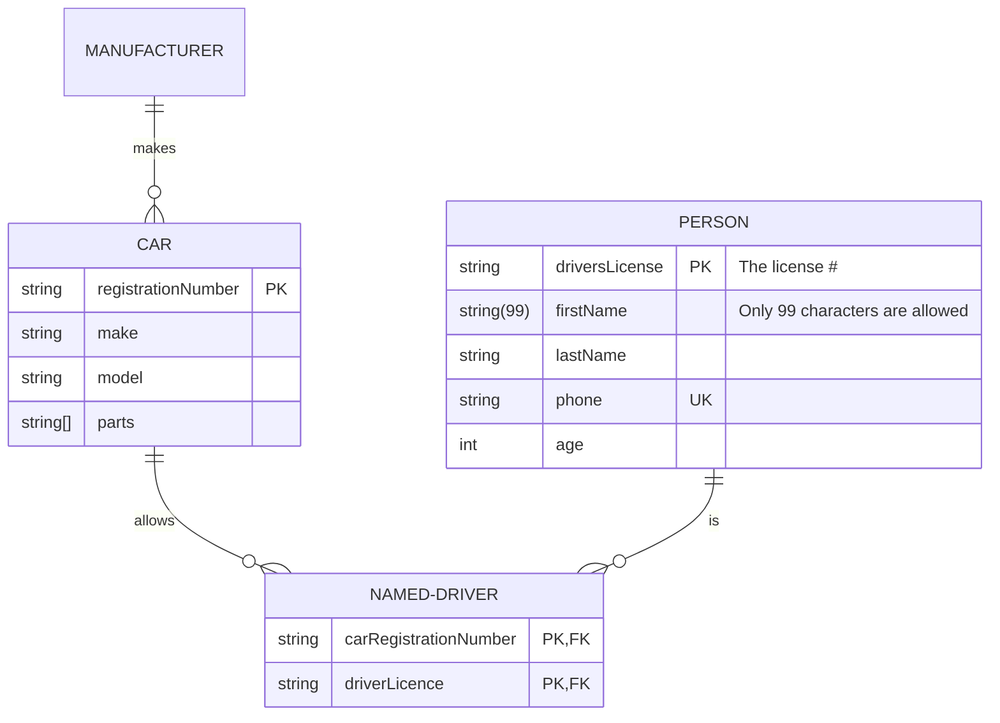


## 5.9 方向

direction语句声明了图的方向。

这声明了图是从上到下的（ `TB` ）。这可以反过来从下到上（ `BT` ）。

- 代码

```
erDiagram
    direction TB
    CUSTOMER ||--o{ ORDER : places
    CUSTOMER {
        string name
        string custNumber
        string sector
    }
    ORDER ||--|{ LINE-ITEM : contains
    ORDER {
        int orderNumber
        string deliveryAddress
    }
    LINE-ITEM {
        string productCode
        int quantity
        float pricePerUnit
    }
```

- 展示图


这声明了图是从左到右的（ `LR` ）。这可以反过来从右到左（ `RL` ）。

- 代码

```
erDiagram
    direction LR
    CUSTOMER ||--o{ ORDER : places
    CUSTOMER {
        string name
        string custNumber
        string sector
    }
    ORDER ||--|{ LINE-ITEM : contains
    ORDER {
        int orderNumber
        string deliveryAddress
    }
    LINE-ITEM {
        string productCode
        int quantity
        float pricePerUnit
    }
```

- 展示图

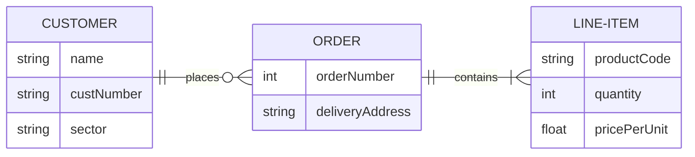


可能的图表方向有：

*   TB -从上到下
*   从下到上
*   RL -从右到左
*   LR -从左到右

## 5.10 样式


### 5.10.1 样式直接定义

可以对节点应用特定的样式，例如更厚的边框或不同的背景颜色。

- 代码

```
erDiagram
    id1||--||id2 : label
    style id1 fill:#f9f,stroke:#333,stroke-width:4px
    style id2 fill:#bbf,stroke:#f66,stroke-width:2px,color:#fff,stroke-dasharray: 5 5
```

- 展示图

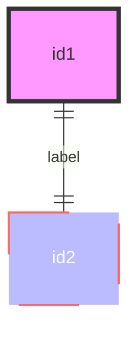


### 5.10.2 样式-类

比每次定义样式更方便的方法是定义一个样式类，并将该类附加到应该具有不同外观的节点上。

类定义看起来像下面的例子：

```
    classDef className fill:#f9f,stroke:#333,stroke-width:4px
```

也可以在一个语句中定义多个类：

```
    classDef firstClassName,secondClassName font-size:12pt
```

将类附加到节点的操作如下：

```
    class nodeId1 className
```

也可以在一条语句中将一个类附加到节点列表：

```
    class nodeId1,nodeId2 className
```

也可以同时附加多个类：

```
    class nodeId1,nodeId2 className1,className2
```

添加类的较短形式是使用 `:::` 操作符将类名附加到节点上，如下所示：

- 代码

```
erDiagram
    direction TB
    CAR:::someclass {
        string registrationNumber
        string make
        string model
    }
    PERSON:::someclass {
        string firstName
        string lastName
        int age
    }
    HOUSE:::someclass

    classDef someclass fill:#f96
```

- 展示图

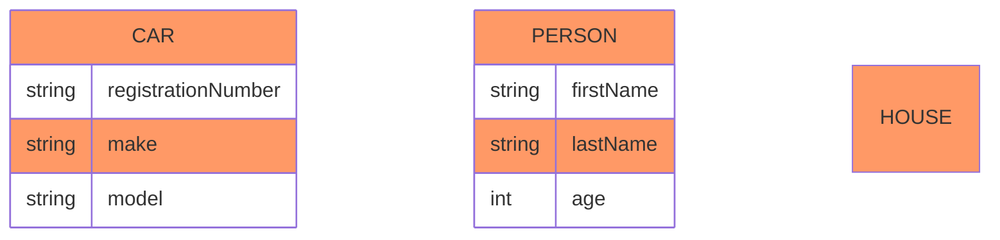


这种形式可以在声明实体之间的关系时使用：

- 代码

```
erDiagram
    CAR {
        string registrationNumber
        string make
        string model
    }
    PERSON {
        string firstName
        string lastName
        int age
    }
    PERSON:::foo ||--|| CAR : owns
    PERSON o{--|| HOUSE:::bar : has

    classDef foo stroke:#f00
    classDef bar stroke:#0f0
    classDef foobar stroke:#00f
```

- 展示图

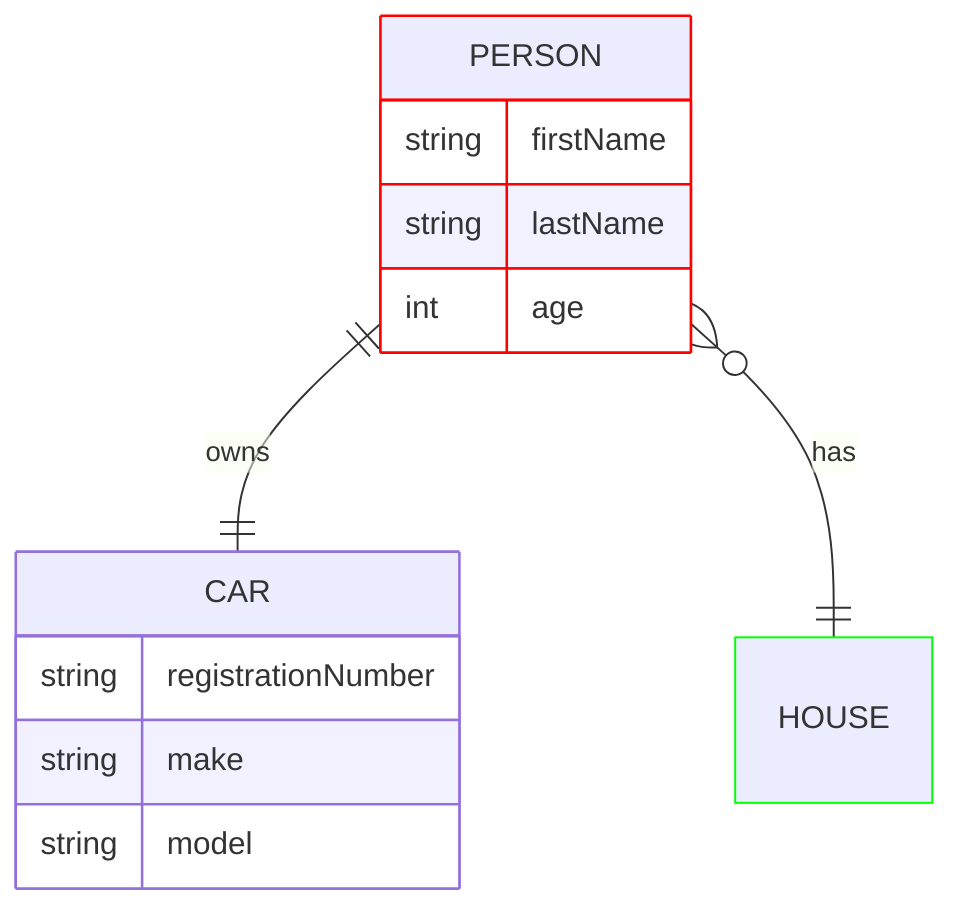


与class语句类似，简写语法也可以一次应用多个类：

```plain
    nodeId:::className1,className2
```

### 5.10.3 默认的类(样式)

如果一个类被命名为default，它将被分配给所有的类，而不需要特定的类定义。

```
    classDef default fill:#f9f,stroke:#333,stroke-width:4px;
```

> 注意：来自style或其他类语句的自定义样式具有优先级，并将覆盖默认样式。（例如， `default` 类为节点提供粉红色的背景色，但 `blue` 类将为该节点提供蓝色的背景色。）

- 代码

```
erDiagram
    CAR {
        string registrationNumber
        string make
        string model
    }
    PERSON {
        string firstName
        string lastName
        int age
    }
    PERSON:::foo ||--|| CAR : owns
    PERSON o{--|| HOUSE:::bar : has

    classDef default fill:#f9f,stroke-width:4px
    classDef foo stroke:#f00
    classDef bar stroke:#0f0
    classDef foobar stroke:#00f
```

- 展示图

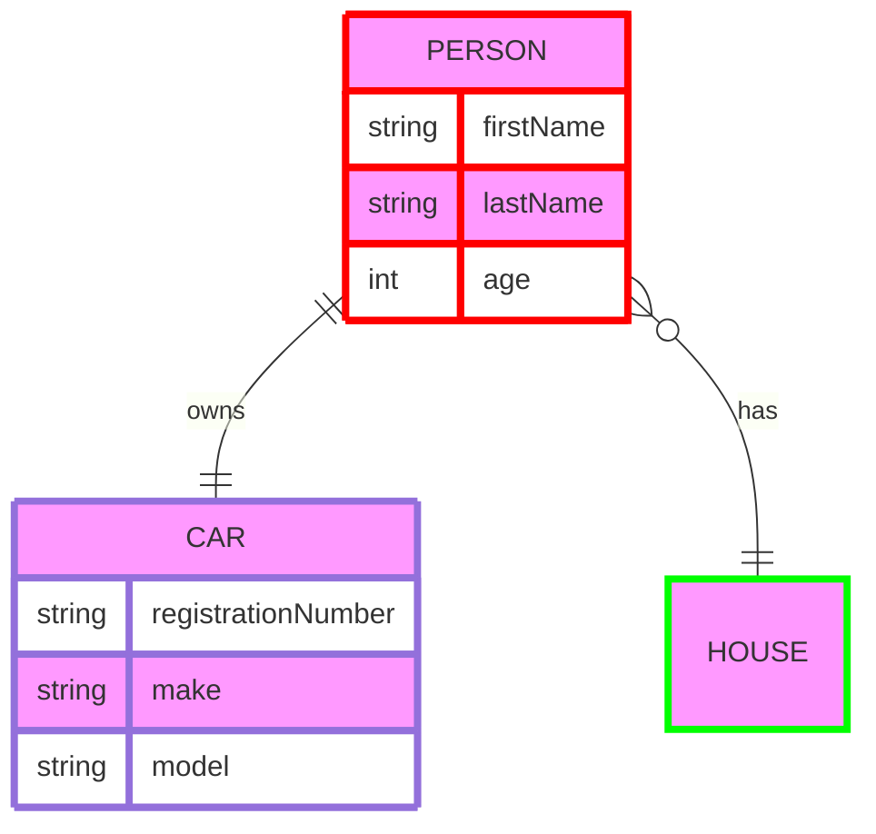


## 5.11 配置

### 5.11.1 渲染器

图的布局是用渲染器完成的。默认的渲染器是dagre。

您可以通过编辑配置来选择使用名为elk的替代渲染器。elk渲染器更适合大型和/或更复杂的图表。

```
---
    config:
        layout: elk
---
```