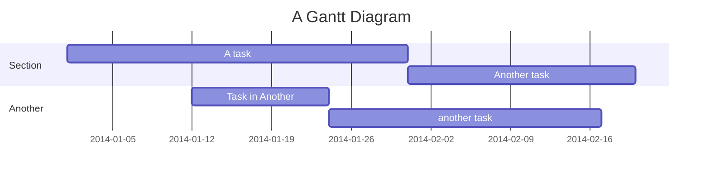
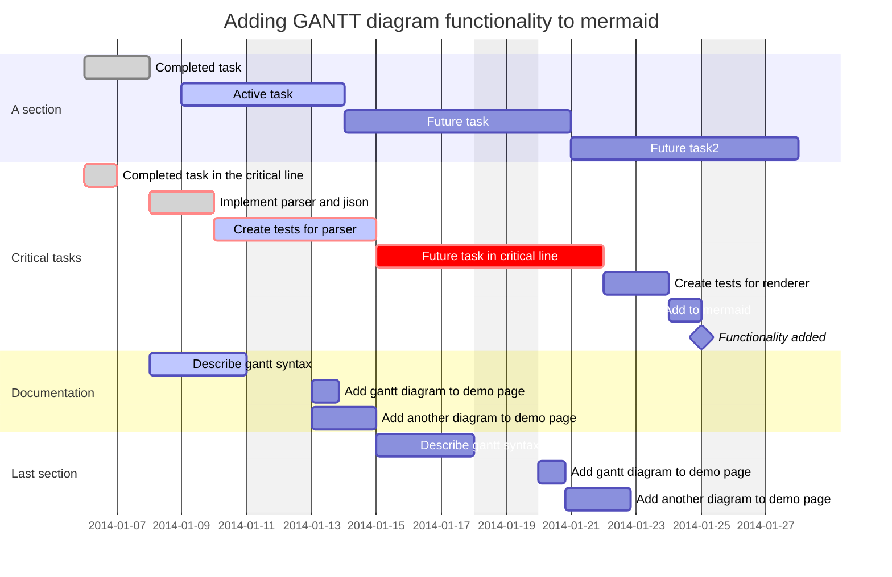
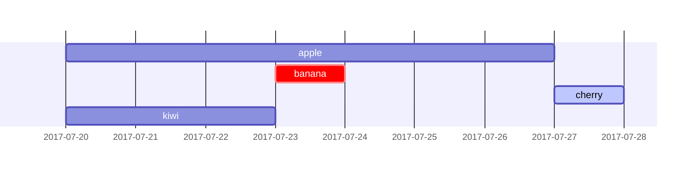
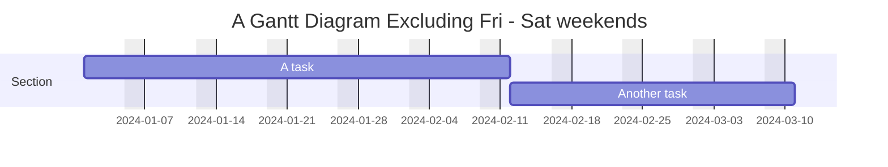
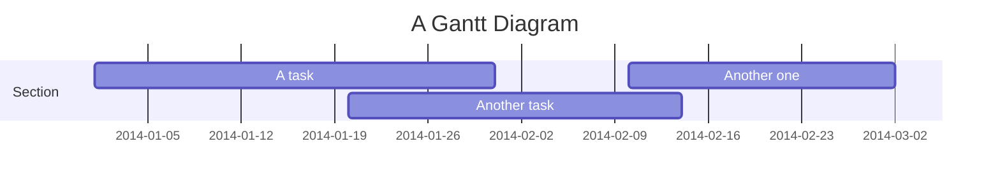

```mermaid
gantt
    title Git Issues - days since last update
    dateFormat X
    axisFormat %s
    section Issue19062
    71   : 0, 71
    section Issue19401
    36   : 0, 36
    section Issue193
    34   : 0, 34
    section Issue7441
    9    : 0, 9
    section Issue1300
    5    : 0, 5
```

# 六、甘特图

> 甘特图是一种柱状图，最早由卡罗尔·阿达米埃茨基在1896年提出，亨利·甘特在20世纪10年代独立提出，它说明了项目进度和任何一个项目完成所需的时间。甘特图说明了项目的终端元素和总结元素的开始和结束日期之间的天数。

## 6.1 甘特图基础

甘特图将每个计划任务记录为一个从左向右延伸的连续条形图。x轴表示时间，y轴记录不同的任务以及完成任务的顺序。

重要的是要记住，当特定于任务的日期，日期或日期集合被“排除”时，甘特图将通过向右扩展相等的天数来适应这些更改，而不是通过在任务内部创建间隙。如下所示

但是，如果排除的日期位于设置为连续开始的两个任务之间，则将以图形方式跳过排除的日期并留空，并且以下任务将在排除的日期结束后开始。如下所示

甘特图用于跟踪项目完成前所需的时间量，但它也可以用于图形化地表示“非工作日”，只需进行一些调整。

Mermaid可以将甘特图渲染为SVG、PNG或可以粘贴到文档中的MarkDown链接。

- 代码

```
gantt
    title A Gantt Diagram
    dateFormat YYYY-MM-DD
    section Section
        A task          :a1, 2014-01-01, 30d
        Another task    :after a1, 20d
    section Another
        Task in Another :2014-01-12, 12d
        another task    :24d
```

- 展示图




## 6.2 语法


### 6.2.1 基础使用

- 代码

```
gantt
    dateFormat  YYYY-MM-DD
    title       Adding GANTT diagram functionality to mermaid
    excludes    weekends
    %% (`excludes` accepts specific dates in YYYY-MM-DD format, days of the week ("sunday") or "weekends", but not the word "weekdays".)

    section A section
    Completed task            :done,    des1, 2014-01-06,2014-01-08
    Active task               :active,  des2, 2014-01-09, 3d
    Future task               :         des3, after des2, 5d
    Future task2              :         des4, after des3, 5d

    section Critical tasks
    Completed task in the critical line :crit, done, 2014-01-06,24h
    Implement parser and jison          :crit, done, after des1, 2d
    Create tests for parser             :crit, active, 3d
    Future task in critical line        :crit, 5d
    Create tests for renderer           :2d
    Add to mermaid                      :until isadded
    Functionality added                 :milestone, isadded, 2014-01-25, 0d

    section Documentation
    Describe gantt syntax               :active, a1, after des1, 3d
    Add gantt diagram to demo page      :after a1  , 20h
    Add another diagram to demo page    :doc1, after a1  , 48h

    section Last section
    Describe gantt syntax               :after doc1, 3d
    Add gantt diagram to demo page      :20h
    Add another diagram to demo page    :48h
```

- 展示图




任务默认是顺序的。任务开始日期默认为前一个任务的结束日期。

冒号 `:` 将任务标题与其元数据分开。元数据项之间用逗号分隔， `,` 。有效的标记是 `active` ,  `done` ,  `crit` ,和 `milestone` 。标记是可选的，但如果使用，必须首先指定它们。处理完标签后，剩下的元数据项解释如下：

1.  如果指定了单个项，则确定任务何时结束。它可以是特定的日期/时间，也可以是持续时间。如果指定了持续时间，则会将其添加到任务的开始日期中，以确定任务的结束日期，并考虑任何排除情况。
2.  如果指定了两项，则最后一项被解释为前一项。第一项可以指定显式的开始日期/时间（以 `dateFormat` 指定的格式），也可以使用 `after <otherTaskID> [[otherTaskID2 [otherTaskID3]]...]` 引用另一个任务。在后一种情况下，任务的开始日期将根据任何引用任务的最近结束日期设置。
3.  如果指定了三个项目，最后两个将被解释为前面的情况。第一项将表示任务的ID，可以使用 `later <taskID>` 语法引用它。

| Metadata syntax | 开始日期 | 结束日期 | ID  |
| --- | --- | --- | --- |
| `<taskID>, <startDate>, <endDate>` | `startdate` 使用 `dateformat` 进行解释 | `endDate` 使用 `dateformat` 进行解释 | `taskID` |
| `<taskID>, <startDate>, <length>` | `startdate` 使用 `dateformat` 进行解释 | 起始日期 `length` | `taskID` |
| `<taskID>, after <otherTaskId>, <endDate>` | 先前指定的任务的结束日期 `otherTaskID` | `endDate` 使用 `dateformat` 进行解释 | `taskID` |
| `<taskID>, after <otherTaskId>, <length>` | 先前指定的任务的结束日期 `otherTaskID` | 起始日期 `length` | `taskID` |
| `<taskID>, <startDate>, until <otherTaskId>` | `startdate` 使用 `dateformat` 进行解释 | 先前指定的任务的开始日期 `otherTaskID` | `taskID` |
| `<taskID>, after <otherTaskId>, until <otherTaskId>` | 先前指定的任务的结束日期 `otherTaskID` | 先前指定的任务的开始日期 `otherTaskID` | `taskID` |
| `<startDate>, <endDate>` | `startdate` 使用 `dateformat` 进行解释 | `enddate` 使用 `dateformat` 进行解释 | N/A |
| `<startDate>, <length>` | `startdate` 使用 `dateformat` 进行解释 | 起始日期 `length` | N/A |
| `after <otherTaskID>, <endDate>` | 先前指定的任务的结束日期 `otherTaskID` | `enddate` 使用 `dateformat` 进行解释 | N/A |
| `after <otherTaskID>, <length>` | 先前指定的任务的结束日期 `otherTaskID` | 起始日期 `length` | N/A |
| `<startDate>, until <otherTaskId>` | `startdate` 使用 `dateformat` 进行解释 | 先前指定的任务的开始日期 `otherTaskID` | N/A |
| `after <otherTaskId>, until <otherTaskId>` | 先前指定的任务的结束日期 `otherTaskID` | 先前指定的任务的开始日期 `otherTaskID` | N/A |
| `<endDate>` | 前一个任务的结束日期 | `enddate` 使用 `dateformat` 进行解释 | N/A |
| `<length>` | 前一个任务的结束日期 | 起始日期 `length` | N/A |
| `until <otherTaskId>` | 前一个任务的结束日期 | 先前指定的任务的开始日期 `otherTaskID` | N/A |


为简单起见，该表没有显示使用 `after` 关键字列出的多个任务。下面是一个如何使用它以及如何解释它的例子：

- 代码

```
gantt
    apple :a, 2017-07-20, 1w
    banana :crit, b, 2017-07-23, 1d
    cherry :active, c, after b a, 1d
    kiwi   :d, 2017-07-20, until b c
```

- 展示图



### 6.2.2  标题

 `title` 是一个可选字符串，将显示在甘特图的顶部，用于描述整个甘特图。

### 6.2.3 excludes（不包括）

 `excludes` 是一个可选属性，它接受YYYY-MM-DD格式的特定日期、星期几（“sunday“）或”weekends”，但不接受单词“weekdays”。这些日期将被标记在图表上，并被排除在任务持续时间的计算之外。这意味着，如果在任务间隔期间有被排除的日期，“跳过”的天数将被添加到任务的末尾，以确保持续时间与代码中指定的一致。

### 6.2.4 weekend 相关

当排除周末时，可以将周末配置为周五和周六或周六和周日。默认情况下，周末是周六和周日。要定义周末开始日期，有一个可选属性 `weekend` ，可以在新行中添加，后跟 `friday` 或 `saturday` 。

- 代码

```
gantt
    title A Gantt Diagram Excluding Fri - Sat weekends
    dateFormat YYYY-MM-DD
    excludes weekends
    weekend friday
    section Section
        A task          :a1, 2024-01-01, 30d
        Another task    :after a1, 20d
```

- 展示图




### 6.2.5 部分语句

您可以将图表划分为不同的部分，例如，将项目的不同部分（如开发和文档）分开。

为此，用 `section` 关键字开始一行，并给它起一个名字。(注意，与整个图表的标题不同，这个名称是必需的。

### 6.2.6 里程碑

您可以向图中添加里程碑。里程碑不同于任务，因为它们代表时间上的单个瞬间，并由关键字 `milestone` 标识。下面是一个如何使用里程碑的例子。正如您可能注意到的，里程碑的确切位置是由里程碑的初始日期和任务的“持续时间”确定的：初始日期持续时间/2。

- 代码

```
gantt
    dateFormat HH:mm
    axisFormat %H:%M
    Initial milestone : milestone, m1, 17:49, 2m
    Task A : 10m
    Task B : 5m
    Final milestone : milestone, m2, 18:08, 4m
```

- 展示图



```mermaid
gantt
    dateFormat HH:mm
    axisFormat %H:%M
    Initial milestone : milestone, m1, 17:49, 2m
    Task A : 10m
    Task B : 5m
    Final milestone : milestone, m2, 18:08, 4m
```

## 6.3 设置日期

`dateFormat` 定义了您的ant元素的日期输入格式。在呈现的图表输出中如何表示这些日期由 `axisFormat` 定义。

### 6.3.1 输入日期格式

默认输入日期格式为 `YYYY-MM-DD` 。您可以定义自定义 `dateFormat` 。


```
dateFormat YYYY-MM-DD
```

支持以下格式选项：

| 输入  | 例子  | 描述  |
| --- | --- | --- |
| `YYYY` | 2014 | 四位数年份 |
| `YY` | 14  | 二位数年份 |
| `Q` | 1..4 | 季度。将月份设置为季度的第一个月。 |
| `M MM` | 1..12 | 月数  |
| `MMM MMMM` | 12月1月. . | 区域设置中的月份名称 `dayjs.locale()` |
| `D DD` | 1..31 | 月中的一天 |
| `Do` | 1 . . 31日 | 带序数的月的第几天 |
| `DDD DDDD` | 1..365 | 一年中的一天 |
| `X` | 1410715640.579 | Unix时间戳 |
| `x` | 1410715640579 | Unix ms时间戳 |
| `H HH` | 0..23 | 24小时时间 |
| `h hh` | 1..12 | `a A` 时使用的12小时时间。 |
| `a A` | 我点  | Post or ante meridiem |
| `m mm` | 0..59 | 分钟  |
| `s ss` | 0..59 | 秒   |
| `S` | 0..9 | 十分之一秒 |
| `SS` | 0..99 | 每秒数百次 |
| `SSS` | 0..999 | 千分之一秒 |
| `Z ZZ` | 12:00 | 与UTC的偏移量为-HH:mm， - hmm或Z |

更多信息请访问：`https://day.js.org/docs/en/parse/string-format/`

### 6.3.2 轴上的输出日期格式

默认输出日期格式为 `YYYY-MM-DD` 。您可以定义自定义 `axisFormat` ，例如 `2020-Q1` ，用于2020年第一季度。

```
axisFormat %Y-%m-%d
```

支持以下格式字符串：

| 格式  | 定义  |
| --- | --- |
| %的  | 工作日缩写名 |
| %的  | 工作日全称 |
| %b  | 缩写月名 |
| %B  | 月名  |
| %c  | 日期和时间，用`%a %b %e %H:%M:%S %Y`表示。 |
| %d  | 以十进制数形式填充的月份中的第几天`[01,31]` |
| %e  | 用十进制数`[1,31]`填充月份的第几天；相当于`%_d` |
| %H  | 小时（24小时制）作为十进制数`[00,23]` |
| %我  | 小时（12小时制）作为十进制数`[01,12]` |
| %j  | 以十进制表示的一年中的第几天`[001366]` |
| %m  | 月作为十进制数`[01,12]` |
| %M  | 分十进制数`[00,59]` |
| %L  | 毫秒为十进制数`[000,999]` |
| %p  | 上午或下午 |
| %S  | 秒作为十进制数`[00,61]` |
| %U  | 一年中的星期数（星期日为一周的第一天）`[00,53]` |
| %w  | 工作日的十进制数`[0（星期日），6]` |
| %W  | 一年中的星期数（星期一为一周的第一天）`[00,53]` |
| %x  | 日期，如`%m/%d/%Y` |
| %X  | 时间，如`%H:%M:%S` |
| y % | 不以十进制表示世纪的年份`[00,99]` |
| Y % | 以世纪为十进制数的年份 |
| %Z  | 时区偏移量，如`-0700` |
| %%  | 文字`%`字符 |

更多信息请访问：`https://github.com/d3/d3-time-format/tree/v4.0.0#locale\_format`

### 6.3.3 轴刻度 

默认输出刻度是自动的。您可以自定义 `tickInterval` ，如 `1day` 或 `1week` 。

```
tickInterval 1day
```

模式是：


```javascript
/^([1-9][0-9]*)(millisecond|second|minute|hour|day|week|month)$/;
```

更多信息请访问：`https://github.com/d3/d3-time#interval\_every`

以周为单位 `tickInterval` 默认从周日开始一周。如果您希望指定 `tickInterval` 启动的另一个工作日，请使用 `weekday` 选项：

- 代码

```
gantt
  tickInterval 1week
  weekday monday
```

- 展示图

```mermaid
gantt
  tickInterval 1week
  weekday monday
```


## 6.4 紧凑模式输出

精简模式允许在同一行中显示多个任务。通过通过前面的YAML设置设置图形的显示模式，可以为甘特图启用紧凑模式。

- 代码

```
---
displayMode: compact
---
gantt
    title A Gantt Diagram
    dateFormat  YYYY-MM-DD

    section Section
    A task           :a1, 2014-01-01, 30d
    Another task     :a2, 2014-01-20, 25d
    Another one      :a3, 2014-02-10, 20d
```

- 展示图




## 6.5 注释

注释可以在甘特图中输入，解析器将忽略它。注释需要在单独的行上，并且必须以 `%%` （双百分号）作为前缀。在注释开始到下一个换行符之后的任何文本都将被视为注释，包括任何图表语法。

- 代码

```
gantt
    title A Gantt Diagram
    %% This is a comment
    dateFormat YYYY-MM-DD
    section Section
        A task          :a1, 2014-01-01, 30d
        Another task    :after a1, 20d
    section Another
        Task in Another :2014-01-12, 12d
        another task    :24d
```

- 展示图


## 6.6 样式

甘特图的样式化是通过定义一些CSS类来完成的。在渲染过程中，这些类是从位于src/diagrams/gantt/styles.js的文件中提取出来的

### 6.6.1 使用的类

| 类   | 描述  |
| --- | --- |
| grid.tick | 网格线的样式 |
| grid.path | 网格边框的样式 |
| .taskText | 任务文本样式 |
| .taskTextOutsideRight | 为超出活动栏右侧的任务文本设置样式。 |
| .taskTextOutsideLeft | 超出活动栏左侧的任务文本的样式化。 |
| todayMarker | “今日标记”的切换和样式 |

### 6.6.2 样本样式表

```css
.grid .tick {
  stroke: lightgrey;
  opacity: 0.3;
  shape-rendering: crispEdges;
}
.grid path {
  stroke-width: 0;
}

#tag {
  color: white;
  background: #fa283d;
  width: 150px;
  position: absolute;
  display: none;
  padding: 3px 6px;
  margin-left: -80px;
  font-size: 11px;
}

#tag:before {
  border: solid transparent;
  content: ' ';
  height: 0;
  left: 50%;
  margin-left: -5px;
  position: absolute;
  width: 0;
  border-width: 10px;
  border-bottom-color: #fa283d;
  top: -20px;
}
.taskText {
  fill: white;
  text-anchor: middle;
}
.taskTextOutsideRight {
  fill: black;
  text-anchor: start;
}
.taskTextOutsideLeft {
  fill: black;
  text-anchor: end;
}
```

## 6.7 今日标志

可以为当前日期设置样式或隐藏标记。要设置样式，请为 `todayMarker` 键添加一个值。

```
todayMarker stroke-width:5px,stroke:#0f0,opacity:0.5
```

要隐藏标记，将 `todayMarker` 设置为 `off` 。

```
todayMarker off
```

## 6.8 配置

### 6.8.1 修改配置

这是通过定义配置对象的 `ganttConfig` 部分来完成的。CLI的使用方法请参见mermaidCLI界面。

可以将ganttConfig设置为带有配置参数或相应对象的JSON字符串。


```javascript
mermaid.ganttConfig = {
  titleTopMargin: 25, // 图表上方文本的顶部边距
  barHeight: 20, // 图表中条形图的高度
  barGap: 4, // 甘特图中不同活动之间的间距
  topPadding: 75, // 标题与甘特图之间以及坐标轴与甘特图之间的边距
  rightPadding: 75, // 为活动右侧部分名称分配的空间
  leftPadding: 75, // 为活动左侧部分名称分配的空间
  gridLineStartPadding: 10, // 网格线的垂直起始位置
  fontSize: 12, // 字体大小
  sectionFontSize: 24, // 章节标题的字体大小
  numberSectionStyles: 1, // 交替章节样式的数量
  axisFormat: '%d/%m', // 坐标轴的日期/时间格式
  tickInterval: '1week', // 坐标轴刻度间隔
  topAxis: true, // 当此标志设置为true时，将在图表顶部添加日期标签
  displayMode: 'compact', // 开启紧凑模式
  weekday: 'sunday', // 基于周的间隔应从哪一天开始
};
```

### 6.8.2 可能的配置参数

| 停止  | 描述  | 默认值 |
| --- | --- | --- |
| mirrorActor | 打开/关闭角色在图表下方和上方的渲染 | false   |
| bottomMarginAdj | 调整图形结束的位置。css的宽边框样式可能会产生不必要的剪切，这就是为什么这个配置参数存在的原因。 | 1   |

## 6.9 交互


### 6.9.1 交互属性

可以将单击事件绑定到任务。点击可以导致javascript回调或将在当前浏览器选项卡中打开的链接。注意：当使用 `securityLevel='strict'` 时禁用此功能，当使用 `securityLevel='loose'` 时启用此功能。

```
click taskId call callback(arguments)
click taskId href URL
```

*   taskId是任务的id
*   callback是在显示图形的页面上定义的javascript函数的名称，如果没有指定其他参数，则将使用taskId作为参数调用该函数。


### 6.9.2 html中的交互

初学者提示——在html上下文中使用交互式链接的完整示例：


```html
<body>
  <pre class="mermaid">
    gantt
      dateFormat  YYYY-MM-DD

      section Clickable
      Visit mermaidjs         :active, cl1, 2014-01-07, 3d
      Print arguments         :cl2, after cl1, 3d
      Print task              :cl3, after cl2, 3d

      click cl1 href "https://mermaidjs.github.io/"
      click cl2 call printArguments("test1", "test2", test3)
      click cl3 call printTask()
  </pre>

  <script>
    const printArguments = function (arg1, arg2, arg3) {
      alert('printArguments called with arguments: ' + arg1 + ', ' + arg2 + ', ' + arg3);
    };
    const printTask = function (taskId) {
      alert('taskId: ' + taskId);
    };
    const config = {
      startOnLoad: true,
      securityLevel: 'loose',
    };
    mermaid.initialize(config);
  </script>
</body>
```

## 6.10 例子

### 6.10.1 条形图（使用甘特图）

- 代码

```
gantt
    title Git Issues - days since last update
    dateFormat X
    axisFormat %s
    section Issue19062
    71   : 0, 71
    section Issue19401
    36   : 0, 36
    section Issue193
    34   : 0, 34
    section Issue7441
    9    : 0, 9
    section Issue1300
    5    : 0, 5
```

- 展示图

