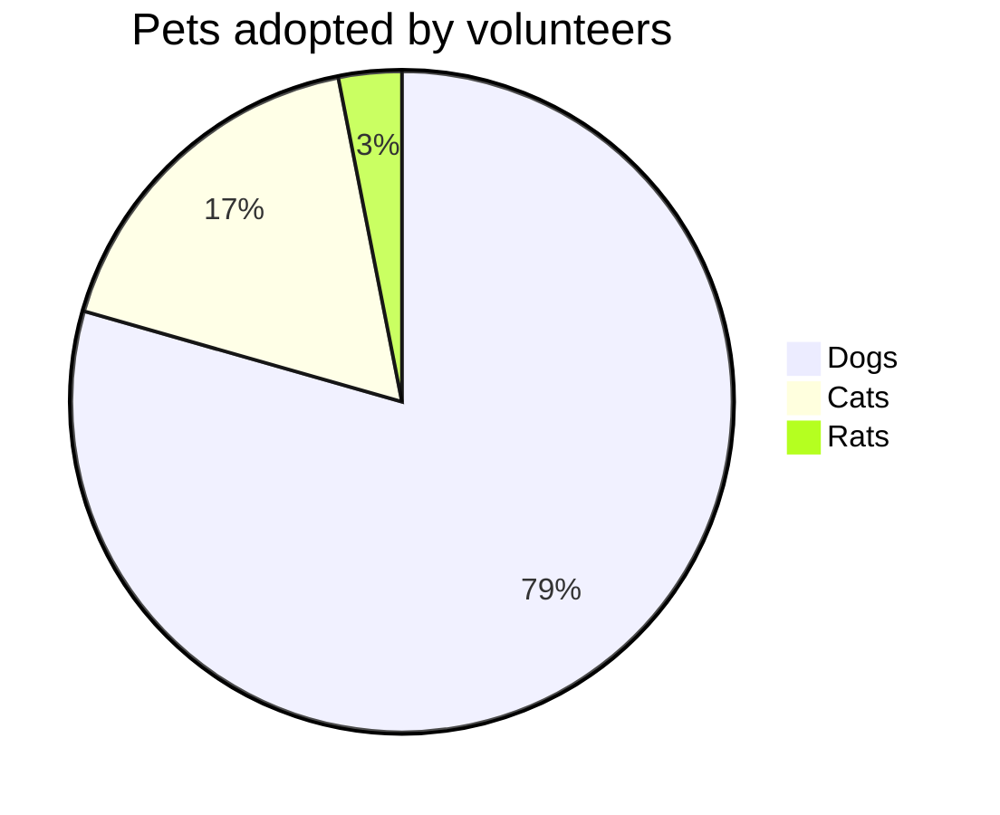
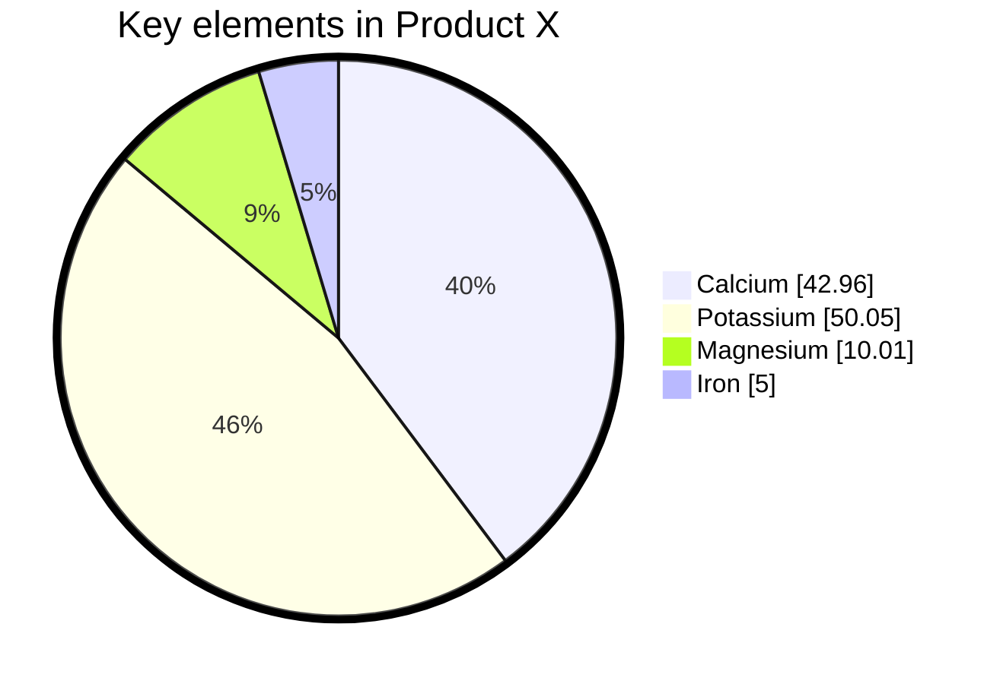

# 七、饼状图


> 饼图（或圆形图）是一种圆形的统计图形，它被分成几片来说明数字比例。在饼状图中，每个切片的弧长（以及它的圆心角和面积）与它所代表的数量成正比。虽然它的名字是因为它看起来像一个被切成薄片的馅饼，但它的呈现方式也有不同。

## 7.1 饼图基础使用

- 代码

```
pie title Pets adopted by volunteers
    "Dogs" : 386
    "Cats" : 85
    "Rats" : 15
```

- 展示图



## 7.2 语法


*   以 `pie` 关键字开始图
*   然后是 `title` 关键字及其字符串形式的值，以给出饼图的标题。这是可选的
*   然后是dataSet。饼切片将按照与标签相同的顺时针顺序排列。


## 7.3 例子

- 代码

```
%%{init: {"pie": {"textPosition": 0.5}, "themeVariables": {"pieOuterStrokeWidth": "5px"}} }%%
pie showData
    title Key elements in Product X
    "Calcium" : 42.96
    "Potassium" : 50.05
    "Magnesium" : 10.01
    "Iron" :  5
```

- 展示图



## 7.4 配置

可能的饼图配置参数：

| 参数  | 描述  | 默认值 |
| --- | --- | --- |
| `textPosition` | 饼图切片标签的轴向位置，从中心的0.0到圆外缘的1.0。 | `0.75` |