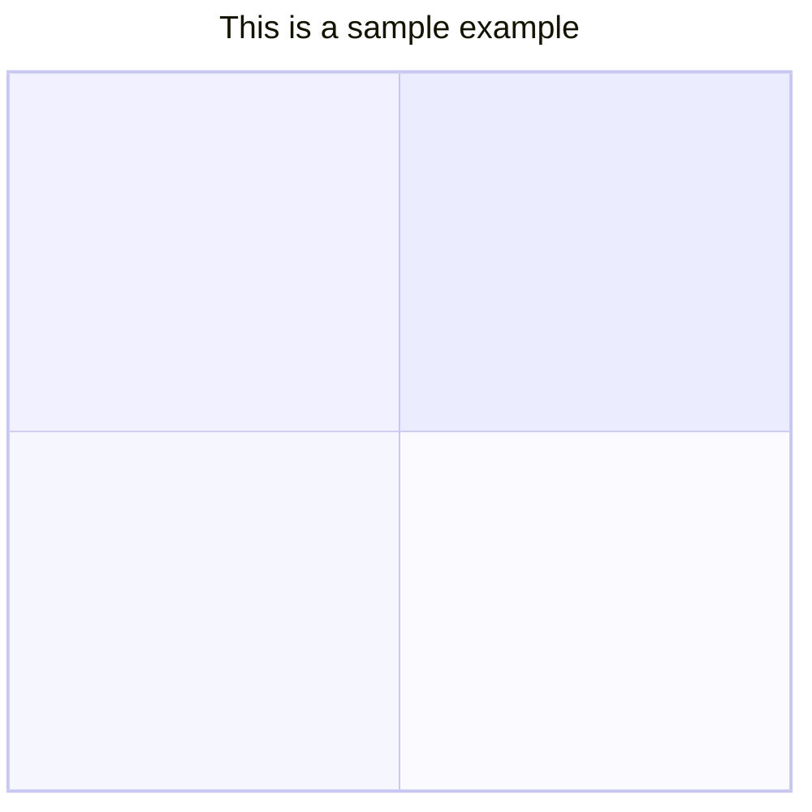
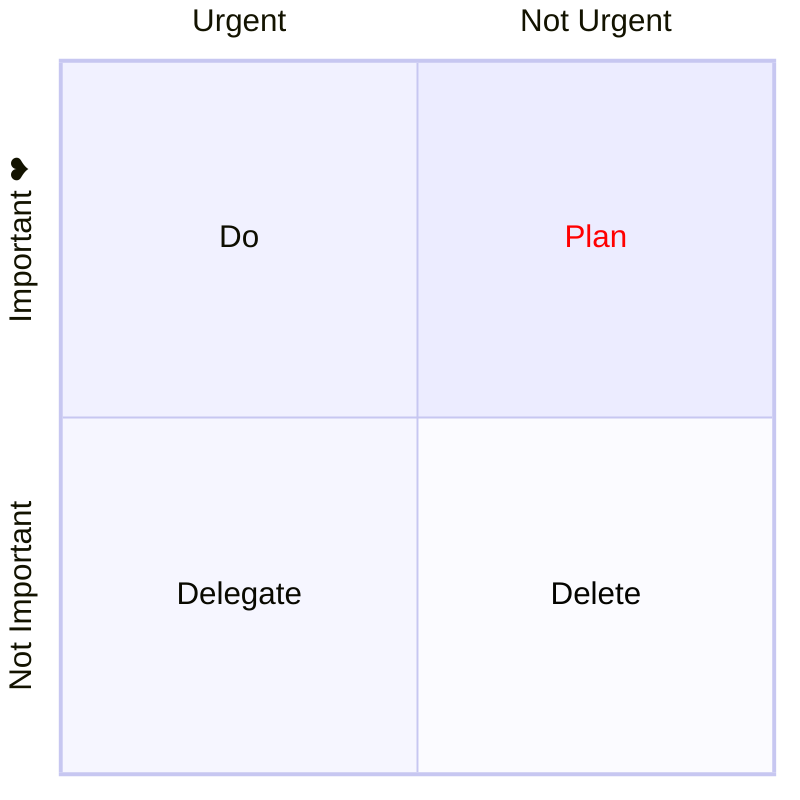
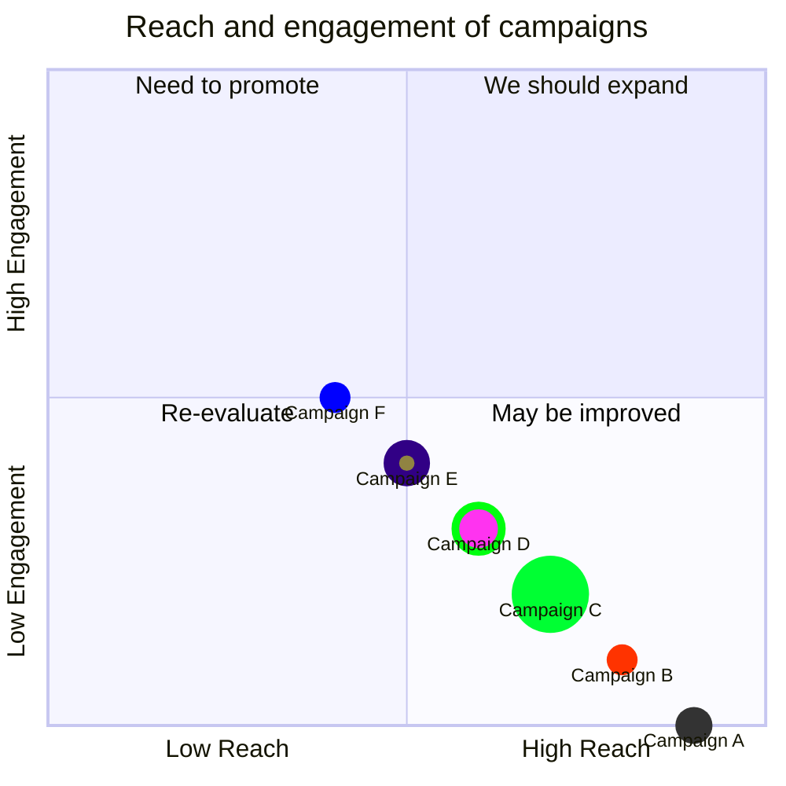

# 八、象限图

> 象限图是将数据分为四个象限的可视化表示。它用于在二维网格上绘制数据点，其中一个变量表示在x轴上，另一个变量表示在y轴上。象限是根据一组特定于所分析数据的标准，将图表分成四个相等的部分来确定的。象限图通常用于识别数据中的模式和趋势，并根据图表中数据点的位置确定行动的优先级。它们通常用于商业、市场营销和风险管理等领域。

## 8.1 象限图基础使用

- 代码

```
quadrantChart
    title Reach and engagement of campaigns
    x-axis Low Reach --> High Reach
    y-axis Low Engagement --> High Engagement
    quadrant-1 We should expand
    quadrant-2 Need to promote
    quadrant-3 Re-evaluate
    quadrant-4 May be improved
    Campaign A: [0.3, 0.6]
    Campaign B: [0.45, 0.23]
    Campaign C: [0.57, 0.69]
    Campaign D: [0.78, 0.34]
    Campaign E: [0.40, 0.34]
    Campaign F: [0.35, 0.78]
```

- 展示图


## 8.2 语法

### 8.2.1 基础

如果图表中没有可用的点，则轴文本和象限都将在各自象限的中心呈现。如果有点，x轴标签将从相应象限的左侧呈现，它们也将显示在图表的底部，y轴标签将在相应象限的底部呈现，象限文本将在相应象限的顶部呈现。


对于点x和y值，最小值为0，最大值为1。

### 8.2.2 标题

标题是图表的简短描述，它将始终呈现在图表的顶部。

- 代码

```
quadrantChart
    title This is a sample example
```

- 展示图



### 8.2.3 x轴

x轴决定在x轴上显示哪些文本。在x轴上有左右两部分你可以同时通过也可以只通过左边。语句应该以 `x-axis` 开始，然后是 `left axis text` ，接着是分隔符 `-->` 然后是 `right axis text` 。


1.  `x-axis <text> --> <text>` 左轴和右轴文本都将被渲染。
2.  `x-axis <text>` 只有左轴文本将被渲染。

### 8.2.4 y轴

y轴决定在y轴上显示哪些文本。在y轴上有两部分，顶部和底部，你可以同时通过，也可以只通过底部。语句应该以 `y-axis` 开始，然后是 `bottom axis text` ，接着是分隔符 `-->` 然后是 `top axis text` 。

1.  `y-axis <text> --> <text>` 底部和顶部轴文本都将被渲染。
2.  `y-axis <text>` 只有底部轴文本将被呈现。

###  8.2.5 象限文本

`quadrant-[1,2,3,4]` 决定哪些文本将在象限内显示。


1.  `quadrant-1 <text>` 确定哪些文本将在右上象限内呈现。
2.  `quadrant-2 <text>` 确定哪些文本将在左上象限内呈现。
3.  `quadrant-3 <text>` 确定哪些文本将在左下象限内呈现。
4.  `quadrant-4 <text>` 确定将在右下象限内呈现的文本。

### 8.2.6 点

点用于在象限图内绘制圆。语法为 `<text>: [x, y]` 这里的x和y值在0 - 1的范围内。


1.  `Point 1: [0.75, 0.80]` 这里点1将绘制在右上象限。
2.  `Point 2: [0.35, 0.24]` 这里点2将绘制在左下角象限。

## 8.3 图配置

| 参数  | 描述  | 默认值 |
| --- | --- | --- |
| chartWidth | 图表宽度 | 500 |
| chartHeight | 图表高度 | 500 |
| titlePadding | 标题的顶部和底部填充 | 10  |
| titleFontSize | 标题字体大小 | 20  |
| quadrantPadding | 填充在所有象限之外 | 5   |
| quadrantTextTopPadding | 象限文本顶部填充时，在顶部绘制文本（没有数据点） | 5   |
| quadrantLabelFontSize | 象限文本字体大小 | 16  |
| quadrantInternalBorderStrokeWidth | 象限内的边框描边宽度 | 1   |
| quadrantExternalBorderStrokeWidth | 象限外部边框笔画宽度 | 2   |
| xAxisLabelPadding | x轴文本的上下填充 | 5   |
| xAxisLabelFontSize | x轴文本字体大小 | 16  |
| xAxisPosition | x轴的位置（顶部，底部），如果有点，x轴将始终呈现在底部 | “顶级” |
| yAxisLabelPadding | y轴文本的左右填充 | 5   |
| yAxisLabelFontSize | y轴文本字体大小 | 16  |
| yAxisPosition | y轴位置（左、右） | “左” |
| pointTextPadding | 点与下面文本之间的填充 | 5   |
| pointLabelFontSize | 点文本字体大小 | 12  |
| pointRadius | 要绘制的点的半径 | 5   |

## 8.4 图表主题变量

| 参数  | 描述  |
| --- | --- |
| quadrant1Fill | 右上象限的填充颜色 |
| quadrant2Fill | 填充左上象限的颜色 |
| quadrant3Fill | 填充左下象限的颜色 |
| quadrant4Fill | 填充右下象限的颜色 |
| quadrant1TextFill | 右上象限的文本颜色 |
| quadrant2TextFill | 左上象限的文本颜色 |
| quadrant3TextFill | 左下象限的文本颜色 |
| quadrant4TextFill | 右下象限的文本颜色 |
| quadrantPointFill | 点填充色 |
| quadrantPointTextFill | 文本颜色 |
| quadrantXAxisTextFill | x轴文字颜色 |
| quadrantYAxisTextFill | y轴文字颜色 |
| quadrantInternalBorderStrokeFill | 象限内边框颜色 |
| quadrantExternalBorderStrokeFill | 象限外边框颜色 |
| quadrantTitleFill | 标题颜色 |

## 8.5 关于配置和主题的示例

- 代码

```
%%{init: {"quadrantChart": {"chartWidth": 400, "chartHeight": 400}, "themeVariables": {"quadrant1TextFill": "#ff0000"} }}%%
quadrantChart
  x-axis Urgent --> Not Urgent
  y-axis Not Important --> "Important ❤"
  quadrant-1 Plan
  quadrant-2 Do
  quadrant-3 Delegate
  quadrant-4 Delete
```

- 展示图




## 8.6 样式

点既可以直接样式化，也可以与定义的共享类一起样式化

### 8.6.1 直接的样式

```
Point A: [0.9, 0.0] radius: 12
Point B: [0.8, 0.1] color: #ff3300, radius: 10
Point C: [0.7, 0.2] radius: 25, color: #00ff33, stroke-color: #10f0f0
Point D: [0.6, 0.3] radius: 15, stroke-color: #00ff0f, stroke-width: 5px ,color: #ff33f0
```

### 8.6.2 类样式

```
Point A:::class1: [0.9, 0.0]
Point B:::class2: [0.8, 0.1]
Point C:::class3: [0.7, 0.2]
Point D:::class3: [0.7, 0.2]
classDef class1 color: #109060
classDef class2 color: #908342, radius : 10, stroke-color: #310085, stroke-width: 10px
classDef class3 color: #f00fff, radius : 10
```

### 8.6.3 可用的样式:

| 参数  | 描述  |
| --- | --- |
| 颜色  | 填充点的颜色 |
| 半径  | 点的半径 |
| 笔划宽度 | 点的边框宽度 |
| 边框颜色 | 点的边框颜色（当未指定描边宽度时无效） |


>偏好顺序：
>
>1.  直接的风格
>2.  类风格
>3.  主题风格

### 8.6.4 关于样式的例子

- 代码

```
quadrantChart
  title Reach and engagement of campaigns
  x-axis Low Reach --> High Reach
  y-axis Low Engagement --> High Engagement
  quadrant-1 We should expand
  quadrant-2 Need to promote
  quadrant-3 Re-evaluate
  quadrant-4 May be improved
  Campaign A: [0.9, 0.0] radius: 12
  Campaign B:::class1: [0.8, 0.1] color: #ff3300, radius: 10
  Campaign C: [0.7, 0.2] radius: 25, color: #00ff33, stroke-color: #10f0f0
  Campaign D: [0.6, 0.3] radius: 15, stroke-color: #00ff0f, stroke-width: 5px ,color: #ff33f0
  Campaign E:::class2: [0.5, 0.4]
  Campaign F:::class3: [0.4, 0.5] color: #0000ff
  classDef class1 color: #109060
  classDef class2 color: #908342, radius : 10, stroke-color: #310085, stroke-width: 10px
  classDef class3 color: #f00fff, radius : 10
```

- 展示图

