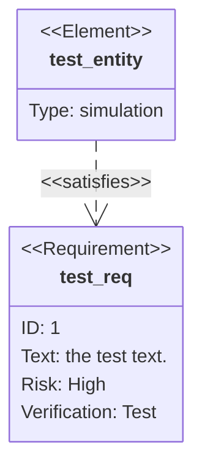
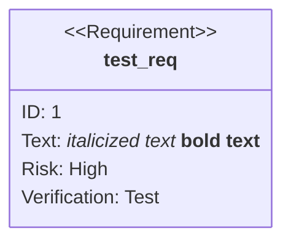
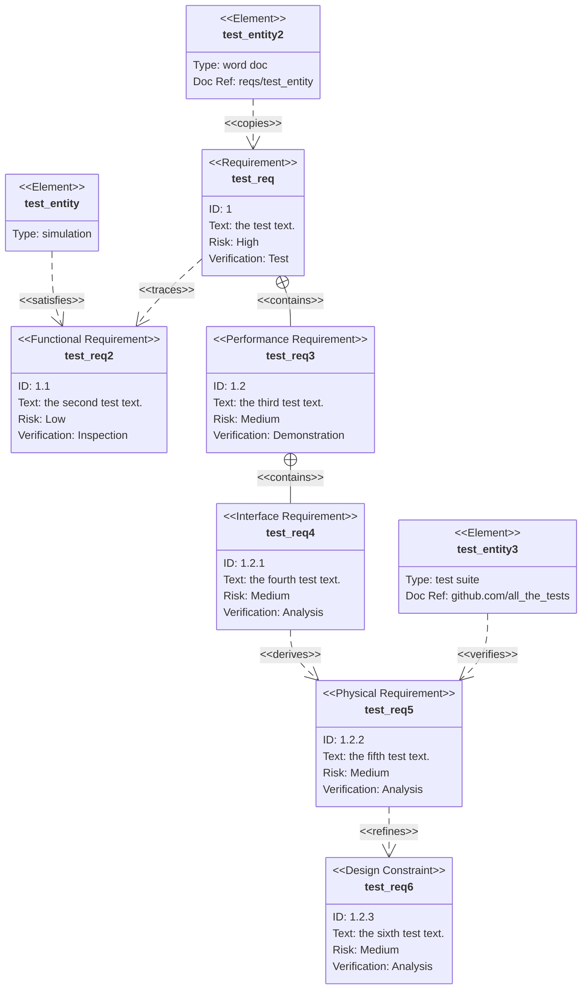
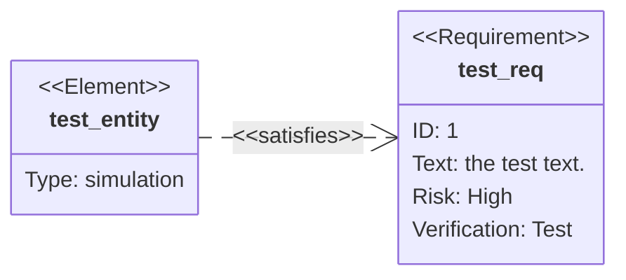
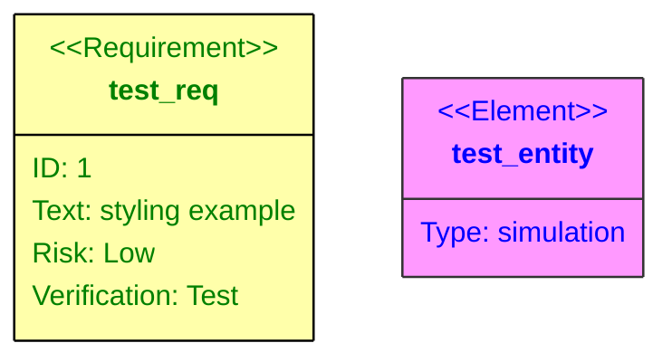
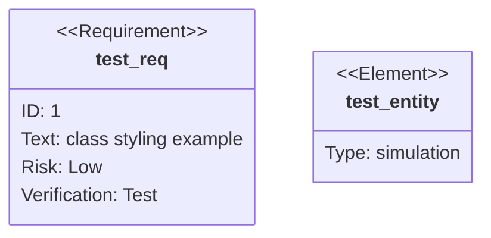
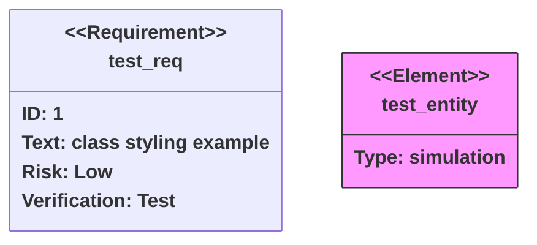

# 九、要求图

> 需求图为需求及其相互之间和其他文档化元素之间的联系提供了可视化。建模规范遵循SysML v1.6定义的规范。


## 9.1 基础使用

- 代码

```
requirementDiagram

    requirement test_req {
      id: 1
      text: the test text.
      risk: high
      verifymethod: test
    }

    element test_entity {
      type: simulation
    }

    test_entity - satisfies -> test_req
```

- 展示图



## 9.2 语法

需求图有三种类型的组件：需求、元素和关系。

定义它们的语法定义如下。尖括号中表示的单词，如 `<word>` ，是枚举关键字，具有表中阐述的选项。 `user_defined_...` 用于任何需要用户输入的地方。

关于用户文本的一个重要注意事项：所有输入都可以用引号括起来，也可以不用。例如， `Id: "here is an example"` 和 `Id: here is an example` 都有效。但是，用户必须小心未加引号的输入。如果检测到另一个关键字，解析器将失败。

### 9.2.1 requirement (要求)

需求定义包含需求类型、名称、id、文本、风险和验证方法。语法如下：

```
<type> user_defined_name {
    id: user_defined_id
    text: user_defined text
    risk: <risk>
    verifymethod: <method>
}
```

类型、风险和方法是SysML中定义的枚举。

| 关键字 | 选项  |
| --- | --- |
| type  | requirement, functionalRequirement, interfaceRequirement, performanceRequirement, physicalRequirement, designConstraint |
| Risk  | Low, Medium, High |
| VerificationMethod | Analysis, Inspection, Test, Demonstration |

### 9.2.2 elment (元素)

元素定义包含元素名称、类型和文档引用。这三个都是用户定义的。元素特性的目的是轻量级的，但允许将需求连接到其他文档的部分。

```
element user_defined_name {
    type: user_defined_type
    docref: user_defined_ref
}
```

### 9.2.3 markdown格式化

在可能使用用户定义文本的地方（如名称、需求文本、元素文档等），你可以：

*   将文本用引号括起来： `"example text"`
*   在引号内使用降价格式： `"**bold text** and *italics*"`

例子:

- 代码

```
requirementDiagram

requirement "__test_req__" {
    id: 1
    text: "*italicized text* **bold text**"
    risk: high
    verifymethod: test
}
```

- 展示图



### 9.2.4 关系

关系由源节点、目标节点和关系类型组成。

- 定义格式1

```
{name of source} - <type> -> {name of destination}
```
- 定义格式2

```plain
{name of destination} <- <type> - {name of source}
```

- 解释

“源名称”和“目标名称”应该是在别处定义的需求或元素节点的名称。

关系类型可以是包含、复制、派生、满足、验证、细化或跟踪类型之一。

图中标注了每个关系。

## 9.3 更大的例子

这个例子使用了图的所有特性。

- 代码

```    
requirementDiagram

    requirement test_req {
    id: 1
    text: the test text.
    risk: high
    verifymethod: test
    }

    functionalRequirement test_req2 {
    id: 1.1
    text: the second test text.
    risk: low
    verifymethod: inspection
    }

    performanceRequirement test_req3 {
    id: 1.2
    text: the third test text.
    risk: medium
    verifymethod: demonstration
    }

    interfaceRequirement test_req4 {
    id: 1.2.1
    text: the fourth test text.
    risk: medium
    verifymethod: analysis
    }

    physicalRequirement test_req5 {
    id: 1.2.2
    text: the fifth test text.
    risk: medium
    verifymethod: analysis
    }

    designConstraint test_req6 {
    id: 1.2.3
    text: the sixth test text.
    risk: medium
    verifymethod: analysis
    }

    element test_entity {
    type: simulation
    }

    element test_entity2 {
    type: word doc
    docRef: reqs/test_entity
    }

    element test_entity3 {
    type: "test suite"
    docRef: github.com/all_the_tests
    }


    test_entity - satisfies -> test_req2
    test_req - traces -> test_req2
    test_req - contains -> test_req3
    test_req3 - contains -> test_req4
    test_req4 - derives -> test_req5
    test_req5 - refines -> test_req6
    test_entity3 - verifies -> test_req5
    test_req <- copies - test_entity2
```

- 展示图



## 9.4 方向

可以使用 `direction` 语句在不同方向上呈现图。有效值为：

*   `TB`  -从上到下（默认）
*   `BT`  -从底部到顶部
*   `LR`  -从左到右
*   `RL`  -从右到左

例子:

- 代码

```
requirementDiagram

direction LR

requirement test_req {
    id: 1
    text: the test text.
    risk: high
    verifymethod: test
}

element test_entity {
    type: simulation
}

test_entity - satisfies -> test_req
```

- 展示图



## 9.5 样式

需求和元素可以使用直接样式化或类进行样式化。作为一个经验法则，当应用样式或类时，它接受一个需求或元素名称列表和一个类名称列表，允许一次分配多个值（唯一的例外是速记语法 `:::` ，它可以分配多个类，但一次只能分配一个需求或元素）。

### 9.5.1 直接的样式

使用 `style` 关键字直接应用CSS样式：

- 代码

```
requirementDiagram

requirement test_req {
    id: 1
    text: styling example
    risk: low
    verifymethod: test
}

element test_entity {
    type: simulation
}

style test_req fill:#ffa,stroke:#000, color: green
style test_entity fill:#f9f,stroke:#333, color: blue
```

- 展示图



### 9.5.2 类定义

使用 `classDef` 定义可重用样式：

- 代码

```
requirementDiagram

requirement test_req {
    id: 1
    text: "class styling example"
    risk: low
    verifymethod: test
}

element test_entity {
    type: simulation
}

classDef important fill:#f96,stroke:#333,stroke-width:4px
classDef test fill:#ffa,stroke:#000
```

- 展示图



### 9.5.3 默认的类

如果一个类被命名为default，它将应用于所有节点。之后应该定义特定的样式和类来覆盖应用的默认样式。

```
classDef default fill:#f9f,stroke:#333,stroke-width:4px;
```

### 9.5.4 应用类

类可以通过两种方式应用：

1.  使用 `class` 关键字：

```plain
class test_req,test_entity important
```

2.  在定义期间或之后使用 `:::` 的简写语法：

```
requirement test_req:::important {
    id: 1
    text: class styling example
    risk: low
    verifymethod: test
}
```

```
element test_elem {
}

test_elem:::myClass
```

### 9.5.5 结合例子

- 代码

```
requirementDiagram

requirement test_req:::important {
    id: 1
    text: "class styling example"
    risk: low
    verifymethod: test
}

element test_entity {
    type: simulation
}

classDef important font-weight:bold

class test_entity important
style test_entity fill:#f9f,stroke:#333
```

- 展示图

