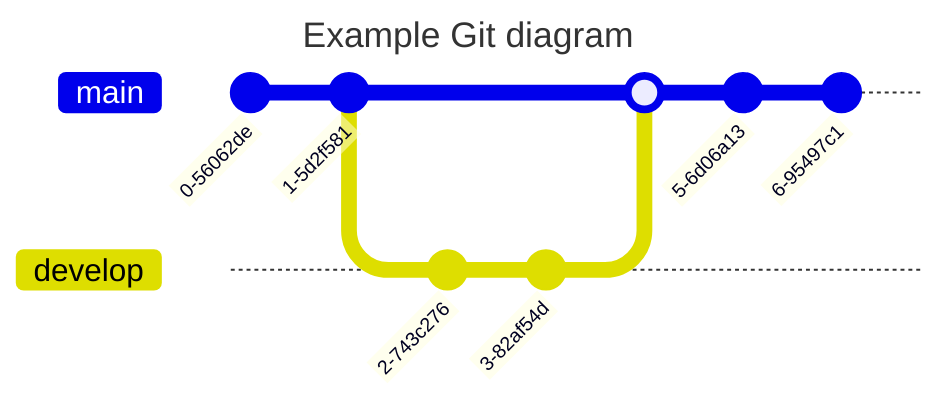
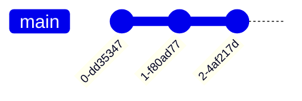
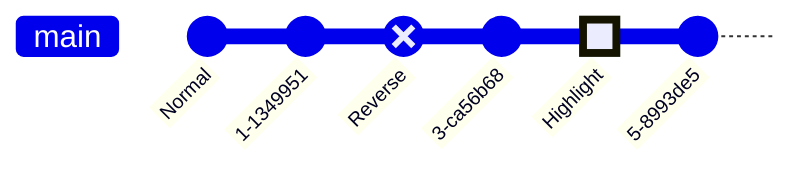
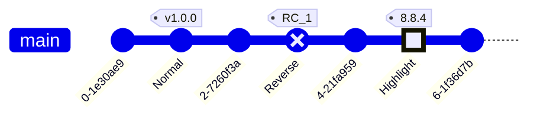
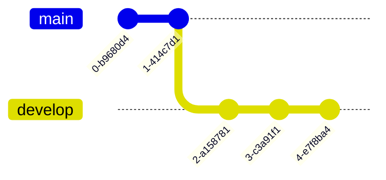
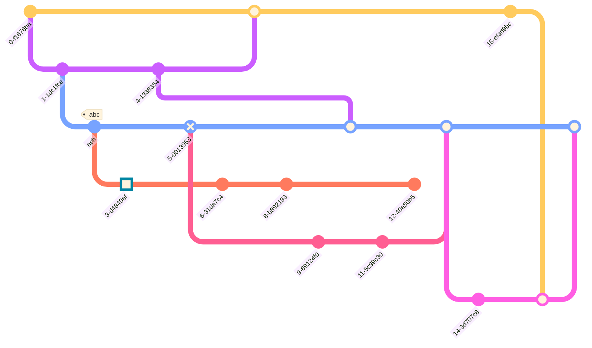
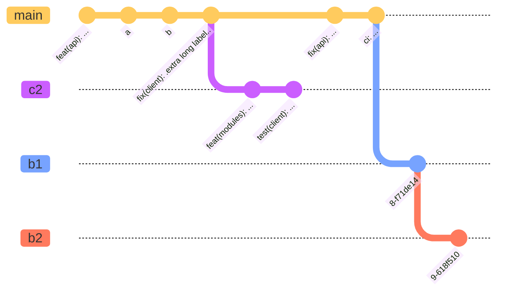
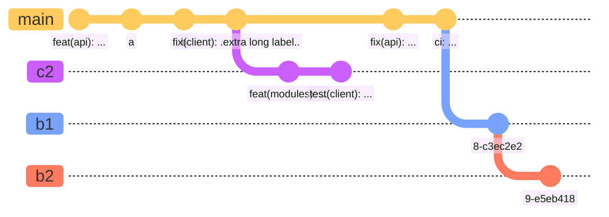

# 十、Git图

> Git图是Git提交和Git操作（命令）在不同分支上的图形表示。

这种图表对于开发人员和开发团队分享他们的Git分支策略特别有帮助。例如，它可以更容易地可视化git流的工作方式。

## 10.1 git图基础使用

- 代码

```
---
title: Example Git diagram
---
gitGraph
   commit
   commit
   branch develop
   checkout develop
   commit
   commit
   checkout main
   merge develop
   commit
   commit
```

- 展示图




在Mermaid中，我们支持基本的git操作，比如：

*   commit：表示当前分支上的新提交。
*   branch：要创建并切换到一个新的分支，将其设置为当前分支。
*   checkout：签出现有分支并将其设置为当前分支。
*   merge：将现有分支合并到当前分支上。

在这些关键git命令的帮助下，您将能够非常轻松快速地在Mermaid中绘制图形。实体名称通常是大写的，尽管在这方面没有公认的标准，在Mermaid中也不是必需的。

注意： `checkout` 和 `switch` 可以互换使用。

## 10.2 语法


### 10.2.1 git图标关键字

用于图形的Mermaid语法非常直接和简单。它遵循声明式方法，其中每个提交都按照其在代码中出现/出现的顺序绘制在图中的时间轴上。基本上，它遵循每个命令的插入顺序。

首先要做的是使用gitgraph关键字声明图表类型。这个 `gitgraph` 关键字，告诉Mermaid您希望绘制一个图形，并相应地解析图表代码。

每个图形都用主分支初始化。所以，除非你创建一个不同的分支，否则默认情况下提交将转到主分支。这是由git的工作方式驱动的，一开始总是从主分支（以前称为主分支）开始。默认情况下， `main` 分支被设置为当前分支。

使用commit关键字在当前分支上注册提交。让我们看看这是如何工作的：

一个简单的曲线图显示了默认（主）分支上的三次提交：

- 代码

```
gitGraph
    commit
    commit
    commit
```

- 展示图




如果仔细查看前面的示例，可以看到默认的分支 `main` 以及三个提交。另外，请注意，默认情况下，每个提交都有一个唯一的随机ID。如果您想为提交提供自己的自定义ID，该怎么办？是的，《美人鱼》可以做到这一点。

### 10.2.2 添加自定义提交id

对于给定的提交，您可以在声明时使用 `id` 属性指定自定义ID，后面跟着 `:` 和您的自定义值 `""` 引号。例如： `commit id: "your_custom_id"`

让我们通过下面的图表来看看这是如何工作的：

- 代码

```
gitGraph
    commit id: "Alpha"
    commit id: "Beta"
    commit id: "Gamma"
```

- 展示图


在本例中，我们为提交提供了自定义id。

### 10.2.3 修改提交类型

在Mermaid中，提交可以是三种类型，它们在图中的呈现略有不同。这些类型是：

*   `NORMAL` ：默认提交类型。用图中的实圆表示
*   `REVERSE` ：强调提交是反向提交。在图中用交叉实心圆表示。
*   `HIGHLIGHT` ：在图中突出显示特定的提交。用图中填充的矩形表示。

对于给定的提交，您可以在声明它的时候使用 `type` 属性指定它的类型，然后是 `:` 和上面讨论的所需类型选项。例如： `commit type: HIGHLIGHT`

注：如果未指定提交类型，则默认选择 `NORMAL` 。

让我们通过下面的图表来看看这些不同的提交类型是怎样的：

- 代码

```
gitGraph
    commit id: "Normal"
    commit
    commit id: "Reverse" type: REVERSE
    commit
    commit id: "Highlight" type: HIGHLIGHT
    commit
```

- 展示图




在本例中，我们为每次提交指定了不同的类型。另外，看看我们是如何在声明提交时同时包含 `id` 和 `type` 的。

### 10.2.4 添加标记

对于给定的提交，您可以将其装饰为标签，类似于git世界中的标签或发布版本的概念。您可以在声明提交时使用 `tag` 属性附加自定义标记，后面跟着 `:` 和您的自定义值 `""` 引号。例如： `commit tag: "your_custom_tag"`

让我们通过下面的图表来看看这是如何工作的：

- 代码

```
    gitGraph
        commit
        commit id: "Normal" tag: "v1.0.0"
        commit
        commit id: "Reverse" type: REVERSE tag: "RC_1"
        commit
        commit id: "Highlight" type: HIGHLIGHT tag: "8.8.4"
        commit
```

- 展示图




在本例中，我们为提交提供了自定义标记。另外，看看我们是如何在一个commit声明中组合所有这些属性的。您可以根据需要混合匹配这些属性。

### 10.2.5 创建一个新分支

在Mermaid中，为了创建一个新的分支，您可以使用 `branch` 关键字。您还需要提供新分支的名称。名称必须是唯一的，不能是现有分支的名称。可能与关键字混淆的分支名称必须在 `""` 内加引号。使用示例： `branch develop` ,  `branch "cherry-pick"`

当Mermaid读取 `branch` 关键字时，它创建一个新的分支并将其设置为当前分支。相当于创建一个新的分支并在Git世界中签出它。

让我们看一个例子：

- 代码

```
    gitGraph
       commit
       commit
       branch develop
       commit
       commit
       commit
```

- 展示图



maindevelop0-d7e5e4e1-81f00802-4e6ef753-7796a1b4-79d0f32

在本例中，看看我们如何从default  `main` 分支开始，并在该分支上推送两次提交。然后我们创建了 `develop` 分支，之后所有的提交都被放到 `develop` 分支上，因为它成为了当前的分支。

### 10.2.6 签出现有分支

在Mermaid中，为了切换到现有的分支，您可以使用 `checkout` 关键字。您还需要提供现有分支的名称。如果没有找到具有给定名称的分支，则会导致控制台错误。使用示例： `checkout develop`

当Mermaid读取 `checkout` 关键字时，它找到给定的分支并将其设置为当前分支。相当于签出Git世界中的一个分支。

让我们修改一下前面的例子：

- 代码

```
    gitGraph
       commit
       commit
       branch develop
       commit
       commit
       commit
       checkout main
       commit
       commit
```

- 展示图


maindevelop0-a7438b11-24f16092-743e6373-0d620f84-5849ea15-0a7fb886-3c04f5a

在本例中，看看我们如何从default  `main` 分支开始，并在该分支上推送两次提交。然后我们创建了 `develop` 分支，之后的所有三个提交都放在 `develop` 分支上，因为它成为当前分支。在此之后，我们使用 `checkout` 关键字将当前分支设置为 `main` ，并且随后的所有提交都针对当前分支注册，即 `main` 。

### 10.2.7 合并两个分支

在Mermaid中，为了合并或加入到现有分支，您可以使用 `merge` 关键字。您还需要提供要合并的现有分支的名称。如果没有找到具有给定名称的分支，则会导致控制台错误。此外，您只能合并两个独立的分支，而不能合并分支本身。在这种情况下会抛出错误。

使用示例： `merge develop`

当Mermaid读取 `merge` 关键字时，它会找到给定的分支及其头提交（该分支上的最后一次提交），并将其与当前分支上的头提交连接起来。每次合并都会导致合并提交，在图中用填充的双圆圈表示。

让我们修改前面的例子来合并两个分支：

- 代码

```
    gitGraph
       commit
       commit
       branch develop
       commit
       commit
       commit
       checkout main
       commit
       commit
       merge develop
       commit
       commit
```

- 展示图


在本例中，看看我们如何从default  `main` 分支开始，并在该分支上推送两次提交。然后我们创建了 `develop` 分支，之后的所有三个提交都放在 `develop` 分支上，因为它成为当前分支。在此之后，我们使用 `checkout` 关键字将当前分支设置为 `main` ，并且随后的所有提交都针对当前分支注册，即 `main` 。在此之后，我们将 `develop` 分支合并到当前分支 `main` ，从而产生合并提交。因为此时的当前分支仍然是 `main` ，所以最后两个提交是根据它注册的。

你也可以用类似的属性来装饰你的合并，就像你在提交中所做的那样：

*   `id` ——>用自定义ID覆盖默认ID
*   `tag` ——>添加自定义标签到合并提交
*   `type` ——>覆盖合并提交的默认形状。这里可以使用前面提到的其他提交类型。

您可以选择不使用、部分使用或全部使用这些属性。例如： `merge develop id: "my_custom_id" tag: "my_custom_tag" type: REVERSE`

让我们通过下面的图表来看看这是如何工作的：

- 代码

```
    gitGraph
       commit id: "1"
       commit id: "2"
       branch nice_feature
       checkout nice_feature
       commit id: "3"
       checkout main
       commit id: "4"
       checkout nice_feature
       branch very_nice_feature
       checkout very_nice_feature
       commit id: "5"
       checkout main
       commit id: "6"
       checkout nice_feature
       commit id: "7"
       checkout main
       merge nice_feature id: "customID" tag: "customTag" type: REVERSE
       checkout very_nice_feature
       commit id: "8"
       checkout main
       commit id: "9"
```

- 展示图


### 10.2.8 Cherry Pick从另一个分支提交

类似于git允许你从另一个分支选择一个提交到当前分支，Mermaid也支持这个功能。还可以使用 `cherry-pick` 关键字从另一个分支中挑选提交。

要使用 `cherry-pick` 关键字，您必须使用 `id` 属性指定id，然后使用 `:` ，并在 `""` 引号中指定所需的提交id。例如:

`cherry-pick id: "your_custom_id"`

在这里，在当前分支上创建了一个代表樱桃的新提交，并在图中用一个樱桃和一个标记突出显示，该标记描述了从樱桃中选择的提交id。

这里需要注意的一些重要规则是：

1.  您需要为已存在的提交提供 `id` 。如果给定的提交id不存在，则会导致错误。为此，使用 `commit id:$value` 格式声明提交。参见上面的例子。
2.  给定的提交必须不存在于当前分支上。精心挑选的提交必须始终是与当前分支不同的分支。
3.  当前分支必须至少有一个提交，在此之前你可以择优选择，否则会导致抛出错误。
4.  当选择合并提交时，必须提供父提交ID。如果省略了parent属性或提供了无效的父提交ID，则会抛出错误。
5.  指定的父提交必须是选中的合并提交的直接父提交。

让我们看一个例子：

- 代码

```
    gitGraph
        commit id: "ZERO"
        branch develop
        branch release
        commit id:"A"
        checkout main
        commit id:"ONE"
        checkout develop
        commit id:"B"
        checkout main
        merge develop id:"MERGE"
        commit id:"TWO"
        checkout release
        cherry-pick id:"MERGE" parent:"B"
        commit id:"THREE"
        checkout develop
        commit id:"C"
```

- 展示图


## 10.3 图形特定的配置选项

在Mermaid中，您可以选择配置曲线图。您可以配置以下选项：

*   `showBranches` : Boolean，默认值 `true` 。如果设置为 `false` ，则分支不在图中显示。
*   `showCommitLabel` : Boolean，默认值 `true` 。如果设置为 `false` ，则提交标签不显示在图中。
*   `mainBranchName` ：字符串，默认值 `main` 。默认/根分支的名称。
*   `mainBranchOrder` ：主分支在分支列表中的位置。默认为 `0` ，这意味着默认 `main` 分支是顺序中的第一个。
*   `parallelCommits` : Boolean，默认值 `false` 。如果设置为 `true` ，那么距离父节点x距离的提交将显示在图中的同一级别。

让我们一个一个地看。

## 10.4 隐藏分支名称和行

有时，您可能希望从图中隐藏分支名称和行。这可以通过使用 `showBranches` 关键字来实现。缺省值为 `true` 。您可以使用指令将其设置为 `false` 。

使用的例子:

- 代码

```
%%{init: { 'logLevel': 'debug', 'theme': 'base', 'gitGraph': {'showBranches': false}} }%%
      gitGraph
        commit
        branch hotfix
        checkout hotfix
        commit
        branch develop
        checkout develop
        commit id:"ash" tag:"abc"
        branch featureB
        checkout featureB
        commit type:HIGHLIGHT
        checkout main
        checkout hotfix
        commit type:NORMAL
        checkout develop
        commit type:REVERSE
        checkout featureB
        commit
        checkout main
        merge hotfix
        checkout featureB
        commit
        checkout develop
        branch featureA
        commit
        checkout develop
        merge hotfix
        checkout featureA
        commit
        checkout featureB
        commit
        checkout develop
        merge featureA
        branch release
        checkout release
        commit
        checkout main
        commit
        checkout release
        merge main
        checkout develop
        merge release
```

- 展示图




## 10.5 提交标签布局：旋转或水平

Mermaid支持两种类型的提交标签布局。默认布局是旋转的，这意味着标签放在提交圈的下方，旋转45度以获得更好的可读性。这对于带有长标签的提交尤其有用。

另一个选项是水平的，这意味着标签放置在以水平为中心的提交圆的下方，并且不旋转。这对于带有短标签的提交尤其有用。

你可以通过在指令中使用 `rotateCommitLabel` 关键字来改变提交标签的布局。默认值为 `true` ，这意味着提交标签是旋转的。

使用示例：旋转提交标签

- 代码

```
%%{init: { 'logLevel': 'debug', 'theme': 'base', 'gitGraph': {'rotateCommitLabel': true}} }%%
gitGraph
  commit id: "feat(api): ..."
  commit id: "a"
  commit id: "b"
  commit id: "fix(client): .extra long label.."
  branch c2
  commit id: "feat(modules): ..."
  commit id: "test(client): ..."
  checkout main
  commit id: "fix(api): ..."
  commit id: "ci: ..."
  branch b1
  commit
  branch b2
  commit
```

- 展示图




使用示例：水平提交标签

- 代码

```
%%{init: { 'logLevel': 'debug', 'theme': 'base', 'gitGraph': {'rotateCommitLabel': false}} }%%
gitGraph
  commit id: "feat(api): ..."
  commit id: "a"
  commit id: "b"
  commit id: "fix(client): .extra long label.."
  branch c2
  commit id: "feat(modules): ..."
  commit id: "test(client): ..."
  checkout main
  commit id: "fix(api): ..."
  commit id: "ci: ..."
  branch b1
  commit
  branch b2
  commit
```

- 展示图




## 10.6 隐藏提交标签

有时，您可能希望从图中隐藏提交标签。这可以通过使用 `showCommitLabel` 关键字来实现。缺省值为 `true` 。您可以使用指令将其设置为 `false` 。

使用的例子:

- 代码

```
%%{init: { 'logLevel': 'debug', 'theme': 'base', 'gitGraph': {'showBranches': false,'showCommitLabel': false}} }%%
      gitGraph
        commit
        branch hotfix
        checkout hotfix
        commit
        branch develop
        checkout develop
        commit id:"ash"
        branch featureB
        checkout featureB
        commit type:HIGHLIGHT
        checkout main
        checkout hotfix
        commit type:NORMAL
        checkout develop
        commit type:REVERSE
        checkout featureB
        commit
        checkout main
        merge hotfix
        checkout featureB
        commit
        checkout develop
        branch featureA
        commit
        checkout develop
        merge hotfix
        checkout featureA
        commit
        checkout featureB
        commit
        checkout develop
        merge featureA
        branch release
        checkout release
        commit
        checkout main
        commit
        checkout release
        merge main
        checkout develop
        merge release
```

- 展示图


## 10.7 自定义主分支名称

有时，您可能希望自定义主/默认分支的名称。这可以通过使用 `mainBranchName` 关键字来实现。缺省值为 `main` 。你可以使用指令将它设置为任何字符串。

使用的例子:

- 代码

```
%%{init: { 'logLevel': 'debug', 'theme': 'base', 'gitGraph': {'showBranches': true, 'showCommitLabel':true,'mainBranchName': 'MetroLine1'}} }%%
      gitGraph
        commit id:"NewYork"
        commit id:"Dallas"
        branch MetroLine2
        commit id:"LosAngeles"
        commit id:"Chicago"
        commit id:"Houston"
        branch MetroLine3
        commit id:"Phoenix"
        commit type: HIGHLIGHT id:"Denver"
        commit id:"Boston"
        checkout MetroLine1
        commit id:"Atlanta"
        merge MetroLine3
        commit id:"Miami"
        commit id:"Washington"
        merge MetroLine2 tag:"MY JUNCTION"
        commit id:"Boston"
        commit id:"Detroit"
        commit type:REVERSE id:"SanFrancisco"
```

- 展示图


看看用“美人鱼”创建的想象中的铁路地图。这里，我们将默认的主分支名称更改为 `MetroLine1` 。

## 10.8 定制分支订购

在Mermaid中，默认情况下，分支按照它们在图代码中的定义或外观顺序显示。

有时，您可能希望自定义分支的顺序。可以通过在分支定义后面使用 `order` 关键字来实现这一点。你可以把它设为正数。

Mermaid遵循 `order` 关键字的给定优先顺序。

*   主分支总是首先显示，因为它的默认顺序值为 `0` 。（除非它的顺序被修改，并且使用 `mainBranchOrder` 关键字在配置中从 `0` 改变）
*   接下来，所有没有 `order` 的分支按照它们在图代码中的出现顺序显示。
*   接下来，所有 `order` 的分支按照 `order` 值的顺序显示。

要完全控制所有分支的顺序，必须为所有分支定义 `order` 。

使用的例子:

- 代码

```
%%{init: { 'logLevel': 'debug', 'theme': 'base', 'gitGraph': {'showBranches': true, 'showCommitLabel':true}} }%%
      gitGraph
      commit
      branch test1 order: 3
      branch test2 order: 2
      branch test3 order: 1
```

- 展示图


看一下这个图，所有的分支都遵循定义的顺序。

使用的例子:

- 代码

```
%%{init: { 'logLevel': 'debug', 'theme': 'base', 'gitGraph': {'showBranches': true, 'showCommitLabel':true,'mainBranchOrder': 2}} }%%
      gitGraph
      commit
      branch test1 order: 3
      branch test2
      branch test3
      branch test4 order: 1
```

- 展示图


看这张图，这里，所有没有指定顺序的分支都是按照它们的定义顺序绘制的。然后，由于 `1` 的顺序，绘制 `test4` 分支。然后，由于 `2` 的顺序，绘制 `main` 分支。最后，绘制 `test1` ，因为 `3` 的顺序。

注意：因为我们已经覆盖了 `mainBranchOrder` 到 `2` ,  `main` 分支不会在开始绘制，而是按照顺序绘制。

这里，我们将默认的主分支名称更改为 `MetroLine1` 。

## 10.9 定向

Mermaid支持三种图形方向：从左到右（默认）、从上到下和从下到上。

您可以在 `gitGraph` 之后设置 `LR:` （从左到右）， `TB:` （从上到下）或 `BT:` （从下到上）。

### 10.9.1 从左到右（默认 `LR:` ）

在Mermaid中，默认的方向是提交从左到右运行，分支堆叠在一起。

但是，您可以在 `gitGraph` 之后显式地设置 `LR:` 。

使用的例子:

- 代码

```
    gitGraph LR:
       commit
       commit
       branch develop
       commit
       commit
       checkout main
       commit
       commit
       merge develop
       commit
       commit
```

- 展示图


### 10.9.2 从上到下（ `TB:` ）

在 `TB` （从上到下）方向下，提交从图的上到下运行，分支并排排列。

要以这种方式定位图形，需要在gitGraph后面添加 `TB:` 。

使用的例子:

- 代码

```
    gitGraph TB:
       commit
       commit
       branch develop
       commit
       commit
       checkout main
       commit
       commit
       merge develop
       commit
       commit
```

- 展示图


maindevelop0-b10df9e1-e73d5262-1879ef43-e1961ce4-10155e75-cde27cf7-aee71028-dc120aa

### 10.9.3 从底部到顶部（ `BT:` ）

在 `BT` （从下到上）方向下，提交从图的底部到顶部运行，分支并排排列。

要以这种方式定位图形，需要在gitGraph后面添加 `BT:` 。

使用的例子:

- 代码

```
    gitGraph BT:
       commit
       commit
       branch develop
       commit
       commit
       checkout main
       commit
       commit
       merge develop
       commit
       commit
```

- 展示图


maindevelop8-3e50be57-e122f7d5-9dbcb1c4-c4972f63-4230dfd2-1c508a61-02bbf750-b30c5fd

## 10.10 并行提交

在缺省情况下，在Mermaid中提交以图形显示时间信息。例如，如果两个提交离它的父提交是一个提交，那么较早的提交就会呈现在离它的父提交更近的地方。您可以通过启用 `parallelCommits` 标志来关闭此功能。

### 10.10.1 临时提交（默认， `parallelCommits: false` ）

- 代码

```
---
config:
  gitGraph:
    parallelCommits: false
---
gitGraph:
  commit
  branch develop
  commit
  commit
  checkout main
  commit
  commit
```

- 展示图

```mermaid
---
config:
  gitGraph:
    parallelCommits: false
---
gitGraph:
  commit
  branch develop
  commit
  commit
  checkout main
  commit
  commit
```

maindevelop0-a91d0b01-39d386f2-2caabdc3-64517ff4-9d74d69

### 10.10.2 并行提交（ `parallelCommits: true` ）

- 代码

```
---
config:
  gitGraph:
    parallelCommits: true
---
gitGraph:
  commit
  branch develop
  commit
  commit
  checkout main
  commit
  commit
```

- 展示图

```mermaid
---
config:
  gitGraph:
    parallelCommits: true
---
gitGraph:
  commit
  branch develop
  commit
  commit
  checkout main
  commit
  commit
```

maindevelop0-3f0c5a11-faead972-3a36e373-97ad1eb4-679867e

## 10.11 主题

美人鱼支持一堆预定义的主题，你可以用它来找到适合你的。PS：你实际上可以覆盖一个现有的主题的变量，让你自己的自定义主题。在这里了解更多关于图表主题化的信息。

以下是不同的预定义主题选项：

*   `base`
*   `forest`
*   `dark`
*   `default`
*   `neutral`

注意：要更改主题，你可以使用 `initialize` 调用或指令。让我们来使用它们，看看我们的示例图在不同的主题中是怎样的：

### 10.11.1 基本主题

- 代码

```
%%{init: { 'logLevel': 'debug', 'theme': 'base' } }%%
      gitGraph
        commit
        branch hotfix
        checkout hotfix
        commit
        branch develop
        checkout develop
        commit id:"ash" tag:"abc"
        branch featureB
        checkout featureB
        commit type:HIGHLIGHT
        checkout main
        checkout hotfix
        commit type:NORMAL
        checkout develop
        commit type:REVERSE
        checkout featureB
        commit
        checkout main
        merge hotfix
        checkout featureB
        commit
        checkout develop
        branch featureA
        commit
        checkout develop
        merge hotfix
        checkout featureA
        commit
        checkout featureB
        commit
        checkout develop
        merge featureA
        branch release
        checkout release
        commit
        checkout main
        commit
        checkout release
        merge main
        checkout develop
        merge release
```

- 展示图

```mermaid
%%{init: { 'logLevel': 'debug', 'theme': 'base' } }%%
      gitGraph
        commit
        branch hotfix
        checkout hotfix
        commit
        branch develop
        checkout develop
        commit id:"ash" tag:"abc"
        branch featureB
        checkout featureB
        commit type:HIGHLIGHT
        checkout main
        checkout hotfix
        commit type:NORMAL
        checkout develop
        commit type:REVERSE
        checkout featureB
        commit
        checkout main
        merge hotfix
        checkout featureB
        commit
        checkout develop
        branch featureA
        commit
        checkout develop
        merge hotfix
        checkout featureA
        commit
        checkout featureB
        commit
        checkout develop
        merge featureA
        branch release
        checkout release
        commit
        checkout main
        commit
        checkout release
        merge main
        checkout develop
        merge release
```

mainhotfixdevelopfeatureBfeatureArelease0-c380dd21-f5c78e6ashabc3-4e231344-1843def5-ee3c77d6-de78e108-835707c9-902e61f11-290cb5e12-af920da14-61ee68e15-8f36ae2

### 10.11.2 森林主题

- 代码

```
%%{init: { 'logLevel': 'debug', 'theme': 'forest' } }%%
      gitGraph
        commit
        branch hotfix
        checkout hotfix
        commit
        branch develop
        checkout develop
        commit id:"ash" tag:"abc"
        branch featureB
        checkout featureB
        commit type:HIGHLIGHT
        checkout main
        checkout hotfix
        commit type:NORMAL
        checkout develop
        commit type:REVERSE
        checkout featureB
        commit
        checkout main
        merge hotfix
        checkout featureB
        commit
        checkout develop
        branch featureA
        commit
        checkout develop
        merge hotfix
        checkout featureA
        commit
        checkout featureB
        commit
        checkout develop
        merge featureA
        branch release
        checkout release
        commit
        checkout main
        commit
        checkout release
        merge main
        checkout develop
        merge release
```

- 展示图

```mermaid
%%{init: { 'logLevel': 'debug', 'theme': 'forest' } }%%
      gitGraph
        commit
        branch hotfix
        checkout hotfix
        commit
        branch develop
        checkout develop
        commit id:"ash" tag:"abc"
        branch featureB
        checkout featureB
        commit type:HIGHLIGHT
        checkout main
        checkout hotfix
        commit type:NORMAL
        checkout develop
        commit type:REVERSE
        checkout featureB
        commit
        checkout main
        merge hotfix
        checkout featureB
        commit
        checkout develop
        branch featureA
        commit
        checkout develop
        merge hotfix
        checkout featureA
        commit
        checkout featureB
        commit
        checkout develop
        merge featureA
        branch release
        checkout release
        commit
        checkout main
        commit
        checkout release
        merge main
        checkout develop
        merge release
```


### 10.11.3 默认主题

- 代码

```
%%{init: { 'logLevel': 'debug', 'theme': 'default' } }%%
      gitGraph
        commit type:HIGHLIGHT
        branch hotfix
        checkout hotfix
        commit
        branch develop
        checkout develop
        commit id:"ash" tag:"abc"
        branch featureB
        checkout featureB
        commit type:HIGHLIGHT
        checkout main
        checkout hotfix
        commit type:NORMAL
        checkout develop
        commit type:REVERSE
        checkout featureB
        commit
        checkout main
        merge hotfix
        checkout featureB
        commit
        checkout develop
        branch featureA
        commit
        checkout develop
        merge hotfix
        checkout featureA
        commit
        checkout featureB
        commit
        checkout develop
        merge featureA
        branch release
        checkout release
        commit
        checkout main
        commit
        checkout release
        merge main
        checkout develop
        merge release
```

- 展示图

```mermaid
%%{init: { 'logLevel': 'debug', 'theme': 'default' } }%%
      gitGraph
        commit type:HIGHLIGHT
        branch hotfix
        checkout hotfix
        commit
        branch develop
        checkout develop
        commit id:"ash" tag:"abc"
        branch featureB
        checkout featureB
        commit type:HIGHLIGHT
        checkout main
        checkout hotfix
        commit type:NORMAL
        checkout develop
        commit type:REVERSE
        checkout featureB
        commit
        checkout main
        merge hotfix
        checkout featureB
        commit
        checkout develop
        branch featureA
        commit
        checkout develop
        merge hotfix
        checkout featureA
        commit
        checkout featureB
        commit
        checkout develop
        merge featureA
        branch release
        checkout release
        commit
        checkout main
        commit
        checkout release
        merge main
        checkout develop
        merge release
```


### 10.11.4 黑暗的主题

- 代码

```
%%{init: { 'logLevel': 'debug', 'theme': 'dark' } }%%
      gitGraph
        commit
        branch hotfix
        checkout hotfix
        commit
        branch develop
        checkout develop
        commit id:"ash" tag:"abc"
        branch featureB
        checkout featureB
        commit type:HIGHLIGHT
        checkout main
        checkout hotfix
        commit type:NORMAL
        checkout develop
        commit type:REVERSE
        checkout featureB
        commit
        checkout main
        merge hotfix
        checkout featureB
        commit
        checkout develop
        branch featureA
        commit
        checkout develop
        merge hotfix
        checkout featureA
        commit
        checkout featureB
        commit
        checkout develop
        merge featureA
        branch release
        checkout release
        commit
        checkout main
        commit
        checkout release
        merge main
        checkout develop
        merge release
```

- 展示图

```mermaid
%%{init: { 'logLevel': 'debug', 'theme': 'dark' } }%%
      gitGraph
        commit
        branch hotfix
        checkout hotfix
        commit
        branch develop
        checkout develop
        commit id:"ash" tag:"abc"
        branch featureB
        checkout featureB
        commit type:HIGHLIGHT
        checkout main
        checkout hotfix
        commit type:NORMAL
        checkout develop
        commit type:REVERSE
        checkout featureB
        commit
        checkout main
        merge hotfix
        checkout featureB
        commit
        checkout develop
        branch featureA
        commit
        checkout develop
        merge hotfix
        checkout featureA
        commit
        checkout featureB
        commit
        checkout develop
        merge featureA
        branch release
        checkout release
        commit
        checkout main
        commit
        checkout release
        merge main
        checkout develop
        merge release
```


### 10.11.5 中性的主题

- 代码

```
%%{init: { 'logLevel': 'debug', 'theme': 'neutral' } }%%
      gitGraph
        commit
        branch hotfix
        checkout hotfix
        commit
        branch develop
        checkout develop
        commit id:"ash" tag:"abc"
        branch featureB
        checkout featureB
        commit type:HIGHLIGHT
        checkout main
        checkout hotfix
        commit type:NORMAL
        checkout develop
        commit type:REVERSE
        checkout featureB
        commit
        checkout main
        merge hotfix
        checkout featureB
        commit
        checkout develop
        branch featureA
        commit
        checkout develop
        merge hotfix
        checkout featureA
        commit
        checkout featureB
        commit
        checkout develop
        merge featureA
        branch release
        checkout release
        commit
        checkout main
        commit
        checkout release
        merge main
        checkout develop
        merge release
```

- 展示图

```mermaid
%%{init: { 'logLevel': 'debug', 'theme': 'neutral' } }%%
      gitGraph
        commit
        branch hotfix
        checkout hotfix
        commit
        branch develop
        checkout develop
        commit id:"ash" tag:"abc"
        branch featureB
        checkout featureB
        commit type:HIGHLIGHT
        checkout main
        checkout hotfix
        commit type:NORMAL
        checkout develop
        commit type:REVERSE
        checkout featureB
        commit
        checkout main
        merge hotfix
        checkout featureB
        commit
        checkout develop
        branch featureA
        commit
        checkout develop
        merge hotfix
        checkout featureA
        commit
        checkout featureB
        commit
        checkout develop
        merge featureA
        branch release
        checkout release
        commit
        checkout main
        commit
        checkout release
        merge main
        checkout develop
        merge release
```


## 10.12 使用主题变量自定义


### 10.12.1 基础自定义

Mermaid允许您使用主题变量来定制图表，这些主题变量控制图表中各种元素的外观和感觉。

为了便于理解，让我们举一个示例图，其中theme  `default` ，主题变量的默认值是自动从主题中选取的。稍后，我们将看到如何覆盖主题变量的默认值。

看看默认主题是如何被用来设置分支的颜色的：

- 代码

```
%%{init: { 'logLevel': 'debug', 'theme': 'default' } }%%
       gitGraph
       commit
       branch develop
       commit tag:"v1.0.0"
       commit
       checkout main
       commit type: HIGHLIGHT
       commit
       merge develop
       commit
       branch featureA
       commit
```

- 展示图

```mermaid
%%{init: { 'logLevel': 'debug', 'theme': 'default' } }%%
       gitGraph
       commit
       branch develop
       commit tag:"v1.0.0"
       commit
       checkout main
       commit type: HIGHLIGHT
       commit
       merge develop
       commit
       branch featureA
       commit
```


> Mermaid支持主题变量覆盖多达8个分支的默认值，也就是说，你可以使用主题变量设置多达8个分支的颜色/样式。在这个8个分支的阈值之后，主题变量以循环的方式被重用，即第9个分支将使用第1个分支的颜色/样式，或者索引位置“8”的分支将使用索引位置“0”的分支的颜色/样式。下一节将详细介绍这一点。请参阅下面自定义分支标签颜色的示例

### 10.12.2 自定义分支颜色

您可以使用 `git0` 到 `git7` 主题变量自定义分支颜色。Mermaid允许您为多达8个分支设置颜色，其中 `git0` 变量将驱动第一个分支的值， `git1` 将驱动第二个分支的值，依此类推。

注意：这些主题变量的默认值是从选定的主题中选取的。如果要覆盖默认值，可以使用 `initialize` 调用来添加自定义主题变量值。

例子:

现在让我们重写 `git0` 到 `git3` 变量的默认值：

- 代码

```
    %%{init: { 'logLevel': 'debug', 'theme': 'default' , 'themeVariables': {
              'git0': '#ff0000',
              'git1': '#00ff00',
              'git2': '#0000ff',
              'git3': '#ff00ff',
              'git4': '#00ffff',
              'git5': '#ffff00',
              'git6': '#ff00ff',
              'git7': '#00ffff'
       } } }%%
       gitGraph
       commit
       branch develop
       commit tag:"v1.0.0"
       commit
       checkout main
       commit type: HIGHLIGHT
       commit
       merge develop
       commit
       branch featureA
       commit
```

- 展示图

```mermaid
 %%{init: { 'logLevel': 'debug', 'theme': 'default' , 'themeVariables': {
              'git0': '#ff0000',
              'git1': '#00ff00',
              'git2': '#0000ff',
              'git3': '#ff00ff',
              'git4': '#00ffff',
              'git5': '#ffff00',
              'git6': '#ff00ff',
              'git7': '#00ffff'
       } } }%%
       gitGraph
       commit
       branch develop
       commit tag:"v1.0.0"
       commit
       checkout main
       commit type: HIGHLIGHT
       commit
       merge develop
       commit
       branch featureA
       commit
```


查看如何将分支颜色更改为主题变量中指定的值。

### 10.12.3 自定义分支标签颜色

您可以使用 `gitBranchLabel0` 到 `gitBranchLabel7` 主题变量自定义分支标签颜色。Mermaid允许您为多达8个分支设置颜色，其中 `gitBranchLabel0` 变量将驱动第一个分支标签的值， `gitBranchLabel1` 将驱动第二个分支标签的值，依此类推。

让我们看看默认主题是如何设置分支标签的颜色的：

现在让我们重写 `gitBranchLabel0` 到 `gitBranchLabel2` 变量的默认值：

- 代码

```
    %%{init: { 'logLevel': 'debug', 'theme': 'default' , 'themeVariables': {
        'gitBranchLabel0': '#ffffff',
        'gitBranchLabel1': '#ffffff',
        'gitBranchLabel2': '#ffffff',
        'gitBranchLabel3': '#ffffff',
        'gitBranchLabel4': '#ffffff',
        'gitBranchLabel5': '#ffffff',
        'gitBranchLabel6': '#ffffff',
        'gitBranchLabel7': '#ffffff',
        'gitBranchLabel8': '#ffffff',
        'gitBranchLabel9': '#ffffff'
  } } }%%
  gitGraph
    checkout main
    branch branch1
    branch branch2
    branch branch3
    branch branch4
    branch branch5
    branch branch6
    branch branch7
    branch branch8
    branch branch9
    checkout branch1
    commit
```

- 展示图

```mermaid
%%{init: { 'logLevel': 'debug', 'theme': 'default' , 'themeVariables': {
        'gitBranchLabel0': '#ffffff',
        'gitBranchLabel1': '#ffffff',
        'gitBranchLabel2': '#ffffff',
        'gitBranchLabel3': '#ffffff',
        'gitBranchLabel4': '#ffffff',
        'gitBranchLabel5': '#ffffff',
        'gitBranchLabel6': '#ffffff',
        'gitBranchLabel7': '#ffffff',
        'gitBranchLabel8': '#ffffff',
        'gitBranchLabel9': '#ffffff'
  } } }%%
  gitGraph
    checkout main
    branch branch1
    branch branch2
    branch branch3
    branch branch4
    branch branch5
    branch branch6
    branch branch7
    branch branch8
    branch branch9
    checkout branch1
    commit
```


在这里，你可以看到 `branch8` 和 `branch9` 颜色和样式分别是从索引位置 `0`  ( `main` )和 `1` ( `branch1` )的分支中挑选的，即分支themeVariables循环重复。

### 10.12.4 自定义提交颜色

您可以使用 `commitLabelColor` 和 `commitLabelBackground` 主题变量来定制提交，以分别更改提交标签颜色和背景颜色。

现在让我们重写 `commitLabelColor` 到 `commitLabelBackground` 变量的默认值：

- 代码

```
%%{init: { 'logLevel': 'debug', 'theme': 'default' , 'themeVariables': {
            'commitLabelColor': '#ff0000',
            'commitLabelBackground': '#00ff00'
    } } }%%
    gitGraph
    commit
    branch develop
    commit tag:"v1.0.0"
    commit
    checkout main
    commit type: HIGHLIGHT
    commit
    merge develop
    commit
    branch featureA
    commit
```

- 展示图

```mermaid
%%{init: { 'logLevel': 'debug', 'theme': 'default' , 'themeVariables': {
            'commitLabelColor': '#ff0000',
            'commitLabelBackground': '#00ff00'
    } } }%%
    gitGraph
    commit
    branch develop
    commit tag:"v1.0.0"
    commit
    checkout main
    commit type: HIGHLIGHT
    commit
    merge develop
    commit
    branch featureA
    commit
```


查看如何将提交标签颜色和背景颜色更改为主题变量中指定的值。

### 10.12.5 自定义提交标签字体大小

您可以使用 `commitLabelFontSize` 主题变量来定制提交，以更改提交标签的字体大小。

示例：现在让我们重写 `commitLabelFontSize` 变量的默认值：

- 代码

```
%%{init: { 'logLevel': 'debug', 'theme': 'default' , 'themeVariables': {
            'commitLabelColor': '#ff0000',
            'commitLabelBackground': '#00ff00',
            'commitLabelFontSize': '16px'
    } } }%%
    gitGraph
    commit
    branch develop
    commit tag:"v1.0.0"
    commit
    checkout main
    commit type: HIGHLIGHT
    commit
    merge develop
    commit
    branch featureA
    commit
```

- 展示图

```mermaid
%%{init: { 'logLevel': 'debug', 'theme': 'default' , 'themeVariables': {
            'commitLabelColor': '#ff0000',
            'commitLabelBackground': '#00ff00',
            'commitLabelFontSize': '16px'
    } } }%%
    gitGraph
    commit
    branch develop
    commit tag:"v1.0.0"
    commit
    checkout main
    commit type: HIGHLIGHT
    commit
    merge develop
    commit
    branch featureA
    commit
```


查看提交标签字体大小如何更改。

### 10.12.6 自定义标签标签字体大小

您可以使用 `tagLabelFontSize` 主题变量自定义提交，以更改标记标签的字体大小。

示例：现在让我们重写 `tagLabelFontSize` 变量的默认值：

- 代码

```
%%{init: { 'logLevel': 'debug', 'theme': 'default' , 'themeVariables': {
            'commitLabelColor': '#ff0000',
            'commitLabelBackground': '#00ff00',
            'tagLabelFontSize': '16px'
    } } }%%
    gitGraph
    commit
    branch develop
    commit tag:"v1.0.0"
    commit
    checkout main
    commit type: HIGHLIGHT
    commit
    merge develop
    commit
    branch featureA
    commit
```

- 展示图

```mermaid
%%{init: { 'logLevel': 'debug', 'theme': 'default' , 'themeVariables': {
            'commitLabelColor': '#ff0000',
            'commitLabelBackground': '#00ff00',
            'tagLabelFontSize': '16px'
    } } }%%
    gitGraph
    commit
    branch develop
    commit tag:"v1.0.0"
    commit
    checkout main
    commit type: HIGHLIGHT
    commit
    merge develop
    commit
    branch featureA
    commit
```


查看标签标签字体大小如何变化。

### 10.12.7 自定义标签颜色

您可以使用 `tagLabelColor` , `tagLabelBackground` 和 `tagLabelBorder` 主题变量来定制标签，分别更改标签标签颜色，标签标签背景颜色和标签标签边框。示例：现在让我们重写 `tagLabelColor` ,  `tagLabelBackground` 和 `tagLabelBorder` 变量的默认值：

- 代码

```
    %%{init: { 'logLevel': 'debug', 'theme': 'default' , 'themeVariables': {
              'tagLabelColor': '#ff0000',
              'tagLabelBackground': '#00ff00',
              'tagLabelBorder': '#0000ff'
       } } }%%
       gitGraph
       commit
       branch develop
       commit tag:"v1.0.0"
       commit
       checkout main
       commit type: HIGHLIGHT
       commit
       merge develop
       commit
       branch featureA
       commit
```

- 展示图

```mermaid
  %%{init: { 'logLevel': 'debug', 'theme': 'default' , 'themeVariables': {
              'tagLabelColor': '#ff0000',
              'tagLabelBackground': '#00ff00',
              'tagLabelBorder': '#0000ff'
       } } }%%
       gitGraph
       commit
       branch develop
       commit tag:"v1.0.0"
       commit
       checkout main
       commit type: HIGHLIGHT
       commit
       merge develop
       commit
       branch featureA
       commit
```

查看如何将标记颜色更改为主题变量中指定的值。

### 10.12.8 自定义高亮提交颜色

您可以使用 `gitInv0` 到 `gitInv7` 主题变量来定制与分支相关的高亮提交颜色。Mermaid允许您为多达8个分支的特定高亮提交设置颜色，其中 `gitInv0` 变量将驱动第一个分支的高亮提交的值， `gitInv1` 将驱动第二个分支的高亮提交标签的值，等等。

例子:

现在让我们重写 `git0` 到 `git3` 变量的默认值：

- 代码

```
    %%{init: { 'logLevel': 'debug', 'theme': 'default' , 'themeVariables': {
              'gitInv0': '#ff0000'
       } } }%%
       gitGraph
       commit
       branch develop
       commit tag:"v1.0.0"
       commit
       checkout main
       commit type: HIGHLIGHT
       commit
       merge develop
       commit
       branch featureA
       commit
```

- 展示图

```mermaid
%%{init: { 'logLevel': 'debug', 'theme': 'default' , 'themeVariables': {
              'gitInv0': '#ff0000'
       } } }%%
       gitGraph
       commit
       branch develop
       commit tag:"v1.0.0"
       commit
       checkout main
       commit type: HIGHLIGHT
       commit
       merge develop
       commit
       branch featureA
       commit
```
