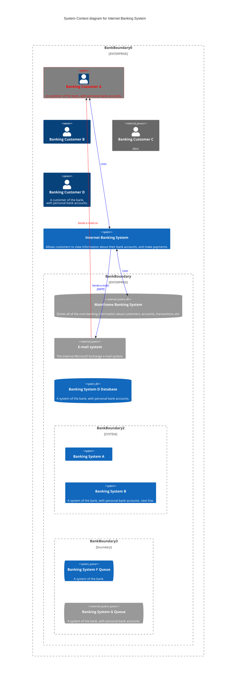
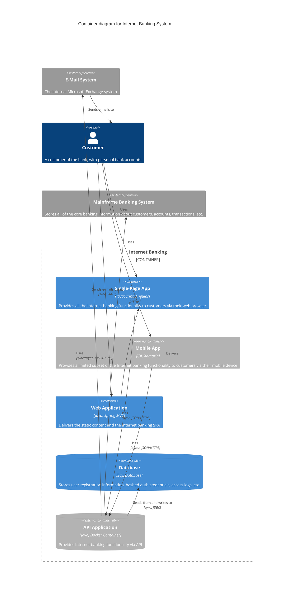
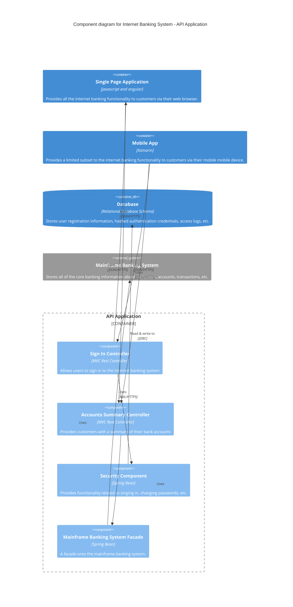
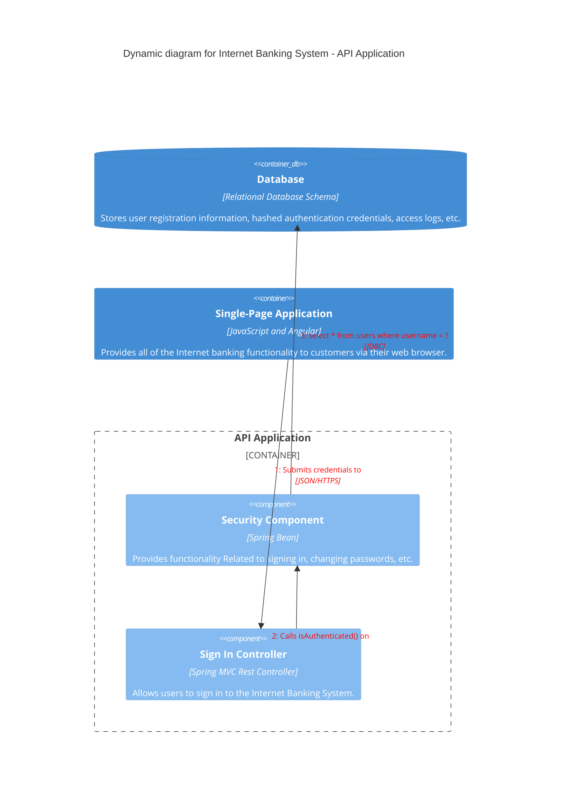
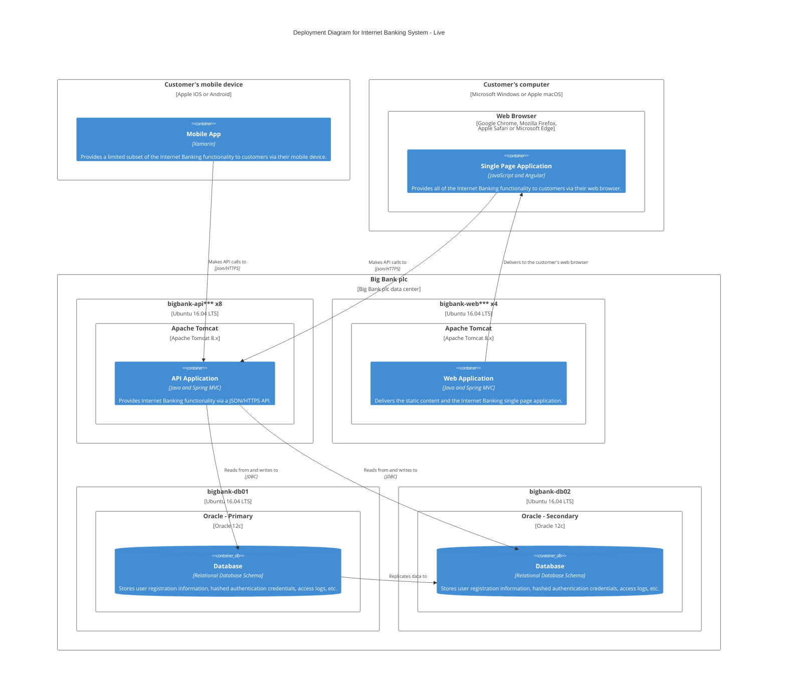

# 十一、C4图

> C4图：这是一个实验图。语法和属性可以在以后的版本中更改。当语法稳定时，将提供适当的文档。


## 11.1 C4图基础使用

Mermaid的C4图语法与plantUML兼容。请看下面的例子：

- 代码

```
    C4Context
      title System Context diagram for Internet Banking System
      Enterprise_Boundary(b0, "BankBoundary0") {
        Person(customerA, "Banking Customer A", "A customer of the bank, with personal bank accounts.")
        Person(customerB, "Banking Customer B")
        Person_Ext(customerC, "Banking Customer C", "desc")

        Person(customerD, "Banking Customer D", "A customer of the bank, <br/> with personal bank accounts.")

        System(SystemAA, "Internet Banking System", "Allows customers to view information about their bank accounts, and make payments.")

        Enterprise_Boundary(b1, "BankBoundary") {

          SystemDb_Ext(SystemE, "Mainframe Banking System", "Stores all of the core banking information about customers, accounts, transactions, etc.")

          System_Boundary(b2, "BankBoundary2") {
            System(SystemA, "Banking System A")
            System(SystemB, "Banking System B", "A system of the bank, with personal bank accounts. next line.")
          }

          System_Ext(SystemC, "E-mail system", "The internal Microsoft Exchange e-mail system.")
          SystemDb(SystemD, "Banking System D Database", "A system of the bank, with personal bank accounts.")

          Boundary(b3, "BankBoundary3", "boundary") {
            SystemQueue(SystemF, "Banking System F Queue", "A system of the bank.")
            SystemQueue_Ext(SystemG, "Banking System G Queue", "A system of the bank, with personal bank accounts.")
          }
        }
      }

      BiRel(customerA, SystemAA, "Uses")
      BiRel(SystemAA, SystemE, "Uses")
      Rel(SystemAA, SystemC, "Sends e-mails", "SMTP")
      Rel(SystemC, customerA, "Sends e-mails to")

      UpdateElementStyle(customerA, $fontColor="red", $bgColor="grey", $borderColor="red")
      UpdateRelStyle(customerA, SystemAA, $textColor="blue", $lineColor="blue", $offsetX="5")
      UpdateRelStyle(SystemAA, SystemE, $textColor="blue", $lineColor="blue", $offsetY="-10")
      UpdateRelStyle(SystemAA, SystemC, $textColor="blue", $lineColor="blue", $offsetY="-40", $offsetX="-50")
      UpdateRelStyle(SystemC, customerA, $textColor="red", $lineColor="red", $offsetX="-50", $offsetY="20")

      UpdateLayoutConfig($c4ShapeInRow="3", $c4BoundaryInRow="1")

```

- 展示图



例如，请参阅源代码demos/index.html

支持5种C4图表。

*   System Context 系统背景（C4Context）
*   Container diagram 容器图（C4Container）
*   Component diagram 组件图（C4Component）
*   Dynamic diagram 动态图（C4Dynamic）
*   Deployment diagram 部署图（C4Deployment）


关于如何编写C4图，请参阅链接的文档C4- plantuml语法。

C4图是固定样式，如css颜色，所以不同的皮肤下不提供不同的css。updateElementStyle和updateElementStyle写在图的最后一部分。updateElementStyle与原始定义不一致，并更新关系的样式，包括文本标签相对于原始位置的偏移量。

布局不使用完全自动化的布局算法。形状的位置可以通过改变语句的书写顺序来调整。因此不存在支持以下Layout语句的计划。每行形状的数量和边界的数量可以使用UpdateLayoutConfig进行调整。


有两种方法可以用问号来分配参数。一个按参数顺序使用非命名参数赋值方法，另一个使用命名参数赋值方法，其中名称必须以$符号开头。

示例：UpdateRelStyle（from, to, ?textColor, ?lineColor, ?offsetX, ?offsetY）

```
UpdateRelStyle(customerA, bankA, "red", "blue", "-40", "60")
UpdateRelStyle(customerA, bankA, $offsetX="-40", $offsetY="60", $lineColor="blue", $textColor="red")
UpdateRelStyle(customerA, bankA, $offsetY="60")
```

## 11.2 C4系统背景图（C4Context）

- 代码

```
    C4Context
      title System Context diagram for Internet Banking System
      Enterprise_Boundary(b0, "BankBoundary0") {
        Person(customerA, "Banking Customer A", "A customer of the bank, with personal bank accounts.")
        Person(customerB, "Banking Customer B")
        Person_Ext(customerC, "Banking Customer C", "desc")

        Person(customerD, "Banking Customer D", "A customer of the bank, <br/> with personal bank accounts.")

        System(SystemAA, "Internet Banking System", "Allows customers to view information about their bank accounts, and make payments.")

        Enterprise_Boundary(b1, "BankBoundary") {

          SystemDb_Ext(SystemE, "Mainframe Banking System", "Stores all of the core banking information about customers, accounts, transactions, etc.")

          System_Boundary(b2, "BankBoundary2") {
            System(SystemA, "Banking System A")
            System(SystemB, "Banking System B", "A system of the bank, with personal bank accounts. next line.")
          }

          System_Ext(SystemC, "E-mail system", "The internal Microsoft Exchange e-mail system.")
          SystemDb(SystemD, "Banking System D Database", "A system of the bank, with personal bank accounts.")

          Boundary(b3, "BankBoundary3", "boundary") {
            SystemQueue(SystemF, "Banking System F Queue", "A system of the bank.")
            SystemQueue_Ext(SystemG, "Banking System G Queue", "A system of the bank, with personal bank accounts.")
          }
        }
      }

      BiRel(customerA, SystemAA, "Uses")
      BiRel(SystemAA, SystemE, "Uses")
      Rel(SystemAA, SystemC, "Sends e-mails", "SMTP")
      Rel(SystemC, customerA, "Sends e-mails to")

      UpdateElementStyle(customerA, $fontColor="red", $bgColor="grey", $borderColor="red")
      UpdateRelStyle(customerA, SystemAA, $textColor="blue", $lineColor="blue", $offsetX="5")
      UpdateRelStyle(SystemAA, SystemE, $textColor="blue", $lineColor="blue", $offsetY="-10")
      UpdateRelStyle(SystemAA, SystemC, $textColor="blue", $lineColor="blue", $offsetY="-40", $offsetX="-50")
      UpdateRelStyle(SystemC, customerA, $textColor="red", $lineColor="red", $offsetX="-50", $offsetY="20")

      UpdateLayoutConfig($c4ShapeInRow="3", $c4BoundaryInRow="1")
```

- 展示图


## 11.3 C4集装箱图（C4Container）

- 代码

```
    C4Container
    title Container diagram for Internet Banking System

    System_Ext(email_system, "E-Mail System", "The internal Microsoft Exchange system", $tags="v1.0")
    Person(customer, Customer, "A customer of the bank, with personal bank accounts", $tags="v1.0")

    Container_Boundary(c1, "Internet Banking") {
        Container(spa, "Single-Page App", "JavaScript, Angular", "Provides all the Internet banking functionality to customers via their web browser")
        Container_Ext(mobile_app, "Mobile App", "C#, Xamarin", "Provides a limited subset of the Internet banking functionality to customers via their mobile device")
        Container(web_app, "Web Application", "Java, Spring MVC", "Delivers the static content and the Internet banking SPA")
        ContainerDb(database, "Database", "SQL Database", "Stores user registration information, hashed auth credentials, access logs, etc.")
        ContainerDb_Ext(backend_api, "API Application", "Java, Docker Container", "Provides Internet banking functionality via API")

    }

    System_Ext(banking_system, "Mainframe Banking System", "Stores all of the core banking information about customers, accounts, transactions, etc.")

    Rel(customer, web_app, "Uses", "HTTPS")
    UpdateRelStyle(customer, web_app, $offsetY="60", $offsetX="90")
    Rel(customer, spa, "Uses", "HTTPS")
    UpdateRelStyle(customer, spa, $offsetY="-40")
    Rel(customer, mobile_app, "Uses")
    UpdateRelStyle(customer, mobile_app, $offsetY="-30")

    Rel(web_app, spa, "Delivers")
    UpdateRelStyle(web_app, spa, $offsetX="130")
    Rel(spa, backend_api, "Uses", "async, JSON/HTTPS")
    Rel(mobile_app, backend_api, "Uses", "async, JSON/HTTPS")
    Rel_Back(database, backend_api, "Reads from and writes to", "sync, JDBC")

    Rel(email_system, customer, "Sends e-mails to")
    UpdateRelStyle(email_system, customer, $offsetX="-45")
    Rel(backend_api, email_system, "Sends e-mails using", "sync, SMTP")
    UpdateRelStyle(backend_api, email_system, $offsetY="-60")
    Rel(backend_api, banking_system, "Uses", "sync/async, XML/HTTPS")
    UpdateRelStyle(backend_api, banking_system, $offsetY="-50", $offsetX="-140")
```

- 展示图




## 11.4 C4组件图（C4Component）

- 代码

```
    C4Component
    title Component diagram for Internet Banking System - API Application

    Container(spa, "Single Page Application", "javascript and angular", "Provides all the internet banking functionality to customers via their web browser.")
    Container(ma, "Mobile App", "Xamarin", "Provides a limited subset to the internet banking functionality to customers via their mobile mobile device.")
    ContainerDb(db, "Database", "Relational Database Schema", "Stores user registration information, hashed authentication credentials, access logs, etc.")
    System_Ext(mbs, "Mainframe Banking System", "Stores all of the core banking information about customers, accounts, transactions, etc.")

    Container_Boundary(api, "API Application") {
        Component(sign, "Sign In Controller", "MVC Rest Controller", "Allows users to sign in to the internet banking system")
        Component(accounts, "Accounts Summary Controller", "MVC Rest Controller", "Provides customers with a summary of their bank accounts")
        Component(security, "Security Component", "Spring Bean", "Provides functionality related to singing in, changing passwords, etc.")
        Component(mbsfacade, "Mainframe Banking System Facade", "Spring Bean", "A facade onto the mainframe banking system.")

        Rel(sign, security, "Uses")
        Rel(accounts, mbsfacade, "Uses")
        Rel(security, db, "Read & write to", "JDBC")
        Rel(mbsfacade, mbs, "Uses", "XML/HTTPS")
    }

    Rel_Back(spa, sign, "Uses", "JSON/HTTPS")
    Rel(spa, accounts, "Uses", "JSON/HTTPS")

    Rel(ma, sign, "Uses", "JSON/HTTPS")
    Rel(ma, accounts, "Uses", "JSON/HTTPS")

    UpdateRelStyle(spa, sign, $offsetY="-40")
    UpdateRelStyle(spa, accounts, $offsetX="40", $offsetY="40")

    UpdateRelStyle(ma, sign, $offsetX="-90", $offsetY="40")
    UpdateRelStyle(ma, accounts, $offsetY="-40")

        UpdateRelStyle(sign, security, $offsetX="-160", $offsetY="10")
        UpdateRelStyle(accounts, mbsfacade, $offsetX="140", $offsetY="10")
        UpdateRelStyle(security, db, $offsetY="-40")
        UpdateRelStyle(mbsfacade, mbs, $offsetY="-40")
```

- 展示图




## C4动态图（C4Dynamic）

- 代码

```
    C4Dynamic
    title Dynamic diagram for Internet Banking System - API Application

    ContainerDb(c4, "Database", "Relational Database Schema", "Stores user registration information, hashed authentication credentials, access logs, etc.")
    Container(c1, "Single-Page Application", "JavaScript and Angular", "Provides all of the Internet banking functionality to customers via their web browser.")
    Container_Boundary(b, "API Application") {
      Component(c3, "Security Component", "Spring Bean", "Provides functionality Related to signing in, changing passwords, etc.")
      Component(c2, "Sign In Controller", "Spring MVC Rest Controller", "Allows users to sign in to the Internet Banking System.")
    }
    Rel(c1, c2, "Submits credentials to", "JSON/HTTPS")
    Rel(c2, c3, "Calls isAuthenticated() on")
    Rel(c3, c4, "select * from users where username = ?", "JDBC")

    UpdateRelStyle(c1, c2, $textColor="red", $offsetY="-40")
    UpdateRelStyle(c2, c3, $textColor="red", $offsetX="-40", $offsetY="60")
    UpdateRelStyle(c3, c4, $textColor="red", $offsetY="-40", $offsetX="10")
```

- 展示图




## C4部署图（C4Deployment）

- 代码

```
    C4Deployment
    title Deployment Diagram for Internet Banking System - Live

    Deployment_Node(mob, "Customer's mobile device", "Apple IOS or Android"){
        Container(mobile, "Mobile App", "Xamarin", "Provides a limited subset of the Internet Banking functionality to customers via their mobile device.")
    }

    Deployment_Node(comp, "Customer's computer", "Microsoft Windows or Apple macOS"){
        Deployment_Node(browser, "Web Browser", "Google Chrome, Mozilla Firefox,<br/> Apple Safari or Microsoft Edge"){
            Container(spa, "Single Page Application", "JavaScript and Angular", "Provides all of the Internet Banking functionality to customers via their web browser.")
        }
    }

    Deployment_Node(plc, "Big Bank plc", "Big Bank plc data center"){
        Deployment_Node(dn, "bigbank-api*** x8", "Ubuntu 16.04 LTS"){
            Deployment_Node(apache, "Apache Tomcat", "Apache Tomcat 8.x"){
                Container(api, "API Application", "Java and Spring MVC", "Provides Internet Banking functionality via a JSON/HTTPS API.")
            }
        }
        Deployment_Node(bb2, "bigbank-web*** x4", "Ubuntu 16.04 LTS"){
            Deployment_Node(apache2, "Apache Tomcat", "Apache Tomcat 8.x"){
                Container(web, "Web Application", "Java and Spring MVC", "Delivers the static content and the Internet Banking single page application.")
            }
        }
        Deployment_Node(bigbankdb01, "bigbank-db01", "Ubuntu 16.04 LTS"){
            Deployment_Node(oracle, "Oracle - Primary", "Oracle 12c"){
                ContainerDb(db, "Database", "Relational Database Schema", "Stores user registration information, hashed authentication credentials, access logs, etc.")
            }
        }
        Deployment_Node(bigbankdb02, "bigbank-db02", "Ubuntu 16.04 LTS") {
            Deployment_Node(oracle2, "Oracle - Secondary", "Oracle 12c") {
                ContainerDb(db2, "Database", "Relational Database Schema", "Stores user registration information, hashed authentication credentials, access logs, etc.")
            }
        }
    }

    Rel(mobile, api, "Makes API calls to", "json/HTTPS")
    Rel(spa, api, "Makes API calls to", "json/HTTPS")
    Rel_U(web, spa, "Delivers to the customer's web browser")
    Rel(api, db, "Reads from and writes to", "JDBC")
    Rel(api, db2, "Reads from and writes to", "JDBC")
    Rel_R(db, db2, "Replicates data to")

    UpdateRelStyle(spa, api, $offsetY="-40")
    UpdateRelStyle(web, spa, $offsetY="-40")
    UpdateRelStyle(api, db, $offsetY="-20", $offsetX="5")
    UpdateRelStyle(api, db2, $offsetX="-40", $offsetY="-20")
    UpdateRelStyle(db, db2, $offsetY="-10")
```

- 展示图


