# 十二、思维导图

> 思维导图：这是一个实验性的图表。语法和属性可以在以后的版本中更改。除了图标集成是实验部分外，语法是稳定的。

思维导图是一种用来直观地将信息组织成层次结构的图表，显示了整体各部分之间的关系。它通常是围绕一个单一的概念创建的，在空白页面的中心绘制一个图像，并在此基础上添加图像，单词和单词部分等相关概念的表示。主要思想直接与中心概念相连，而其他思想则从这些主要思想中衍生出来。”维基百科

## 12.1 一个思维导图的例子

- 代码

```
mindmap
  root((mindmap))
    Origins
      Long history
      ::icon(fa fa-book)
      Popularisation
        British popular psychology author Tony Buzan
    Research
      On effectiveness<br/>and features
      On Automatic creation
        Uses
            Creative techniques
            Strategic planning
            Argument mapping
    Tools
      Pen and paper
      Mermaid
```

- 展示图

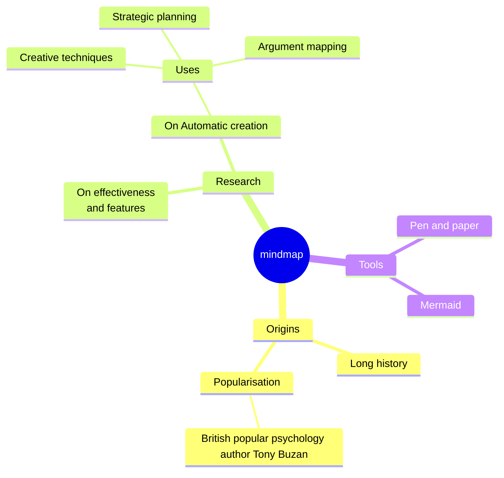

## 12.2 语法

创建思维导图的语法很简单，并且依赖于缩进来设置层次结构中的级别。

在下面的例子中，你可以看到有3个不同的关卡。一层从文本的左侧开始，另一层有两行从同一列开始，定义节点a。在最后还有一层，其中文本比前面定义节点B和C的行进一步缩进。

```
mindmap
    Root
        A
            B
            C
```

总之是一个简单的文本大纲，其中在根级别有一个节点称为 `Root` ，它有一个子节点 `A` 。 `A` 依次有两个子节点 `B` 和 `C` 。在下面的图表中，我们可以看到这是一个思维导图。

- 代码

```
mindmap
Root
    A
      B
      C
```

- 展示图

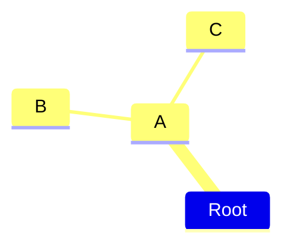


通过这种方式，我们可以使用文本大纲来生成分层思维导图。

## 12.3 不同的形状

美人鱼思维导图可以用不同的形状来显示节点。在为节点指定形状时，语法类似于流程图节点，其id后跟形状定义，并且形状分隔符中包含文本。在可能的情况下，我们尝试/将尝试保持与流程图相同的形状，即使它们从一开始就不支持。

思维导图可以显示以下形状：

1. 矩形

- 代码

```
mindmap
    id[I am a square]
```

- 展示图

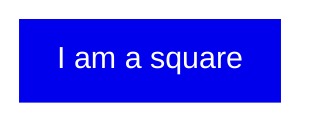


2. 圆边矩形

- 代码

```
mindmap
    id(I am a rounded square)
```

- 展示图

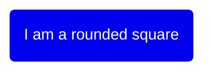

3. 圆

- 代码

```
mindmap
    id((I am a circle))
```

- 展示图

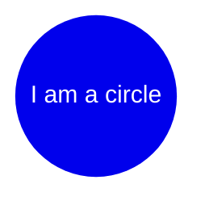


4. 爆炸

- 代码

```
mindmap
    id))I am a bang((
```

- 展示图

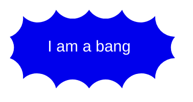

5. 云

- 代码

```
mindmap
    id)I am a cloud(
```

- 展示图

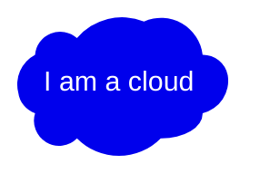

6. 六角

- 代码

```
mindmap
    id{{I am a hexagon}}
```

- 展示图

<!-- 由于有{{}} 在vue会有错误
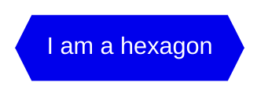
-->


7. 默认

- 代码

```
mindmap
    I am the default shape
```

- 展示图

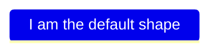

I am the default shape

将添加更多的形状，从流程图中可用的形状开始。


## 12.4 图标

与流程图一样，您可以向节点添加图标，但要使用更新的语法。基于字体的图标样式是在集成过程中添加的，这样它们就可以在网页上使用。这不是图表作者可以做的事情，而是必须与站点管理员或集成商一起完成。一旦图标字体就位，使用 `::icon()` 语法将它们添加到思维导图节点。您将图标的类放在括号内，就像下面的示例一样，其中显示了material design和Font Awesome 5的图标。这样做的目的是，所有支持图标的图表都应该使用这种方法。实验特性：这种更广泛的范围也是思维导图是实验性的原因，因为这种语法和方法可能会改变。

- 代码

```
mindmap
    Root
        A
        ::icon(fa fa-book)
        B(B)
        ::icon(mdi mdi-skull-outline)
```

- 展示图

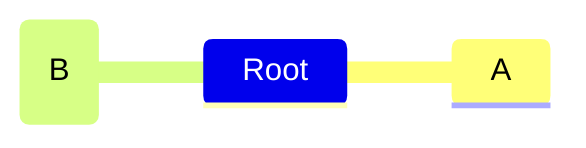

## 12.5 类

添加类的语法同样类似于流程图。您可以在多个css类后面用空格分隔的三个冒号来添加类。在下面的例子中，其中一个节点附带了两个自定义类，紧急将背景变为红色，文本变为白色，并增加字体大小：

- 代码

```
mindmap
    Root
        A[A]
        :::urgent large
        B(B)
        C
```

- 展示图

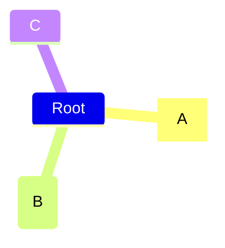

_这些类需要由站点管理员提供。_

## 12.6 缩进

实际的缩进并不重要，只是与前几行进行比较。如果我们把前面的例子稍微打乱一下，我们可以看到计算是如何进行的。让我们先用比 `B` 更小但比 `A` 更大的缩进放置C。

```plain
mindmap
    Root
        A
            B
          C
```

这个轮廓是不清楚的，因为 `B` 显然是 `A` 的子元素，但是当我们移动到 `C` 时，清晰度就丢失了。 `C` 不是具有更高缩进的 `B` 的子元素，也不具有与 `B` 相同的缩进。唯一清楚的是，第一个缩进较小的节点（表示父节点）是a。然后Mermaid依赖于这个已知的事实，并补偿了不清楚的缩进，选择 `A` 作为 `C` 的父节点，直到相同的图中 `B` 和 `C` 作为兄弟节点。

- 代码

```
mindmap
Root
    A
        B
      C
```

- 展示图


## 12.7 markdown字符串

“标记字符串”功能通过提供更通用的字符串类型来增强思维导图，它支持文本格式选项，如粗体和斜体，并自动在标签内包装文本。

- 代码

```
mindmap
    id1["`**Root** with
a second line
Unicode works too: 🤓`"]
      id2["`The dog in **the** hog... a *very long text* that wraps to a new line`"]
      id3[Regular labels still works]
```

- 展示图

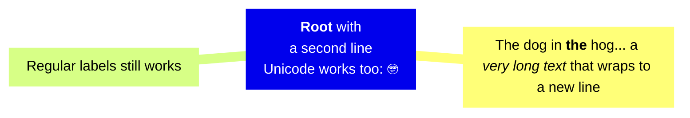


格式:

*   对于粗体文本，在文本前后使用双星号\*\*。
*   对于斜体，在文本前后使用单个星号\*。
*   标签。