# 十三、时间轴

> 时间轴：这是一个实验性的图表。语法和属性可以在以后的版本中更改。除了图标集成是实验部分外，语法是稳定的。

时间轴是一种图表，用来说明事件、日期或时间段的年表。它通常以图形形式表示时间的流逝，并且通常按时间顺序组织。一个基本的时间轴以时间顺序呈现一系列事件，通常使用日期作为标记。时间轴也可以用来显示事件之间的关系，比如一个人一生中事件之间的关系”（维基百科）。

## 13.1 一个时间轴的例子

- 代码

```
timeline
    title History of Social Media Platform
    2002 : LinkedIn
    2004 : Facebook
         : Google
    2005 : YouTube
    2006 : Twitter
```

- 展示图

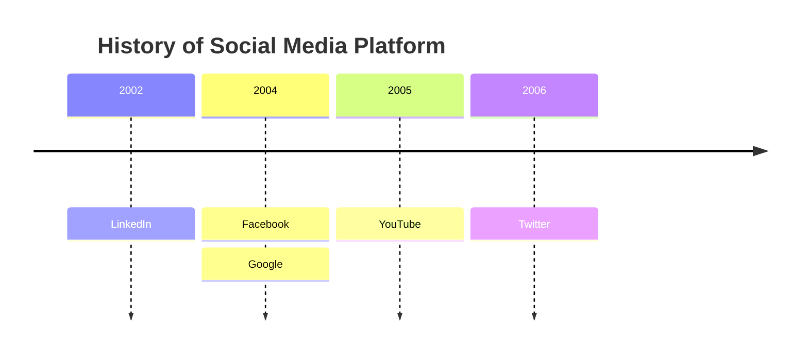


## 13.2 语法

创建时间轴图的语法很简单。你总是以 `timeline` 关键字开始，让美人鱼知道你想创建一个时间轴图。

之后，有可能添加一个标题到时间轴。这是通过在标题文本后面添加关键字 `title` 的行来完成的。

然后添加时间轴数据，其中总是以时间段开始，后跟冒号，然后是事件的文本。也可以添加第二个冒号，然后是事件的文本。因此，每个时间段可以有一个或多个事件。


```json
{time period} : {event}
```
--- 
```json
{time period} : {event} : {event}
```
---
```json
{time period} : {event}
              : {event}
              : {event}
```

>注意：时间段和事件都是简单的文本，不限于数字。

让我们看一下上面示例的语法。

- 代码

```
timeline
    title History of Social Media Platform
    2002 : LinkedIn
    2004 : Facebook : Google
    2005 : YouTube
    2006 : Twitter
```

- 展示图


通过这种方式，我们可以使用文本大纲来生成时间轴图。时间段和事件的顺序很重要，因为它将用于绘制时间轴。第一个时间段将被放置在时间轴的左侧，最后一个时间段将被放置在时间轴的右侧。

类似地，第一个事件将被放置在该特定时间段的顶部，最后一个事件将被放置在底部。

## 12.3 分段/年龄的时间段分组

您可以将时间段分组为部分/年龄。这是通过添加一行关键字 `section` ，后面跟着节名来实现的。

在定义新部分之前，所有后续的时间段都将放在该部分中。

如果没有定义区段，所有的时间段将被放置在默认区段中。

让我们看一个例子，其中我们将时间段分组为几个部分。

- 代码

```
timeline
    title Timeline of Industrial Revolution
    section 17th-20th century
        Industry 1.0 : Machinery, Water power, Steam <br>power
        Industry 2.0 : Electricity, Internal combustion engine, Mass production
        Industry 3.0 : Electronics, Computers, Automation
    section 21st century
        Industry 4.0 : Internet, Robotics, Internet of Things
        Industry 5.0 : Artificial intelligence, Big data, 3D printing
```

- 展示图

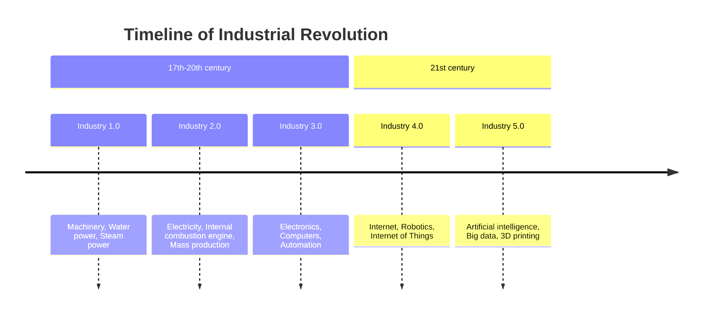

正如您所看到的，时间段被放置在各个部分中，各个部分按照定义的顺序放置。

所有的时间段和事件在一个给定的部分遵循类似的配色方案。这样做是为了更容易看到时间段和事件之间的关系。

## 12.4 为长时间段或事件的文本进行换行

默认情况下，如果时间段和事件的文本太长，则将对其进行换行。这样做是为了避免在图外绘制文本。

还可以使用 `<br>` 强制换行。

让我们看另一个例子，我们有一个很长的时间段和一个很长的事件。

- 代码

```
timeline
        title England's History Timeline
        section Stone Age
          7600 BC : Britain's oldest known house was built in Orkney, Scotland
          6000 BC : Sea levels rise and Britain becomes an island.<br> The people who live here are hunter-gatherers.
        section Bronze Age
          2300 BC : People arrive from Europe and settle in Britain. <br>They bring farming and metalworking.
                  : New styles of pottery and ways of burying the dead appear.
          2200 BC : The last major building works are completed at Stonehenge.<br> People now bury their dead in stone circles.
                  : The first metal objects are made in Britain.Some other nice things happen. it is a good time to be alive.
```

- 展示图

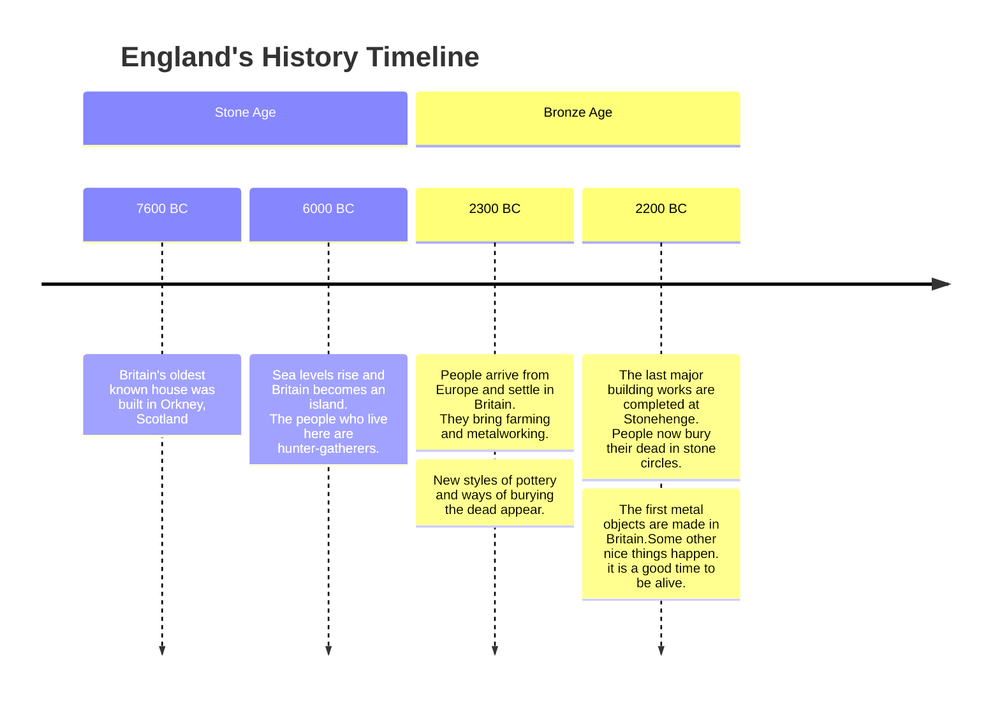


- 代码

```
timeline
        title MermaidChart 2023 Timeline
        section 2023 Q1 <br> Release Personal Tier
          Bullet 1 : sub-point 1a : sub-point 1b
               : sub-point 1c
          Bullet 2 : sub-point 2a : sub-point 2b
        section 2023 Q2 <br> Release XYZ Tier
          Bullet 3 : sub-point <br> 3a : sub-point 3b
               : sub-point 3c
          Bullet 4 : sub-point 4a : sub-point 4b
```

- 展示图

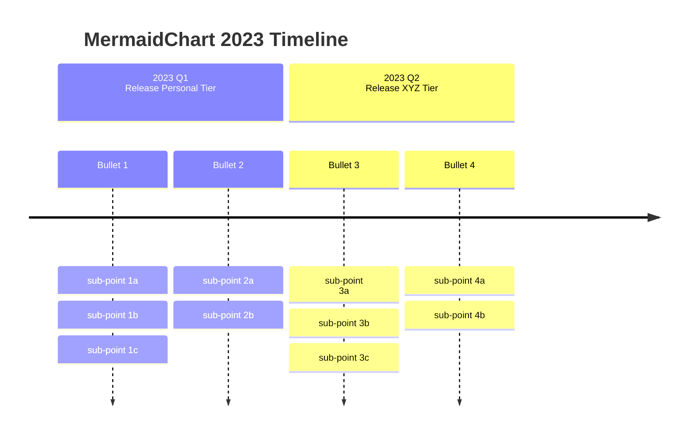


## 12.5 时间段和事件的样式化


### 12.5.1 基础配色

如前所述，每个部分都有一个配色方案，每个部分下的每个时间段和事件都遵循类似的配色方案。

但是，如果没有定义section，则有两种可能性：

1.  单独设置时间段的样式，即每个时间段（及其对应的事件）都有自己的配色方案。这是默认行为。

- 代码

```
    timeline
        title History of Social Media Platform
          2002 : LinkedIn
          2004 : Facebook : Google
          2005 : YouTube
          2006 : Twitter
```

- 展示图


注意：没有定义分段，每个时间段及其对应的事件都有自己的配色方案。

2.  使用 `disableMultiColor` 选项禁用多色选项。这将使所有的时间段和事件遵循相同的配色方案。

您将需要通过mermaid添加此选项。初始化函数或指令。

javascript

```
mermaid.initialize({
        theme: 'base',
        startOnLoad: true,
        logLevel: 0,
        timeline: {
          disableMulticolor: false,
        },
        ...
        ...
```

让我们看一下同样的例子，其中我们禁用了multiccolor选项。

- 代码

```
   %%{init: { 'logLevel': 'debug', 'theme': 'base', 'timeline': {'disableMulticolor': true}}}%%
    timeline
        title History of Social Media Platform
          2002 : LinkedIn
          2004 : Facebook : Google
          2005 : YouTube
          2006 : Twitter
```

- 展示图

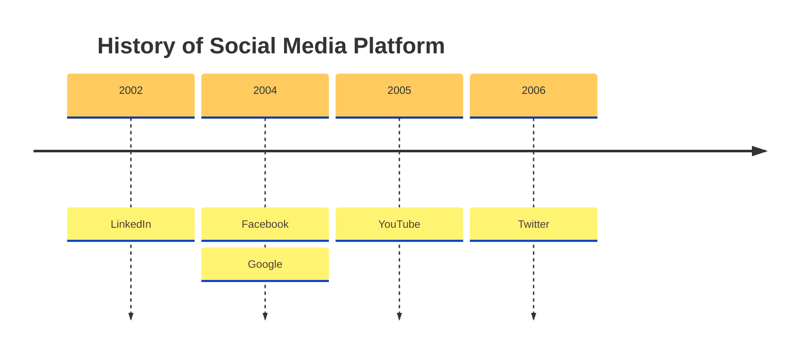

### 12.5.2 定制配色方案

您可以使用 `cScale0` 到 `cScale11` 主题变量自定义配色方案，这将改变背景颜色。Mermaid允许您为多达12个部分设置唯一的颜色，其中 `cScale0` 变量将驱动第一个部分或时间段的值， `cScale1` 将驱动第二个部分的值，依此类推。如果你有超过12个部分，配色方案将开始重复。

如果你还想改变一个部分的前景色，你可以使用相应的主题变量 `cScaleLabel0` 到 `cScaleLabel11` 变量。

注意：这些主题变量的默认值是从选定的主题中选取的。如果要覆盖默认值，可以使用 `initialize` 调用来添加自定义主题变量值。

例子:

现在让我们重写 `cScale0` 到 `cScale2` 变量的默认值：

- 代码

```
    %%{init: { 'logLevel': 'debug', 'theme': 'default' , 'themeVariables': {
              'cScale0': '#ff0000', 'cScaleLabel0': '#ffffff',
              'cScale1': '#00ff00',
              'cScale2': '#0000ff', 'cScaleLabel2': '#ffffff'
       } } }%%
       timeline
        title History of Social Media Platform
          2002 : LinkedIn
          2004 : Facebook : Google
          2005 : YouTube
          2006 : Twitter
          2007 : Tumblr
          2008 : Instagram
          2010 : Pinterest
```

- 展示图

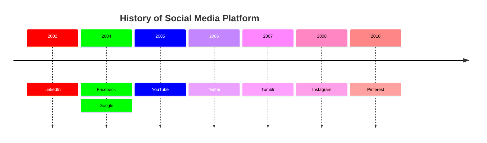


查看如何将颜色更改为主题变量中指定的值。

## 12.6 主题

美人鱼支持一堆预定义的主题，你可以用它来找到适合你的。PS：你实际上可以覆盖一个现有的主题的变量，让你自己的自定义主题。在这里了解更多关于图表主题化的信息。

以下是不同的预定义主题选项：

*   `base`
*   `forest`
*   `dark`
*   `default`
*   `neutral`

注意：要更改主题，你可以使用 `initialize` 调用或指令。让我们来使用它们，看看我们的示例图在不同的主题中是怎样的：

### 12.6.1 基本主题

- 代码

```
%%{init: { 'logLevel': 'debug', 'theme': 'base' } }%%
    timeline
        title History of Social Media Platform
          2002 : LinkedIn
          2004 : Facebook : Google
          2005 : YouTube
          2006 : Twitter
          2007 : Tumblr
          2008 : Instagram
          2010 : Pinterest
```

- 展示图

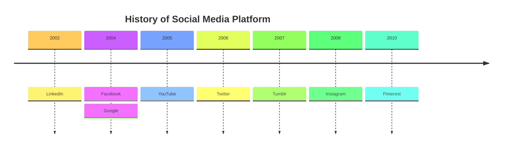


### 12.6.2 森林主题

- 代码

```
%%{init: { 'logLevel': 'debug', 'theme': 'forest' } }%%
    timeline
        title History of Social Media Platform
          2002 : LinkedIn
          2004 : Facebook : Google
          2005 : YouTube
          2006 : Twitter
          2007 : Tumblr
          2008 : Instagram
          2010 : Pinterest
```

- 展示图

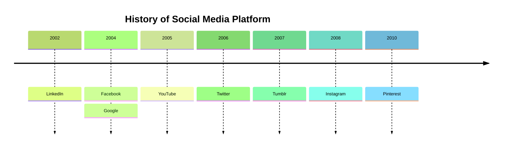


### 12.6.3 黑暗的主题

- 代码

```
%%{init: { 'logLevel': 'debug', 'theme': 'dark' } }%%
    timeline
        title History of Social Media Platform
          2002 : LinkedIn
          2004 : Facebook : Google
          2005 : YouTube
          2006 : Twitter
          2007 : Tumblr
          2008 : Instagram
          2010 : Pinterest
```

- 展示图

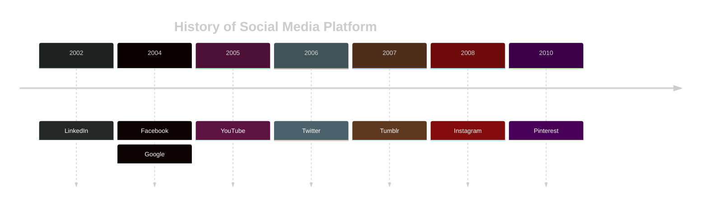


### 12.6.4 默认主题

- 代码

```
%%{init: { 'logLevel': 'debug', 'theme': 'default' } }%%
    timeline
        title History of Social Media Platform
          2002 : LinkedIn
          2004 : Facebook : Google
          2005 : YouTube
          2006 : Twitter
          2007 : Tumblr
          2008 : Instagram
          2010 : Pinterest
```

- 展示图

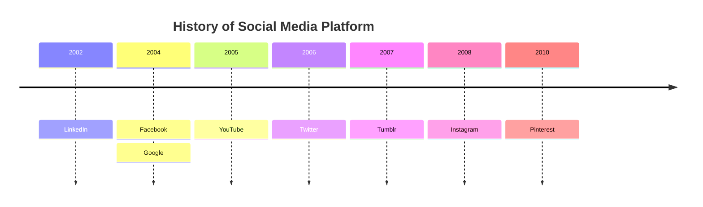


### 12.6.5 暗淡主题

- 代码

```
%%{init: { 'logLevel': 'debug', 'theme': 'neutral' } }%%
    timeline
        title History of Social Media Platform
          2002 : LinkedIn
          2004 : Facebook : Google
          2005 : YouTube
          2006 : Twitter
          2007 : Tumblr
          2008 : Instagram
          2010 : Pinterest
```

- 展示图

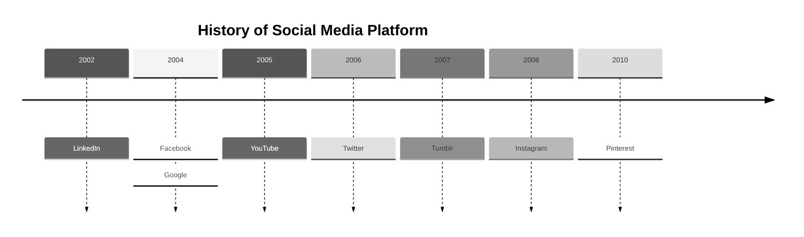