# 十四、ZenUM序列图

> 序列图是一种交互图，它显示了流程如何相互操作以及以何种顺序操作。


## 14.1 序列图基础使用

Mermaid可以用ZenUML呈现序列图。注意，ZenUML使用了与mermaid中原始序列图不同的语法。

- 代码

```
zenuml
    title Demo
    Alice->John: Hello John, how are you?
    John->Alice: Great!
    Alice->John: See you later!
```

- 展示图

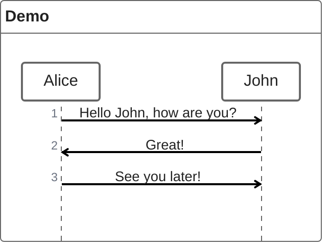


## 14.2 语法

### 14.2.1 参与者

参与者可以隐式地定义，如本页第一个示例所示。参与者或参与者在图源文本中按外观顺序呈现。有时，您可能希望以不同于第一条消息中的顺序显示参与者。可以通过执行以下操作来指定演员的出场顺序：

- 代码

```
zenuml
    title Declare participant (optional)
    Bob
    Alice
    Alice->Bob: Hi Bob
    Bob->Alice: Hi Alice
```

- 展示图

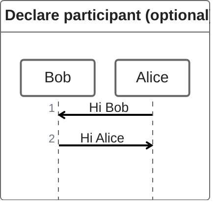


### 14.2.2 注解者

如果你特别想使用符号而不是带文本的矩形，你可以使用注释器语法来声明参与者，如下所示。

- 代码

```
zenuml
    title Annotators
    @Actor Alice
    @Database Bob
    Alice->Bob: Hi Bob
    Bob->Alice: Hi Alice
```

- 展示图

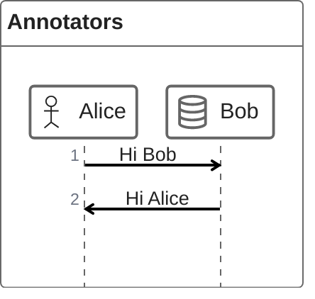


注释器列表：


### 14.2.3 别名

参与者可以有一个方便的标识符和描述性标签。

- 代码

```
zenuml
    title Aliases
    A as Alice
    J as John
    A->J: Hello John, how are you?
    J->A: Great!
```

- 展示图

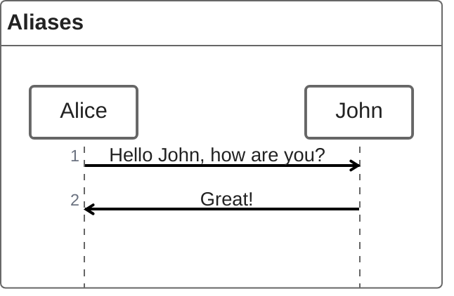


## 14.3 消息

消息可以是：

1.  同步消息
2.  异步消息
3.  创建消息
4.  回复消息

### 14.3.1 同步消息

您可以考虑编程语言中的同步（阻塞）方法。

- 代码

```
zenuml
    title Sync message
    A.SyncMessage
    A.SyncMessage(with, parameters) {
      B.nestedSyncMessage()
    }
```

- 展示图

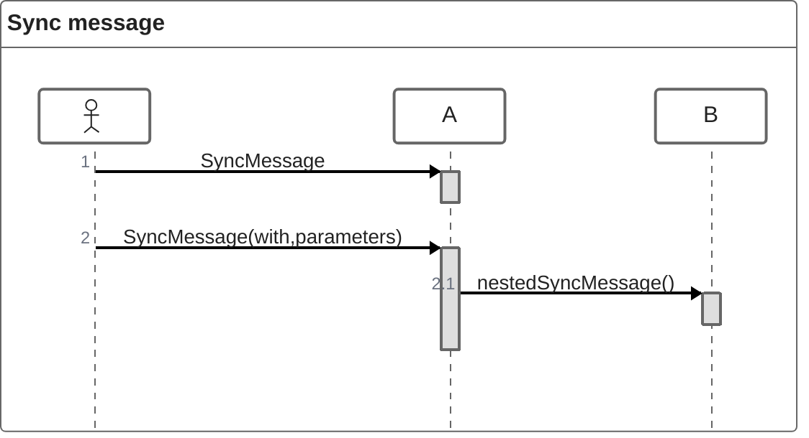


### 14.3.2 异步消息

您可以考虑编程语言中的异步（非阻塞）方法。触发一个事件，然后忘记它。

- 代码

```
zenuml
    title Async message
    Alice->Bob: How are you?
```

- 展示图

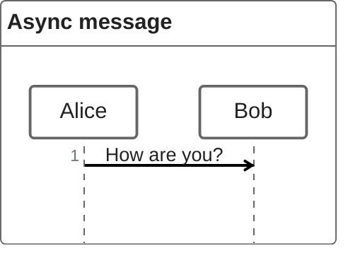


### 14.3.3 创建消息

我们使用 `new` 关键字创建对象。

- 代码

```
zenuml
    new A1
    new A2(with, parameters)
```

- 展示图

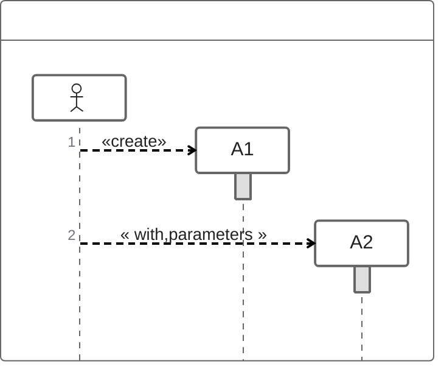


### 14.3.4 回复消息

回复信息有三种表达方式：

- 代码

```
zenuml
    // 1. assign a variable from a sync message.
    a = A.SyncMessage()

    // 1.1. optionally give the variable a type
    SomeType a = A.SyncMessage()

    // 2. use return keyword
    A.SyncMessage() {
    return result
    }

    // 3. use @return or @reply annotator on an async message
    @return
    A->B: result
```

- 展示图

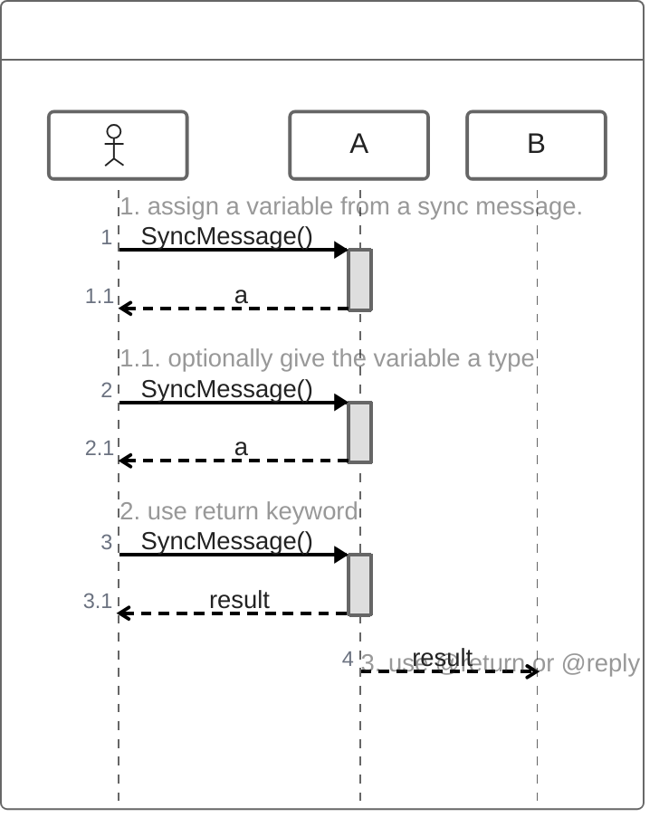


第三种方式 `@return` 很少使用，但是当您想要返回到上一级时，它很有用。

- 代码

```
zenuml
    title Reply message
    Client->A.method() {
      B.method() {
        if(condition) {
          return x1
          // return early
          @return
          A->Client: x11
        }
      }
      return x2
    }
```

- 展示图

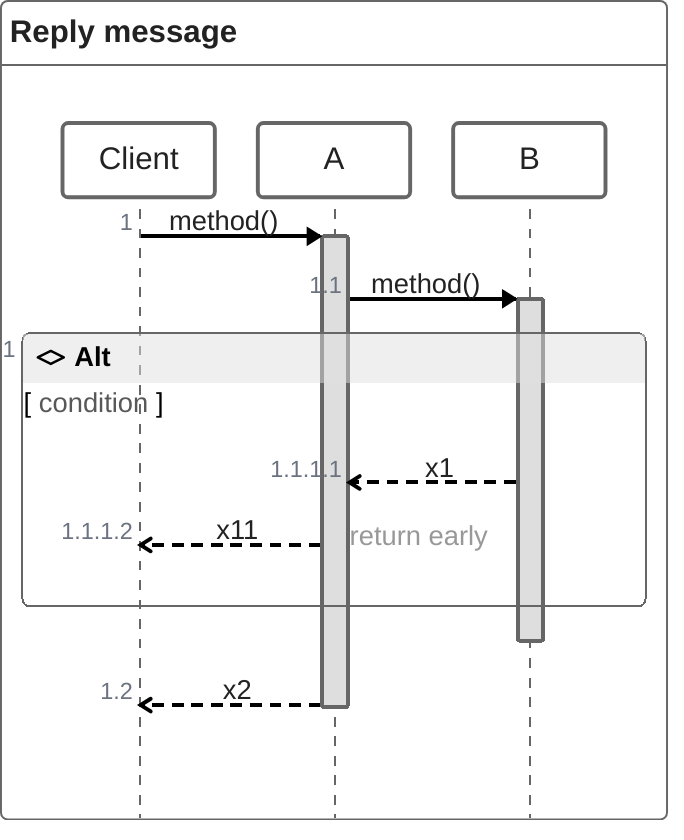


## 14.4 嵌套

同步消息和创建消息自然可以嵌套在 `{}` 。

- 代码

```
zenuml
    A.method() {
      B.nested_sync_method()
      B->C: nested async message
    }
```

- 展示图

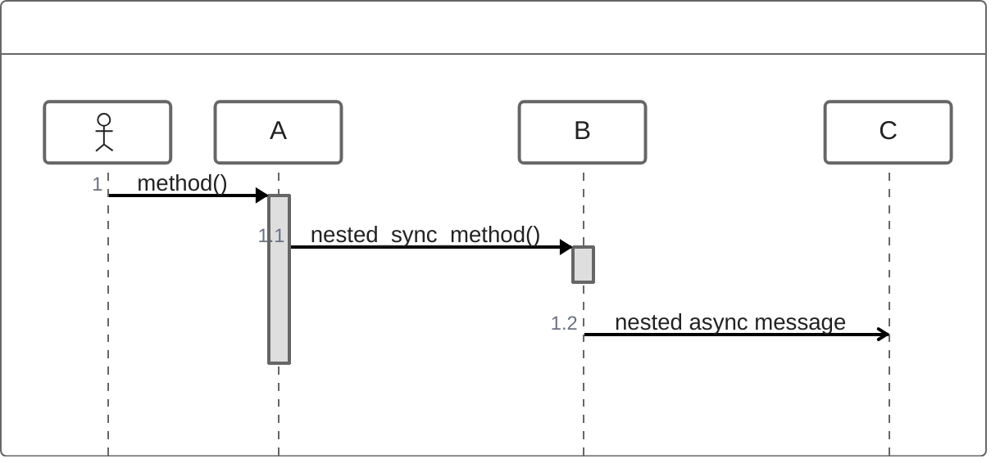


## 14.5 注释

可以使用 `// comment` 语法向序列图添加注释。注释将呈现在消息或片段的上方。其他地方的评论被忽略。支持降价。

请看下面的例子：

- 代码

```
zenuml
    // a comment on a participant will not be rendered
    BookService
    // a comment on a message.
    // **Markdown** is supported.
    BookService.getBook()
```

- 展示图

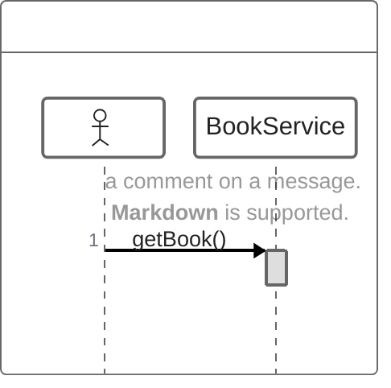


## 14.6 循环

可以在ZenUML图中表示循环。这可以通过以下任何一种符号来完成：

1.  而
2.  为
3.  forEach, forEach
4.  循环


```
while(condition) {
    ...statements...
}
```

请看下面的例子：

- 代码

```
zenuml
    Alice->John: Hello John, how are you?
    while(true) {
      John->Alice: Great!
    }
```

- 展示图

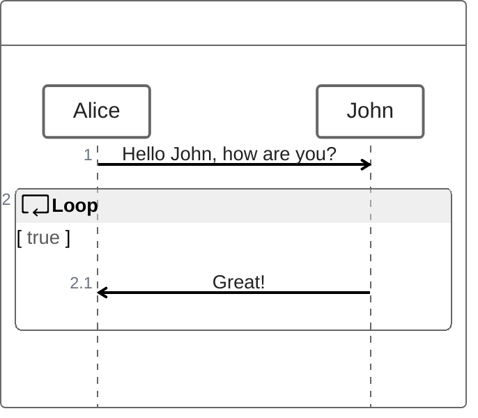


## 14.7 alt 选择

在序列图中表达可选路径是可能的。这是用符号表示的


```
if(condition1) {
    ...statements...
} else if(condition2) {
    ...statements...
} else {
    ...statements...
}
```

请看下面的例子：

- 代码

```
zenuml
    Alice->Bob: Hello Bob, how are you?
    if(is_sick) {
      Bob->Alice: Not so good :(
    } else {
      Bob->Alice: Feeling fresh like a daisy
    }
```

- 展示图

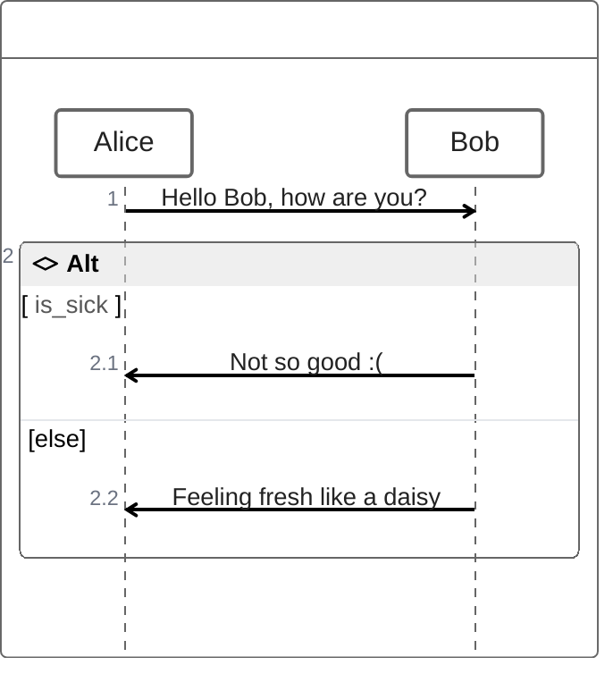


## 14.8 opt 选择

可以渲染 `opt` 片段。这是用符号表示的

```
opt {
  ...statements...
}
```

请看下面的例子：

- 代码

```
zenuml
    Alice->Bob: Hello Bob, how are you?
    Bob->Alice: Not so good :(
    opt {
      Bob->Alice: Thanks for asking
    }
```

- 展示图

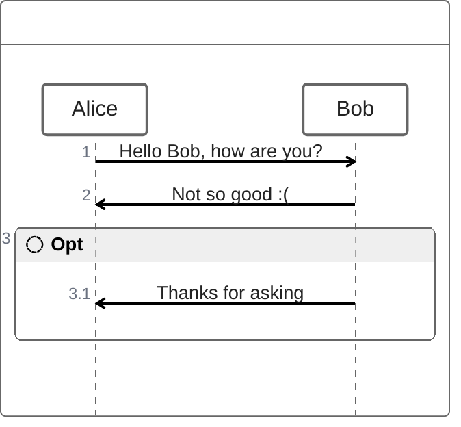


## 14.8 并行

可以显示并行发生的操作。

```
par {
  statement1
  statement2
  statement3
}
```

请看下面的例子：

- 代码

```
zenuml
    par {
        Alice->Bob: Hello guys!
        Alice->John: Hello guys!
    }
```

- 展示图

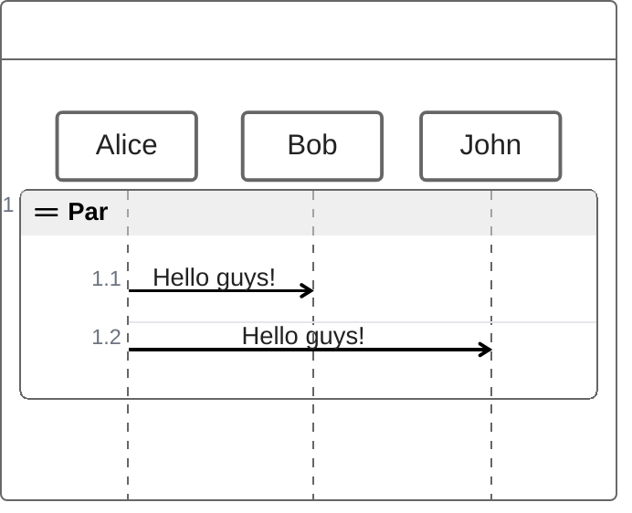

## 14.9 Try / Catch / Finally

可以在流中指示序列的停止（通常用于对异常建模）。


```
try {
  ...statements...
} catch {
  ...statements...
} finally {
  ...statements...
}
```

请看下面的例子：

- 代码

```
zenuml
    try {
      Consumer->API: Book something
      API->BookingService: Start booking process
    } catch {
      API->Consumer: show failure
    } finally {
      API->BookingService: rollback status
    }
```

- 展示图

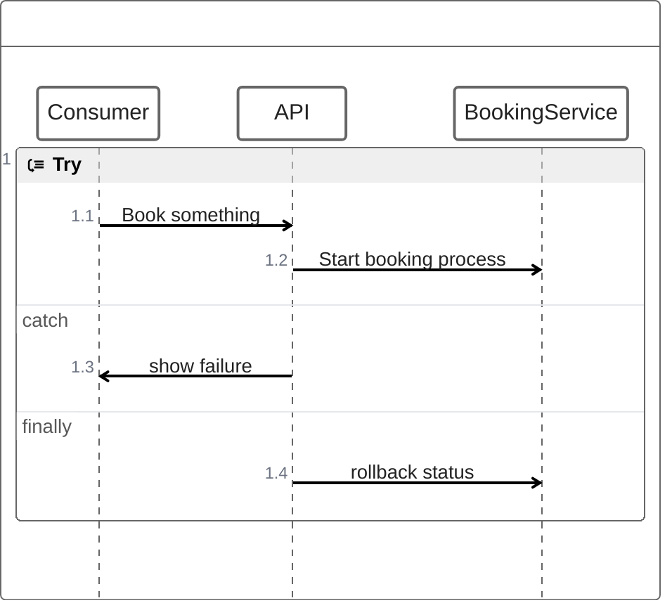


## 14.10 与您的图书馆/网站集成。

Zenuml使用实验性的延迟加载和异步渲染特性，这些特性在将来可能会改变。

你可以使用这个方法将美人鱼（包括zenuml图）添加到网页中：


```html
<script type="module">
  import mermaid from 'https://cdn.jsdelivr.net/npm/mermaid@10/dist/mermaid.esm.min.mjs';
  import zenuml from 'https://cdn.jsdelivr.net/npm/@mermaid-js/mermaid-zenuml@0.1.0/dist/mermaid-zenuml.esm.min.mjs';
  await mermaid.registerExternalDiagrams([zenuml]);
</script>
```