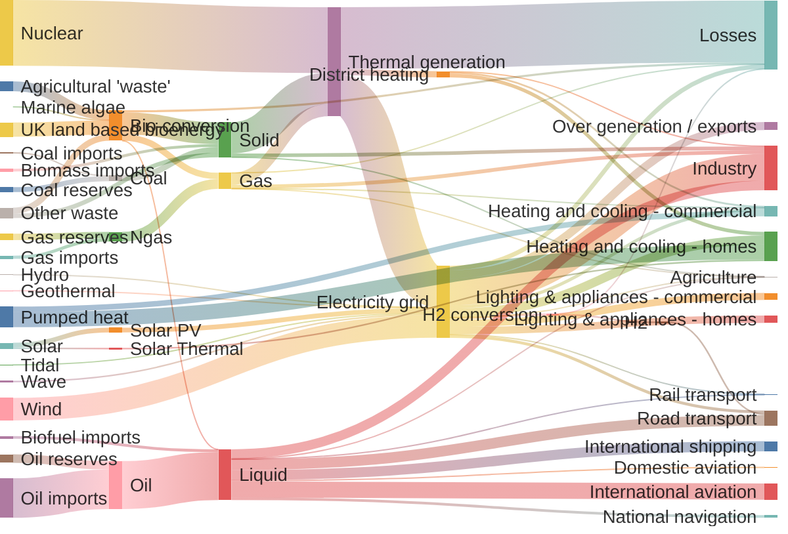
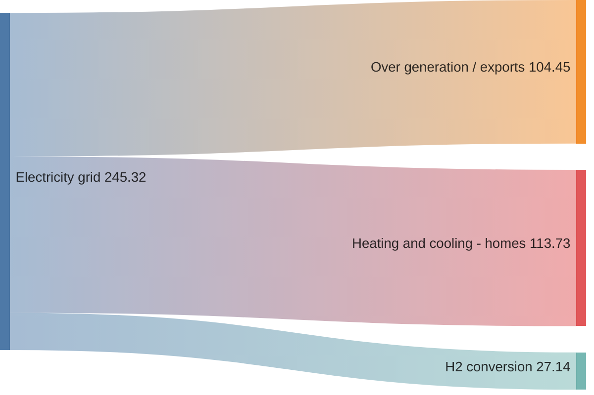
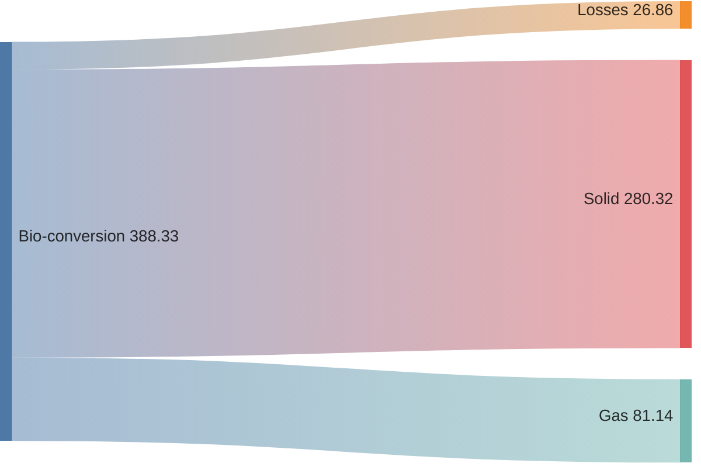
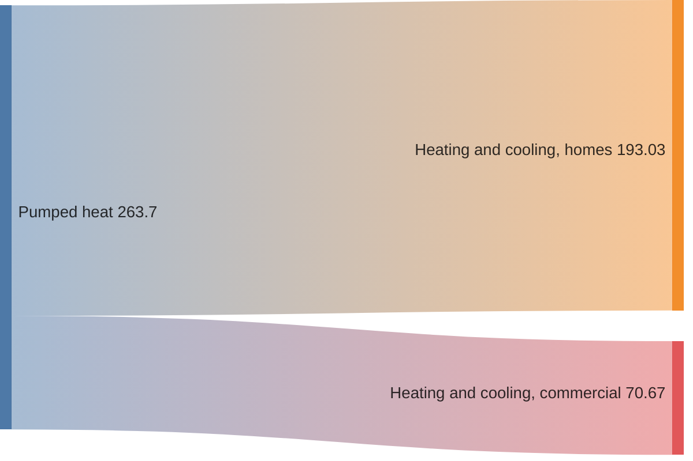
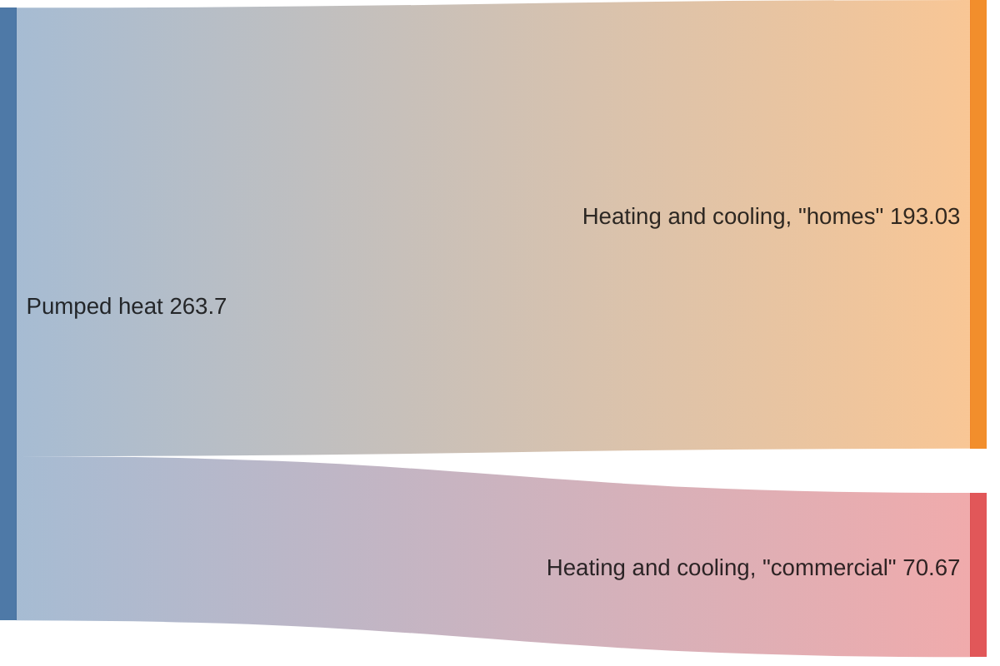

# 十五、桑基图

> 桑基图是用于描述从一组值到另一组值的流的可视化图。


> 1. 这是一张实验图。它的语法非常接近纯CSV，但它将在不久的将来得到扩展。
> 2. 被连接的东西被称为节点，连接被称为链接。

## 15.1 例子

这个例子取自observable。不过，在大小和颜色方面，它可能会被渲染得有点不同。

- 代码

```
---
config:
  sankey:
    showValues: false
---
sankey-beta

Agricultural 'waste',Bio-conversion,124.729
Bio-conversion,Liquid,0.597
Bio-conversion,Losses,26.862
Bio-conversion,Solid,280.322
Bio-conversion,Gas,81.144
Biofuel imports,Liquid,35
Biomass imports,Solid,35
Coal imports,Coal,11.606
Coal reserves,Coal,63.965
Coal,Solid,75.571
District heating,Industry,10.639
District heating,Heating and cooling - commercial,22.505
District heating,Heating and cooling - homes,46.184
Electricity grid,Over generation / exports,104.453
Electricity grid,Heating and cooling - homes,113.726
Electricity grid,H2 conversion,27.14
Electricity grid,Industry,342.165
Electricity grid,Road transport,37.797
Electricity grid,Agriculture,4.412
Electricity grid,Heating and cooling - commercial,40.858
Electricity grid,Losses,56.691
Electricity grid,Rail transport,7.863
Electricity grid,Lighting & appliances - commercial,90.008
Electricity grid,Lighting & appliances - homes,93.494
Gas imports,Ngas,40.719
Gas reserves,Ngas,82.233
Gas,Heating and cooling - commercial,0.129
Gas,Losses,1.401
Gas,Thermal generation,151.891
Gas,Agriculture,2.096
Gas,Industry,48.58
Geothermal,Electricity grid,7.013
H2 conversion,H2,20.897
H2 conversion,Losses,6.242
H2,Road transport,20.897
Hydro,Electricity grid,6.995
Liquid,Industry,121.066
Liquid,International shipping,128.69
Liquid,Road transport,135.835
Liquid,Domestic aviation,14.458
Liquid,International aviation,206.267
Liquid,Agriculture,3.64
Liquid,National navigation,33.218
Liquid,Rail transport,4.413
Marine algae,Bio-conversion,4.375
Ngas,Gas,122.952
Nuclear,Thermal generation,839.978
Oil imports,Oil,504.287
Oil reserves,Oil,107.703
Oil,Liquid,611.99
Other waste,Solid,56.587
Other waste,Bio-conversion,77.81
Pumped heat,Heating and cooling - homes,193.026
Pumped heat,Heating and cooling - commercial,70.672
Solar PV,Electricity grid,59.901
Solar Thermal,Heating and cooling - homes,19.263
Solar,Solar Thermal,19.263
Solar,Solar PV,59.901
Solid,Agriculture,0.882
Solid,Thermal generation,400.12
Solid,Industry,46.477
Thermal generation,Electricity grid,525.531
Thermal generation,Losses,787.129
Thermal generation,District heating,79.329
Tidal,Electricity grid,9.452
UK land based bioenergy,Bio-conversion,182.01
Wave,Electricity grid,19.013
Wind,Electricity grid,289.366
```

- 展示图



## 15.2 语法

语法背后的思想是，用户首先键入 `sankey-beta` 关键字，然后在下面粘贴原始CSV并获得结果。

它实现了如下描述的CSV标准，有细微的差别：

*   CSV只能包含3列
*   出于视觉目的，允许使用不带逗号分隔符的空行

### 15.2.1 基本

这意味着CSV中的3列应该分别代表 `source` ,  `target` 和 `value` ：

- 代码

```
sankey-beta

%% source,target,value
Electricity grid,Over generation / exports,104.453
Electricity grid,Heating and cooling - homes,113.726
Electricity grid,H2 conversion,27.14
```

- 展示图




### 15.2.2 空行

CSV默认不支持不带逗号分隔符的空行。但如果需要，你可以添加它们：

- 代码

```
sankey-beta

Bio-conversion,Losses,26.862

Bio-conversion,Solid,280.322

Bio-conversion,Gas,81.144
```

- 展示图



### 15.2.3 逗号

如果你需要逗号，用双引号括起来：

- 代码

```
sankey-beta

Pumped heat,"Heating and cooling, homes",193.026
Pumped heat,"Heating and cooling, commercial",70.672
```

- 展示图



### 15.2.4 双引号

如果你需要双引号，把一对双引号放在带引号的字符串里：

- 代码

```
sankey-beta

Pumped heat,"Heating and cooling, ""homes""",193.026
Pumped heat,"Heating and cooling, ""commercial""",70.672
```

- 展示图




## 15.3 配置

您可以自定义链接颜色、节点对齐方式和图表尺寸。

```html
<script>
  const config = {
    startOnLoad: true,
    securityLevel: 'loose',
    sankey: {
      width: 800,
      height: 400,
      linkColor: 'source',
      nodeAlignment: 'left',
    },
  };
  mermaid.initialize(config);
</script>
```

### 15.3.1  链接颜色

你可以通过设置 `linkColor` 来调整链接的颜色：

*   `source`  - link将为源节点颜色
*   `target`  - link将是目标节点的颜色
*   `gradient`  -链接颜色将在源节点和目标节点颜色之间平滑过渡
*   颜色的十六进制代码，如 `#a1a1a1`

### 15.3.2 节点对齐

通过设置 `nodeAlignment` 为，可以改变图形布局：

*   `justify`
*   `center`
*   `left`
*   `right`