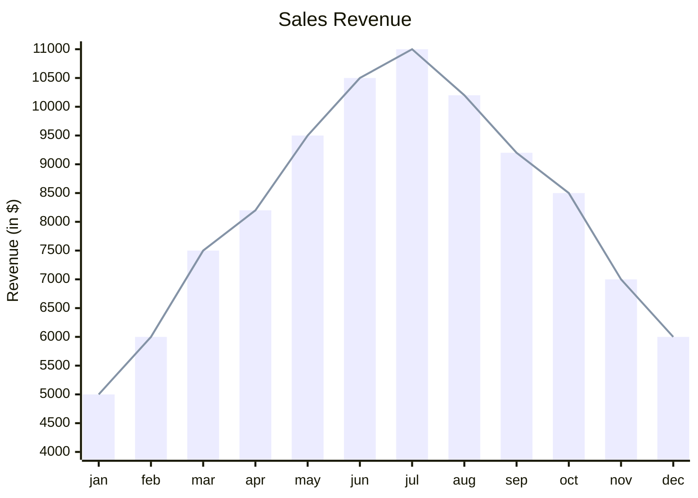
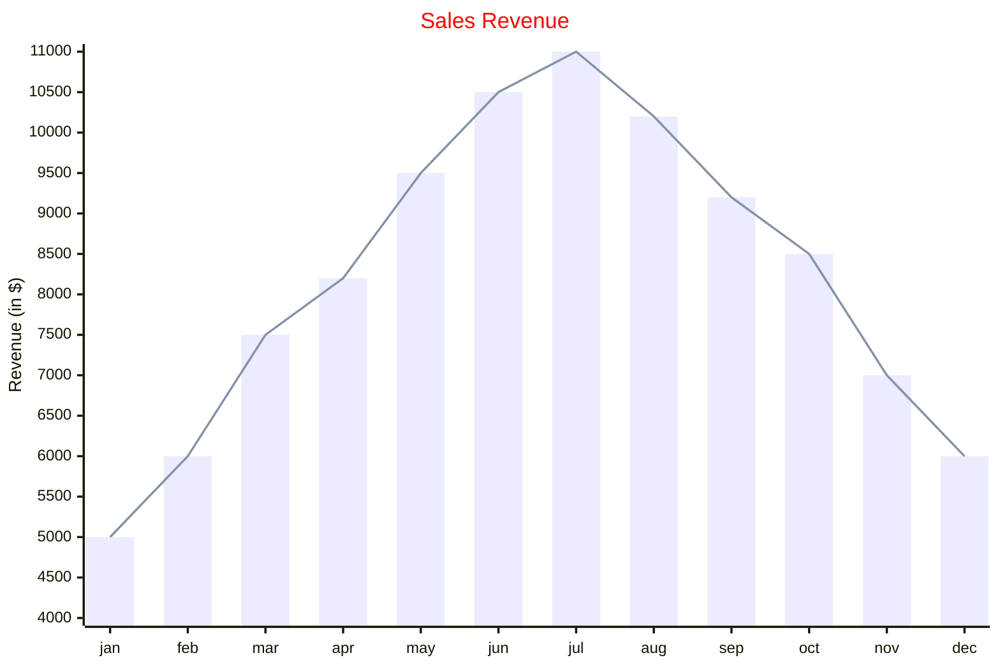

# 十六、XY图表

> 在mermaid-js上下文中，XY图表是一个综合的图表模块，它包含各种类型的图表，这些图表利用x轴和y轴来表示数据。目前，它包括两种基本的图表类型：条形图和折线图。这些图表旨在直观地显示和分析涉及两个数值变量的数据。

> 需要注意的是，虽然当前的mermaid-js实现包括这两种图表类型，但该框架的设计是动态的和可适应的。因此，它具有扩展和在未来包含其他图表类型的能力。这意味着用户可以期望在XY图表模块中有一套不断发展的图表选项，随着时间的推移引入新的图表类型，满足各种数据可视化需求。

## 16.1 例子

- 代码

```
xychart-beta
    title "Sales Revenue"
    x-axis [jan, feb, mar, apr, may, jun, jul, aug, sep, oct, nov, dec]
    y-axis "Revenue (in $)" 4000 --> 11000
    bar [5000, 6000, 7500, 8200, 9500, 10500, 11000, 10200, 9200, 8500, 7000, 6000]
    line [5000, 6000, 7500, 8200, 9500, 10500, 11000, 10200, 9200, 8500, 7000, 6000]
```

- 展示图




## 16.2 语法

信息

所有只包含一个单词的文本值都可以不写入 `"` 。如果文本值中包含多个单词，特别是包含空格，则将该值括在 `"`中

### 16.2.1 指引

图表可以水平或垂直绘制，默认值为垂直。

```
xychart-beta horizontal
...
```

### 16.2.2 标题

标题是图表的简短描述，它将始终呈现在图表的顶部。

- 例子

```
xychart-beta
    title "This is a simple example"
    ...
```

>如果标题是单个单词，则不需要使用 `"` ，但如果它有空格 `"` 则需要

### 16.2.3 x轴

x轴主要用作分类值，但在需要时也可以用作数值范围值。


1.  `x-axis title min --> max`  x轴将作为给定范围的数字
2.  `x-axis "title with space" [cat1, "cat2 with space", cat3]`  x轴如果分类，分类是文本类型

### 16.2.4 y轴

y轴用于表示数值范围值，它不能具有分类值。

1.  `y-axis title min --> max`
2.  `y-axis title` 它将只添加标题，范围将自动从数据生成。


>x和y轴都是可选的，如果没有提供，我们将尝试创建范围

### 16.2.5 折线图

折线图提供了图形化描绘线条的能力。

1.  `line [2.3, 45, .98, -3.4]` 它可以包含所有有效的数值。

### 16.2.6 条形图

条形图提供了图形化描述条形图的功能。


1.  `bar [2.3, 45, .98, -3.4]` 它可以包含所有有效的数值。


只需要两个东西：图表名称（ `xychart-beta` ）和一个数据集。因此，您将能够用简单的配置绘制图表，例如

```
xychart-beta
    line [+1.3, .6, 2.4, -.34]
```

## 16.3 图配置

### 16.3.1 基础配置

| 参数  | 描述  | 默认值 |
| --- | --- | --- |
| 宽度  | 图表宽度 | 700 |
| 高度  | 图表高度 | 500 |
| titlePadding | 标题的顶部和底部填充 | 10  |
| titleFontSize | 标题字体大小 | 20  |
| showTitle | 是否显示标题 | true |
| xAxis | xAxis配置 | AxisConfig |
| yAxis | yAxis配置 | AxisConfig |
| chartOrientation |'vertical' or 'horizontal' | 'vertical' |
| plotReservedSpacePercent | 最小的空间图将占用内部的图表 | 50  |

### 16.3.2 AxisConfig 配置

| 参数  | 描述  | 默认值 |
| --- | --- | --- |
| showLabel | 显示轴标签或刻度值 | true |
| labelFontSize | 要绘制的标签的字体大小 | 14  |
| labelPadding | 标签的顶部和底部填充 | 5   |
| showTitle | 轴标题是否显示 | true |
| titleFontSize | 轴标题字体大小 | 16  |
| titlePadding | 轴标题的上下填充 | 5   |
| showTick | 勾选是否显示 | true |
| tickLength | 滴答声会持续多久 | 5   |
| tickWidth | 刻度的宽度是多少 | 2   |
| showAxisLine | 是否显示中轴线 | true |
| axisLineWidth | 轴线的厚度 | 2   |

## 16.4 图表主题变量

xychart的主题位于xychart属性中，因此要设置变量，请使用此语法 `%%{init: {" themeVariables": {" xychart ": {"titleColor": "#ff0000"}}}}%%`

| 参数  | 描述  |
| --- | --- |
| 写成backgroundColor | 整个图表的背景色 |
| titleColor | 标题文本的颜色 |
| xAxisLabelColor | x轴标签的颜色 |
| xAxisTitleColor | x轴标题的颜色 |
| xAxisTickColor | x轴刻度的颜色 |
| xAxisLineColor | x轴的颜色 |
| yAxisLabelColor | y轴标签的颜色 |
| yAxisTitleColor | y轴标题的颜色 |
| yAxisTickColor | y轴刻度的颜色 |
| yAxisLineColor | y轴的颜色 |
| plotColorPalette | 用逗号分隔的一串颜色。`#f3456, #43445` |

## 16.5 关于配置和主题的示例

- 代码

```
---
config:
    xyChart:
        width: 900
        height: 600
    themeVariables:
        xyChart:
            titleColor: "#ff0000"
---
xychart-beta
    title "Sales Revenue"
    x-axis [jan, feb, mar, apr, may, jun, jul, aug, sep, oct, nov, dec]
    y-axis "Revenue (in $)" 4000 --> 11000
    bar [5000, 6000, 7500, 8200, 9500, 10500, 11000, 10200, 9200, 8500, 7000, 6000]
    line [5000, 6000, 7500, 8200, 9500, 10500, 11000, 10200, 9200, 8500, 7000, 6000]
```

- 展示图

