# 十七、框图文档

## 17.1 框图简介

### 17.1.1 小示例

- 代码

```
block-beta
columns 1
  db(("DB"))
  blockArrowId6<["&nbsp;&nbsp;&nbsp;"]>(down)
  block:ID
    A
    B["A wide one in the middle"]
    C
  end
  space
  D
  ID --> D
  C --> D
  style B fill:#969,stroke:#333,stroke-width:4px
```

- 展示图

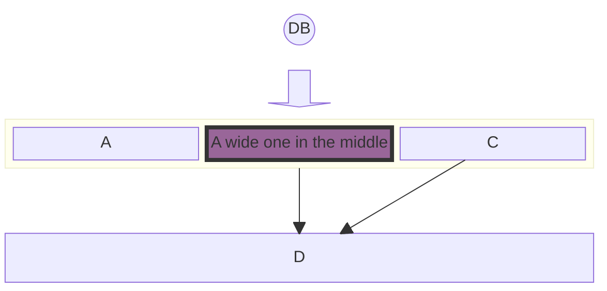


### 17.1.2 定义及目的

框图是一种直观而有效的方式，可以直观地表示复杂的系统、过程或体系结构。它们由块和连接器组成，其中块表示基本组件或功能，连接器表示这些组件之间的关系或流程。这种绘制图的方法在工程、软件开发和过程管理等各个领域都是必不可少的。

框图的主要目的是提供系统的高级视图，允许轻松理解和分析，而无需深入研究每个组件的复杂细节。这使得它们对于简化复杂系统和解释系统内组件的整体结构和交互特别有用。

许多人使用mermaid流程图来达到这个目的。这样做的一个副作用是，自动布局有时会将形状移动到图表制作者不想要的位置。框图使用不同的方法。在这张图中，我们让作者完全控制形状的位置。

### 17.1.3 通用用例

框图在不同的行业和学科中有着广泛的应用。一些关键用例包括：

*   软件体系结构：在软件开发中，框图可以用来说明软件应用程序的体系结构。这包括展示不同模块或服务如何交互、数据流和高级组件交互。
    
*   网络图：框图是表示IT和电信网络架构的理想选择。它们可以描述不同的网络设备和服务是如何相互连接的，包括路由器、交换机、防火墙和跨网络的数据流。
    
*   过程流程图：在商业和制造业中，可以使用方框图来创建过程流程图。这些流程图表示业务或制造过程的各个阶段，有助于将步骤序列、决策点和控制流可视化。
    
*   电气系统：工程师使用框图来表示电气系统和电路。它们可以说明电气系统的高层结构、不同电气元件之间的相互作用以及电流的流动。
    
*   教育用途：在教育材料中也广泛使用框图，以简化的方式解释复杂的概念和系统。它们有助于分解和可视化科学理论、工程原理和技术系统。
    

这些例子展示了框图在提供复杂系统的清晰和简洁表示方面的多功能性。它们的简单和清晰使它们成为不同领域的专业人士有效沟通复杂想法的宝贵工具。

在下面的部分中，我们将深入研究使用Mermaid创建和操作框图的细节，涵盖从基本语法到高级配置和样式的所有内容。

创建框图与mermaid是直接和可访问的。本节介绍开始构建简单图所需的基本语法和结构。理解这些基本概念是有效利用Mermaid完成更复杂的绘图任务的关键。


## 17.2 框图基础

### 17.2.1 简单框图

**基本结构**

框图的核心是由表示不同实体或组件的块组成。在Mermaid中，可以使用简单的文本标签轻松创建这些块。框图的最基本形式可以是一系列没有任何连接器的块。

示例—简单框图：创建一个简单的框图，其中包含三个标记为“a”，“b”和“c”的块，语法如下：

- 代码

```
block-beta
  a b c
```

- 展示图

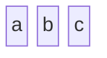


这个示例将生成三个块的水平序列。每个块自动间隔和对齐，以获得最佳的可读性。

### 17.2.2 定义要使用的列的数量

**列的使用**

简单的框图是线性和直接的，而更复杂的系统可能需要结构化的布局。Mermaid允许将块组织成多个列，方便创建更复杂和详细的图表。

—多列图：当需要将数据块分布在多个列中时，可以指定数据块的列数，并根据列数对数据块进行排列。下面是如何创建一个包含三列和四个块的框图，其中第四个块出现在第二行：

- 代码

```
block-beta
  columns 3
  a b c d
```

- 展示图

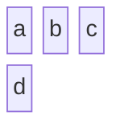


该语法指示Mermaid将‘a’、‘b’、‘c’和‘d’块排列在三列中，并根据需要换行到下一行。此特性对于表示分层或多层系统（如网络层或分层结构）特别有用。

mermaid方框图的这些基本构建块为更复杂的图表提供了基础。语法的简单性允许快速创建和迭代图表，使其成为可视化想法和概念的有效工具。在下一节中，我们将探索高级块配置选项，包括设置块宽度和创建复合块。

## 17.3 高级块配置

在基础知识的基础上，本节将深入研究mermaid中更高级的框图功能。这些特性允许在图设计中具有更大的灵活性和复杂性，适应更广泛的用例和场景。

### 17.3.1 设置块宽度

**跨越多列**

在更复杂的关系图中，您可能需要跨越多个列的块来强调某些组件或表示更大的实体。Mermaid允许调整块宽度以覆盖多个列，从而增强图表的可读性和结构。

示例-块跨越多列：要创建一个块跨越两列的框图，您可以为每个块指定所需的宽度：

- 代码

```
block-beta
  columns 3
  a["A label"] b:2 c:2 d
```

- 展示图

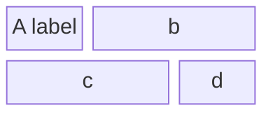


在本例中，标记为“A labels”的块跨越了一列，而标记为“b”、“c”的块跨越了2列，而“d”又被分配了自己的列。这种块大小的灵活性对于准确地表示具有不同重要性或大小的组件的系统至关重要。

### 17.3.2 创建复合块

**嵌套块**


复合块，或块中的块，是Mermaid的框图语法中的高级特性。它们支持嵌套或分层系统的表示，其中一个组件包含多个子组件。

示例-复合块：创建一个复合块包括定义父块，然后在其中嵌套其他块。下面是如何定义一个嵌套元素的复合块：

- 代码

```
block-beta
    block
      D
    end
    A["A: I am a wide one"]
```

- 展示图

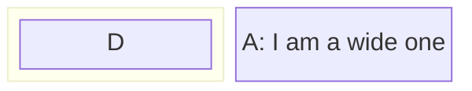


在这个语法中，‘D’是一个嵌套块在一个更大的父块中。此特性对于描述复杂结构特别有用，例如具有多个服务的服务器或较大组织框架中的部门。

### 17.3.3 列宽度动态

**调整宽度**

Mermaid还允许根据块的内容动态调整列的宽度。列的宽度由列中最宽的块决定，确保图表保持平衡和可读。

示例-动态列宽度：在具有不同块大小的图表中，Mermaid自动调整列宽度以适应每列中最大的块。这里有一个例子：

- 代码

```
block-beta
  columns 3
  a:3
  block:group1:2
    columns 2
    h i j k
  end
  g
  block:group2:3
    %% columns auto (default)
    l m n o p q r
  end
```

- 展示图

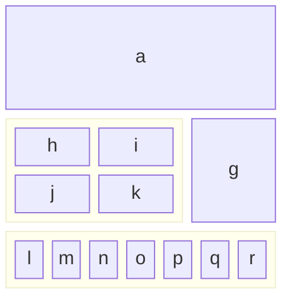


这个例子演示了Mermaid如何动态调整列的宽度，以适应最宽的块，在本例中是“a”和复合块“e”。这种动态调整对于创建视觉平衡和易于理解的图表是必不可少的。

水平合并块：当需要水平堆叠块时，可以使用列宽度来完成。块可以通过将它们放在一个列中来垂直排列。下面是如何创建一个框图，其中4个块堆叠在彼此的顶部：

- 代码

```
block-beta
  block
    columns 1
    a["A label"] b c d
  end
```

- 展示图

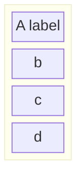


在本例中，合并块的宽度会根据最大子块的宽度动态调整。

有了这些先进的配置选项，Mermaid的框图可以定制，以表示广泛的复杂系统和结构。这些特性提供的灵活性使用户能够创建既具有信息量又具有视觉吸引力的图表。在接下来的部分中，我们将探讨更多的功能，包括不同的块形状和链接选项。

## 17.4 砌块的种类和形状

mermaid的方框图并不局限于标准的矩形。有多种块形状可用，允许对不同类型的信息或实体进行更细致和定制的表示。本节概述了可以在Mermaid中使用的不同块形状及其特定应用程序。

### 17.4.1 标准和特殊块形状

Mermaid支持一系列的块形状，以满足不同的绘图需求，从基本的几何形状到更专业的形式。

1. 示例-圆边块

创建一个圆边的块，它可以用来代表一个更柔软或更灵活的组件：

- 代码

```
block-beta
    id1("This is the text in the box")
```

- 展示图

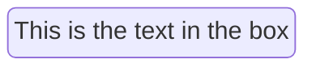


2. 示例-体育场形状的块

体育场形状的块，类似于一个细长的圆圈，可用于面向过程的组件：

- 代码

```
block-beta
    id1(["This is the text in the box"])
```

- 展示图

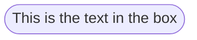


3. 示例-子程序形状

对于表示子程序或包含的进程，带有双竖线的块是有用的：

- 代码

```
block-beta
    id1[["This is the text in the box"]]
```

- 展示图

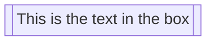

4. 示例-圆柱形

圆柱形是表示数据库或存储组件的理想选择：

- 代码

```
block-beta
    id1[("Database")]
```

- 展示图

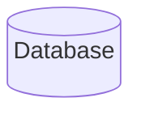

Database

5. 示例-圆形

圆圈可用于集中的或关键的部件：

- 代码

```
block-beta
    id1(("This is the text in the circle"))
```

- 展示图

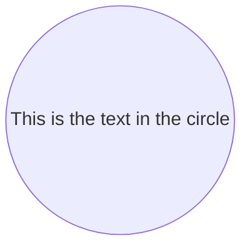


6. 示例-非对称、菱形和六边形

对于决策点，使用菱形，对于独特或专门的过程，可以使用不对称形状和六边形：

**不对称**

- 代码

```
block-beta
  id1>"This is the text in the box"]
```

- 展示图

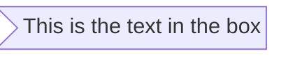


**菱形**

- 代码

```
block-beta
    id1{"This is the text in the box"}
```

- 展示图

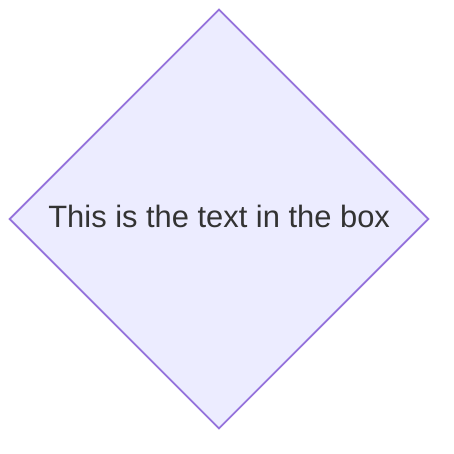


**六角**

- 代码

```
block-beta
    id1{{"This is the text in the box"}}
```

- 展示图

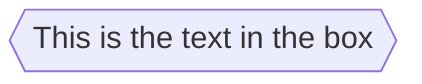


7. 示例-平行四边形和梯形

平行四边形和梯形非常适合输入/输出和过渡过程：

- 代码

```
block-beta
  id1[/"This is the text in the box"/]
  id2[\"This is the text in the box"\]
  A[/"Christmas"\]
  B[\"Go shopping"/]
```

- 展示图

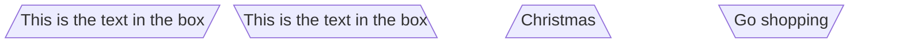


8. 示例—双环

为了突出显示关键或高优先级的组件，双圈可以有效：

- 代码

```
block-beta
    id1((("This is the text in the circle")))
```

- 展示图

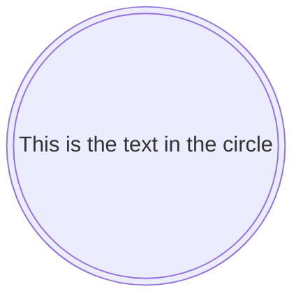


### 17.4.2 块箭头和空间块

mermaid还提供了独特的形状，如块箭头和空间块，用于定向流动和间距。

1. 示例-块箭头

块状箭头可以直观地指示过程中的方向或流程：

- 代码

```
block-beta
  blockArrowId<["Label"]>(right)
  blockArrowId2<["Label"]>(left)
  blockArrowId3<["Label"]>(up)
  blockArrowId4<["Label"]>(down)
  blockArrowId5<["Label"]>(x)
  blockArrowId6<["Label"]>(y)
  blockArrowId6<["Label"]>(x, down)
```

- 展示图

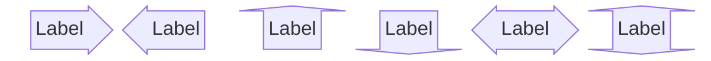


2. 示例-空格块

空格块可以用来在图表中创建有意的空白空间，这对布局和可读性很有用：

- 代码

```
block-beta
  columns 3
  a space b
  c   d   e
```

- 展示图

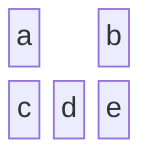

---

- 代码

```
block-beta
  ida space:3 idb idc
```

- 展示图

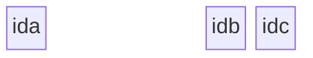


注意，您可以使用数字表示法 `space:num` 设置空格块占用的列数，其中num是表示num列宽度的数字。您还可以使用 `space` ，默认为一列。

mermaid中的各种形状和特殊块增强了框图的表现力，允许更准确和特定于上下文的表示。这些选项使用户能够灵活地创建信息丰富且视觉上吸引人的图表。在接下来的部分中，我们将探讨连接这些块并自定义其外观的方法。

### 17.4.3 标准和特殊块形状

讨论可用于块的各种形状，包括标准形状和特殊形式，如块箭头和空格块。

## 17.5 带边连接块

在Mermaid中，框图的关键特性之一是使用各种类型的边或链接连接块的能力。本节探讨块之间相互连接的不同方式，以表示组件之间的关系和流。

### 17.5.1 基本链接和箭头类型

连接块的最基本方面是使用箭头或链接。这些连接器描述了块之间的关系或信息流。Mermaid提供了一系列箭头类型，以满足不同的绘图需求。

**示例—基本链接**

可以创建一个带箭头的简单链接来显示从一个块到另一个块的方向或流程：

- 代码

```
block-beta
  A space B
  A-->B
```

- 展示图

```mermaid
block-beta
  A space B
  A-->B
```

这个例子用一个简单的箭头说明了从a块到B块的直接连接。

这种语法创建了一条连接‘ a ’和‘B’的线，暗示了一种关系或连接，而不指示特定的方向。

### 17.5.2 链接上的文字

除了连接块之外，通常还需要描述或标记关系。Mermaid允许在链接上包含文本，为连接提供上下文。

示例-带链接的文本要将文本添加到链接中，语法包括链接定义中的文本：

- 代码

```
block-beta
  A space:2 B
  A-- "X" -->B
```

- 展示图

```mermaid
block-beta
  A space:2 B
  A-- "X" -->B
```

此示例展示了如何向链接添加描述性文本，从而增强图表所传达的信息。

示例-边缘和样式：

- 代码

```
block-beta
columns 1
  db(("DB"))
  blockArrowId6<["&nbsp;&nbsp;&nbsp;"]>(down)
  block:ID
    A
    B["A wide one in the middle"]
    C
  end
  space
  D
  ID --> D
  C --> D
  style B fill:#939,stroke:#333,stroke-width:4px
```

- 展示图

```mermaid
block-beta
columns 1
  db(("DB"))
  blockArrowId6<["&nbsp;&nbsp;&nbsp;"]>(down)
  block:ID
    A
    B["A wide one in the middle"]
    C
  end
  space
  D
  ID --> D
  C --> D
  style B fill:#939,stroke:#333,stroke-width:4px
```


## 17.6 样式和定制

除了结构和布局的框图，mermaid提供了广泛的样式选择。这些自定义特性允许创建更具视觉特色和信息丰富的图表。本节介绍如何将单个样式应用到块中，以及如何在多个元素之间使用类来实现一致的样式。

### 17.6.1 单个块样式

Mermaid支持对单个块进行详细的样式化，允许您应用各种CSS属性，如颜色、描边和边框厚度。此功能在突出显示图表的特定部分或坚持某些视觉主题时特别有用。

1. 示例-单个块的样式化

要将自定义样式应用到块中，你可以使用 `style` 关键字，后跟块标识符和所需的CSS属性：

- 代码

```
block-beta
  id1 space id2
  id1("Start")-->id2("Stop")
  style id1 fill:#636,stroke:#333,stroke-width:4px
  style id2 fill:#bbf,stroke:#f66,stroke-width:2px,color:#fff,stroke-dasharray: 5 5
```

- 展示图

```mermaid
block-beta
  id1 space id2
  id1("Start")-->id2("Stop")
  style id1 fill:#636,stroke:#333,stroke-width:4px
  style id2 fill:#bbf,stroke:#f66,stroke-width:2px,color:#fff,stroke-dasharray: 5 5
```


在这个例子中，一个名为“blue”的类被定义并应用于块“a”，而块“B”则接受单独的样式。这展示了Mermaid在同一图表中应用共享样式和独特样式的灵活性。

单独或通过类设置块样式的能力为增强块图的视觉效果和清晰度提供了一个强大的工具。无论是强调某些元素，还是在图中维护内聚设计，这些样式化功能都是有效绘制图的核心。下一节将介绍实际示例和用例，然后是故障排除常见问题的提示。

## 17.7 实际示例和用例

mermaid的方框图的多功能性在应用于现实世界场景时变得明显。本节提供实际示例，演示前几节中讨论的各种特性的应用。这些示例展示了如何使用框图以可访问和信息丰富的方式表示复杂的系统和过程。

### 17.7.1 详细的例子说明各种功能

结合结构、链接和样式的元素，我们可以创建在不同上下文中服务于特定目的的综合图。

1. 示例—系统架构

举例说明一个简单的软件系统架构与相互连接的组件：

- 代码

```
block-beta
  columns 3
  Frontend blockArrowId6<[" "]>(right) Backend
  space:2 down<[" "]>(down)
  Disk left<[" "]>(left) Database[("Database")]

  classDef front fill:#696,stroke:#333;
  classDef back fill:#969,stroke:#333;
  class Frontend front
  class Backend,Database back
```

- 展示图

```mermaid
block-beta
  columns 3
  Frontend blockArrowId6<[" "]>(right) Backend
  space:2 down<[" "]>(down)
  Disk left<[" "]>(left) Database[("Database")]

  classDef front fill:#696,stroke:#333;
  classDef back fill:#969,stroke:#333;
  class Frontend front
  class Backend,Database back
```


这个例子展示了一个基本的体系结构，包括前端、后端和数据库。这些块的样式是为了区分不同类型的组件。

2. 示例—业务流程流

表示具有决策点和多个阶段的业务流程流：

- 代码

```
block-beta
  columns 3
  Start(("Start")) space:2
  down<[" "]>(down) space:2
  Decision{{"Make Decision"}} right<["Yes"]>(right) Process1["Process A"]
  downAgain<["No"]>(down) space r3<["Done"]>(down)
  Process2["Process B"] r2<["Done"]>(right) End(("End"))

  style Start fill:#969;
  style End fill:#696;
```

- 展示图

```mermaid
block-beta
  columns 3
  Start(("Start")) space:2
  down<[" "]>(down) space:2
  Decision{{"Make Decision"}} right<["Yes"]>(right) Process1["Process A"]
  downAgain<["No"]>(down) space r3<["Done"]>(down)
  Process2["Process B"] r2<["Done"]>(right) End(("End"))

  style Start fill:#969;
  style End fill:#696;
```

这些实际的例子和场景强调了Mermaid方框图在简化和有效地跨不同领域交流复杂信息方面的实用性。

下一节“故障排除和常见问题”将提供解决使用Mermaid方框图时遇到的常见挑战的见解，以确保顺利的绘图体验。

## 17.8 故障处理和常见问题

使用Mermaid框图有时会带来挑战，特别是当图的复杂性增加时。本节旨在提供解决常见问题的指导，并提供管理更复杂的图结构的技巧。

### 17.8.1 常见语法错误

理解和避免常见的语法错误是顺利使用Mermaid图的关键。

1. 示例—错误链接

一个常见的错误是不正确的链接语法，这可能导致意想不到的结果或损坏的图：

```
block-beta
  A - B
```

更正：确保用箭头（——>或——）正确指定块之间的链接，以定义连接的方向和类型。还要记住，框图的一个基本原则是让作者完全控制方框的位置，所以在这个例子中，你需要在方框之间添加一个空格：

- 代码

```
block-beta
  A space B
  A --> B
```

- 展示图

```mermaid
block-beta
  A space B
  A --> B
```

2. 示例-错位的样式

在错误的上下文中应用样式或使用不正确的语法会导致块没有按照预期样式化：

- 代码

```
  block-beta
    A
    style A fill#969;
```

- 展示图

```mermaid
  block-beta
    A
    style A fill#969;
```

纠正：通过确保样式属性与逗号的正确分离，并使用正确的CSS属性格式来纠正语法：

- 代码

```
block-beta
  A
  style A fill:#969,stroke:#333;
```

- 展示图

```mermaid
block-beta
  A
  style A fill:#969,stroke:#333;
```


### 17.8.2 复杂图表结构的技巧

管理Mermaid图中的复杂性包括计划和采用最佳实践。

1. 模块化设计

将复杂的关系图分解成更小、更易于管理的组件。这种方法不仅使图更容易理解，而且还简化了创建和维护过程。

2. 一致的风格

使用类在相似的元素之间保持一致的样式。这不仅节省了时间，还保证了一个有凝聚力和专业的外观。

3. 注释和文档

在Mermaid语法中使用带有 `%%` 的注释来记录图中各个部分的目的。这种做法对于保持清晰度是无价的，特别是在团队中工作或在一段时间后返回图时。

通过这些故障排除技巧和最佳实践，您可以有效地管理和解决Mermaid框图中的常见问题。最后一部分“结论”将总结本文档所涵盖的关键点，并邀请用户反馈以进行持续改进。
