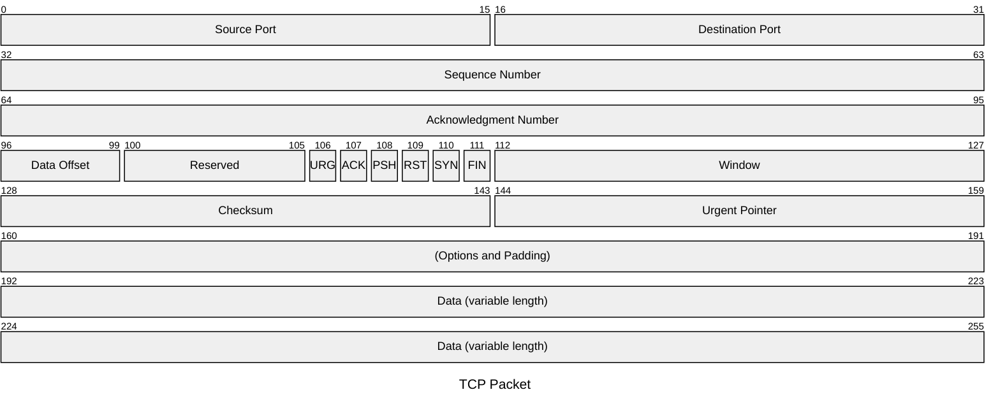
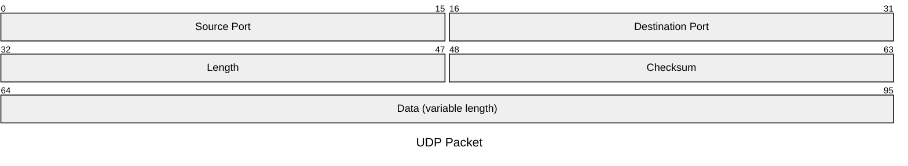

# 十八、包图


## 18.1 包图基础

1. 介绍

包图是用来说明网络包的结构和内容的可视化表示。网络数据包是通过网络传输的数据的基本单位。


2. 用法

这种图表类型对于开发人员、网络工程师、教育工作者和学生特别有用，他们需要一种清晰而简洁的方式来表示网络数据包的结构。

## 18.2 语法


```
packet-beta
start: "Block name" %% Single-bit block
start-end: "Block name" %% Multi-bit blocks
... More Fields ...
```

## 18.3 例子

- 代码

```
---
title: "TCP Packet"
---
packet-beta
0-15: "Source Port"
16-31: "Destination Port"
32-63: "Sequence Number"
64-95: "Acknowledgment Number"
96-99: "Data Offset"
100-105: "Reserved"
106: "URG"
107: "ACK"
108: "PSH"
109: "RST"
110: "SYN"
111: "FIN"
112-127: "Window"
128-143: "Checksum"
144-159: "Urgent Pointer"
160-191: "(Options and Padding)"
192-255: "Data (variable length)"
```

- 展示图


--- 
- 代码

美人鱼

```
packet-beta
title UDP Packet
0-15: "Source Port"
16-31: "Destination Port"
32-47: "Length"
48-63: "Checksum"
64-95: "Data (variable length)"
```
- 展示图



## 18.4 语法细节

*   范围：标题后的每一行代表数据包中的一个不同字段。范围（例如 `0-15` ）表示报文中的位位置。
*   字段描述：字段所代表内容的简短描述，用引号括起来。

