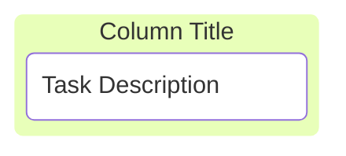
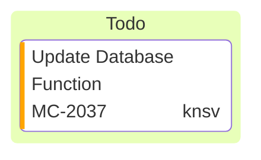
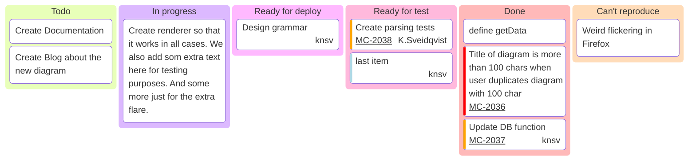

# 十九、看板图

Mermaid的看板图允许您创建通过工作流的不同阶段移动的任务的可视化表示。本指南根据提供的示例解释了如何使用看板图语法。

## 19.1 简单使用

Mermaid中的看板图以看板关键字开始，然后是列（阶段）和这些列中的任务的定义。

- 代码

```
kanban
  column1[Column Title]
    task1[Task Description]
```

- 展示图




## 19.2 定义列

列表示工作流中的不同阶段，例如“待办事项”、“进行中”、“完成”等。每一列都使用一个唯一标识符和一个用方括号括起来的标题来定义。

**语法:**

```
columnId[Column Title]
```

*   columnId：列的唯一标识符。
*   \[Column Title\]：显示在列标题上的标题。

像这样 `id1[Todo]`

## 19.3 向列中添加任务

任务以缩进的方式列在各自的列下。每个任务还有一个唯一标识符和方括号内的描述。

**语法:**

```
taskId[Task Description]
```

- `taskId`：任务的唯一标识符。
- `[Task Description]`: 任务的描述。


**例子:**

```
docs[Create Documentation]
```

## 19.4 向任务中添加元数据

您可以使用@{…}语法。元数据可以包含键值对，如assigned、ticket、priority等。这将渲染添加到节点的渲染中。

- assigned: 指定谁负责该任务。
- ticket: 将任务链接到工单或问题编号。
- priority: 表示任务的紧迫性。允许的值：“极高”、“高”、“低”和“极低”


- 代码

```
kanban
todo[Todo]
  id3[Update Database Function]@{ ticket: MC-2037, assigned: 'knsv', priority: 'High' }
```

- 展示图




## 19.5 配置选项

您可以使用标记文件开头的配置块来定制看板图。这对于设置全局设置（如票据的基本URL）非常有用。目前有一个看板图 `ticketBaseUrl` 的配置选项。设置示例如下：


```yaml
---
config:
  kanban:
    ticketBaseUrl: 'https://yourproject.atlassian.net/browse/#TICKET#'
---
```

当看板项目有一个指定的票号时，图中的票号将链接到票号定义的外部系统。 `ticketBaseUrl` 将基本URL设置为外部系统，#TICKET#被替换为任务元数据中的票证值，以创建一个有效的链接。

## 19.6 完整的示例

下面是基于所提供示例的完整看板图：

- 代码

```
---
config:
  kanban:
    ticketBaseUrl: 'https://mermaidchart.atlassian.net/browse/#TICKET#'
---
kanban
  Todo
    [Create Documentation]
    docs[Create Blog about the new diagram]
  [In progress]
    id6[Create renderer so that it works in all cases. We also add som extra text here for testing purposes. And some more just for the extra flare.]
  id9[Ready for deploy]
    id8[Design grammar]@{ assigned: 'knsv' }
  id10[Ready for test]
    id4[Create parsing tests]@{ ticket: MC-2038, assigned: 'K.Sveidqvist', priority: 'High' }
    id66[last item]@{ priority: 'Very Low', assigned: 'knsv' }
  id11[Done]
    id5[define getData]
    id2[Title of diagram is more than 100 chars when user duplicates diagram with 100 char]@{ ticket: MC-2036, priority: 'Very High'}
    id3[Update DB function]@{ ticket: MC-2037, assigned: knsv, priority: 'High' }

  id12[Can't reproduce]
    id3[Weird flickering in Firefox]
```

- 展示图




总之，在Mermaid中创建看板图是一个简单的过程，可以有效地可视化您的工作流程。首先使用看板关键字来初始化图表。用唯一标识符和标题定义列，以表示项目的不同阶段。在每一列下，列出您的任务（也使用唯一标识符），并根据需要提供详细的描述。记住，适当的缩进是至关重要的；任务必须在父列下缩进，以保持正确的结构。

您可以通过使用@{…}语法，它允许您包含额外的上下文，例如受让人、票号和优先级级别。对于进一步的定制，利用文件顶部的配置块来设置全局选项，如ticketBaseUrl，用于直接从图中链接票据。

通过遵守这些指导方针——确保唯一标识符、适当缩进、利用元数据和配置选项——你可以创建一个全面的、定制的看板，有效地使用Mermaid绘制出项目的工作流程。