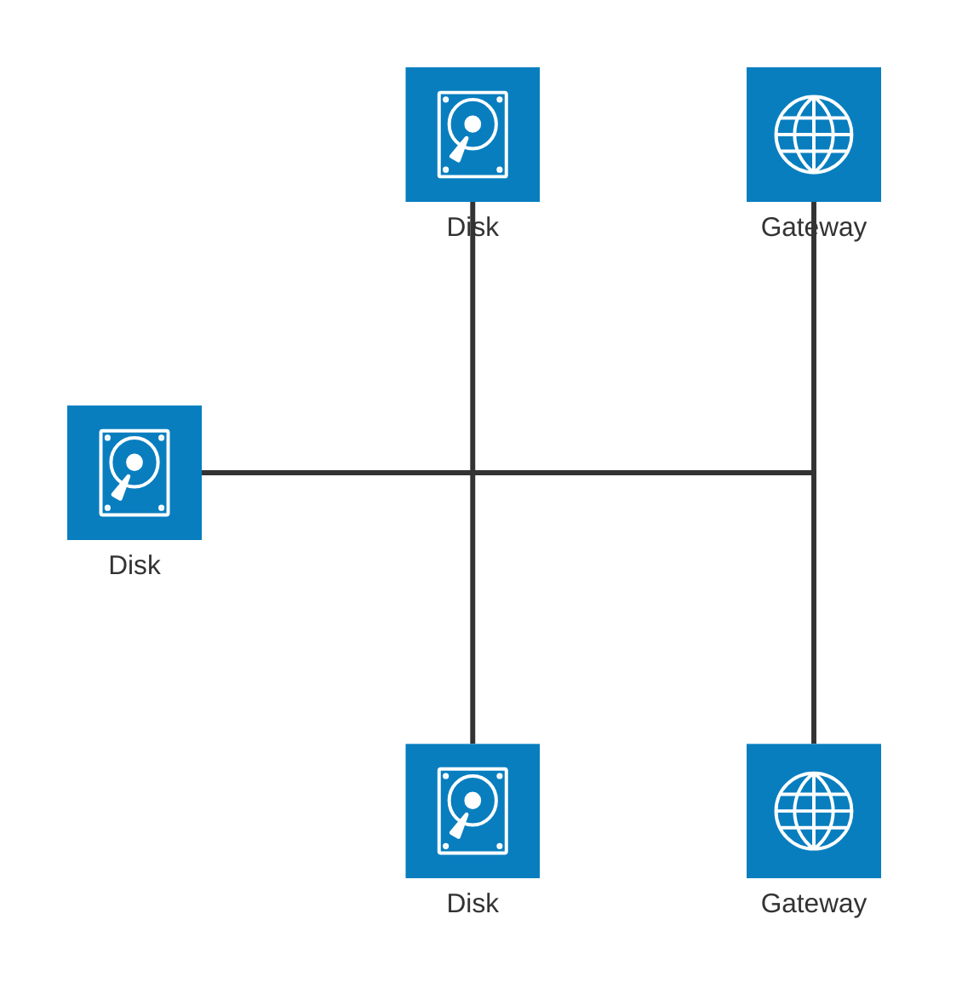

```mermaid
architecture-beta
    group api(logos:aws-lambda)[API]

    service db(logos:aws-aurora)[Database] in api
    service disk1(logos:aws-glacier)[Storage] in api
    service disk2(logos:aws-s3)[Storage] in api
    service server(logos:aws-ec2)[Server] in api

    db:L -- R:server
    disk1:T -- B:server
    disk2:T -- B:db
```

# 二十、架构图

> 在mermaid-js上下文中，架构图用于显示云或CI/CD部署中常见的服务和资源之间的关系。在架构图中，服务（节点）通过边连接。可以将相关服务放在组中，以便更好地说明它们是如何组织的。

## 20.1 例子

- 代码

```
architecture-beta
    group api(cloud)[API]

    service db(database)[Database] in api
    service disk1(disk)[Storage] in api
    service disk2(disk)[Storage] in api
    service server(server)[Server] in api

    db:L -- R:server
    disk1:T -- B:server
    disk2:T -- B:db
```

- 展示图


DatabaseStorageStorageServerAPI

## 20.2 语法

体系结构的构建块为 `groups` ,  `services` ,  `edges` ,  `junctions` 。

对于支持组件，图标是通过在图标名称周围加上 `()` 来声明的，而标签是通过在文本周围加上 `[]` 来声明的。

要开始架构图，请使用关键字 `architecture-beta` ，然后是组、服务、边缘和连接。虽然这3个构建块中的每一个都可以按任意顺序声明，但必须注意确保标识符之前已由另一个组件声明过。

### 20.2.1 组

声明组的语法是：

```
group {group id}({icon name})[{title}] (in {parent id})?
```

放在一起:

```
group public_api(cloud)[Public API]
```

创建标识为 `public_api` 的组，图标为 `cloud` ，标签为 `Public API` 。

此外，可以使用可选的 `in` 关键字将组置于组中

```
group private_api(cloud)[Private API] in public_api
```

### 20.2.2 服务

声明服务的语法是：

```
service {service id}({icon name})[{title}] (in {parent id})?
```

放在一起:

```
service database1(database)[My Database]
```

创建标识为 `database1` 的服务，使用图标 `database` ，标签为 `My Database` 。

如果该服务属于某个组，可以通过可选的 `in` 关键字将其放入该组

```
service database1(database)[My Database] in private_api
```

### 20.2.3 边缘

声明边的语法是：

```
{serviceId}{{group}}?:{T|B|L|R} {<}?--{>}? {T|B|L|R}:{serviceId}{{group}}?
```

1. 边的方向

通过在连接到箭头的服务的一侧添加一个冒号（ `:` ）并添加 `L|R|T|B`来指定边缘所来自的服务的一侧

例如:

```
db:R -- L:server
```

在 `db` 和 `server` 之间创建一个边缘，边缘从 `db` 的右侧和 `server` 的左侧出来。

```
db:T -- L:server
```

在服务 `db` 和 `server` 之间创建一个90度的边缘，边缘从 `db` 的顶部和 `server` 的左侧伸出。

2. 箭头

可以在边的每一边添加箭头，在左边方向前添加 `<` ，在右边方向后添加 `>` 。

例如:

```
subnet:R --> L:gateway
```

创建一个边缘，箭头指向 `gateway` 服务

3. 将边缘移出群组

如果需要将一个边缘从一个组转移到另一个组或另一个组内的业务，可以在 `serviceId` 后添加 `{group}` 修饰符。

例如:

```
service server[Server] in groupOne
service subnet[Subnet] in groupTwo

server{group}:B --> T:subnet{group}
```

创建一条边，从 `groupOne` 出发，毗邻 `server` ，并进入 `groupTwo` ，毗邻 `subnet` 。

重要的是要注意， `groupId` s不能用于指定边缘， `{group}` 修饰符只能用于组内的服务。

### 20.3.4 连接

结点是一种特殊类型的节点，它在边缘之间充当潜在的4向分裂。

声明连接的语法是：

```
junction {junction id} (in {parent id})?
```

- 代码

```
architecture-beta
    service left_disk(disk)[Disk]
    service top_disk(disk)[Disk]
    service bottom_disk(disk)[Disk]
    service top_gateway(internet)[Gateway]
    service bottom_gateway(internet)[Gateway]
    junction junctionCenter
    junction junctionRight

    left_disk:R -- L:junctionCenter
    top_disk:B -- T:junctionCenter
    bottom_disk:T -- B:junctionCenter
    junctionCenter:R -- L:junctionRight
    top_gateway:B -- T:junctionRight
    bottom_gateway:T -- B:junctionRight
```

- 展示图




## 20.3 图标

默认情况下，架构图支持以下图标： `cloud` ,  `database` ,  `disk` ,  `internet` ,  `server` 。用户可以使用iconify.design中提供的200,000个图标中的任何一个，或者按照下面的步骤添加他们自己的自定义图标。

图标安装完成后，可以使用“name:icon-name”格式在架构图中使用它们，其中name是注册图标包时使用的值。

- 代码

```
architecture-beta
    group api(logos:aws-lambda)[API]

    service db(logos:aws-aurora)[Database] in api
    service disk1(logos:aws-glacier)[Storage] in api
    service disk2(logos:aws-s3)[Storage] in api
    service server(logos:aws-ec2)[Server] in api

    db:L -- R:server
    disk1:T -- B:server
    disk2:T -- B:db
```

- 展示图

