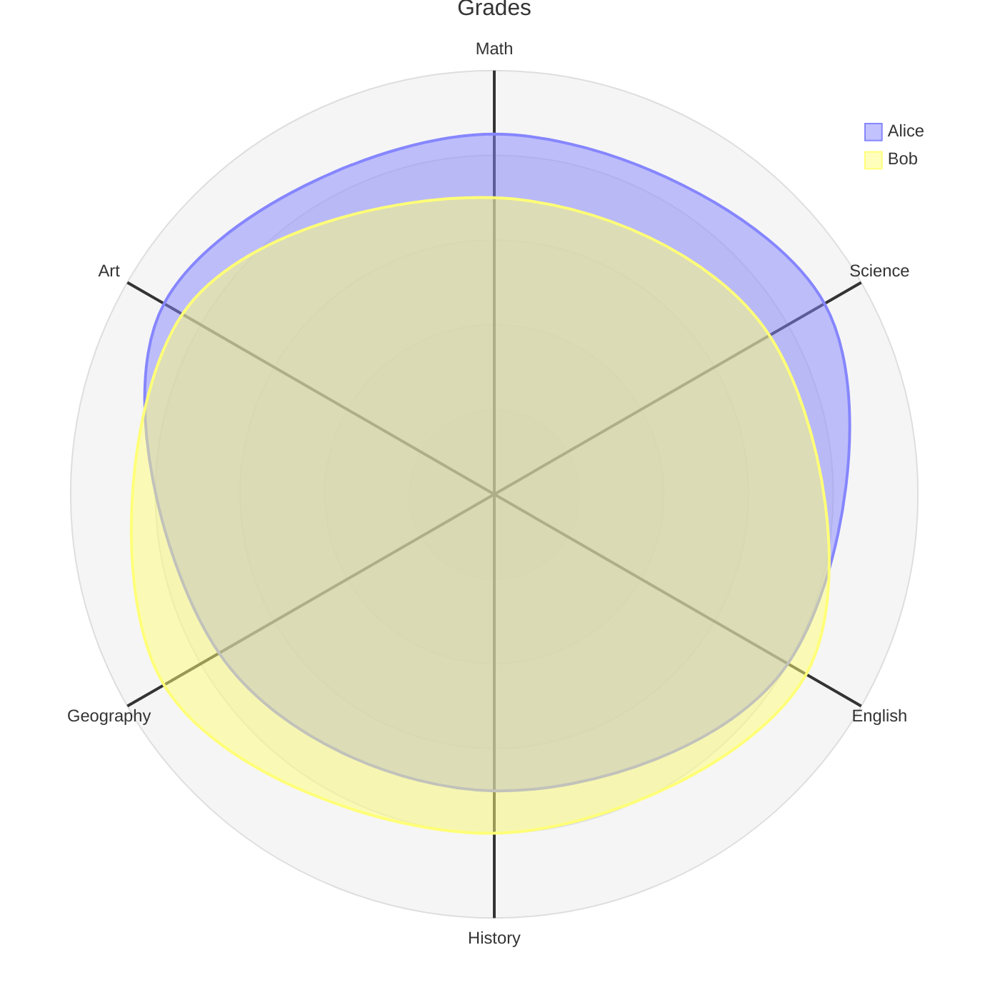
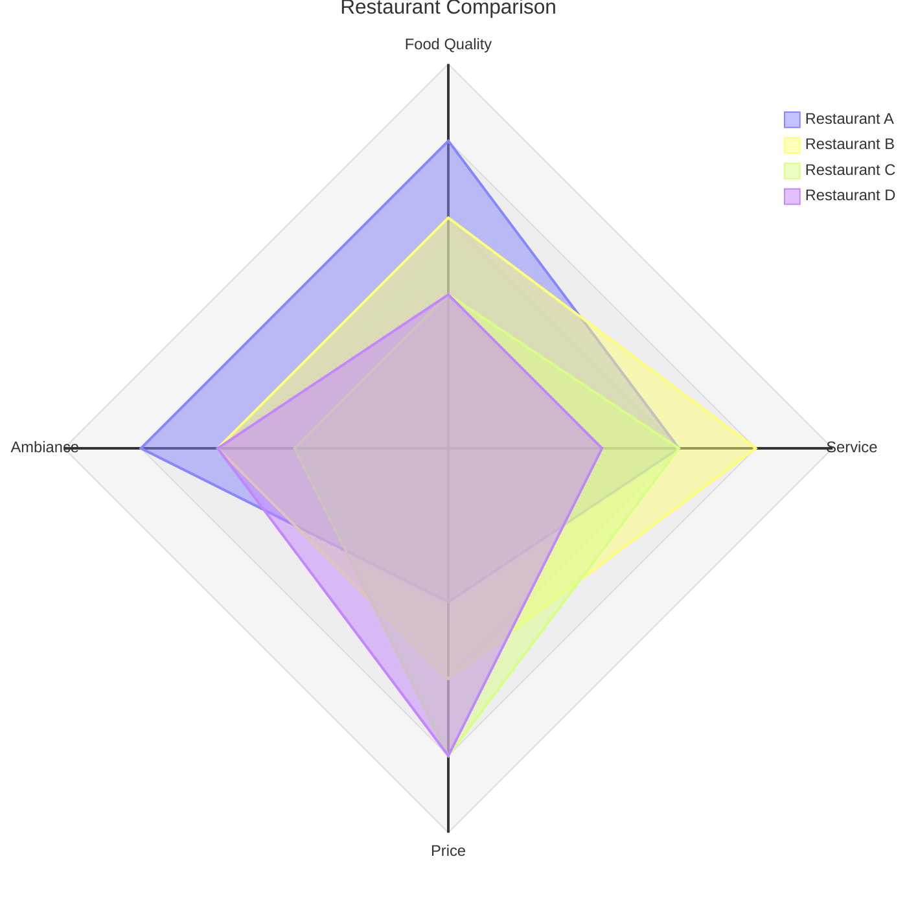
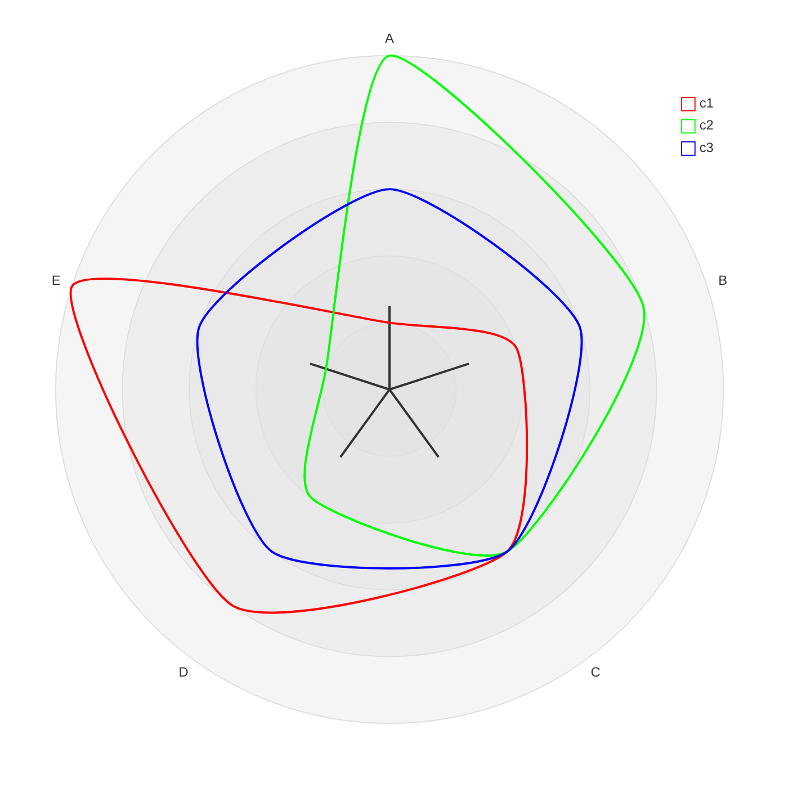

# 二十一、雷达图

## 21.1 雷达图基础

### 20.1.1 介绍

雷达图是用圆形格式绘制低维数据的一种简单方法。

它也被称为雷达图、蜘蛛图、星图、蛛网图、极地图或基维亚图。

### 20.1.2 用法

这种图表类型对于开发人员、数据科学家和工程师特别有用，因为他们需要一种清晰而简洁的方式来以循环格式表示数据。

它通常用于图形化地总结和比较多个实体在多个维度上的性能。

## 20.2 语法

```
radar-beta
axis A, B, C, D, E
curve c1{1,2,3,4,5}
curve c2{5,4,3,2,1}
... More Fields ...
```

## 20.3 例子

- 代码

```
---
title: "Grades"
---
radar-beta
  axis m["Math"], s["Science"], e["English"]
  axis h["History"], g["Geography"], a["Art"]
  curve a["Alice"]{85, 90, 80, 70, 75, 90}
  curve b["Bob"]{70, 75, 85, 80, 90, 85}

  max 100
  min 0
```

- 展示图




- 代码

```
radar-beta
  title Restaurant Comparison
  axis food["Food Quality"], service["Service"], price["Price"]
  axis ambiance["Ambiance"]

  curve a["Restaurant A"]{4, 3, 2, 4}
  curve b["Restaurant B"]{3, 4, 3, 3}
  curve c["Restaurant C"]{2, 3, 4, 2}
  curve d["Restaurant D"]{2, 2, 4, 3}

  graticule polygon
  max 5
```

- 展示图



##  20.4 语法细节

### 20.4.1 标题

`title` ：标题是一个可选字段，允许在雷达图的顶部呈现标题。

```
radar-beta
  title Title of the Radar Diagram
  ...
```

### 40.4.2 轴

`axis` : axis关键字用于定义雷达图的轴线。

每个轴由一个ID和一个可选标签表示。

在一条直线上可以定义多个轴。

```
radar-beta
  axis id1["Label1"]
  axis id2["Label2"], id3["Label3"]
  ...
```

### 20.4.3 曲线

`curve` : curve关键字用于定义雷达图中曲线的数据点。

每条曲线都由一个ID、一个可选标签和一个值列表表示。

值可以通过数字列表或键值对列表来定义。如果使用键-值对，则键表示轴ID，值表示数据点。否则，假设数据点按照定义的轴的顺序排列。

多条曲线可以在一条直线上定义。

```
radar-beta
  axis axis1, axis2, axis3
  curve id1["Label1"]{1, 2, 3}
  curve id2["Label2"]{4, 5, 6}, id3{7, 8, 9}
  curve id4{ axis3: 30, axis1: 20, axis2: 10 }
  ...
```

### 20.4.4 选项

*   `showLegend` : showLegend关键字用于显示或隐藏雷达图中的图例。默认情况下显示图例。
*   `max` ：雷达图最大值。这是用来缩放雷达图的。如果没有提供，则从数据点计算最大值。
*   `min` ：雷达图最小值。这是用来缩放雷达图的。如果不提供，最小值为 `0` 。
*   `graticule` : graticule关键字用于定义在雷达图中渲染的光栅类型。光栅可以 `circle` 或 `polygon` 。如果未提供，则默认栅格 `circle` 。
*   `ticks` : ticks关键字用于定义栅格上的tick数。它是绘制的同心圆或多边形的数量，以表示雷达图的比例。如果不提供，则默认的tick数为 `5` 。

```
radar-beta
  ...
  showLegend true
  max 100
  min 0
  graticule circle
  ticks 5
  ...
```

## 20.5 配置

详细信息请参考配置指南。

| 参数  | 描述  | 默认值 |
| --- | --- | --- |
| hight  | 雷达图宽度 | `600` |
| width  | 雷达图高度 | `600` |
| marginTop | 雷达图的上边缘 | `50` |
| marginBottom | 雷达图的底边 | `50` |
| marginLeft | 雷达图左边缘 | `50` |
| marginRight | 雷达图的右边缘 | `50` |
| axisScaleFactor | 轴的比例因子 | `1` |
| axisLabelFactor | 因子调整轴标位置 | `1.05` |
| curveTension | 圆形曲线的张力 | `0.17` |

## 20.6 主题变量

### 20.6.1 全局主题变量

信息

这些变量的默认值取决于所使用的主题。要覆盖默认值，请在配置的themeVariables部分设置所需的值：`%%{init: {"themeVariables": {"cScale0": "#FF0000", "cScale1": "#00FF00"}}}%%`

雷达图支持颜色刻度 `cScale${i}` ，其中 `i` 是一个从 `0` 到主题在其颜色刻度中的最大颜色数的数字。通常，颜色的最大数量为 `12` 。

| 财产  | 描述  |
| --- | --- |
| fontSize | 标题的字体大小 |
| titleColor | 标题的颜色 |
| cScale美元 | 第i条曲线的色阶 |

### 20.6.2 雷达样式选项


雷达的特定变量位于 `radar` 键中。要设置雷达样式选项，请使用此语法。`%% {init:{“themeVariables”:{“雷达”:{“axisColor”:“# FF0000}}}} %%`

| 财产  | 描述  | 默认值 |
| --- | --- | --- |
| axisColor | 中轴线的颜色 | `black` |
| axisStrokeWidth | 轴线的宽度 | `1` |
| axisLabelFontSize | 轴标签的字体大小 | `12px` |
| curveOpacity | 曲线的不透明度 | `0.7` |
| curveStrokeWidth | 曲线的宽度 | `2` |
| graticuleColor | 光栅的颜色 | `black` |
| graticuleOpacity | 光栅的不透明性 | `0.5` |
| graticuleStrokeWidth | 光栅的宽度 | `1` |
| legendBoxSize | 图例框的大小 | `10` |
| legendFontSize | 图例的字体大小 | `14px` |

## 20.7 关于配置和主题的示例

- 代码

```
---
config:
  radar:
    axisScaleFactor: 0.25
    curveTension: 0.1
  theme: base
  themeVariables:
    cScale0: "#FF0000"
    cScale1: "#00FF00"
    cScale2: "#0000FF"
    radar:
      curveOpacity: 0
---
radar-beta
  axis A, B, C, D, E
  curve c1{1,2,3,4,5}
  curve c2{5,4,3,2,1}
  curve c3{3,3,3,3,3}
```

- 展示图

