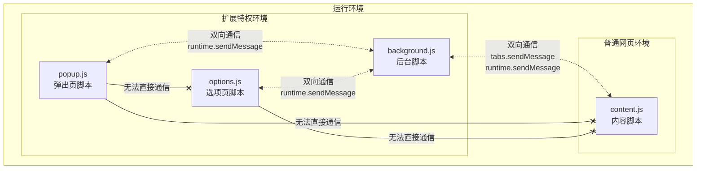

# 二、核心内容

## 2.1 format 格式化

### 2.1.1 典型 Chrome 插件项目结构

一个完整的 Chrome 插件项目通常包含以下文件和目录结构：

```md
my-extension/
├── manifest.json        # 核心配置文件（必须）
├── icons/               # 图标目录
│   ├── icon16.png       # 16x16 图标
│   ├── icon48.png       # 48x48 图标
│   └── icon128.png      # 128x128 图标
├── background.js        # 后台脚本（Service Worker）
├── content.js          # 内容脚本
├── popup/              # 弹出窗口相关文件
│   ├── popup.html      # 弹出窗口HTML
│   ├── popup.js        # 弹出窗口JS
│   └── popup.css       # 弹出窗口CSS
├── options/            # 选项页面
│   ├── options.html    # 选项页面HTML
│   ├── options.js      # 选项页面JS
│   └── options.css     # 选项页面CSS
├── scripts/            # 其他脚本
├── styles/             # 全局样式
└── _locales/           # 多语言支持
    ├── en/             # 英文
    │   └── messages.json
    └── zh_CN/          # 中文
        └── messages.json
```

### 2.1.2 manifest.json 配置文件详解

```json
{
  // 必须字段：清单文件版本（Manifest V3是当前最新版本）
  "manifest_version": 3,

  // 必须字段：扩展名称（显示在商店和浏览器中）
  "name": "我的扩展程序",

  // 必须字段：版本号（使用语义化版本格式）
  "version": "1.0.0",

  // 扩展描述（显示在商店和管理页面）
  "description": "这是一个演示用的Chrome扩展程序",

  // 图标配置（不同尺寸）
  "icons": {
    "16": "icons/icon16.png",   // 扩展管理页面和工具栏
    "48": "icons/icon48.png",   // 扩展管理页面
    "128": "icons/icon128.png"  // Chrome应用商店
  },

  // 浏览器工具栏按钮配置
  "action": {
    "default_icon": "icons/icon16.png",  // 默认图标
    "default_title": "点击弹出窗口",      // 悬停提示
    "default_popup": "popup/popup.html"  // 点击后弹出的HTML页面
  },

  // 后台脚本配置（Manifest V3使用Service Worker）
  "background": {
    "service_worker": "background.js",
    "type": "module"  // 可选：使用ES模块
  },

  // 内容脚本配置（注入到网页中的JS/CSS）
  "content_scripts": [
    {
      "matches": ["https://*.example.com/*"], // 匹配的URL模式
      "css": ["styles/content.css"],         // 注入的CSS
      "js": ["scripts/content.js"],          // 注入的JS
      "run_at": "document_end"               // 注入时机
    }
  ],

  // 选项页面配置（扩展设置页面）
  "options_page": "options/options.html",

  // 权限申请（访问浏览器API需要声明）
  "permissions": [
    "storage",          // 存储数据
    "tabs",             // 访问标签页
    "activeTab",        // 当前活动标签页
    "scripting",        // 脚本注入（Manifest V3新增）
    "contextMenus"      // 右键菜单
  ],

  // 可选权限（运行时请求）
  "optional_permissions": [
    "downloads",       // 下载管理
    "bookmarks"        // 书签管理
  ],

  // 主机权限（访问特定网站的权限）
  "host_permissions": [
    "https://*.example.com/*"
  ],

  // 扩展默认语言（默认en）
  "default_locale": "en",

  // 扩展在Chrome应用商店的展示配置
  "chrome_settings_overrides": {
    "homepage": "https://example.com",
    "search_provider": {
      "name": "My Search",
      "keyword": "mysearch",
      "search_url": "https://example.com/search?q={searchTerms}",
      "favicon_url": "https://example.com/favicon.ico",
      "suggest_url": "https://example.com/suggest?q={searchTerms}",
      "encoding": "UTF-8",
      "is_default": true
    }
  },

  // 扩展命令（键盘快捷键）
  "commands": {
    "_execute_action": {
      "suggested_key": {
        "default": "Ctrl+Shift+F",
        "mac": "Command+Shift+F"
      },
      "description": "打开弹出窗口"
    }
  },

  // 开发者相关信息（发布到商店时使用）
  "author": "Your Name",
  "homepage_url": "https://example.com/my-extension",

  // 扩展的官方主页（商店展示用）
  "short_name": "MyExt",

  // 扩展的版本名称（非必要）
  "version_name": "1.0 beta"
}
```

### 2.1.3 通信流程图



### 2.1.4 示例代码

1. manifest.json

    ```json
    {
        "manifest_version": 3,
        "name": "__MSG_extensionName__",
        "version": "1.0.0",
        "description": "__MSG_extensionDescription__",
        "default_locale": "en",

        "icons": {
            "16": "icons/icon16.png",
            "48": "icons/icon48.png",
            "128": "icons/icon128.png"
        },

        "permissions": [
            "storage",
            "activeTab",
            "scripting"
        ],

        "host_permissions": [  
            "https://*/*"
        ],

        "background": {
            "service_worker": "background.js"
        },

        "action": {
            "default_icon": {
            "16": "icons/icon16.png"
            },
            "default_title": "__MSG_extensionName__",
            "default_popup": "popup.html"
        },

        "options_ui": {
            "page": "options.html",
            "open_in_tab": false
        },

        "content_scripts": [
            {
            "matches": ["<all_urls>"],
            "js": ["content.js"],
            "css": ["content-style.css"],
            "run_at": "document_idle"
            }
        ]
    }
    ```
2. 弹出页面

    - popup.html

        ```html
        <!DOCTYPE html>
        <html>
        <head>
            <meta charset="utf-8">
            <link rel="stylesheet" href="popup.css">
        </head>
        <body>
            <div class="container">
                <h2 id="popup-title"></h2>
                
                <div class="color-display">
                <span id="current-color-label"></span>
                <div id="current-color-box" class="color-box"></div>
                </div>
                
                <input type="color" id="color-picker" value="#3498db">
                <button id="pick-color-btn" class="btn primary"></button>
                
                <button id="apply-color-btn" class="btn secondary"></button>
                
                <div class="footer">
                <a href="#" id="options-link">Options</a>
                </div>
            </div>
            
            <script src="popup.js"></script>
        </body>
        </html>
        ```
    - popup.css

        ```css
        body {
            width: 250px;
            margin: 0;
            padding: 0;
            font-family: Arial, sans-serif;
        }

        .container {
            padding: 15px;
        }

        h2 {
            margin: 0 0 15px 0;
            font-size: 16px;
            color: #333;
            text-align: center;
        }

        .color-display {
            display: flex;
            align-items: center;
            margin-bottom: 15px;
            gap: 10px;
        }

        .color-box {
            width: 30px;
            height: 30px;
            border: 2px solid #ddd;
            border-radius: 4px;
        }

        input[type="color"] {
            width: 100%;
            height: 40px;
            margin-bottom: 10px;
            border: none;
            border-radius: 4px;
            cursor: pointer;
        }

        .btn {
            width: 100%;
            padding: 8px;
            margin: 5px 0;
            border: none;
            border-radius: 4px;
            cursor: pointer;
            font-size: 14px;
        }

        .btn.primary {
            background-color: #3498db;
            color: white;
        }

        .btn.secondary {
            background-color: #95a5a6;
            color: white;
        }

        .btn:hover {
            opacity: 0.9;
        }

        .footer {
            margin-top: 15px;
            text-align: center;
        }

        #options-link {
            color: #3498db;
            text-decoration: none;
            font-size: 12px;
        }

        #options-link:hover {
            text-decoration: underline;
        }
        ```
    - popup.js

        ```js
        document.addEventListener("DOMContentLoaded", function () {
            // 国际化
            document.getElementById("popup-title").textContent = chrome.i18n.getMessage("popupTitle");
            document.getElementById("current-color-label").textContent = chrome.i18n.getMessage("currentColor");
            document.getElementById("pick-color-btn").textContent = chrome.i18n.getMessage("pickColor");
            document.getElementById("apply-color-btn").textContent = chrome.i18n.getMessage("applyColor");

            const colorPicker = document.getElementById("color-picker");
            const colorBox = document.getElementById("current-color-box");
            const pickColorBtn = document.getElementById("pick-color-btn");
            const applyColorBtn = document.getElementById("apply-color-btn");
            const optionsLink = document.getElementById("options-link");

            // 从存储中加载颜色
            chrome.storage.sync.get(["selectedColor"], function (result) {
                // 配置后台可能还未设置颜色，提供默认值
                console.log("Loaded color from storage:", result.selectedColor);

                const color = result.selectedColor || "#3498db";
                colorPicker.value = color;
                colorBox.style.backgroundColor = color;
            });

            // 颜色选择器变化
            colorPicker.addEventListener("input", function () {
                colorBox.style.backgroundColor = this.value;
            });

            // 选择颜色按钮
            pickColorBtn.addEventListener("click", function () {
                colorPicker.click();
            });

            // 应用颜色到页面
            applyColorBtn.addEventListener("click", function () {
                const color = colorPicker.value;

                // 保存颜色
                chrome.storage.sync.set({ selectedColor: color });

                // 发送消息到内容脚本
                chrome.tabs.query({ active: true, currentWindow: true }, function (tabs) {
                    // 检查是否有活动标签页
                    if (tabs.length === 0) {
                        console.log("No active tab found");
                        return;
                    }

                    chrome.tabs.sendMessage(
                        tabs[0].id,
                        {
                            action: "applyColor",
                            color: color,
                        },
                        function (response) {
                            if (chrome.runtime.lastError) {
                                console.log("Error sending message to content script:", chrome.runtime.lastError.message);
                                // 显示用户友好的错误提示
                                alert("无法应用颜色，请确保页面已完全加载");
                            } else {
                                console.log("Message sent successfully");
                            }
                        }
                    );
                });
            });

            // 打开选项页
            optionsLink.addEventListener("click", function (e) {
                e.preventDefault();
                chrome.runtime.openOptionsPage();
            });
        });
        ```
3. 配置页面

    - options.html

        ```html
        <!DOCTYPE html>
        <html>
        <head>
            <meta charset="utf-8" />
            <link rel="stylesheet" href="options.css" />
        </head>
        <body>
            <div class="container">
                <h1>颜色选择器</h1>

                <div class="option-group">
                    <label for="default-color">默认颜色:</label>
                    <input type="color" id="default-color" value="#3498db" />
                </div>

                <div class="option-group">
                    <label for="auto-apply">
                        <input type="checkbox" id="auto-apply" />
                        颜色选择后自动加载
                    </label>
                </div>

                <button id="save-btn" class="btn">保存配置</button>
                <button id="reset-btn" class="btn secondary">重置</button>

                <div id="status" class="status"></div>
            </div>

            <script src="options.js"></script>
        </body>
        </html>

        ```
    - options.css

        ```css
        body {
            width: 400px;
            margin: 0;
            padding: 20px;
            font-family: Arial, sans-serif;
        }

        .container {
            max-width: 100%;
        }

        h1 {
            font-size: 20px;
            margin-bottom: 20px;
            color: #333;
        }

        .option-group {
            margin-bottom: 15px;
        }

        label {
            display: block;
            margin-bottom: 5px;
            font-weight: bold;
        }

        input[type="color"] {
            width: 50px;
            height: 30px;
            border: 1px solid #ddd;
            border-radius: 4px;
        }

        input[type="checkbox"] {
            margin-right: 5px;
        }

        .btn {
            padding: 8px 16px;
            margin-right: 10px;
            border: none;
            border-radius: 4px;
            cursor: pointer;
            font-size: 14px;
        }

        .btn.secondary {
            background-color: #95a5a6;
            color: white;
        }

        .status {
            margin-top: 15px;
            padding: 10px;
            border-radius: 4px;
            display: none;
        }

        .status.success {
            background-color: #d4edda;
            color: #155724;
            display: block;
        }

        .status.error {
            background-color: #f8d7da;
            color: #721c24;
            display: block;
        }
        ```
    - option.js

        ```js
        document.addEventListener('DOMContentLoaded', function() {
            const defaultColor = document.getElementById('default-color');
            const autoApply = document.getElementById('auto-apply');
            const saveBtn = document.getElementById('save-btn');
            const resetBtn = document.getElementById('reset-btn');
            const status = document.getElementById('status');
            
            // 加载保存的设置
            chrome.storage.sync.get(['defaultColor', 'autoApply'], function(result) {
                defaultColor.value = result.defaultColor || '#3498db';
                autoApply.checked = result.autoApply || false;
            });
            
            // 保存设置
            saveBtn.addEventListener('click', function() {
                const settings = {
                defaultColor: defaultColor.value,
                autoApply: autoApply.checked
                };
                
                chrome.storage.sync.set(settings, function() {
                showStatus('Options saved successfully!', 'success');
                });
            });
            
            // 重置设置
            resetBtn.addEventListener('click', function() {
                defaultColor.value = '#3498db';
                autoApply.checked = false;
                
                chrome.storage.sync.set({
                defaultColor: '#3498db',
                autoApply: false
                }, function() {
                showStatus('Options reset to defaults!', 'success');
                });
            });
            
            function showStatus(message, type) {
                status.textContent = message;
                status.className = 'status ' + type;
                
                setTimeout(function() {
                status.style.display = 'none';
                }, 3000);
            }
        });
        ```
4. 内容脚本

    - content.js

        ```js
        // 内容脚本 - 注入到网页中
        (function () {
            "use strict";

            // 监听来自popup的消息
            chrome.runtime.onMessage.addListener(function (request, sender, sendResponse) {
                // 验证发送者是否来自同一个扩展
                if (sender.id !== chrome.runtime.id) {
                    console.warn("Message received from unknown sender:", sender);
                    return false;
                }

                if (request.action === "applyColor") {
                    try {
                        applyColorToPage(request.color);
                        sendResponse({ success: true });
                    } catch (error) {
                        console.error("Error applying color:", error);
                        sendResponse({ success: false, error: error.message });
                    }
                    return true; // 保持消息通道开放
                }

                if (request.action === "getPageInfo") {
                    try {
                        sendResponse({
                            title: document.title,
                            url: window.location.href,
                        });
                    } catch (error) {
                        console.error("Error getting page info:", error);
                        sendResponse({ error: error.message });
                    }
                    return true; // 保持消息通道开放
                }

                // 未处理的消息
                return false;
            });

            function applyColorToPage(color) {
                // 验证颜色值
                if (!color || typeof color !== "string") {
                    throw new Error("Invalid color value");
                }

                // 创建一个样式元素来修改页面背景色
                const styleId = "color-picker-style";
                let styleElement = document.getElementById(styleId);

                if (!styleElement) {
                    styleElement = document.createElement("style");
                    styleElement.id = styleId;
                    document.head.appendChild(styleElement);
                }

                styleElement.textContent = `
            body {
                background-color: ${color} !important;
                transition: background-color 0.3s ease;
            }
            `;
            }

            // 页面加载完成后初始化
            if (document.readyState === "loading") {
                document.addEventListener("DOMContentLoaded", init);
            } else {
                init();
            }

            function init() {
                console.log("Color Picker content script loaded");
            }
        })();

        ```
    - content-style.css

        ```css
        /* 可以通过内容脚本注入的样式 */
        .color-picker-highlight {
            outline: 2px dashed #3498db !important;
            outline-offset: 2px !important;
            transition: outline 0.2s ease !important;
        }
        ```
5. 后台脚本

    ```js
    // Service Worker - 后台脚本
    chrome.runtime.onInstalled.addListener(function () {
        console.log("Color Picker Extension installed");

        // 设置默认值
        chrome.storage.sync.set({
            selectedColor: "#3498db",
            defaultColor: "#3498db",
            autoApply: false,
        });
    });

    // 监听消息
    chrome.runtime.onMessage.addListener(function (request, sender, sendResponse) {
        if (request.action === "getColor") {
            chrome.storage.sync.get(["selectedColor"], function (result) {
                sendResponse({ color: result.selectedColor });
            });
            return true; // 保持消息通道开放用于异步响应
        }
        // 对于未处理的消息，返回false
        return false;
    });

    // 监听标签页更新
    chrome.tabs.onUpdated.addListener(function (tabId, changeInfo, tab) {
        if (changeInfo.status === "complete") {
            // 可以在这里执行一些标签页完成加载后的操作
            console.log("Tab loaded:", tab.url);
        }
    });
    ```

## 2.2 Permissions(清单)

在 Chrome 插件开发中，`permissions`是一个非常重要的概念，它定义了你的插件需要访问哪些 Chrome API 或网站资源。

### 2.2.1 权限介绍

1. 基本权限配置

    在 manifest.json 文件中，你可以声明两种类型的权限：

    ```json
    {
        "permissions": [
            "activeTab",
            "storage",
            "https://example.com/*"
        ],
        "optional_permissions": [
            "tabs",
            "http://*/*",
            "https://*/*"
        ]
    }
    ```


2. 常见权限类型

    1. API 权限

        *  `activeTab`\- 访问当前活动标签页
            
        *  `tabs`\- 访问浏览器标签系统
            
        *  `bookmarks`\- 访问书签系统
            
        *   `history`\- 访问浏览历史
            
        *   `storage`\- 使用 chrome.storage API
            
        *   `notifications`\- 显示桌面通知
            
        *  `contextMenus`\- 创建右键菜单项
            
        *   `cookies`\- 访问 cookies
            
        *   `downloads`\- 管理下载
                

    2. 主机权限

        *   `http://*/*`\- 访问所有 HTTP 网站
            
        *   `https://*/*`\- 访问所有 HTTPS 网站
            
        *   `*://*.google.com/*`\- 访问所有 Google 子域名
            


3. 权限最佳实践

    1. ​**​最小权限原则​**​：只请求必要的权限
        
    2. ​**​使用可选权限​**​：对于非核心功能，使用 `optional_permissions`
        
    3. ​**​运行时请求权限​**​：可以使用 `chrome.permissions.request()`在需要时请求额外权限
        
    4. ​**​权限警告​**​：敏感权限（如所有网站访问）会显示警告，考虑使用更具体的 URL 模式

### 2.2.2 代码验证

1. manifest.json

    ```json
    {
        "name": "Test chrome.permissions",
        "description": "permissions",
        "version": "1.0",
        "manifest_version": 3,
        "action": {
            "default_popup": "index.html",
            "default_icon": "index.png"
        },
        "permissions": [
            "tabs" 
        ],
        "optional_permissions": [
            "downloads"
        ],
        "host_permissions": [  
            "https://www.youtube.com/"
        ]
    }
    ```

2. index.html

    ```html
    <html>
        <head>
            <!-- 去除中文乱码 -->
            <meta charset="UTF-8" />
            <!-- 设置大小 -->
            <style>
                body{
                    width: 200px;
                }
            </style>
        </head>
        <body>
            <button id="setPermissions">设置权限</button>
            <button id="checkPermissions">检查权限</button>
            <script src="index.js"></script>
        </body>
    </html>
    ```
3. index.js

    ```js
    // 设置权限
    setPermissions.addEventListener("click", function () {
        chrome.permissions.request(
            {
                permissions: ["downloads"],
                origins: ["https://www.youtube.com/"],
            },
            granted => {
                // granted 为 true 表示用户同意了
                if (granted) {
                    console.log("权限已授予！");
                    // 执行需要该权限的功能
                } else {
                    console.log("用户拒绝了权限。");
                }
            }
        );
    });

    // 检查数据
    checkPermissions.addEventListener("click", function () {
        // 检查是否拥有特定权限
        chrome.permissions.contains(
            {
                permissions: ["downloads"],
                origins: ["https://www.youtube.com/"],
            },
            result => {
                if (result) {
                    console.log("插件拥有这些权限");
                } else {
                    console.log("插件没有这些权限");
                }
            }
        );
    });
    ```

4. 运行结果

    

## 2.3 常用API

### 2.3.1 存储API (chrome.storage)

1. 代码示例

    - manifest.json（添加storage配置）

        ```json
        {
            "name": "Test chrome.storage",
            "description": "测试存储功能",
            "version": "1.0",
            "manifest_version": 3,
            "action": {
                "default_popup": "index.html",
                "default_icon": "index.png"
            },
            // 开启 storage
            "permissions": [
                "storage"
            ]
        }
        ```
    - index.html

        ```html
        <html>
            <head>
                <!-- 去除中文乱码 -->
                <meta charset="UTF-8" />
                <!-- 设置大小 -->
                <style>
                    body{
                        width: 200px;
                    }
                </style>
            </head>
            <body>
                <button id="add">写入数据</button>
                <button id="read">读取数据</button>
                <button id="clear">清空数据</button>
                <script src="index.js"></script>
            </body>
        </html>
        ```
    - index.js

        ```js
        // 监控方法不能使用 onClick 这种形式，智能使用绑定事件 addEventListener

        // 添加数据
        add.addEventListener("click",function() {    
            chrome.storage.local.set({ key: "value" }, () => {
                console.log("数据已保存到本地存储");
            });

            chrome.storage.sync.set({ theme: "dark" }, () => {
                console.log("数据已同步到用户账户");
            });
        })

        // 读取数据
        read.addEventListener("click",function() {  
            chrome.storage.local.get(["key"], result => {
                console.log("获取的值:", result.key);
            });

            chrome.storage.sync.get(["theme"], result => {
                console.log("当前主题:", result.theme || "light");
            });
        })

        // 清空数据
        clear.addEventListener("click",function() { 
            console.log("清空local存储的值");
            chrome.storage.local.clear();
            console.log("清空sync存储的值");
            chrome.storage.sync.clear();
        })

        // 监听存储变化
        chrome.storage.onChanged.addListener((changes, area) => {
            console.log(`存储区域 ${area} 发生变化:`);
            for (let [key, { oldValue, newValue }] of Object.entries(changes)) {
                console.log(`键 ${key} 从 ${oldValue} 变为 ${newValue}`);
            }
        });

        ```

2. 控制台打印结果

    

### 2.3.2 标签页API (chrome.tabs)

1. 代码示例

    - manifest.json(开启tabs)

        ```json
        {
            "name": "Test chrome.tabs",
            "description": "测试标签页",
            "version": "1.0",
            "manifest_version": 3,
            "action": {
                "default_popup": "index.html",
                "default_icon": "index.png"
            },
            "permissions": [
                "tabs"
            ]
        }
        ```
    - index.html

        ```html
        <html>
        <head>
            <!-- 去除中文乱码 -->
            <meta charset="UTF-8" />
            <!-- 设置大小 -->
            <style>
                body{
                    width: 200px;
                }
            </style>
        </head>
        <body>
            <button id="getTabs">获取标签</button>
            <button id="createTabs">创建标签</button>
            <button id="updateTabs1">网站静音</button>
            <button id="updateTabs2">取消静音</button>
            <script src="index.js"></script>
        </body>
        </html>
        ```
    - index.js

        ```js
        let tabId = null; // 用于存储标签页ID

        // 获取当前活动标签页
        getTabs.addEventListener("click", function() {
            chrome.tabs.query({ active: true, currentWindow: true }, tabs => {
                const currentTab = tabs[0];
                tabId = currentTab.id; // 存储标签页ID
                console.log("当前标签页:", currentTab.url);
            });
        });

        // 打开新的标签页
        createTabs.addEventListener("click", function() {
            chrome.tabs.create({ url: "https://www.google.com" });
        });

        // 更新标签页
        updateTabs1.addEventListener("click", function() {
            console.log("开启静音，标签ID:", tabId);
            chrome.tabs.update(tabId, { muted: true }); 
        });
        updateTabs2.addEventListener("click", function() {
            console.log("取消静音，标签ID:", tabId);
            chrome.tabs.update(tabId, { muted: false }); 
        });

        // 监听标签页变化
        chrome.tabs.onUpdated.addListener((tabId, changeInfo, tab) => {
            if (changeInfo.status === "complete") {
                console.log("标签页加载完成:", tab.url);
            }
        });

        ```
2. 控制台打印结果

     

### 2.3.3 运行时 API (chrome.runtime)

1. 代码示例

    - manifest.json 

        ```json
        {
            "name": "Test chrome.runtime",
            "description": "测试消息传递",
            "version": "1.0",
            "manifest_version": 3,
            "action": {
                "default_popup": "index.html",
                "default_icon": "index.png"
            },
            "permissions": [
                "nativeMessaging"   // 开启runtime
            ],
            "background": {
                "service_worker": "background.js",
                "type": "module"
            }
        }
        ```
    - index.html

        ```html
        <html>
        <head>
            <!-- 去除中文乱码 -->
            <meta charset="UTF-8" />
            <!-- 设置大小 -->
            <style>
                body{
                    width: 200px;
                }
            </style>
        </head>
        <body>
            <button id="useSendMessage">发送消息</button>
            <button id="usePostMessage">发送长连接消息</button>
            <script src="index.js"></script>
        </body>
        </html>
        ```
    - index.js

        ```js
        // ===================== runtime运行信息 =====================

        // 获取扩展信息
        const manifest = chrome.runtime.getManifest();
        console.log('扩展版本:', manifest.version);

        // 获取扩展URL
        const url = chrome.runtime.getURL('images/icon.png');
        console.log('资源URL:', url);

        // 打开选项页面
        chrome.runtime.openOptionsPage(() => {
        console.log('选项页面已打开');
        });

        // 重新加载扩展
        // chrome.runtime.reload();


        // ===================== runtime发送信息 =====================

        useSendMessage.addEventListener("click", () => {
            console.log("发送消息到后台脚本");
            
            // 发送消息到后台脚本   
            chrome.runtime.sendMessage(
                { type: "USER_ACTION", data: { action: "click" } }, 
                response => {   
                if (chrome.runtime.lastError) {
                    console.error("发送失败:", chrome.runtime.lastError);
                } else {
                    console.log("收到响应:", response);
                }     
            });
        });


        // 连接长时间通信
        usePostMessage.addEventListener("click", () => {
            const port = chrome.runtime.connect({ name: 'popup_connection' });
            
            // 监听接收消息
            port.onMessage.addListener((msg) => {
            console.log(`${msg.message}`);
            });
            
            // 监听连接关闭
            port.onDisconnect.addListener(() => {
            console.log( '连接已关闭');
            });

            // 发送消息
            port.postMessage({ message: '连接建立' });
        });
        ```
    - background.js

        ```js
        // 监听消息
        chrome.runtime.onMessage.addListener((request, sender, sendResponse) => {
            console.log("收到消息:", request);
            console.log("发送者:", sender);

            if (request.type === "GET_DATA") {
                // 异步响应
                getData().then(data => {
                    sendResponse({ data: data });
                });
                return true; // 保持消息通道开放
            }

            sendResponse({ received: true });
        });

        // 监听长连接
        chrome.runtime.onConnect.addListener(port => {
            console.log("长连接建立:", port.name);

            // 监听接收消息
            port.onMessage.addListener(msg => {
                console.log("通过长连接收到消息:", msg);

                // 回复消息
                port.postMessage({
                    type: "acknowledge",
                    message: `收到你的长连接消息: ${msg.message}`,
                    originalCount: msg.count,
                });
            });

            // 监听连接断开
            port.onDisconnect.addListener(() => {
                console.log("长连接关闭:", port.name);
            });
        });
        ```
2. 运行结果

    

### 2.3.4 浏览器操作 API (chrome.action)

1. 代码示例

    - manifest.json

        ```json
        {
            "name": "Test chrome.action",
            "description": "action浏览器设置",
            "version": "1.0",
            "manifest_version": 3,
            "action": {
                "default_popup": "index.html",
                "default_icon": "index.png"
            }
        }
        ```
    - index.html

        ```html
        <html>
        <head>
            <!-- 去除中文乱码 -->
            <meta charset="UTF-8" />
            <!-- 设置大小 -->
            <style>
                body{
                    width: 200px;
                }
            </style>
        </head>
        <body>
            <button id="setIcon">设置图表</button>
            <button id="setTitle">设置标题</button>
            <button id="setBadge">设置徽章</button>
            <script src="index.js"></script>
        </body>
        </html>
        ```
    - index.js

        ```js
        // 更改扩展按钮图标
        setIcon.addEventListener("click", function ()  {
            chrome.action.setIcon({
                path: {
                    16: "icons/icon16.png",
                    32: "icons/icon32.png",
                },
            });
        });

        // 设置按钮标题
        setTitle.addEventListener("click", function ()  {  
            chrome.action.setTitle({
                title: "点击执行操作",
            });

        });

        // 设置徽章
        setBadge.addEventListener("click", function ()  { 
            chrome.action.setBadgeText({ text: "NEW" });
            chrome.action.setBadgeBackgroundColor({ color: "#FF0000" });
        });

        // 监听按钮点击
        chrome.action.onClicked.addListener(tab => {
            console.log("扩展按钮被点击，标签页:", tab);
            // 执行相应操作
        });
        ```
2. 运行结果

    

### 2.3.5 上下文菜单 API (chrome.contextMenus)

1. 代码示例

    - manifest.json

        ```json
        {
            "name": "Test chrome.action",
            "description": "action浏览器设置",
            "version": "1.0",
            "manifest_version": 3,
            "permissions": [
                "contextMenus"
            ],
            "background": {
                "service_worker": "background.js",
                "type": "module"
            }
        }
        ```
    
    - background.js

        ```js
        // 扩展安装时创建右键菜单
        chrome.runtime.onInstalled.addListener(() => {
            // 创建菜单
            chrome.contextMenus.create({
                id: "search-google",
                title: '使用Google搜索 "%s"',
                contexts: ["selection"],
            });

            chrome.contextMenus.create({
                id: "separator-1",
                type: "separator",
                contexts: ["all"],
            });

            chrome.contextMenus.create({
                id: "custom-action",
                title: "自定义操作",
                contexts: ["page", "selection"],
            });

            // 监听菜单点击
            chrome.contextMenus.onClicked.addListener((info, tab) => {
                console.log(2222);

                switch (info.menuItemId) {
                    case "search-google":
                        const text = info.selectionText;
                        chrome.tabs.create({
                            url: `https://www.google.com/search?q=${encodeURIComponent(text)}`,
                        });
                        break;

                    case "custom-action":
                        console.log("自定义操作被触发");
                        break;
                }
            });
        });
        ```
2. 运行结果

    

### 2.3.6 通知 API (chrome.notifications)

这个通知属于系统的通知，浏览器调用的通知

1. 代码示例

    - manifest.json

        ```json
        {
            "name": "Test chrome.action",
            "description": "action浏览器设置",
            "version": "1.0",
            "manifest_version": 3,
            "permissions": [
                "notifications"
            ],
            "background": {
                "service_worker": "background.js",
                "type": "module"
            }
        }
        ```
    
    - background.js

        ```js
        // 扩展安装时创建右键菜单
        chrome.runtime.onInstalled.addListener(() => {
            // 创建通知
            chrome.notifications.create("reminder", {
                type: "basic",
                iconUrl: chrome.runtime.getURL("icons/icon48.png"),
                title: "提醒",
                message: "这是一个重要提醒！",
                priority: 2,
                buttons: [{ title: "确定" }, { title: "取消" }],
            });
        });

        // 监听通知点击
        chrome.notifications.onClicked.addListener(notificationId => {
            console.log("通知被点击:", notificationId);
        });

        chrome.notifications.onButtonClicked.addListener((notificationId, buttonIndex) => {
            console.log(`通知 ${notificationId} 的按钮 ${buttonIndex} 被点击`);
        });

        // 清除通知
        chrome.notifications.clear("reminder", wasCleared => {
            console.log("通知已清除:", wasCleared);
        });

        ```

2. 运行结果

    

### 2.3.7 下载 API (chrome.downloads)

1. 代码示例

    
    - manifest.json

        ```json
        {
            "name": "Test chrome.downloads",
            "description": "下载文件",
            "version": "1.0",
            "manifest_version": 3,
            "action": {
                "default_popup": "index.html",
                "default_icon": "index.png"
            },
            "permissions": [
                "downloads"        
            ]
        }
        ```
    - index.html

        ```html
        <html>
        <head>
            <!-- 去除中文乱码 -->
            <meta charset="UTF-8" />
            <!-- 设置大小 -->
            <style>
                body{
                    width: 200px;
                }
            </style>
        </head>
        <body>
            <button id="startDL">下载文件</button>
            <button id="pauseDL">暂停下载</button>
            <button id="resumeDL">恢复下载</button>
            <button id="searchDL">搜索文件</button>
            <script src="index.js"></script>
        </body>
        </html>
        ```
    - index.js

        ```js
        let dlLd = null; // 用于存储下载ID

        // 开始下载文件
        startDL.addEventListener("click", function () {
        // 弹出“另存为”对话框，让用户选择保存位置和文件名
            chrome.downloads.download(
                {
                    // 必须没有cors跨域问题
                    url: "https://alimov2.a.kwimgs.com/upic/2023/12/03/20/BMjAyMzEyMDMyMDEwNTJfMTAyNzY2NDk1MV8xMTg3ODEzODE0ODZfMV8z_b_Bfa60778726a8724f6cd0a36e4540ddcf.mp4", // 下载链接
                    filename: "women.mp4",  // 建议的文件名
                    // saveAs: true, // 显示“另存为”对话框
                    conflictAction: 'uniquify'
                },
                (downloadId) => {
                    if (chrome.runtime.lastError) {
                        console.error("下载失败:", chrome.runtime.lastError);
                    } else {
                        console.log("下载开始，ID:", downloadId);
                        dlLd = downloadId;
                    }
                }
            );
        });

        // 暂停下载
        pauseDL.addEventListener("click", () => {
            chrome.downloads.pause(dlLd, () => {
                console.log("下载已暂停");
            });
        });

        // 恢复下载
        resumeDL.addEventListener("click", () => {
            chrome.downloads.resume(dlLd, () => {
                console.log("下载已恢复");
            });
        });

        // 搜索下载
        searchDL.addEventListener("click", () => {
            chrome.downloads.search(
                {
                    query: [".mp4"],
                    orderBy: ["-startTime"],
                },
                results => {
                    console.log("找到的mp4文件:", results);
                }
            );
        });

        // 监听下载事件
        chrome.downloads.onChanged.addListener(delta => {
            if (delta.state && delta.state.current === "complete") {
                console.log("下载完成:", delta.id);
            }
        });
        ```

2. 运行结果

    