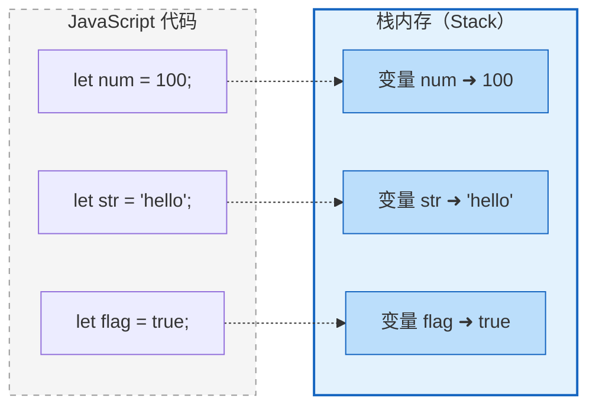
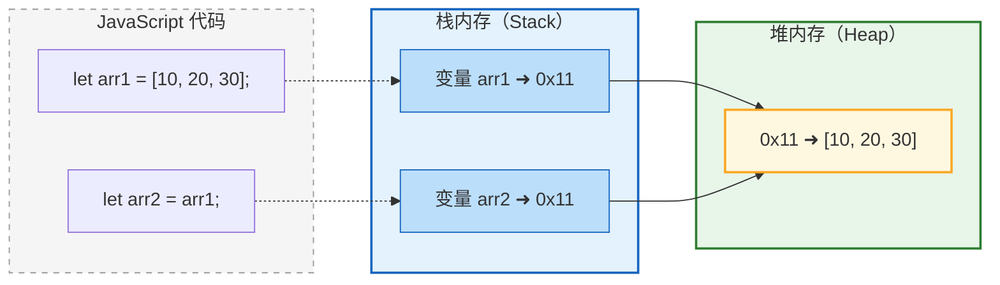

# 二、数据定义

## 2.1 变量与字面量

### 2.1.1 字面量

**字面量**（Literal）是JavaScript中最基本的单位，它就是一个直接使用的值，其所代表的含义就是它字面的意思。

常见的字面量类型：

| 字面量类型 | 示例 | 说明 |
|-----------|------|------|
| 数字字面量 | `1`、`2`、`3`、`4`、`100` | 整数值 |
| 字符串字面量 | `'hello'`、`"world"` | 文本内容 |
| 布尔字面量 | `true`、`false` | 逻辑值 |
| 空值字面量 | `null`、`undefined` | 表示"无" |
| 对象字面量 | `{}`、`{name: '张三'}` | 对象 |
| 数组字面量 | `[]`、`[1, 2, 3]` | 数组 |

在JavaScript中，所有的字面量都可以直接使用：

```javascript
// 直接使用字面量
console.log("hello");      // 字符串字面量
alert(123);                // 数字字面量
document.write(true);      // 布尔字面量
```

> **问题**：虽然字面量可以直接使用，但每次都重新书写同一个值非常不便。例如，如果有多处使用了 `"hello"`，后期需要统一修改时，每处都要逐一更改，维护成本很高。因此，我们通常使用**变量**来存储字面量。


### 2.1.2 变量

**变量**（Variable）可以理解为"存储字面量的容器"，它让数据有了名称和描述，便于复用和修改。

变量的核心特点：
- 变量中可以存储字面量（值）
- 变量中存储的值可以随时修改
- 通过变量名可以描述数据的含义，使代码更具可读性

```javascript
// 变量声明与赋值
let x;          // 声明变量 x
x = 80;         // 存入数字 80
x = '哈哈';     // 修改变量的值为字符串（变量可以存储不同类型的值）

// 有意义的变量名
let age;        // 用 age 描述"年龄"
age = 80;
age = 81;       // 年龄修改为81
```

### 2.1.3 变量的使用

变量的使用分为三个步骤：

| 步骤 | 语法 | 示例 | 说明 |
|------|------|------|------|
| **声明变量** | `let 变量名` | `let abc;` | 告诉JS引擎要创建一个变量 |
| **变量赋值** | `变量名 = 值` | `abc = "黄金";` | 将值存入变量中 |
| **声明+赋值** | `let 变量名 = 值` | `let i = 100;` | 一步完成声明和赋值 |

```javascript
// 1. 先声明，再赋值
let abc;            // 声明变量 abc
abc = "黄金";       // 赋值
abc = true;         // 重新赋值（类型可以改变）

// 2. 声明与赋值同时进行（推荐写法）
let i = 100;        // 声明变量 i 并初始化为 100
let name = "张三";   // 声明变量 name 并初始化为 "张三"
let isStudent = true; // 声明变量 isStudent 并初始化为 true
```

> **注意**：在JavaScript中，变量可以存储任意类型的值，并且可以在赋值时改变类型（这被称为"动态类型"）。


### 2.1.4 变量声明方式的演进

| 关键字 | 引入版本 | 特点 | 使用建议 |
|--------|----------|------|----------|
| `var` | ES5 | 函数作用域，存在变量提升 | 现代开发中已逐渐被淘汰 |
| `let` | ES6（ES2015） | 块级作用域，不存在变量提升 | **推荐使用** |
| `const` | ES6（ES2015） | 块级作用域，声明后不可重新赋值 | 用于声明常量 |

> **建议**：在日常开发中，优先使用 `let` 和 `const`，避免使用 `var`。


## 2.2 变量的内存结构

理解变量在内存中的存储方式，对于后续学习引用类型和函数传参非常重要。

**核心概念**：变量中并不直接存储值本身，而是存储值在内存中的地址（引用）。

```javascript
let x = 10;          // 基本类型：变量中直接存储值
let arr = [1, 2, 3]; // 引用类型：变量中存储的是数组在内存中的地址
```

| 变量名 | 存储内容 | 说明 |
|--------|----------|------|
| `x`（基本类型） | `10`（值本身） | 基本类型直接存储在变量中 |
| `arr`（引用类型） | `0x00A1`（内存地址） | 引用类型存储的是指向实际数据的地址 |


**基本类型-内存结构图**



**引用类型-内存结构图**




> **引申知识**：
> - **基本类型**（Number、String、Boolean、null、undefined）：变量直接存储值，赋值时复制值本身。
> - **引用类型**（Object、Array、Function）：变量存储内存地址，赋值时复制地址（多个变量可以指向同一份数据）。


## 2.3 常量

**常量**（Constant）是值不可变的变量，一旦声明并赋值后，不能再重新赋值。

```javascript
// 使用 const 声明常量
const PI = 3.1415926;   // 声明常量 PI

// 重复赋值会报错
// PI = 3.14;           // TypeError: Assignment to constant variable
```

**常量的命名规范**：

| 规范 | 示例 | 说明 |
|------|------|------|
| 全部大写 | `const MAX_SIZE = 100;` | 多个单词用下划线分隔 |
| 单词间用下划线 | `const MAX_LENGTH = 50;` | 提高可读性 |

> **使用建议**：
> - 对于不会改变的值（如数学常数、配置参数），应优先使用 `const`
> - 使用 `const` 可以让代码意图更清晰，减少意外修改的风险
> - 注意：`const` 保证的是**变量指向的地址不可变**，如果指向的是对象，对象内部的属性仍然可以修改

```javascript
const PERSON = { name: '张三' };
PERSON.name = '李四';   // 允许：对象内容可以修改
// PERSON = {};         // 报错：不能重新赋值给常量
```


## 2.4 标识符

**标识符**（Identifier）是JavaScript中所有可以由开发者自主命名的名称，包括：

- 变量名：`let userName;`
- 函数名：`function getUser() {}`
- 类名：`class Person {}`
- 属性名：`obj.propertyName`
- 参数名：`function foo(param) {}`

1.  标识符的命名规则（必须遵守）

    | 规则 | 说明 | 正确示例 | 错误示例 |
    |------|------|----------|----------|
    | 只能包含字母、数字、下划线、`$` | 不能包含空格、特殊字符 | `name`、`_age`、`$price` | `user-name`、`@home` |
    | 不能以数字开头 | 首字符不能是数字 | `a1`、`_1`、`$1` | `1a`、`2_name` |
    | 不能是关键字或保留字 | 如 `let`、`const`、`if`、`for` 等 | `myLet`、`_if` | `let`、`const` |
    | 不建议使用内置函数/类名 | 避免覆盖原生功能 | `userName` | `String`、`Array`、`console` |

2.  标识符的命名规范（建议遵守）

    **命名规范**是行业约定俗成的写法，虽然不是强制要求，但遵守规范能让代码更具可读性和团队协作性。

    | 命名方式 | 规则 | 示例 | 适用场景 |
    |----------|------|------|----------|
    | **小驼峰命名法**（camelCase） | 首字母小写，后续单词首字母大写 | `maxLength`、`borderLeftWidth` | 变量名、函数名、参数名 |
    | **大驼峰命名法**（PascalCase） | 所有单词首字母大写 | `MaxLength`、`BorderLeftWidth` | 类名、构造函数 |
    | **全大写+下划线**（SCREAMING_SNAKE_CASE） | 全部大写，单词间用下划线 | `MAX_LENGTH`、`PI`、`API_BASE_URL` | 常量 |

    ```javascript
    // 小驼峰命名法（变量、函数）
    let userName = '张三';
    let maxFileSize = 1024;

    function getUserInfo() {
        // ...
    }

    // 大驼峰命名法（类）
    class PersonInfo {
        constructor(name) {
            this.name = name;
        }
    }

    // 全大写+下划线（常量）
    const MAX_FILE_SIZE = 1024;
    const API_BASE_URL = 'https://api.example.com';
    ```

3. 关键字与保留字

    JavaScript中有一些保留字（Reserved Words）不能用作标识符，主要包括：

    | 类别 | 示例 |
    |------|------|
    | 控制语句 | `if`、`else`、`for`、`while`、`switch`、`break`、`continue` |
    | 变量声明 | `let`、`const`、`var` |
    | 函数/类 | `function`、`class`、`return`、`new`、`this`、`super` |
    | 其他 | `try`、`catch`、`finally`、`typeof`、`instanceof`、`void` |

    > **提示**：如果不确定某个词是否为关键字，可以在代码中尝试声明，编辑器会给出提示。

