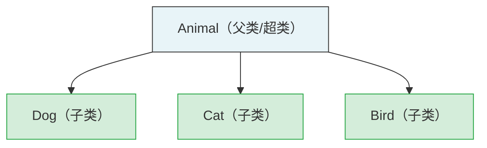

# 八、JavaScript 面向对象编程

## 8.1 面向对象编程（OOP）

1. 面向对象核心思想理解

    1. 程序的本质

        程序是对**现实世界的抽象**，就像照片是对人的抽象，代码不能直接描述万物，只能提取事物特征、行为转换成代码。
    2. 对象是什么

        现实中的一个事物，映射到代码里就是**对象**；JS 设计理念：**一切皆对象**（数字、字符串、函数、数组本质都是对象）。
    3. 面向对象编程定义
        
        程序所有操作都依托对象完成，做任何逻辑前，先找到对应对象，调用它的属性/方法，而非单纯写零散函数。

2. 事物与对象的对应关系

    现实中任何事物都由两部分组成：**数据 + 功能**，映射到对象中：

    | 现实事物 | 代码对象 | 说明 |
    | ---- | ---- | ---- |
    | 数据（静态特征） | 属性 | 姓名、年龄、身高、体重等描述信息 |
    | 功能（动态行为） | 方法 | 睡觉、吃饭、跑步等可执行动作 |

3. 基础对象字面量案例

    ```js
    const person = {
        // 属性：描述数据
        name: "王老五",
        age: 48,
        height: 180,
        weight: 80,
        // 方法：描述行为
        sleep() {
            console.log(`${this.name} 睡觉了~`);
        },
        eat() {
            console.log(`${this.name} 吃饭了~`);
        }
    }

    // 调用属性
    console.log(person.name);
    // 调用方法
    person.eat();
    person.sleep();
    ```

4. 对象字面量的缺陷
    1. 批量创建同类对象需要重复复制代码，冗余量大；
    2. 无法区分对象类型，无法快速判断两个对象是否属于同一类事物；
    3. 统一修改行为时，需要逐个修改所有对象的方法，维护麻烦。

## 8.2 Class 类：对象模板

1. 类的作用

    类是**对象的模板**，提前统一定义一类事物共有的属性、方法，通过 `new` 批量创建实例对象，解决字面量重复代码问题。
    - 同一个类创建出来的对象，称为**同类实例**；
    - `instanceof` 运算符：判断某个对象是否为某个类的实例。

2. 类命名规范

    1. 类名必须使用**大驼峰命名法** `Person / Dog / Student`；
    2. 两种定义语法：

    ```js
    // 语法1：声明式（推荐）
    class Person {}

    // 语法2：表达式式
    const Dog = class {}
    ```

3. 字面量 vs Class 对比案例

    ```js
    // 1. 对象字面量，重复冗余
    const p1 = {
        name: "王老五",
        age: 48,
        sleep() { console.log(`${this.name}睡觉`); }
    }
    const p2 = {
        name: "大黄",
        age: 3,
        sleep() { console.log(`${this.name}睡觉`); }
    }

    // 2. 使用类统一模板
    class Person {}
    class Dog {}

    // 通过 new 创建实例
    const human = new Person();
    const dog = new Dog();

    // instanceof 判断实例归属
    console.log(human instanceof Person); // true
    console.log(dog instanceof Person);   // false
    ```

4. 类的执行流程图

    ```mermaid
    flowchart LR
        A[定义 class 类] --> B[使用 new 类名]
        B --> C[创建空对象]
        C --> D[设置原型链]
        D --> E[执行 constructor]
        E --> F[返回实例对象]
        F --> G[调用实例方法/属性]
    ```

## 8.3 类中的属性

> 补充规则：类内部代码块默认运行在**严格模式 use strict**；类中不能随意写全局业务逻辑，仅用于定义属性、方法、构造函数。

1. 实例属性（对象私有，每个实例独立）

    1. 定义方式：`属性名 = 值`；
    2. 访问规则：**只能通过实例对象访问**，类本身无法直接读取；
    3. 每个实例拥有独立副本，修改一个实例不会影响其他实例。

2. 静态属性（类专属，所有实例共享）

    1. 定义方式：`static 属性名 = 值`；
    2. 访问规则：**只能通过类名直接访问**，实例无法读取；
    3. 全局共享，修改静态属性会对所有实例生效。

3. 示例代码

    ```js
    class Person {
        // 实例属性
        name = "孙悟空";
        age = 18;
        // 静态属性（属于类）
        static weapon = "金箍棒";
        static species = "灵明石猴";
    }

    // 实例操作实例属性
    const p1 = new Person();
    p1.name = "孙大圣";
    console.log(p1.name, p1.age);
    // 实例无法读取静态属性
    console.log(p1.weapon); // undefined

    // 类操作静态属性
    Person.weapon = "定海神针";
    console.log(Person.weapon, Person.species);
    ```

## 8.4 类中的方法

方法本质：类/对象内部封装的函数，用于描述行为。

1. 实例方法

    1. 定义：直接书写 `方法名(){}`；
    2. 调用：`实例.方法名()`；
    3. this 指向：**当前调用方法的实例对象**；
    4. 内部可直接读取/修改实例属性 `this.xxx`。

2. 静态方法

    1. 定义：`static 方法名(){}`；
    2. 调用：`类名.方法名()`；
    3. this 指向：**当前类本身**；
    4. 限制：只能操作静态属性，无法访问实例属性。

3. 示例代码

    ```js
    class Person {
        name = "孙悟空";
        static nickname = "齐天大圣";

        // 实例方法
        sayHello() {
            // this 指向实例
            console.log(`大家好，我是${this.name}`);
        }

        // 静态方法
        static showInfo() {
            // this 指向 Person 类
            console.log("类名：", this.name);
            console.log("静态昵称：", this.nickname);
        }
    }

    // 调用实例方法
    const p = new Person();
    p.sayHello();

    // 调用静态方法
    Person.showInfo();
    ```

4. 类内函数式写法（不推荐）

    ```js
    class Person {
        name = "孙悟空";
        // 箭头函数赋值方法，会挂载到实例自身，不进入原型，浪费内存
        say = function () {
            console.log(this.name);
        }
    }
    ```

## 8.5 构造函数 constructor

1. 核心作用

    `constructor` 是类中**唯一特殊方法**，称为构造函数；
    1. 执行时机：使用 `new 类名()` 创建实例时自动调用；
    2. this 指向：当前正在创建的新实例；
    3. 核心用途：创建实例时批量初始化实例属性，不用创建后手动赋值。

2. 两种属性赋值方式对比

    - 方式1：类直接赋值（统一默认值）
            
        所有实例初始属性完全相同，需要逐个手动修改，适合默认值统一的场景。

        ```js
        class Person {
            name = "孙悟空";
            age = 18;
        }
        const p1 = new Person();
        p1.name = "唐僧";
        const p2 = new Person();
        p2.age = 25;
        ```

    - 方式2：构造函数动态传参（推荐）

        创建实例时直接传入参数，灵活定义每个对象独有数据，开发主流写法。
        ```js
        class Person {
            // 提前声明属性
            name;
            age;
            gender;
            // 构造函数接收参数
            constructor(name, age, gender) {
                this.name = name;
                this.age = age;
                this.gender = gender;
            }
        }
        // 创建不同数据的实例
        const p1 = new Person("孙悟空", 18, "男");
        const p2 = new Person("猪八戒", 28, "男");
        const p3 = new Person("唐僧", 35, "男");
        console.log(p1, p2, p3);
        ```

3. 面向对象三大特性总览
    1. **封装**：保证数据安全，隔离内部私有数据，对外提供可控访问入口；
    2. **继承**：复用已有类代码，实现功能扩展，消除重复代码；
    3. **多态**：同一方法接收不同对象，产生不同执行效果，提升代码灵活性。

## 8.6 封装：私有属性 & Getter / Setter
1. 直接暴露属性的问题

    对象属性可以被外部任意修改，无法校验数据合法性，数据不安全。

    例：年龄可以被赋值 `-99`、姓名为空字符串，不符合业务逻辑。

2. JS 私有属性语法

    使用 `#` 定义私有属性，私有属性**仅能在当前类内部访问**，实例、子类都无法直接读取/修改。

3. Getter / Setter 访问器

    作用：对外提供可控的读写通道，可在赋值时做数据校验、格式处理。
    1. `get 名称(){}`：读取属性时自动触发；
    2. `set 名称(值){}`：赋值属性时自动触发；

4. 示例代码

    ```js
    class Person {
        // 私有属性
        #name;
        #age;
        #address = "花果山";

        constructor(name, age) {
            this.#name = name;
            this.#age = age;
        }

        // 读取私有name
        get name() {
            return this.#name;
        }
        // 修改私有name
        set name(val) {
            if (val && typeof val === "string") {
                this.#name = val;
            } else {
                console.log("姓名格式非法");
            }
        }

        get age() {
            return this.#age;
        }
        set age(val) {
            // 数据校验：年龄不能负数
            if (val >= 0 && val <= 150) {
                this.#age = val;
            } else {
                console.log("年龄输入不合法");
            }
        }

        say() {
            // 类内部可正常访问私有属性
            console.log(`${this.#name}，住址：${this.#address}`);
        }
    }

    const p = new Person("孙悟空", 18);
    // 读取自动触发get
    console.log(p.name);
    // 赋值自动触发set，非法值会拦截
    p.age = -10;
    p.name = "孙大圣";
    console.log(p.name, p.age);

    // 无法直接访问私有属性
    // console.log(p.#name); 语法报错
    ```

5. 旧式普通get/set方法（不推荐）

    早期无访问器语法时使用，现在优先使用 `get/set` 关键字：
    ```js
    getName() { return this.#name }
    setName(val) { this.#name = val }
    ```

## 8.7 多态
1. 多态核心概念

    JS 属于弱类型语言，函数不限制传入参数类型；

    只要对象拥有对应属性/方法，即可传入函数执行，不限制对象所属类，即**鸭子类型**：长得像鸭子、叫得像鸭子，就可以当作鸭子使用。

2. 多态案例

    ```js
    // 通用函数：只要求传入对象存在 name 属性
    function sayHello(obj) {
        if (obj.name) {
            console.log("Hello", obj.name);
        } else {
            console.log("该对象无name属性");
        }
    }

    class Person {
        constructor(name) { this.name = name }
    }
    class Dog {
        constructor(name) { this.name = name }
    }
    class Test {}

    const human = new Person("孙悟空");
    const dog = new Dog("旺财");
    const test = new Test();

    // 不同类实例均可传入，实现多态
    sayHello(human);
    sayHello(dog);
    sayHello(test);
    ```
3. 多态价值

    一套函数逻辑兼容多种对象，降低代码耦合，提升代码灵活复用性。

## 8.8 继承 extends

1. 继承基础语法

    使用 `extends` 实现类继承：
    - 被继承的类：父类 / 超类；
    - 继承的类：子类；
    - 效果：子类自动拥有父类全部属性、方法，无需重复编写代码。

2. 基础继承示例

    ```js
    // 父类
    class Animal {
        constructor(name) {
            this.name = name;
        }
        cry() {
            console.log("动物发出叫声");
        }
    }

    // 子类继承父类
    class Dog extends Animal {}
    class Cat extends Animal {}

    const dog = new Dog("旺财");
    const cat = new Cat("汤姆");
    // 子类直接复用父类方法
    dog.cry();
    cat.cry();
    ```

3. 继承的优势

    1. 代码复用，消除重复逻辑；
    2. 符合**开闭原则OCP**：对修改关闭，对扩展开放；不改动父类代码，仅通过子类扩展功能。

4. 继承关系图



## 8.9 方法重写 & super 关键字

1. 重写规则

    子类定义与父类同名方法时，会**覆盖父类方法**，调用时优先执行子类逻辑，称为重写。

2. super 两种用法

    1. `super()`：子类构造函数中调用父类构造函数；
        - 子类重写 constructor 时，第一行必须写 `super()`，否则报错；
    2. `super.方法名()`：子类方法中调用父类同名方法。

3. 代码示例

    ```js
    class Animal {
        constructor(name) {
            this.name = name;
        }
        cry() {
            console.log("动物在叫");
        }
    }

    class Dog extends Animal {
        // 重写方法
        cry() {
            console.log("汪汪汪");
        }
    }

    class Cat extends Animal {
        // 重写构造函数，新增参数age
        constructor(name, age) {
            // 必须先调用父类构造
            super(name);
            this.age = age;
        }
        cry() {
            // 调用父类原有逻辑，再扩展子类逻辑
            super.cry();
            console.log("喵喵喵");
        }
    }

    const dog = new Dog("旺财");
    const cat = new Cat("汤姆", 3);
    dog.cry();
    cat.cry();
    ```

## 8.10 对象底层结构：自身存储 + 原型

每个对象分为两块存储区域：

1. **对象自身**
   - 字面量直接赋值、类中 `xxx = 值` 定义的实例属性；
   - 通过实例手动新增的属性，只属于当前对象，互不共享。
2. **原型对象 `prototype`**
   - 类中 `方法名(){}` 定义的实例方法，统一存放在原型；
   - 所有同类实例共享同一个原型，节省内存；
   - 对象内置隐藏属性 `__proto__` 指向自身原型。

3. 代码示例

    ```js
    class Person {
        // 存在实例自身
        name = "孙悟空";
        // 存在原型对象
        sayHello() {
            console.log(`我是${this.name}`);
        }
    }
    const p = new Person();
    console.log(p);
    // 访问原型对象
    console.log(p.__proto__);
    ```

## 8.11 原型对象 & 原型链

1. 获取原型两种方式

    1. 实例隐式属性：`实例.__proto__`（不推荐修改，仅查看）
    2. 标准API：`Object.getPrototypeOf(实例)`（官方推荐）

2. 原型链

    每个原型自身也存在原型，层层向上查找，形成链式结构，直到顶层 `Object.prototype`，顶层原型为 `null`。
    
    属性查找规则：

    1. 优先在**对象自身**查找；
    2. 找不到则去 `__proto__` 原型查找；
    3. 逐层向上遍历原型链；
    4. 找到 `Object.prototype` 仍无，返回 `undefined`。

3. 原型链 vs 作用域链

    | 链条 | 作用 | 查找失败结果 |
    | ---- | ---- | ---- |
    | 原型链 | 查找对象属性 | 返回 undefined |
    | 作用域链 | 查找变量 | 直接抛出引用错误 |

4. 代码示例

    ```js
    class Person {
        name = "孙悟空";
        sayHello() {}
    }
    const p = new Person();
    // 逐层打印原型链
    console.log(Object.getPrototypeOf(p));
    console.log(Object.getPrototypeOf(p).__proto__);
    console.log(Object.getPrototypeOf(p).__proto__.__proto__); // null

    const obj = {};
    console.log(Object.getPrototypeOf(obj) === Object.prototype);
    ```

## 8.12 原型的核心作用

1. 核心作用

    1. **内存共享**：同类实例共用一套原型方法，不用每个对象单独复制方法，大幅节省内存；
    2. **实现JS继承**：子类实例的原型指向父类实例，依靠原型链完成继承；
    3. **全局扩展**：统一修改原型，所有同类实例自动拥有新增属性/方法。

2. 多层继承原型链示例

    ```js
    class Animal {}
    class Cat extends Animal {}
    class TomCat extends Cat {}

    const tom = new TomCat();
    // 原型链：tom -> TomCat原型 -> Cat原型(Animal实例) -> Animal原型 -> Object原型 -> null
    console.log(tom.__proto__);
    console.log(tom.__proto__.__proto__);
    console.log(tom.__proto__.__proto__.__proto__);
    ```

3. 原型链关系图

    ```mermaid
    graph LR
        tom["tom (TomCat实例)"] --> tomProto["TomCat.prototype"]
        tomProto --> catProto["Cat.prototype<br>（Animal实例）"]
        catProto --> animalProto["Animal.prototype"]
        animalProto --> objProto["Object.prototype"]
        objProto --> null["null"]
        
        style tom fill:#d4edda,stroke:#28a745
        style tomProto fill:#fff8e1,stroke:#f9a825
        style catProto fill:#fff8e1,stroke:#f9a825
        style animalProto fill:#fff8e1,stroke:#f9a825
        style objProto fill:#e3f2fd,stroke:#1565c0
    ```

## 8.13 修改原型规范

- 禁止操作

    1. 通过实例 `p.__proto__` 修改原型：污染全局、影响所有同类，代码难以维护；
    2. 直接覆盖 `类.prototype = {}`：会丢失原有原型上的构造函数、方法。

-  推荐规范操作

    通过 `类名.prototype` 统一追加属性/方法，无需创建实例即可全局生效。

    ```js
    class Person {}
    const p1 = new Person();
    const p2 = new Person();

    // 正确：通过类追加原型方法
    Person.prototype.fly = function () {
        console.log("自由飞翔");
    }
    p1.fly();
    p2.fly();
    ```

## 8.14 实例判断与属性检测

1. instanceof

    检测构造函数是否出现在对象的**原型链**上，只要原型链包含该类，返回 true。

    ```js
    class Animal {}
    class Dog extends Animal {}
    const dog = new Dog();
    console.log(dog instanceof Dog);    // true
    console.log(dog instanceof Animal); // true
    console.log(dog instanceof Object); // true
    ```

2. 属性检测三种方式

    1. `in`：只要原型链上存在该属性就返回 true，不区分自身/原型；
    2. `实例.hasOwnProperty("属性")`：旧API，仅检测对象自身属性；
    3. `Object.hasOwn(实例, "属性")`：ES2022 官方推荐，替代 hasOwnProperty。

3. 代码示例

    ```js
    class Person {
        name = "孙悟空";
        say() {}
    }
    const p = new Person();

    console.log("name" in p); // true
    console.log("say" in p);  // true

    console.log(p.hasOwnProperty("name"));    // true（自身属性）
    console.log(p.hasOwnProperty("say"));     // false（原型方法）

    console.log(Object.hasOwn(p, "name"));    // true
    console.log(Object.hasOwn(p, "say"));     // false
    ```

## 8.15 ES5 旧式构造函数（无class）

1. 定义
    ES6 class 是语法糖，底层原理仍是构造函数+原型；早期 JS 使用普通函数模拟类：
    
    1. 普通函数直接调用：普通函数；
    2. `new 函数()` 调用：构造函数，生成实例。

2. 基础构造函数

    ```js
    function Person(name, age) {
        // this 指向新建实例
        this.name = name;
        this.age = age;
    }
    // 原型挂载方法，实现共享
    Person.prototype.say = function () {
        console.log(this.name);
    }
    // 静态属性/方法
    Person.type = "人类";
    Person.test = function () {}

    const p = new Person("孙悟空", 18);
    p.say();
    ```

3.  ES5 原型继承

    ```js
    function Animal() {}
    function Cat() {}
    // 让子类原型等于父类实例，实现继承
    Cat.prototype = new Animal();
    const cat = new Cat();
    console.log(cat instanceof Animal); // true
    ```

## 8.16 new 运算符底层执行流程

1. 使用 `new 构造函数()` 时，JS 自动执行4步：
    1. 创建一个全新空普通对象 `{}`；
    2. 将空对象的 `__proto__` 指向构造函数的 `prototype`；
    3. 执行构造函数，内部 `this` 绑定为新对象；
    4. 判断构造函数返回值：
        - 返回**引用类型**（对象、数组）：直接返回该值；
        - 返回**原始值/无return**：自动返回第一步创建的新对象。

2. 流程图展示

    ```mermaid
    flowchart TB
        A["① 创建空对象 {}"] --> B["② 设置原型<br>对象.__proto__ = 构造函数.prototype"]
        B --> C["③ 执行构造函数<br>this 绑定为新对象"]
        C --> D{"④ 判断构造函数返回值"}
        D -->|"返回引用类型<br>（对象/数组）"| E["返回该引用值"]
        D -->|"返回原始值/无 return"| F["返回新创建的对象"]
    ```

3. 代码示例

    ```js
    function MyClass() {
        // return { name: "覆盖实例" }; // 会覆盖返回值
        return 123; // 原始值，无效，仍返回新对象
    }
    const mc = new MyClass();
    console.log(mc);
    ```
